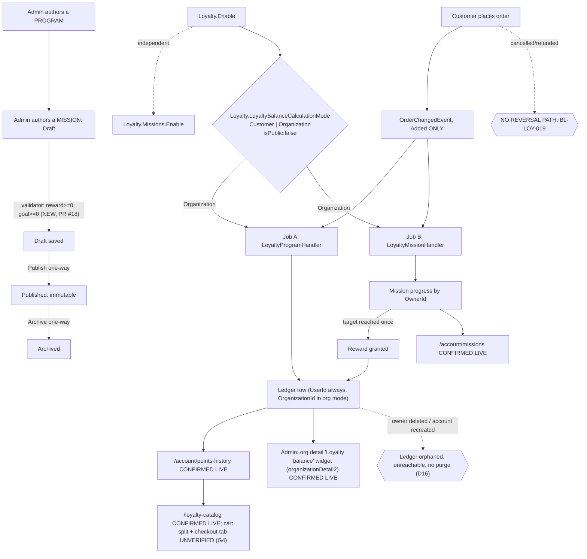

# Loyalty & Missions — domain map

> Refresh with `/qa-domain-map loy`. This file answers **what the feature is and where its
> surfaces are**. It does **not** carry behavioural rules — those are `BL-LOY-*` in the BL oracle
> (`npm run bl:extract -- --domain loy`; cited by id, never restated) — and it can **never ground
> an assertion as `{DOC}`**. Pointer index plus surface inventory.

**Verdict vocabulary** (unchanged): `CONFIRMED (source)` read in module/storefront source at the
revision named · `CONFIRMED (docs)` fetched first-hand from VirtoOZ, verbatim, with URL ·
`CONFIRMED (corpus read)` from `config/test-suites.json` or the CSVs · `CONFIRMED (prior-art)` a
dated prior deliverable's own capture, not re-observed here · `CONFIRMED (live)` observed this pass
· `DRIFT` two of the above disagree · `MISSING` documented/expected, does not exist · `UNVERIFIED`
not established, and not to be treated as true.

**No environment name or URL appears here.** Every live observation is attributed to **Env-A**
(`BACK_URL`/`FRONT_URL` under `TEST_ENV=vcst`). **Read-only pass**: no create / edit / publish /
seed / teardown / delete / order / cart / store-setting write was performed. Sessions were real
sign-ins; the three reserved-fixture accounts were only signed in and viewed. Any capability
confirmable only by mutating is `UNVERIFIED` **with the mutation named**.

---

## §0 — Changed since rev 3 (2026-09-18 → 2026-10-01)

Rev 3's own §0 table (rev 2 → rev 3) lives in git history; this table replaces it.

**Headline 1 — Loyalty is again a PR-preview build, and the version string carries the old trap
a second time.** Env-A runs `VirtoCommerce.Loyalty 3.1009.0-pr-18-4411` (rev 3: tagged `3.1008.0`).
`4411` is commit `4411e195`, the **third commit of PR #18** ("show mission validation errors in the
admin blade", 2026-09-25) — it already contains the Admin `onSaveError` re-fix. Everything rev 3 read
at `ab0908a8` still describes deployed code except the validator and one Admin blade (D10).

**Headline 2 — the reserved loyalty fixtures no longer match the environment (D16).** The VIP
account was **recreated 2026-09-19**: it now reads `Balance: 0` / "No records found", while the old
security-account id (still in the alias registry) keeps a 2,804,551,662-point, 223-row ledger that
nothing can reach. **The primary loyalty organization (`ORG_LOY_A.org_id`) no longer exists**; the sibling
(`sibling_org_id`) still exists as an organization, but the three `ORG_LOY_*` contacts belong to no
organization at all. Rev 3's §2b table, the "Company" sidebar claim and §1's org-member rows are
contradicted below.

| Rev 3 said | Rev 4 says |
|---|---|
| **D10**: backend is a tagged release `3.1008.0` ≡ `ab0908a8`; theme `2.58.0-pr-2467-1f40-1f40b001` | **SUPERSEDED.** Backend `3.1009.0-pr-18-4411`; theme **`2.59.0-pr-2501-3a82-3a82025e`**; platform `3.1074.0-pr-3125-c3b8`; XCart `3.1037.0-pr-141-fb27` is also a PR preview. See rewritten **D10** |
| §2b row 1: `LOYALTY_VIP_USER` storefront `Balance: 2804550892`, 23 pages, exact REST match | **DRIFT (D16).** Storefront `Balance: 0`, "No records found". `loyaltyBalance` returns `{currentBalance:0, resultBalance:0}` for the session. The alias's `securityAccountId` is stale: the platform user now has a different id, created 2026-09-19T08:32Z; the old id's ledger last moved 2026-09-18T17:40Z. KB-EDDBBE75 confirmed |
| §2b row 2: `ORG_LOY_A` org member sees `Balance: 0` while the org ledger holds 34,516,797 | **Symptom unchanged, cause changed.** Ada still sees `Balance: 0` / "No records found", but she is **no longer an organization member**: the contact has `organizations: []`, `GET /api/members/{org_id}` is empty, and an organization search finds no `AGENT-TEST-Org-Loyalty*` among 217 organizations. The sibling org id still resolves to a live organization (re-checked by the orchestrator, 2026-10-01). The org balance route still returns **34,516,797** for the deleted org and **219,416** for the sibling. The "read-side half of the Critical bug" demonstration no longer exists as a live fixture |
| §1 Actors / §2b: org-affiliated accounts get a **Company** sidebar group | **DRIFT in this map's own literal.** The group is **"Corporate"** (Company info, Company members, Sales reps), live on a TechFlow org admin. Docs say "Corporate"; rev 3 mis-transcribed it. See D15 |
| G11: Admin org widget never rendered | **CLOSED (live).** Contacts → search → row's three-dots → **Manage** opens the organization detail blade; a **"Loyalty balance"** widget renders (last of the secondary widgets), value `0` on an org with no org-scope ledger |
| §4: nine suites... 265 cases, 208 in `loyalty`, 153 Draft | **Counts identical** (re-parsed): same 11 suites, per-suite counts and per-status distributions. **Content moved** in four suites (§4) — Behavior/mind-map stamps, one reworded 083c title |
| §4: "28 cross-domain loyalty rows in six non-loyalty suites" (estimate) | **Re-derived: 28 rows in NINE suites** (§4). The six rev-3 suites hold 24; `095`, `026`, `089` add 4 |
| 67 missions (15 `public:false`), 1,674 progress rows, 2,152 ledger rows | **69 missions** (65 Published / 3 Draft / 1 Archived; **17** `public:false`), **2,833** progress rows, **2,830** ledger rows, 22 programs. The two new Drafts are human-named junk (`rgweg`, `rwqrQWR`), not seeder output |
| D8: route `api/loyalty-program-operation-log` was never renamed ⇒ not evidence of mirror staleness | **Refined.** The base route is unrenamed, but the mirror's *sub-route* `balance/{userId}` ≠ deployed `balance/user/{userId}` (D14); the mirror's lock key `loyalty-balance:{userId}` has no org key. The mirror is stale per symbol, including this one |
| G10: `LOYALTY_VIP_USER` inline password literal | **Still present** (see G10) |
| Docs rows D1 / D3 / D4 | **Re-fetched; unchanged.** D1 guide still lists two queries; D3 page still empty; D4 no mission content in five real sources |
| — | **NEW D15** (guide vs live on the program-authoring palette and one in-page menu-path contradiction), **NEW D16** (registry vs environment), new gaps **G13–G15** |

**No `D*` / `G*` row renumbered or deleted.** `G1`–`G3`, `G5`–`G9` stay CLOSED; **G11 CLOSED this
rev**; `G4`, `G10`, `G12` OPEN; `G13`–`G15` new.

---

## §1 — Purpose and value chain

**Loyalty purpose** (`PlatformUserGuide` Overview —
[docs.virtocommerce.org/platform/user-guide/loyalty/overview](https://docs.virtocommerce.org/platform/user-guide/loyalty/overview),
re-fetched this pass, unchanged since rev 1): *"The **Loyalty** module provides a flexible loyalty
program management system for the Virto Commerce Platform. It enables store managers to define
loyalty programs, reward customers with points, track transactions, and allow customers to pay for
their orders using loyalty points."* `CONFIRMED (docs)`. The same page's Key features adds, new to
this map: *"Points can only be used if the balance fully covers the order amount."* and
*"Conversion rate: **1 point = 1 unit of order currency**."* — both `UNVERIFIED` live (need a cart,
G4).

**Missions purpose: `UNDECLARED`.** Looked in PlatformUserGuide (a "missions and challenges Virto
Rewards" query returns only the loyalty program pages and the glossary), StorefrontUserGuide
(Points History, Company pages — no missions), PlatformDeveloperGuide (xAPI Loyalty lists two
queries), FrontendSourceCode (en.json carries `points-history` keys only) and
PlatformBackendSourceCode. See D4.

**Organization-scope balance purpose: `UNDECLARED`** in every guide (PlatformUserGuide, StorefrontUserGuide
Points History / Company Info / Company Members: no org-balance statement). The nearest statement
is PR #17's description, carried from rev 3 (not re-fetched): *"To enable calculating balance on
the org level instead of an individual level select Organization mode in a store settings."*
`CONFIRMED (source)`.

The chain is rev 3's, carried forward; only the rows marked changed moved this pass.

| # | Link, in the customer's words | Mechanism |
|---|---|---|
| 1 | A store turns Loyalty on | `Loyalty.Enable`: store value `true`, `isPublic: true`. `CONFIRMED (live)` |
| 1b | A store turns Missions on, independently | `Loyalty.Missions.Enable`: store value `true`. Three independent gates (write, read, storefront route) — carried, not re-checked in source. `CONFIRMED (live)` for the value |
| 1c | A store chooses WHOSE balance it is | `Loyalty.LoyaltyBalanceCalculationMode`, allowed `["Customer","Organization"]`, default `Customer`, **`isPublic: false`**; store value **`Customer`**, re-read twice this pass (before and after the storefront walk). `CONFIRMED (live)` |
| 2a | A PROGRAM is authored | Admin **Loyalty** main-menu item; templates `GET /api/loyalty-programs/new/{Default\|ProductPoints}` live: 22 programs (4 `Default`/order-type, 18 `ProductPoints`; 4 inactive). `CONFIRMED (live)` |
| 2b | A MISSION is authored | Admin **Loyalty missions** menu (69 missions, badge `69` live). Template palette: conditions `UserGroupIsCondition`/`AnyUserGroupCondition`; goals `OrderValueGoal`/`OrderCountGoal`/`PerSkuGoal`; reward `FixedAmountReward` only. **New: the validator rejects a negative reward amount and a negative goal value** (PR #18, D10). `CONFIRMED (live + source)` |
| 3 | A customer places a qualifying order | `OrderChangedEvent`, `EntryState.Added` only. `CONFIRMED (source)`, carried, unchanged at `4411e195` |
| 4 | Async hop — two Hangfire jobs | carried from rev 2, **not re-checked** |
| 5a | Program path: earn/redeem, owner-scoped | `CONFIRMED (source)`, unchanged at `4411e195` (D10 diff) |
| 5b | Mission path: contribution, `OwnerId`-scoped progress | `BL-LOY-017` / `BL-LOY-016`. `OrganizationId` + `OwnerId` present on `POST /api/loyalty-mission-progress/search` rows. `CONFIRMED (live + source)` |
| 6 | Contribution and reward persisted, granted at most once | `BL-LOY-018`. `CONFIRMED (source)`, carried |
| 7 | The customer sees it | `CONFIRMED (live)` on five accounts (§2b). Mission-row label "Mission reward" **re-confirmed** |
| 8 | Points are spent | Loyalty catalog **40 results** re-confirmed. Cart split + checkout points tab `UNVERIFIED` (G4) |
| 9 | Daily sweep expires stale progress | carried, **not re-checked** |
| 10 | Reversal — NOT reversed anywhere | `BL-LOY-019`. `CONFIRMED (source)`, carried; PR #18 adds no reversal path |
| 11 | Mode flipped — two disjoint ledgers | `BL-LOY-020`. **New observed variant of the same mechanism**: the owning organization *disappears* and its ledger is orphaned (D16) — the route does not validate that the organization exists (KB-EC1EDCE2) |



### Actors

| Actor | Can do | Verdict |
|---|---|---|
| **Store manager / admin** | Authors programs/missions; 3-field loyalty blade; reads a user's balance (`balance/user/{id}`) and an org's (`balance/organization/{id}`) — and, new live this pass, via the **"Loyalty balance" widget on the organization detail blade**. Cannot set `Missions.Enable`, `DefaultProductMultiplyFactor`, or the calculation mode from the module's blade | `CONFIRMED (live)` |
| **Customer**, `Customer` mode | Earns/spends against their own ledger. Live: `LOY_PERSONAL_NOORG` 38,916 (= REST), a TechFlow org admin 8,961 (personal scope), VIP-recreated 0, ordinary account 0 | `CONFIRMED (live)` |
| **Customer with NO loyalty history** (the negative case; an `.env` account, **not** an alias) | Sees `Balance: 0` and a table row "No records found" — **byte-identical to an org-less member of a deleted org and to a recreated account**; the page cannot tell "never earned" from "ledger orphaned" | `CONFIRMED (live)` |
| **Customer**, `Organization` mode | Pooled ledger, shared progress | `CONFIRMED (source)`; runtime `UNVERIFIED` (G12) |
| **Customer with no organization in an org-mode store** | Falls back to user scope silently | fallback `CONFIRMED (source)`; consequence `UNVERIFIED` (G12) |
| **Customer**, `Public=false` mission | **Sees it anyway** — now on a **third independent account** (an ordinary no-group account sees `…TGT-PRIVATE`; the VIP-group and org-group accounts did too) | `CONFIRMED (live)` — D7 strengthened again |
| **Targeted customer group** | Group conditions filter (VIP account sees `TGT-GROUP`; the org-group account does not) | `CONFIRMED (live)` — G8 stays closed |
| **Guest** | Attributes no mission progress (`VCST-5320` C24) | `CONFIRMED (prior-art)`, not re-derived |

---

## §2 — Surface inventory

### 2a. Back office — Admin AngularJS SPA

Source rows describe deployed code at `4411e195` (D10). **Main menu**: `Loyalty` and `Loyalty
missions` as two top-level items (both seen in the live sidebar this pass). `CONFIRMED (live)`.

**Widgets — five**, unchanged. New live fact: the organization widget is reachable and renders
(titled **"Loyalty balance" — the same label as the Contact widget, for a different scope**; prior art
`VCST-5024` C2 already flagged the contact widget reading `0` for a pooled-balance member).
Path: Contacts → search the org → row's **three-dots menu → Manage** → organization detail blade →
widget row at the bottom (after Dynamic properties, Index, Icon, Assets, White labeling).
`CONFIRMED (live)`; the widget code path `CONFIRMED (prior-art)` from the VCST-5024 design report
(success-only callback, no error branch — that report's C1).

**REST routes** — live swagger inventory, **identical to rev 3**: 7 controllers, 25 verbs; balance
reads are `GET …/balance/user/{userId}` and `GET …/balance/organization/{organizationId}`; the legacy
`…/balance/{userId}` returns **404** (re-confirmed). `CONFIRMED (live)`.

**PR #18's new Admin behaviour (read-only observation only):** `loyalty-mission-details.js` now saves
a *copy* of the entity (so a rejected save leaves the expression tree rendered) and routes both POST
and PUT failures to `onSaveError`, which joins the response's `errorMessage` list. New validator
rejections: *"Mission reward amount cannot be negative"*, *"Mission goal value cannot be negative"*.
`CONFIRMED (source, 4411e195)`. **The messages' live rendering is `UNVERIFIED` — needs a `POST`/`PUT
/api/loyalty-missions` with a negative value (G14).** `CONFIRMED (prior-art)`:
`VCST-5855`/`VCST-6084` verification summaries record, at this exact build, 400 responses carrying
both messages with nothing persisted (mission count unchanged), the Admin blade showing the message
at `4411` where it showed bare "Error 400" at `e3e4`, and a pre-existing platform `httpError`
`TypeError` on any list-shaped 400 body (not filed upstream).

**NOT manageable from the back office**

| Not manageable here | Where it lives |
|---|---|
| `Loyalty.Missions.Enable` / `DefaultProductMultiplyFactor` / `LoyaltyBalanceCalculationMode` from the module's own blade | `GET /api/loyalty-setting/store/{storeId}` returns exactly `{storeId, loyaltyEnabled, loyaltyMode, loyaltyCurrency}` (re-confirmed); the three live only on the generic Store→Settings surface (D13) |
| A mission's `Public` flag | No Admin control; filterable via `POST /api/loyalty-missions/search`. 17 of 69 carry `public:false` |
| A balance as an editable value, either scope | Read-only everywhere; KB-EDDBBE75 re-confirmed |
| Purging mission progress, ledger rows, or an orphaned ledger | No purge/retention path. 2,833 progress / 2,830 ledger rows accumulated; mutation needed to clear (teardown) |

### 2b. Storefront (Vue)

Theme `2.59.0-pr-2501-3a82-3a82025e` (footer). Five accounts walked in firefox, Customer mode:

| Account | Organization | `/account/points-history` | `GET balance/user/{id}` (alias id) | `GET balance/user/{id}` (platform's actual id) |
|---|---|---|---|---|
| `LOYALTY_VIP_USER` ("AGENT TEST") | none | **`Balance: 0`**, "No records found" | 2,804,551,662 (**stale id**) | **0** |
| `ORG_LOY_A` ("Ada Outlet") | **none (org deleted)** | `Balance: 0`, "No records found" | 0 | 0 |
| `LOY_PERSONAL_NOORG` ("Nina Solo") | none | `Balance: 38916`; "Mission reward" and order rows | 38,916 | 38,916 |
| TechFlow org admin (slot-2 pool account) | TechFlow | `Balance: 8961` | n/a (not resolved) | n/a |
| ordinary account, no loyalty history (`.env` `USER2_*`) | none | `Balance: 0`, "No records found" | n/a | n/a |

`CONFIRMED (live)`. The first two rows no longer demonstrate what rev 3 said they did (§0, D16).

| Surface | Route | Live observation |
|---|---|---|
| Loyalty catalog | `/loyalty-catalog` | **40 results**, PTS-priced; ~5–10 s hydration delay persists (blank first snapshot). The main navigation also carries a **"Loyalty"** menu item. `CONFIRMED (live)` |
| Points history | `/account/points-history` | `Balance: <unformatted integer>`; columns Operation / Type / Date / Amount; order rows show the order number; **mission rows "Mission reward"** (re-confirmed; no mission name or id — `BL-LOY-015`); empty state is a "No records found" row inside the table. xAPI `loyaltyBalance` returned `{currentBalance, resultBalance}` (matches the dev guide's `LoyaltyBalanceResult`). `CONFIRMED (live)` |
| Missions & challenges | `/account/missions` | Heading + "Complete missions to earn bonus Virto Rewards points."; **Virto Rewards balance** banner, **Redeem your points** banner ("Trade points for products in the rewards catalog."), 12 cards/page, ≥4 page buttons, types Order value / Order count / Featured SKUs, "N days left", "Open mission". Same balance as points-history for the same account. `CONFIRMED (live)` |
| Account sidebar | any `/account/*` | Groups seen live: **Purchasing** (Dashboard, Orders, Lists, Quote requests, Saved for later, Back-in-stock list), **Marketing** (Missions & challenges, Coupons & promotions, Notifications, Points history), **User** (Profile, Addresses, Change password, Saved credit cards…). A genuine org member additionally gets **Corporate** (Company info, Company members, Sales reps) — no loyalty surface in it. Missions/Points links appear for an account with no loyalty history (store-gated, not user-gated). `CONFIRMED (live)` |
| Mixed cart split UI, checkout "Pay with points" | `/cart`, `/checkout` | `UNVERIFIED` (G4) |
| Any organization-aware loyalty surface | — | `MISSING` — rev 3's 0-hits search for `organizationId` under `client-app/modules/loyalty/**` is carried, **not re-run** (theme moved to 2.59.0) |

**NOT manageable from the storefront**: read-only over every loyalty object except the cart; the
customer cannot see which owner scope the balance is resolved at (D13), and cannot tell a
never-earned balance from an orphaned one (D16).

### 2c. API / contract

Live anonymous introspection, 2026-10-01 — **identical to rev 3**:

```
loyaltyBalance(storeId: String!, userId: String, orderId: String)
loyaltyPointsHistory(after, first, keyword, sort, storeId: String!, userId: String, operationType: String)
loyaltyMissionProgress(after, first, keyword, sort, storeId: String!, statuses, completedStartDate,
                       completedEndDate, cultureName, currencyCode, isStarted, userId)
```

`CONFIRMED (live)`. 3 queries, **0** loyalty/mission/points mutations. No `organizationId`
argument (ambient-only, D12 — source rows unchanged at `4411e195`). `PlatformDeveloperGuide` still
documents `loyaltyBalance` as *"the loyalty balance information for a specific user"* and
`loyaltyPointsHistory` as *"the history of loyalty point transactions for a specific user"* — both
with no mention of `storeId` or scope (D1).

**NOT manageable from the API layer**: no mission-granting-row id on the ledger type
(`BL-LOY-015`); no mutation to spend/forfeit/adjust points; no way to address an organization
balance explicitly or to request personal scope in an org-mode store; no discovery of the active
scope (the mode setting is non-public).

### 2d. Persistence / jobs

Carried from rev 3 / rev 2 and **not re-checked in source or Hangfire**. Live this pass:
`LoyaltyMissionProgress` rows expose `organizationId` and `ownerId` (field list of
`POST /api/loyalty-mission-progress/search`). **New live fact:** ledger rows outlive their owner —
the org-balance route answers 200 with the old total for an organization that no longer exists, and
a recreated customer account does not inherit the old account's ledger (KB-EC1EDCE2, KB-EDDBBE75).
**NOT manageable from this layer**: `Loyalty.ExpireMissions` trigger/schedule/disable (platform
Hangfire dashboard only); whether `AddOrganizationId` backfilled `OwnerId` on all 2,833 rows
(`UNVERIFIED`; sampled rows consistent).

### 2e. Published docs — queried first-hand this pass

- **`PlatformUserGuide`** — six loyalty pages. Verbatim, new this pass:
  *"Loyalty points = (Product price − Discount) × Multiply factor"* (unchanged);
  Order-loyalty conditions list: *"Order status is… Order total… Is first order… Is recurring
  order… Is registration"* and rewards *"Fixed points… % of order value as points"*
  ([…/enable-and-configure-loyalty-programs](https://docs.virtocommerce.org/platform/user-guide/loyalty/enable-and-configure-loyalty-programs)).
  Points history: *"In the user details blade, click the **Loyalty balance** widget"* — Contacts
  only ([…/loyalty-points-history](https://docs.virtocommerce.org/platform/user-guide/loyalty/loyalty-points-history)).
- **`StorefrontUserGuide`** — *"This section shows the number of points earned and redeemed for each
  order, as well as the total balance of points remaining"*
  ([…/account/points-history](https://docs.virtocommerce.org/storefront/user-guide/account/points-history));
  *"Open **Company members** from the **Corporate** group in your account menu."*
  ([…/account/company-members](https://docs.virtocommerce.org/storefront/user-guide/account/company-members));
  *"**Pay with points** allows you to pay for the order with loyalty points earned from previous activity."*
  ([…/shopping/checkout-process](https://docs.virtocommerce.org/storefront/user-guide/shopping/checkout-process));
  *"The **Corporate** section appears only in corporate accounts."*
  ([…/account/overview](https://docs.virtocommerce.org/storefront/user-guide/account/overview)).
- **`PlatformDeveloperGuide`** — xAPI Loyalty overview lists `loyaltyBalance` and
  `loyaltyPointsHistory` only. **D1 persists.**
- **`FrontendSourceCode`** — mirror's `GetLoyaltyPointsHistory` document is the **pre-`storeId`**
  version (`query GetLoyaltyPointsHistory($sort, $after, $first, $operationType)`): stale against the
  deployed contract. Locale keys are `points-history.*`; no mission keys.
- **`PlatformBackendSourceCode`** — pre-org, pre-rename mirror: `LoyaltyProgramOperationLogController`
  with `[HttpGet("balance/{userId}")]` and `LoyaltyLogicService` with lock key
  `loyalty-balance:{userId}` and no organization key. **D8 refined.**

---

## §3 — Where the layers DISAGREE

`D1`–`D14` carried; **D10 rewritten, D8 refined**; **D15, D16 new.** Never renumbered.

| # | Disagreement | Verdict |
|---|---|---|
| **D1** | The published xAPI reference undercounts the schema by one query (`loyaltyMissionProgress` absent; two listed) — and documents neither `storeId` nor scope on the two it lists | `CONFIRMED (docs + live)` — re-fetched and re-introspected this pass |
| **D2** | Two `PlatformUserGuide` pages name the enabling step differently (one says the **Settings** widget / "Loyalty enabled", another the **Loyalty settings** widget / "Enable loyalty") | **RESOLVED** (rev 2); the two wordings are still both on the live docs this pass |
| **D3** | "Create Loyalty Program" is an empty page that a sibling links to as a step | `CONFIRMED (docs)` — re-fetched this pass: the page returns exactly `# Create Loyalty Program` |
| **D4** | Missions ship a mature Admin + storefront + GraphQL surface and have zero surface across every official guide | `CONFIRMED (docs)` — re-queried this pass across the same five real sources; nothing mission-shaped returned |
| **D5** | `MissionTypes` declares 5 constants; only 3 are ever a stored goal's class | `CONFIRMED (source)` — carried, not re-checked. Live template offers exactly 3 goal types |
| **D6** | Reward vocabulary asymmetric: a program offers Fixed + Relative; a mission Fixed only | `CONFIRMED (live)` this pass: `new/Default` palette `FixedAmountReward,RelativeAmountReward`; mission template `FixedAmountReward` only |
| **D7** | `Public` flag unreachable from Admin and unread by the customer query — every Published mission is shown to everyone | `CONFIRMED (live)` — **third independent account** (ordinary, no group) rendered `TGT-PRIVATE`; 17 of 69 missions are `public:false` |
| **D8** | VirtoOZ's source mirrors are stale against the deployed build | `CONFIRMED (docs-tool output vs live)`, **refined**: backend mirror still returns `LoyaltyProgramOperationLog*` names, sub-route `balance/{userId}` (deployed: `balance/user/{userId}`, D14) and an org-less lock key; frontend mirror's points-history document lacks `$storeId`. The base route `api/loyalty-program-operation-log` is unrenamed and correct. Check per symbol |
| **D9** | Points page had two routes across sources | **RESOLVED** (rev 2); `/account/points-history` re-walked live |
| **D10 — the backend is a PR preview again, and "3.1009.0" has a trap exactly like "3.1008.0" did** | Deployed: `VirtoCommerce.Loyalty 3.1009.0-pr-18-4411`. **`4411` = `4411e195`**, PR #18's third commit ("fix(VCST-5855): show mission validation errors in the admin blade", 2026-09-25T15:34:53Z); it is neither the PR's first commit (`baff9290`, reward), second (`e3e47e0f`, goal) nor head (`d1325e52`, a merge of `dev`, which differs from `4411e195` only in four CI workflow files). **Tag `3.1009.0` = `ebdd10f6`**, the squash-merge of PR #18 (2026-09-28T11:29:27Z); `compare 4411e195...ebdd10f6` touches only four `.github/workflows` files, so **deployed source ≡ tag `3.1009.0` source**. **The trap**: `dev` also carries `e95b9351` "3.1009.0" (2026-09-17) — a version-string-only bump that predates PR #18's content; "manifest says 3.1009.0" ≠ "the 3.1009.0 release". After the tag, `dev` has only `23c29e88` (3.1010.0 bump) and `81c7319a` (CI workflow sync): **no functional change since `ebdd10f6`**. **Rev-3 source rows**: `compare ab0908a8...4411e195` lists exactly six files — `Directory.Build.props`, `module.manifest`, `LoyaltyMissionValidator.cs` (+reward/goal checks), `loyalty-mission-details.js` (copy-on-save + `onSaveError`), and two new test files — so every rev-3 `CONFIRMED (source)` row **outside the validator and that Admin blade is still true at `4411e195`**. Other tiers: theme `2.59.0-pr-2501-3a82-3a82025e`, platform `3.1074.0-pr-3125-c3b8`, XCart `3.1037.0-pr-141-fb27` (PR preview), others tagged (Customer 3.1026.0, Orders 3.1016.0, Store 3.1007.0, Marketing 3.1007.0, Notifications 3.1014.0, Xapi 3.1023.0, XOrder 3.1013.0, ProfileExperienceApiModule 3.1019.0). A PR preview moves under the map without a tag | `CONFIRMED (live REST + live footer + GitHub compare/tag/ancestry)` |
| **D11** | Org-level loyalty: merged, released, deployed (PR #17 `ab0908a8`, tag `3.1008.0`) | `CONFIRMED` as rewritten in rev 3 — **still true**; surfaces re-seen live (setting, split routes, `ownerId`). Rev 2's "absent" stays overturned by events |
| **D12** | The organization scope is ambient-only; three layers resolve "which organization" from three places | `CONFIRMED (source, unchanged at 4411e195)`; cart/session divergence `UNVERIFIED` (G12) |
| **D13** | The setting that decides whose money it is is the one Loyalty setting the storefront cannot read and the module's own blade cannot set | `CONFIRMED (live REST + live GraphQL + source)` — re-read: `isPublic:false`, 3-field `loyalty-setting` contract; the storefront rendered a personal balance and gave no scope signal on any of five accounts |
| **D14** | BREAKING REST route change in a minor release: `balance/{userId}` → `balance/user/{userId}` | `CONFIRMED (live 404 + source diff)` — legacy path 404 re-confirmed this pass |
| **D15 — the guides' program-authoring text vs the live palette, and one in-page path contradiction** | (a) *"Order status is… Order total… Is first order… Is recurring order… Is registration"* (5 conditions) vs live `GET /api/loyalty-programs/new/Default` palette of **7**: those five **plus `UserGroupsContainsCondition` and `UserGroupIsCondition`** — the guide never lists the two user-group conditions for an Order program (it lists them only for Product Points, whose live palette is exactly `UserGroupIsCondition`, `AnyUserGroupCondition`, matching the guide). (b) One `enable-and-configure-loyalty-programs` page says *"In the main menu, click **Loyalty**."* (order program) and *"click **More**, then click **Loyalty**."* (product points) a few lines apart; live, **Loyalty is a top-level main-menu item** (and the troubleshooting page says the blade can be "missing from the More menu"). Whether "More" is a narrow-viewport overflow is `UNVERIFIED`. (c) **Matches, recorded so it is not re-raised:** the storefront guide's "Corporate group" is correct live (§0 corrects this map, not the guide) | (a) `CONFIRMED (docs + live)` · (b) `CONFIRMED (docs)` + live main-menu item · (c) `CONFIRMED (docs + live)` |
| **D16 — the fixture registry vs the environment: reserved loyalty fixtures no longer exist as the registry describes them** | `test-data/aliases.vcst.json` `LOYALTY_VIP_USER.securityAccountId` (and `memberId`) point at an account the platform no longer has; the platform user for that email was created **2026-09-19T08:32Z** with a different id and has **0** ledger rows. The old id keeps **223** rows (last 2026-09-18T17:40Z) and a balance of 2,804,551,662. `ORG_LOY_A/B/LOCKED`: `organizations: []`; `AGENT-TEST-Org-LoyaltyOutlet` (`ORG_LOY_A.org_id`) is absent (GET by id empty; absent from a 217-organization listing), while the **sibling org (`sibling_org_id`) still exists** — the analyzer's pass recorded it absent too; the orchestrator's re-check by id on 2026-10-01 contradicted that, and the sibling claim is corrected here. The org-balance route returns **34,516,797** for the deleted org and **219,416** for the sibling. Consequence for the corpus: any case that resolves the VIP id via `@td()` reads a 2.8-billion balance that the storefront account does not have, and `075f`/`083e` preconditions (a *non-zero pooled org balance*, members in the org) cannot hold until re-seeded. Who/what removed the organizations is not established here. **Correction (2026-10-01, §7):** `contact.organizations: []` is not on its own proof of "no membership": on this Customer module membership is the `OrganizationMembership` entity, and the contacts still held memberships to the deleted organization. What decided the storefront result is that xAPI resolves the session organization from `contact.organizations`, and that was empty | `CONFIRMED (live REST + live storefront + alias file read)`; cause `UNVERIFIED` |

**Where the layers were compared and agree**: the five permissions, the four `Loyalty.Mode` allowed
values (`Loyalty Store`, `Mixed Cart`, `Coupon Redemption`, `Payment Method`), swagger inventory vs
rev 3, GraphQL signatures vs rev 3, and every storefront balance vs its REST counterpart **for the
id the platform actually holds** (Nina 38,916; VIP-new 0).

---

## §4 — Coverage shape

**Basis:** `config/test-suites.json` and all 11 loyalty CSVs re-parsed by `csv-parse` 2026-10-01;
manifest `testCount` agrees with CSV rows (265). All other suite CSVs scanned (case-insensitive
`loyalty|points-history|loyalty-catalog` over each row; BL citation scan separately).
`CONFIRMED (corpus read)`.

**Counts identical to rev 3; content moved.** Commits since rev 3: `2fbb83ce` (2026-09-20) — manifest
+8 lines, `083c` 10 lines (one case, MSNF-031, **title reworded** — the clause "announced as such" was
dropped from the title; the row's assertions were not diffed here); `eea50cbf` (2026-09-28) —
`075d` 64 lines and `083d` 14 lines (mind-map `Behavior:` stamps) and creation of the mind map and
data model; `3026fdb6` (2026-09-29) — `075d` 2, `075e` 4, `083c` 6, `083d` 2 lines and one line in
each loyalty seeder. **No case was added or removed; no status changed.** `Behavior:` stamps now
appear in `075d`, `075e`, `083c`, `083d` only (row counts 32/2/3/7).

| Suite | Cases | In `loyalty` | Status | `BL-LOY` cited |
|---|---|---|---|---|
| `075` Loyalty (B) | 29 | yes | Draft 29 | none |
| `075b` Mixed Cart Order (B) | 13 | yes | Draft 10 · Manual 1 · Semi 1 · Auto 1 | 002,003,005,007,008,009,010,012,013 |
| `075c` Product Points Earning (B) | 10 | yes | Draft 10 | 001,007 |
| `075d` Missions (B) | 34 | **NO** | Auto 19 · Draft 9 · Manual 4 · Deprecated 2 | 007,009,010,015,016,017,019 |
| `075e` Missions Admin (B) | 23 | **NO** | Auto 14 · Draft 9 | 015,016 |
| `075f` Organization Balance (B) | 22 | yes | Draft 13 · Auto 9 | 007,008,015,018,019 |
| `083` Loyalty Catalog (F) | 26 | yes | Draft 24 · Auto 2 | 003 |
| `083b` Mixed Cart Order (F) | 8 | yes | Auto 6 · Draft 2 | 002,003,005,007,008,009,010,013 |
| `083c` Missions Storefront (F) | 84 | yes | Auto 44 · Draft 36 · Manual 1 · Reviewed 3 | 002,003,015,016 |
| `083d` Missions E2E (F) | 8 | yes | Auto 2 · Draft 5 · Deprecated 1 | 007,009,010,013,015,016,018,019 |
| `083e` Org Balance Storefront (F) | 8 | yes | Auto 2 · Draft 6 | 007,008,010,015,018,019,**020** |
| **Total** | **265** | **208** | Draft 153 · Auto 99 · Manual 6 · Reviewed 3 · Deprecated 3 · Semi 1 | 16 distinct |

### Feature-relevant cases the obvious selection group MISSES

`selections.loyalty.include` = `["075","075b","075c","083","083b","083c","083d","075f","083e"]`
(9 suites / 208 cases) — unchanged. `075d` and `075e` appear in **no explicit selection**; they are
reached only through `where`/`all` groups (`backend`, `sprint`, `full`) or an explicit id list.

**Re-derived cross-domain loyalty rows — 28 rows in NINE non-loyalty suites** (rev 3: "28 in six",
an estimate): `050b4` 10 · `028` 5 · `010` 5 · `050a` 2 · `026` 2 · `050b1` 1 · `078c` 1 · `095` 1 ·
`089` 1 = 28. Rev 3's six suites hold 24; the other 4 are `026` (2), `095` (1), `089` (1). **Only two
suites outside the loyalty folders cite any `BL-LOY-*` id: `050b1` (2 rows), `050b4` (10 rows)**.
Feature-relevant corpus ≈ 293; group resolves to 208; **85 cases (≈29%) never run under `loyalty`**
(the 57 in `075d`/`075e` plus 28 cross-domain). Fix is `suites:sync`, not a hand edit.

### Zero / near-zero coverage

| Area | Count | Deliberate or hole |
|---|---|---|
| **PR #18's two rejection messages and the Admin blade's `onSaveError` display** | **0** cases (`cannot be negative` appears in no suite) | **HOLE, new** — both surfaces are deployed; coverage lives only in two ticket verification summaries |
| `BL-LOY-020` (owner scope) | 1 citing case (`083e`); **0 in `075f`** | **HOLE**, unchanged |
| `BL-LOY-006` | 0 | **HOLE**, unchanged |
| `BL-LOY-014` | 0 | **HOLE**, low severity, unchanged |
| `BL-LOY-011` | n/a | **Deliberate** (reserved) |
| `075` Loyalty (29 cases) | 0 `BL-LOY` citations | **HOLE**, unchanged |
| Admin organization loyalty widget | 0 cases | **HOLE** — now reachable (§2a); `075f` covers the org balance by API only |
| **An organization-less / recreated-account balance** (D16) | 0 | **HOLE, new** — no case asserts the storefront's zero-vs-orphaned ambiguity |
| Missions ↔ docs | 0 doc-grounded | **Deliberate consequence** of D4 |

### Over-covered relative to risk

`083c` still holds 84 cases (32% of loyalty coverage) on the storefront *read* surface, while the
backend grant surface `075d` holds 34 and runs under no loyalty selection. Unchanged argument; the
decision belongs to `/qa-review-tests`.

### Selection-group and executability problems

| Property | Reading |
|---|---|
| `requiresModules` | `["loyalty"]` on all `075*` and `083c/d/e`; **absent on `083`, `083b`** — unchanged |
| `envRiskGate` | `staging` on all six `075*` and `083e`; absent on `083`, `083b`, `083c`, `083d` — unchanged |
| Browser lanes | `firefoxClickOk: true`; no lane denial applies to any loyalty suite |
| Never-run share | 153 of 265 (58%) Draft — unchanged |
| **Mutual exclusion** | `083e` `notes` demand that no other loyalty suite share the store in its window. `selections.loyalty` still schedules `083e` and `075f` (also Organization-mode) alongside `075*`/`083*` — `regression:plan loyalty` lists both in one plan. Still invisible to the manifest |
| **Fixture liveness (NEW, D16)** | `075f` and `083e` are executable in the manifest sense but their `@td(ORG_LOY_*)` preconditions are false on Env-A today (primary organization absent, members org-less) — a re-seed precedes any run. Nothing in the manifest or `suites:lint` can express "alias ids are live" |

**Fixture accumulation, live:** 69 missions (65 Published / 3 Draft / 1 Archived; 17 `public:false`),
2,833 progress rows, 2,830 ledger rows, 22 programs. Still no reaping.

---

## §5 — Open gaps

| # | Gap | State |
|---|---|---|
| G1 | Storefront-rendered claims | **CLOSED** (rev 2); re-walked on five accounts this pass |
| G2 | `Missions.Enable`/`DefaultProductMultiplyFactor` reachability | **CLOSED** (rev 2); the fourth, non-public setting recorded (D13) |
| G3 | D2's two guide pages | **CLOSED** (rev 2) |
| **G4** | Every `BL-LOY-0xx` live measurement is still inherited from the oracle's dated captures; mixed-cart split UI, checkout "Pay with points" tab, the guide's "balance fully covers the order amount" and "1 point = 1 unit" claims, and the sidebar auth-reactivity question were not observed | **OPEN** — needs (a) `seed:missions-e2e` + an order placement + a cancellation; (b) a loyalty-catalog product in a real cart; (c) a sign-in performed while already on an `/account/*` page. All mutations or session-timing tests |
| G5 | Has `Loyalty.ExpireMissions` ever fired? | **CLOSED** (rev 2), carried, not re-checked |
| G6 | Live route for the points page | **CLOSED** (rev 2) |
| G7 | Is `.Public` read elsewhere? | **CLOSED** (rev 2) |
| G8 | `VCST-5320` "CustomerIDs" targeting | **CLOSED — not real**; group filter re-demonstrated |
| G9 | Deployed module versions | **CLOSED** (rev 2); re-derived (D10) |
| **G10** | `LOYALTY_VIP_USER` carries a bare inline password literal in `test-data/aliases.json` | **STILL OPEN — present** (a 9-character literal on `password`, plus a redundant `password_env`; value never reproduced). `ORG_LOY_A`, `ORG_LOY_B`, `ORG_LOY_LOCKED`, `LOY_PERSONAL_NOORG` carry `{{DEFAULT_TEST_PASSWORD}}`; `LOYALTY_NOBAL_USER`/`LOYALTY_WHOLESALE_USER` carry `password_env` only. Fix not applied from here |
| **G11** | Admin organization loyalty-balance widget never seen to render | **CLOSED (live, rev 4)** — Contacts → search → three-dots → **Manage** → organization detail blade → **"Loyalty balance"** widget, value `0` on an organization with no org-scope ledger. Prior art `VCST-5024` (Sprint26-18) had already captured it rendering a non-zero pooled value under org mode. Rev 3's "member LIST blade" was the row click, not the Manage action |
| **G12** | Entire organization-scope runtime `UNVERIFIED` (store reads `Customer`) | **OPEN.** Blocking mutation: store-setting write `Loyalty.LoyaltyBalanceCalculationMode: Customer → Organization` on the store under test, plus an order placement for the earn half. **Newly compounded by D16:** the pooled-balance fixtures needed to observe it are gone, so a re-seed of the organizations/members precedes even that |
| **G13** | Reserved fixtures are stale (D16): who recreated the VIP account on 2026-09-19, removed the primary loyalty organization, and detached its members; whether the alias file or a teardown run is the source of truth | **OPEN** — needs: a `td:reconcile`/seeder re-run (mutation) and the seeders' teardown logs; neither is a read |
| **G14** | PR #18's two rejection messages and the Admin blade's error display, observed live by this map | **OPEN (UNVERIFIED)** — mutation: `POST`/`PUT /api/loyalty-missions` with a negative reward amount / goal value (even though nothing persists, it is a write against a real endpoint). Cited as `CONFIRMED (prior-art)` from `VCST-5855`/`VCST-6084` at this build |
| **G15** | Is the wrong-currency symptom in the drafted `loyaltyMissionProgress` bug gone now that the query accepts `currencyCode`? | **OPEN** — needs only a read: an authenticated xAPI `loyaltyMissionProgress` call with a non-session `currencyCode` against the named SKU. Not attempted (breadth-first); not a mutation |

**Aside, carried from rev 2 and not re-checked:** Hangfire dashboard accepts a plain platform bearer
token — platform-wide, out of scope to adjudicate here.

---

## §6 — Prior-art verdicts

Rev 1/2/3's tables are in git history. New this rev:

| Claim | Verdict |
|---|---|
| **This map's rev 3 §2b rows 1–2** (VIP 2,804,550,892 with 23 pages; org member sees 0 against a 34.5M org ledger) | **DRIFT — fixtures moved (D16).** Rev 3 was correct on 2026-09-18; the account was recreated the next morning, the primary organization has since been removed and its members detached |
| **This map's rev 3 "Company" sidebar group** | **DRIFT — my transcription was wrong.** The group is **"Corporate"**, live; the storefront guide already says so |
| **This map's rev 3 D10** (backend `3.1008.0` ≡ `ab0908a8`; theme 2.58.0-pr-2467) | **SUPERSEDED** by D10 above (`3.1009.0-pr-18-4411`; theme 2.59.0-pr-2501) |
| **BL-LOY-017's Source line**: *"re-derived 2026-09-28 at the release the environment runs (`ab0908a8`)"* | **DRIFT in naming only.** Env-A runs `4411e195` / tag `3.1009.0`, not `ab0908a8`. The cited accrual files are untouched between the two (compare above), so the content stands; the *revision label* is stale. Routed, not edited |
| `reports/tickets/Sprint26-19/VCST-5855` + `VCST-6084` verification summaries | **Used as `CONFIRMED (prior-art)`** for PR #18's live behaviour at `4411` (G14). Notes recorded, not adjudicated: zero reward saves as a Draft; `httpError` `TypeError` on list-shaped 400 is a platform-side observation, unfiled |
| `vc/shared/archive/sprints/Sprint26-18/VCST-5024/design-report.md` | **Used for G11** (widget rendered under org mode) and C1/C2 (success-only callback; contact widget reads 0 for a pooled member). Its "Ada's spendable balance 127,040" has since grown to 34,516,797 on the (now deleted) org |
| `BUG-org-mode-contact-level-transactions-written-but-unreachable-VCST-5024.md` (drafted, unfiled) | Names the **user-scoped read** surface (storefront + Admin contact widget). Recorded; not filed, not adjudicated; its live demonstration fixture is gone (D16) |
| `BUG-loyalty-mission-progress-serves-non-session-currency-price.md` | Names `loyaltyMissionProgress` price currency. Partly overtaken by `currencyCode` (rev 3); symptom state `UNVERIFIED` (G15) |
| `BUG-loyalty-mission-public-flag-has-no-effect.md` | Names the `Public` flag — **D7 supports it** (third account). Recorded only |
| `BUG-AI-loyalty-mission-localizedname-null-culturename.md` | Names `loyaltyMissionProgress` without `cultureName` — **KB-6A20B0AF covers the same fact**; not re-run here |
| `BUG-loyalty-published-mission-edit-returns-500.md` | Names `PUT /api/loyalty-missions` on a Published mission (500). Not re-run (a write) |
| `BUG-loyalty-missions-design-drift-three-surfaces.md`, `BUG-loyalty-mission-date-severity-ladder-collapses.md`, `BUG-missions-points-history-link-below-aa-touch-target.md` | Name storefront `/account/missions` visual surfaces (order modal banner, mobile grid, card banner, date badge, "Points history" link). **Not re-measured**; the surfaces exist live. Recorded only |

**Resolved by this map this pass**: G11; the true shape of the cross-domain row count (28 rows, nine
suites); the exact commit behind `…-pr-18-4411` and its relation to tag `3.1009.0`; the sidebar group
label. **Not resolved, carried**: G4, G12, G13, G14, G15, every live `BL-LOY` re-measurement, the
Hangfire/ExpireMissions state.

---

## §7 — Amendments

Written by `/qa-test` `5h-map`, one row per write-back, append-only. An amendment sets `amended:` and
never `generated:` or `rev:`.

*(Empty — no `/qa-test` run has amended this map yet. Preserved unchanged from rev 1–3; a refresh is
not itself an amendment and does not populate this table.)*

| Date | By | What moved |
|---|---|---|
| 2026-10-01 | `/qa-seed-data` (after the rev-4 pass) | **D16 / G12 / G13 acted on, live.** `seed:org-loyalty` re-created `AGENT-TEST-Org-LoyaltyOutlet` (new id in `aliases.vcst.json`) with 3 org-scoped memberships (`ORG_LOY_LOCKED` `isLocked=true`) and minted fresh `ORG_LOY_MISSION*` (old generation swept); no order placed, store mode untouched (`Customer`). The seeder reuses existing contacts **without** adding the new org to `contact.organizations`, so xAPI `me.contact.organizationId` stayed `null`; fixed by a `PUT /api/members` relink, and the three dangling memberships to the deleted organization were removed. Verified: xAPI resolves the outlet for `ORG_LOY_A`/`B`; `ORG_LOY_LOCKED` lists it with `organizationId: null` (locked membership). `LOYALTY_VIP_USER`, `LOYALTY_NOBAL_USER`, `LOYALTY_WHOLESALE_USER` overlay ids refreshed to the accounts recreated together at 2026-09-19 08:32Z, which narrows G13 to a single company-users re-seed. G12 (the org-mode runtime) is still OPEN: it needs the mode flip, which only a run makes |
