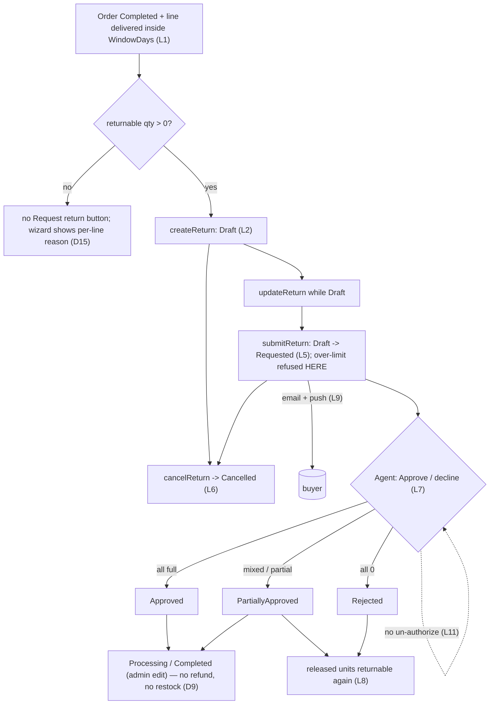

# Returns — domain map

> Refresh with `/qa-domain-map ret --refresh`. This file answers **what the feature is and where its surfaces
> are**. It does **not** carry behavioural rules — those are `BL-*` (`npm run bl:extract -- --domain ret`;
> the `BL-RET` section is declared and deliberately empty, so the invariants named below are candidates, not
> oracles) — and it can **never ground an assertion as `{DOC}`**. Pointer index plus surface inventory: it
> says *where to look* and *what exists*, never *what correct looks like*.

**Every claim carries a verdict.** `CONFIRMED` = observed live or read at source this pass ·
`DRIFT` = prior art/docs say otherwise and are wrong · `MISSING` = documented, does not exist ·
`UNVERIFIED` = not established, and **not** to be treated as true.

**Read-only pass.** No mutating call was made. A capability confirmable only by mutating is `UNVERIFIED`
with the mutation named.

## Changed since rev 1

Rev 1 was written on 2026-09-22 while both PRs were open and the storefront was not deployed. Every one of
these rev 1 statements is **now wrong** (marked in place below with `DRIFT (rev 1)`):

| Rev 1 statement | Now |
|---|---|
| Header call-out / §0: "both PRs are open"; deployed module is `3.1002.0-pr-26-323d`; "mid-change" | **DRIFT (rev 1).** Module is the released `3.1004.0`; PR #26 and #27 merged; PR #28 (organization returns) still open and not deployed. The mid-change call-out no longer applies to the backend |
| §2b: "storefront not reachable"; `/account/returns` 404s; no Returns link; no Return button on order detail | **DRIFT (rev 1).** `/account/returns` renders; Purchasing sidebar has a **Returns** link; Completed orders with returnable lines show **Request return** (§2b). The theme is still an unreleased PR build (`2.59.0-pr-2532`), not a release |
| §1 Actors: "Returns agent — not implemented / UNVERIFIED" | **DRIFT (rev 1).** Agent Approve / decline exists, REST + Admin SPA, gated by `return:authorize` (§2a) |
| §1 link 7: "someone else decides — not built yet" | **DRIFT (rev 1).** Built — `POST /api/return/{id}/authorize`, `Approved`/`PartiallyApproved`/`Rejected` statuses, per-line `approvedQuantity`/`rejectReason` populated on live returns |
| §4: "073 has 22 rows, all `Automation Status: None`", "zero coverage … true zero" | **DRIFT (rev 1).** Five returns suites hold 134 rows, 126 `Automated` (§4) |
| §2c "live values match `ModuleConstants` defaults exactly" (`returnPolicy.isEnabled: true`) | **DRIFT (rev 1), in part.** `Return.ReturnEnabled` default in source is `false`; the live `true` is the B2B-store override. A store with no value reads `false` (§2c, D2) |
| §1 link 1 reasons `OrderStatusNotAllowed`, `NotDelivered`… (PascalCase) | **DRIFT (rev 1).** The contract values are `UPPER_SNAKE`: `ORDER_STATUS_NOT_ALLOWED`, `NOT_DELIVERED`, `OUTSIDE_RETURN_WINDOW`, `NOTHING_LEFT_TO_RETURN`, `LINE_CANCELLED`, `RETURNS_DISABLED` (source + live) |
| D1 (legacy available-quantity counts every status) | **DRIFT (rev 1)** — no longer holds on 3.1004; see D1 |
| G1, G2, G3, G5, G6, G8 | `CLOSED` (§5). G4, G7 stay OPEN |

Scope grew: **step 2 (agent approve/decline, VCST-5883) and notifications are now IN scope**.

## §1 — Purpose and value chain

**Purpose: UNDECLARED in every published source; reconstructed below and marked as the first written
statement.** Where I looked: `PlatformUserGuide` (return/overview, return/managing-returns, return/settings,
order-management/managing-returns), `StorefrontUserGuide` (searched `returns`, `request a return`, `RMA` —
zero returns pages), the `PlatformDeveloperGuide` xAPI reference (searched — zero return pages), the module's
own guide (vc-module-return, file docs/return-module-guide.md) @ 3.1004.0 (a how-it-works guide, no purpose statement), rev 1, and the VCST-5883
test model. The only stated purpose is the legacy one, verbatim, `https://docs.virtocommerce.org/platform/user-guide/return/overview`:
*"The **Return** module gives you an opportunity to view and manage all return operations. Once a customer
returns an item to your store, this information appears in the list of returns."* — an admin-side record of a
return that has **already happened**, which is the opposite of the buyer-initiated request that now exists
(D12).

Reconstructed purpose (this map's own framing, not a quote): *An authenticated B2B buyer asks to return
specific quantities of specific lines from their own delivered order, within a store-configured window,
with a reason, optional comment and evidence; a back-office agent decides each line with an approved
quantity; the buyer is told, sees the outcome in their account, and can request again the units that were
not approved. Nothing in this module moves money or stock — a return reaching any terminal state still does
not refund or restock (D9).* `CONFIRMED` as the mechanism (source + live); the sentence is the map's own.

| # | Link, in the user's words | Mechanism |
|---|---|---|
| 1 | **My order line becomes returnable** | `returnableItems(orderId)` → `ReturnEligibilityService`: store must have `Return.ReturnEnabled`; order status ∈ `Return.AllowedOrderStatuses` (default `Completed`); line not cancelled; the line's quantity counted **delivered** only through a non-cancelled shipment that carries a `DeliveryDate` (and, if `Return.AllowedShipmentStatuses` is non-blank, a matching shipment status); `returnableUntil = latest delivery date + WindowDays`; remaining > 0. Per-line reasons: `RETURNS_DISABLED`, `ORDER_STATUS_NOT_ALLOWED`, `LINE_CANCELLED`, `NOT_DELIVERED`, `OUTSIDE_RETURN_WINDOW`, `NOTHING_LEFT_TO_RETURN`. `CONFIRMED` source (3.1004.0) + live (4 of the 6 reasons seen on the rich persona's 17 Completed orders: `NOTHING_LEFT_TO_RETURN`, `OUTSIDE_RETURN_WINDOW`, `NOT_DELIVERED`, `LINE_CANCELLED`; `ORDER_STATUS_NOT_ALLOWED` is per kb KB-4E1FF232 only, `RETURNS_DISABLED` not seen) |
| 2 | **I build a draft** | `createReturn(command{orderId, customerReference?, customerComment?, cultureName?, items[]})` (`cultureName` is NEW since rev 1) → status `Draft`; `updateReturn` edits it while `Draft`. `CONFIRMED` live (introspection) + source |
| 3 | **Quantity is held — by what is OPEN** | `ReturnQuantityService`: Draft/Cancelled/Rejected hold 0; a Requested/New return holds its requested quantity; **a decided line holds its `approvedQuantity` by `ItemState`, not by return status**. `CONFIRMED` source; behaviour corroborated by live `returnableItems` on orders carrying decided returns (e.g. 260 returnable of 500 after a partial approval) |
| 4 | **I attach evidence** | File Experience API scope `return-attachments`; `Return.AttachmentsRequired` (default `false`; **`true` on B2B-store here** — D2). Attachments render live on decided returns. `CONFIRMED` live (details page) + source |
| 5 | **I submit** | `submitReturn(returnId)` `Draft -> Requested`; additionally requires a reason on every line and `ReasonsRequiringComment`; **this is where the over-limit quantity is refused** (`RETURN_QUANTITY_UNAVAILABLE`), not at create/update (kb KB-F97CFAF6, disputed on one display point — D14). `CONFIRMED` source; submit not re-run |
| 6 | **I can withdraw until a decision** | `cancelReturn(returnId, reason?)` valid from `Draft` and `Requested` only (`ReturnStateProvider` transitions). xAPI `availableActions` shows `cancel.isAvailable=false, unavailableReason=WRONG_STATUS` on every other status. Authorization = ownership only, no store check (D6). `CONFIRMED` live (all six statuses sampled) + source |
| 7 | **An agent decides each line** | Admin SPA Return -> Line items -> **Approve / decline** → `POST /api/return/{id}/authorize {rejectReason?, items[{lineItemId, approvedQuantity, rejectReason?}]}`; every line decided, `0 <= approved <= requested`; status follows the numbers (all full → `Approved`, all 0 → `Rejected`, else `PartiallyApproved`); gate `return:authorize`; valid only from `Requested` and `New`. `CONFIRMED` source + live (Line items blade renders Approved / Decline reason columns and the toolbar command on a Requested return; live returns exist in `PartiallyApproved` ×2 and `Rejected` ×3 for the rich persona); the decision call itself not re-run |
| 8 | **Units I was refused become returnable again** | A decided line holds only its approved units, "whatever status it moves on to" (module guide). `CONFIRMED` live (returnable 260/500 on a partially approved order) |
| 9 | **I am told, once, by email and in-app** | `ReturnStatusChangedEvent` → two Hangfire jobs (email, push) per change to Requested/Approved/PartiallyApproved/Rejected/Cancelled; five email notification types, **one `default` template each, no localized templates** (live); switches `Return.SendNotifications` / `Return.SendPushNotifications`. `CONFIRMED` live (5 types, 1 default template each; push messages `Return RET… cancelled`/`received`, status `Sent`, 427 push rows) + source; delivery of the email itself `UNVERIFIED` (no SMTP — kb: journal row status `Error`) |
| 10 | **I see the outcome in my account** | `/account/returns/{id}`: Status, Date, Order number, PO reference, Comment, Reason for decline, **Items** with `Requested` / `Approved` columns, per-line decline reason, attachments. `CONFIRMED` live (Requested + PartiallyApproved) |
| 11 | **Reversal** | Cancel (buyer, pre-decision) is the only undo; **a decision has NO reverse path** — no un-authorize; an edit can only carry a decided return onto `AwaitingDelivery/Received/Processing/Completed`, never cancel or reopen it (`CanSetStatus`); `Rejected` and `Cancelled` are closed. Nothing is refunded, restocked or re-opened in Orders (D9). `CONFIRMED` source + live (`available-statuses` per status, D11) |



### Actors

| Actor | Can do | Verdict |
|---|---|---|
| **Buyer / customer** (owner) | Create/edit/submit/cancel own returns; read own list/details; **Request return** from a Completed order that has a returnable line | `CONFIRMED` live (rich persona: list 132 returns, details, Request return button) + source |
| **Org colleague** (same organization, not the owner) | Can open the owner's order by id (`order(id)` resolves) but `returnableItems` = `[]` (empty, not an error), `return(id)` = `null`, own `/account/returns` empty — so never sees Request return on the owner's order | `CONFIRMED` live (xAPI as the colleague persona + empty-state screenshot). Cancel/update refusal for a colleague not re-run (mutation) — `UNVERIFIED` |
| **Back-office agent with `return:authorize`** | Decide each line via Approve / decline; everything below | `CONFIRMED` live (command renders for `admin`) + source |
| **Back-office user WITHOUT `return:authorize`** (holds access/read/update) | Per kb: no Approve / decline command, Approved column read-only, Requested status dropdown offers only `Requested`; REST authorize → 403 | `UNVERIFIED` on 3.1004 (kb KB-700E5D52, KB-DF9F415E observed on 3.1003); no such account is provisioned on this env (G9) |
| **Admin (legacy surface)** | Search/view/edit status + resolution + line reason, delete (REST `DELETE /api/return`, permission `return:delete`), create via `PUT /api/return` with no id, **across every store** | `CONFIRMED` source (controller) + live (search 136 rows across `B2B-store` and one store-less legacy row) |
| **Anonymous** | Every new-flow query refused `Unauthorized` (not a silent empty); **introspection itself is allowed** (200) | `CONFIRMED` live |

---

## §2 — Surface inventory

### 2a. Admin SPA + REST — Return module

Entry: platform main menu **More → Return** (route `#!/workspace/Return`; the lowercase `…/returns` path renders
the dashboard, not the blade). Version banner: platform `3.1076.0`.

**Return list blade** (`CONFIRMED` live): title "Return list" with total badge (136), toolbar **Refresh**,
**Add new return**; search box ("Search keyword…"; module guide: covers return number, order number,
customer reference, SKU and name of any line); status filter ("All statuses"; options seen: New, Approved,
Completed, Processing, Draft, Requested, Partially approved, … list continues, not scrolled to the end);
columns Return number, Order number, Customer, Return status, Create date, Modify date, Created by, Item count
(column chooser present). Returns whose order was deleted show empty Order number / Customer.

**Return blade** (`CONFIRMED` live, Requested return): Return number, Order number, Created date, Modified date,
Created by (link), Customer (link), **Status** (dropdown, pencil icon), Buyer's reference, **Resolution**
(free text, legacy), **Reason for decline** (free text, return-level), widget **N LINE ITEMS / total USD**.
Toolbar Refresh / Save / Reset.

**Line items blade** (`CONFIRMED` live): toolbar Refresh, Save, **Approve / decline**; columns Item name (+
buyer reason, comment, attachment link), Return reason ("Faulty on arrival" — admin shows a LOCALIZED reason
label where the storefront contract does not, D4), SKU, Quantity (editable input), **Approved** (pre-filled
with the requested quantity), **Decline reason**, Price (editable input); a return-level "Reason for decline"
box below. Decision commit and the absent confirmation dialog: kb KB-97A675C1, not re-run (mutation).

REST `api/return` (`CONFIRMED` source @ 3.1004.0 + swagger live):

| Verb | Route | Permission | Verdict |
|---|---|---|---|
| POST | `search` | `return:read` | live (136 rows; body supports `statuses`, `orderId`, `customerId`, `storeId`, `keyword`, `startDate`/`endDate`, `sort`) |
| GET | `{id}` | read | source |
| GET | `{id}/available-statuses` | read | live (D11 table) |
| PUT | *(none, upsert)* | `return:update` | source; **no POST create exists** — a body without id creates `New` (kb KB-1F2EBF83, 3.1003, not re-run) |
| POST | `{id}/authorize` | **`return:authorize`** | source + swagger live (model `ReturnAuthorizationRequest {returnId, rejectReason, items[]}`, `ReturnLineDecision {lineItemId, approvedQuantity, rejectReason}`) |
| DELETE | *(none)* `?ids=` | `return:delete` | source; kb KB-06CFE625 observed it working on 3.1003 — **contradicts both guides' "cannot be deleted"** (D13) |
| GET | `available-quantities/{orderId}` | read | live (D1, D10) |

Permissions (live `/api/platform/security/permissions`): `return:access, read, create, update, delete, authorize`.

Notification setup (live `POST /api/notifications`): five types — `ReturnRegisteredEmailNotification`,
`ReturnApprovedEmailNotification`, `ReturnPartiallyApprovedEmailNotification`,
`ReturnRejectedEmailNotification`, `ReturnCancelledEmailNotification` — all active, each with a single
`default` template (no language-specific one). `CONFIRMED` live.

### 2b. Storefront — buyer-facing (theme `2.59.0-pr-2532-c725-c7253361`, UNRELEASED)

Module registers only when the store setting `Return.ReturnEnabled` is on (`index.ts` `isEnabled(ENABLED_KEY)`);
a store without it gets no route, no menu item, no order-page button. `CONFIRMED` source; the "off" rendering was
not observed (no org user can sign in to the only return-disabled store, `New-super`) — `UNVERIFIED` live.

| Surface | Route | Observed (`CONFIRMED` live unless stated) |
|---|---|---|
| Sidebar entry | Purchasing → **Returns** (`/account/returns`) | present (after Orders) |
| Returns list | `/account/returns` | title "Returns"; search "Search by RMA, order, reference or product"; **Filters** panel: Created date (preset/custom start-end) + Status checkboxes Approved, Cancelled, Completed, Draft, New, Partially approved, Processing, Rejected, Requested (9 — the legacy `Canceled` is de-duplicated); table columns RMA, Date (sortable), Status, Qty; 10 rows/page, 14 pages for the rich persona; row is a button → details; **empty state** "There are no returns yet" (colleague persona) |
| Order detail | `/account/orders/{id}` | **Request return** button (outline, beside Print order / Reorder all) on a Completed order with at least one `isReturnable` line; **absent with no explanation** on a Completed order whose lines are `NOTHING_LEFT_TO_RETURN` (D15). Gate: `allowsOrderStatus(order.status)` then `returnableItems.some(isReturnable)` (source) |
| Wizard step 1 | `/account/returns/new/{orderId}` (no left sidebar) | source: "Select items to return" table with Ordered / Returnable / Quantity columns, per-line ineligibility text via i18n, window hint, Continue creates the draft. Not rendered this pass (needs a draft) — `UNVERIFIED` live on this theme; kb KB-6323ED21 / KB-2073D7AD observed it on 2.59 pr-2500 |
| Wizard step 2 | `/account/returns/{id}/edit` | source: details/edit with reason (`text-field="localizedName"`), comment, attachments, autosave through a queued `UpdateReturn` mutation (800 ms debounce); `UNVERIFIED` live this pass |
| Details | `/account/returns/{id}` | **Summary** (Status, Date, Order number, "Your purchase order reference", Comment, Reason for decline), **Cancel return** button, **Items** table (Item, Requested, **Approved**, per-line decline reason, attachments) |
| Cancel | modal (`cancel-return-modal.vue`) | the button is **rendered on every status** but **disabled with a tooltip** (`WRONG_STATUS`) when `availableActions.cancel.isAvailable` is false — red-outline and live on Requested, grey and disabled on PartiallyApproved. Click-through not performed (mutation) |

Routes in source: `returns` (children `""`, `new/:orderId`, `:returnId/edit`, `:returnId`) under the Account route.
`CONFIRMED` source @ c7253361.

### 2c. API — GraphQL, shared `/graphql`

**6 queries / 4 mutations, unchanged by name since rev 1** (live introspection 2026-10-06):

```
returnableItems(orderId) · returnPolicy(storeId) · return(id) · returnReasons(storeId, cultureName)
returns(after, first, keyword, sort, storeId, statuses, startDate, endDate) · returnStatuses(cultureName)
createReturn(command) · updateReturn(command) · submitReturn(command) · cancelReturn(command)
```

Changed since rev 1: `CreateReturnCommandType` gained **`cultureName`** (fields now `orderId, customerReference,
customerComment, cultureName, items`); `UpdateReturnCommandType` and `SubmitReturnCommandType` carry none (kb KB-C6BB1914:
`Return.LanguageCode` = createReturn culture, observed on 3.1003). Unchanged: `ReturnPolicyType` still exactly
`isEnabled, windowDays, allowedOrderStatuses` (D8); `ReturnType` fields `id, number, status, statusDisplayValue,
createdDate, orderId, orderNumber, customerReference, customerComment, rejectReason, cancelReason, itemsQuantity,
items, availableActions`; `ReturnLineItemType` adds nothing new (`approvedQuantity`, `itemState`, `rejectReason`
now populated on live returns). `CONFIRMED` live.

**`availableActions` carries `edit`, `submit`, `cancel` only — never `authorize`** (source: agent actions are
filtered out of `GetActions`). Live, per status: Draft → edit/submit/cancel all available; Requested → only cancel
available; New, PartiallyApproved, Rejected, Cancelled → all three `WRONG_STATUS`. `CONFIRMED` live (132 returns) + source.

**Live values** (B2B-store, rich persona = AcmeCorp primary buyer; 22 customers have orders system-wide):

| Call | Result | Verdict |
|---|---|---|
| `returnPolicy("B2B-store")` | `{isEnabled:true, windowDays:30, allowedOrderStatuses:["Completed"]}` | `CONFIRMED` (store override; module default `ReturnEnabled=false`) |
| `returnPolicy("New-super")` | `{isEnabled:false, windowDays:30, …}` | `CONFIRMED` — a store with no Return setting reads disabled while `returnReasons("New-super")` still lists 5 codes (D16) |
| `returnReasons("B2B-store")` | 5 codes; `requiresComment:true` only for `FaultyOnArrival`; `localizedName` == `code` **when no `cultureName` is passed** (and for de-DE / fr-FR); with `cultureName` en-US → "Faulty on arrival", ru-RU → "Брак при получении" (2026-10-07, triangulation of RET-GQL-035) | `CONFIRMED` (D4, D5) |
| `returnStatuses` | 10 keys: Approved, Canceled, Cancelled, Completed, Draft, New, PartiallyApproved, Processing, Rejected, Requested | `CONFIRMED` (D3) |
| `returns("B2B-store")` rich persona | `totalCount 132`: Cancelled 114, Requested 8, Draft 4, Rejected 3, PartiallyApproved 2, New 1 | `CONFIRMED` — all fixtures but `CO260923-` orders |
| `orders` rich persona | 39 orders: Completed 17, Cancelled 13, Processing 6, New 3 | `CONFIRMED` |
| admin `POST /api/return/search` | 136 rows: Cancelled 115, Requested 9, Draft 4, Rejected 3, PartiallyApproved 2, Completed 2, New 1; store ids `B2B-store` and one `null` | `CONFIRMED` |
| anonymous `{__schema{queryType{name}}}` | 200, introspection answered | `CONFIRMED` (G6) |

**Store settings** (live `GET /api/stores/B2B-store`, all 10 module keys present): `Return.ReturnNewNumberTemplate=RET{0:yyMMdd}-{1:D5}`,
`Return.ReturnEnabled=true`, `Return.WindowDays=30`, `Return.AllowedOrderStatuses=Completed`,
`Return.AllowedShipmentStatuses=null`, `Return.Reasons=null`, `Return.ReasonsRequiringComment=FaultyOnArrival`
(**overrides the default 3-code list** — closes G3), `Return.AttachmentsRequired=true` (**overrides default false**),
`Return.SendNotifications=true`, `Return.SendPushNotifications=null` (unset → source default `true`). `CONFIRMED` live.

### 2d. NOT manageable from a given layer

| What | Where it lives instead |
|---|---|
| Deciding a return (approve/decline) | **Admin SPA / REST only.** No buyer mutation; not in xAPI `availableActions`; `PUT /api/return` refuses decision statuses |
| An agent cancelling a Requested return | **Nowhere** — the dropdown/`available-statuses` offer only `Requested` (D11); only the owner can cancel, via the storefront/xAPI |
| Reversing a decision | **Nowhere** (no un-authorize; edit cannot reopen) |
| Store switches `Return.SendNotifications` / `SendPushNotifications`, `AttachmentsRequired`, window, reasons | **Admin → Stores → store settings** only; no storefront or xAPI write |
| Return attachments on the legacy blade | visible read-only on Line items (attachment link); deletion belongs to buyer/administrators (module guide) |
| Order-side effect of any terminal status (refund, restock) | **Not connected** (D9) |
| Organization-wide return visibility | **Not built** (PR #28 open, VCST-5884); a colleague sees nothing (Actors) |

---

## §3 — Where the layers DISAGREE

Ids are a citation contract; rows are updated in place, never renumbered.

| # | Disagreement | Verdict |
|---|---|---|
| **D1** | **Legacy available-quantity vs the buyer flow's held quantity — NO LONGER DISAGREE.** Rev 1: `GetItemsAvailableQuantities` counted every return regardless of status. 3.1004.0's own guide now says the endpoint *"counts what the order's returns hold, the same way `returnableItems` does … nothing for a draft, a cancelled or a declined return, the approved quantity for a line that has been decided"*. Live: an order carrying many `Cancelled` returns of 20 units each reports admin `available-quantities` 20 / 25 and buyer `returnableItems.returnableQuantity` 20 / 25 — equal; cancelled returns consume nothing. **A residual difference remains and is its own row (D10).** | **DRIFT (rev 1)** — `CONFIRMED` live (one order with 100+ cancelled returns, 17 Completed orders compared) + guide text. The mind-map node `returns.buyer.hold.legacy-endpoint-counts-all` (CONFIRMED) is stale and needs its own re-observation |
| **D2** | **Settings split — now 10 store-level settings, not 8.** The persisted keys (field names differ from keys — `ReturnWindowDays` persists as `Return.WindowDays`): `Return.ReturnNewNumberTemplate, ReturnEnabled, WindowDays, AllowedOrderStatuses, AllowedShipmentStatuses, Reasons, ReasonsRequiringComment, AttachmentsRequired, SendNotifications, SendPushNotifications` — configurable per store and all 10 present on the live store. `Return.ReturnPassword` (default `"qwerty"`, SecureString) and `Return.Status` (dictionary) remain module-global only. **Live overrides differ from the defaults on this stand**: `ReasonsRequiringComment=FaultyOnArrival` (default has 3 codes), `AttachmentsRequired=true` (default `false`), `ReturnEnabled=true` (default `false`). `SendNotifications` / `SendPushNotifications` both default **on** ("a store that upgrades would silently stop telling its buyers anything" — source comment). | `CONFIRMED` source (`StoreLevelSettings`, 10 entries) + live (`GET /api/stores`) |
| **D3** | **`returnStatuses` dictionary vs `ReturnStatus.cs` — set difference remains, now DECLARED ON PURPOSE.** Live `returnStatuses`: 10 keys incl. legacy `New` and the typo spelling `Canceled`. Source `ReturnStatus.cs` @ 3.1004.0: 12 constants (`Draft, Requested, Approved, PartiallyApproved, Rejected, Cancelled, New, Canceled, AwaitingDelivery, Received, Processing, Completed`); the dictionary's `AllowedValues` omit `AwaitingDelivery` and `Received` — the source comment says they "exist as constants but are not reachable yet", and the module guide says to add them to the dictionary to use them. **This is not a defect**; marking it as one wastes a reviewer's time. The storefront does not rely on the server label: it falls back to its own `returns.statuses.*` i18n whenever `statusDisplayValue == code` (live: `statusDisplayValue` equals the code on every row). | `CONFIRMED` live + source; divergence declared in source and guide |
| **D4** | **Reason labels are raw codes at the contract, localized in the admin, and NOT localized by the storefront.** Live `returnReasons` **without `cultureName`**: `localizedName` byte-identical to `code` (`"DamagedInTransit"`); with `cultureName` en-US / ru-RU the operator-entered labels come back, de-DE / fr-FR fall back to the code (2026-10-07). The storefront wizard was seen translating only "Faulty on arrival" and showing the other four as codes. Admin Line items shows "Faulty on arrival". The storefront localizes **statuses** and **ineligibility reasons** and **errors** through its own `returns.*` i18n, but its locale file has **no `reasons` namespace**, and the reason `<select>` binds `text-field="localizedName"` (`select-return-items`/`edit-return`) — so the buyer's dropdown can only show the raw `PascalCase` code until an operator fills the platform localization store. | contract + admin + source `CONFIRMED`; the **rendered dropdown** is `UNVERIFIED` on this theme (not walked — would need a draft; G11). Suspected defect, see report |
| **D5** | **`requiresComment` live vs the module's default — explained, not a defect.** Source default `FaultyOnArrival,DamagedInTransit,WrongItemDelivered`; live `requiresComment` true only for `FaultyOnArrival` because **B2B-store overrides `Return.ReasonsRequiringComment` to `FaultyOnArrival`** (`GET /api/stores/B2B-store`). | `CONFIRMED` live — **closes the rev 1 question (G3)**; a store override, not a defect |
| **D6** | **Authorization is customer-scoped, not store-scoped, on `return(id)`/`updateReturn`/`submitReturn`/`cancelReturn`** while `returns`/`returnPolicy`/`returnReasons` are store-scoped by argument. Ownership is checked in `ReturnFlowService.IsOwnedBy` / `GetOwnedReturnAsync` (called from the query and command handlers; `ReturnAuthorizationHandler` is the attachment-download authorizer — rev 1 mis-anchored it, corrected 2026-10-07) — ownership + authentication only, no store comparison. | `UNVERIFIED` at 3.1004.0 — carried from rev 1 (`ReturnAuthorizationHandler` was NOT re-read this pass; the authorize endpoint's own `return:authorize` gate WAS read); **not reproduced live** — still no same-customer two-store pair (G4) |
| **D7** | **Published docs describe only the admin-created legacy flow; there is still NO buyer, no agent-decision and no notifications text anywhere published.** `StorefrontUserGuide` searched `returns`/`request a return`/`RMA`: no returns page (quote-requests, purchase-requests, dashboard… only). `PlatformDeveloperGuide` xAPI reference: no `returnableItems`/`createReturn`/`submitReturn` page. `PlatformUserGuide` return pages cover create/view/edit status only — nothing on Approve / decline, `return:authorize`, the two notification switches or the five notification types. Not a contradiction (new feature, release unpublished) but a **future** doc gap now larger than rev 1 recorded. | `CONFIRMED` (queried first-hand 2026-10-06, zero hits) |
| **D8** | **`ReturnPolicy` carries exactly 3 fields.** No `allowOrderlessReturns`, `maxOrderlessLineQuantity`, `policyText` anywhere. Orderless returns are therefore not in this build (consistent with the excludes). | `CONFIRMED` live (`__type ReturnPolicyType`) + source |
| **D9** | **`Return` still carries free-text `Resolution` next to the dictionary `Status`, and no status — old or new — raises any order-side event.** No refund, no restock; the legacy blade still has a **Resolution** textarea beside **Reason for decline**. The module guide itself says nothing about refunds beyond a link to creating refund documents in Orders. | `CONFIRMED` — Resolution field seen live on the blade; absence of an order-side effect carried from the suite manifest's retired-case note, not re-proven this pass (would need a decision + order read: mutation) → half `UNVERIFIED` on 3.1004 |
| **D10** | **Admin `available-quantities` ignores the delivered cap and the eligibility gates that `returnableItems` applies.** Across the rich persona's 17 Completed orders, 3 differ: one where `returnableItems` caps at 4 (delivered 4) but admin reports 10; one `NOT_DELIVERED` order (returnable 0, delivered 0) where admin reports 5; one with a `LINE_CANCELLED` line where admin reports 2 for a line the buyer cannot return. So an admin creating a return from the Admin blade is guided by a number the buyer-side engine would refuse. | `CONFIRMED` live (aggregate comparison, 17 orders) — what the Admin blade then enforces on save is `UNVERIFIED` (mutation) |
| **D11** | **An agent cannot cancel a Requested return, and the status dropdown is far narrower than the published guide says.** `GET /api/return/{id}/available-statuses` live on 3.1004.0: `Requested → [Requested]`, `Draft → [Draft]`, `Rejected → [Rejected]`, `Cancelled → [Cancelled]`, `PartiallyApproved → [Completed, Processing, PartiallyApproved]`, `New → [New, Completed, Cancelled, Processing]`, legacy `Completed → [New, Completed, Cancelled, Processing]` (still offers a **backwards move to `New`**); no `Approved` sample exists. **The legacy `Canceled` duplicate that kb KB-21F4F161 saw on one run is gone on 3.1004 — one `Cancelled` only** (resolves that entry's DISPUTED history in favour of the contradiction). Source: `Cancel` transition is the buyer's from `Draft`/`Requested`; `CanSetStatus` refuses leaving `Requested`, so an agent's only way to end a Requested return is Approve / decline with every line 0 (→ `Rejected`). The VCST-5883 test model's state diagram ("Requested → Cancelled: cancel (buyer own / agent)") and case RET-ADM-007 are wrong; the mind map already flags it DRIFT. | `CONFIRMED` live (6 statuses sampled) + source (`ReturnStateProvider.CanSetStatus`) |
| **D12** | **PUBLISHED GUIDE vs build — the Return module user guide describes free status editing and a record-of-a-past-return module.** `https://docs.virtocommerce.org/platform/user-guide/return/managing-returns`: *"In the next blade, edit the return status and/or the resolution."* and *"If required, click the **Line items** widget to edit the return reason."* `https://docs.virtocommerce.org/platform/user-guide/order-management/managing-returns`: *"In the **Return** blade, change the return status and enter your resolution."* Build: status editing is a restricted list (D11); decisions are made on the **Line items** blade through **Approve / decline** with approved quantities and decline reasons — the widget is where the decision lives, not just the reason. The overview's *"Once a customer returns an item to your store, this information appears in the list of returns"* describes a retrospective record; buyers now **request** returns that wait for a decision. A reader following the guide will not find Approve / decline. | `CONFIRMED` (docs fetched first-hand; live Line items blade observed with Approve / decline) |
| **D13** | **Three sources disagree about deleting a return.** `https://docs.virtocommerce.org/platform/user-guide/return/managing-returns`: *"You cannot delete line items or returns as a whole."* In-repo guide @ 3.1004.0 (Process Chart note 1): *"Once created, the return cannot be deleted, and its status changes as described under Approving and declining."* The controller exposes `[HttpDelete]` guarded by `return:delete`, and kb KB-06CFE625 observed `DELETE /api/return?ids=` working on 3.1003. | docs + source `CONFIRMED`; DELETE working on 3.1004 `UNVERIFIED` (mutation) |
| **D14** | **Over-limit quantity: enforced at submit, but the wizard hides it by clamping.** kb KB-F97CFAF6 (createReturn with 13 of 12 → 200 and a Draft carrying the over-limit quantity; `submitReturn` refused) was DISPUTED by a later observation that the wizard clamps the saved value while the field still displays the typed number (KB-2073D7AD, KB-6323ED21). Both can be true at once: the contract accepts an over-limit draft (API), the storefront never sends one (UI), and the UI field can disagree with what was saved. | contract behaviour `UNVERIFIED` on 3.1004 (mutation); the display mismatch `UNVERIFIED` on this theme (G11) |
| **D15** | **Four different causes collapse onto one silent absence on the order page.** `Request return` is hidden unless `allowsOrderStatus` AND some line `isReturnable`; a Completed order whose lines are all `NOTHING_LEFT_TO_RETURN` shows no button and no message (observed). The same is true of `OUTSIDE_RETURN_WINDOW`, `NOT_DELIVERED` and `ORDER_STATUS_NOT_ALLOWED`. The explanatory per-line text (`returns.ineligibility.*`: "Already fully requested", "Outside the return window", "Not delivered yet"…) exists only in the wizard, which a buyer cannot reach through the UI when nothing is returnable. | `CONFIRMED` live (nothing-left order) + source (other three causes by predicate) |
| **D16** | **A store with no Return settings answers `isEnabled:false` yet still serves a reason list.** `returnPolicy("New-super").isEnabled=false` while `returnReasons("New-super")` returns the five default codes. And the storefront gate is `returnPolicy.isEnabled`/`Return.ReturnEnabled` — the xAPI itself still answers `returnableItems` for such a store. | `CONFIRMED` live for the two reads; whether `createReturn` is refused for a disabled store is `UNVERIFIED` (mutation; mind map says `RETURNS_DISABLED` refused) |
| **D17** | **Notification setting write path and language chain are claims the build has not been shown to honour.** (a) kb KB-17555498: writing `Return.SendNotifications=false` through the platform settings API did not reach the store read by the handler within 10 minutes, and a submit still sent. (b) the module guide says the email is written in `cultureName`, then the order's language, then the store default, and *"a language without a template of its own gets the default one"*; kb KB-C6BB1914 observed `cultureName` winning over the order language; kb KB-17555498 observed one `fr-FR` decision whose jobs "succeeded" and produced neither email nor push, then both on requeue. Live now: every notification has only a `default` template. | `UNVERIFIED` on 3.1004 for both — each needs a mutation (setting write, a decision on a fresh return); carried as a candidate for a BL-RET proposal only |
| **D18** | **`ReturnStatus.Normalize` hides the `Canceled`/`Cancelled` split from the buyer but not from the legacy contract.** Storefront filter shows one `Cancelled`; `returnStatuses` still returns both keys; the admin filter and `available-statuses` now offer one. A consumer reading the raw dictionary (an integration, a report) still sees two statuses for one fact. | `CONFIRMED` live (dictionary + both filters) |

> **No longer mid-change on the backend.** Rev 1's call-out (PRs open, deployed build behind source) is retired.
> Still open and relevant: PR #28 (organization returns, read-only) will change who can read a return — re-read
> the Actors and D6 rows when it merges. The deployed theme is an unreleased PR build over `dev`; re-read §2b
> after the next theme release.

---

## §4 — Coverage shape

**Basis: rows parsed from each CSV (multi-line fields respected), `Automation_Status` column, plus
`config/test-suites.json` for gates. Counts include one `Pre-flight` row per suite.**

| Suite | Rows | `Automated` / other | Layer & content |
|---|---|---|---|
| `050o` GraphQL xAPI — Returns | **45** | 44 / 1 `Draft` | Query 18, Mutation 17, Configuration 3, Step-2 read surface 6, Pre-flight 1 |
| `014c` Orders Frontend — Returns | **23** | 22 / 1 `Draft` | `[JOURNEY]` 12, Wizard 5, List 3, Eligibility 1, Localisation 1, Pre-flight 1 |
| `073` Returns (legacy Admin SPA) | **23** | 20 / 2 `Deprecated` / 1 `Manual` | CRUD 5, Status workflow 5, Validation 4, Cross-module 4, Grid & UX 4 |
| `073a` Authorize & Notifications | **31** | 31 / 0 | Admin REST 26, Notifications 4 |
| `073b` Admin SPA Decisions | **12** | 9 / 3 `Draft` | Decisions 8, Permissions 1, Localization 1, Settings 1 |
| **Total, 5 suites** | **134** (129 excluding pre-flight) | **126 Automated**; 5 Draft, 1 Manual, 2 Deprecated | |
| `014b` ORD-037..051 | 15 of 50 | all `Draft` | superseded proposals (below) |

**Rev 1 correction, out loud:** rev 1 said suite `073` had 22 rows, *all* `Automation Status: None`, and that the
buyer-flow surface had "no test case anywhere". Both were true at 2026-09-22 and false now: the corpus grew to
134 returns rows across 5 suites (073 has 23 rows, 20 `Automated`) and every layer — xAPI, storefront UI,
admin REST, admin SPA, notifications — has a suite (their last run results were not read). The module-suite-map citation rev 1 called "off by one
letter" (`/api/returns/`) is now correct: the row reads `/api/return/`.

- **Suites the obvious selection MISSES.** `config/test-suites.json` has a `returns` selection
  (`014c, 050o, 073, 073a, 073b`) — the right 5. The `orders` selection includes `014c` and `014b` but **not**
  `073*` or `050o`, so `/qa-regression orders` exercises the storefront half of Returns and none of the admin
  or API half. `014b` carries a returns slice (ORD-037..051) under an Orders-only name and has **no
  `requiresModules`** while the other five declare `["returns"]`.
- **Superseded rows still present.** `014b` ORD-037..051 (15 rows, all `Draft`): their guessed vocabulary does
  not match the real schema (rev 1 §4), several still carry `ENV-BLOCKED: Returns module not installed` —
  now false — and ORD-038 is already stamped `SUPERSEDED (VCST-5883) … retirement is a human decision`. Treat as
  retire-or-rewrite candidates, not coverage.
- **Zero / near-zero coverage.** `Draft` cases (5 across 050o/014c/073b) have never run. Organization returns
  (PR #28) has no coverage and no code deployed — **deliberate**, not a hole. The `Return.SendNotifications` write
  path and the language fork (D17) are covered only by whatever 073a's 4 Notifications rows assert — whether they
  exercise the write path was not checked (shape, not audit).
- **Executability.** Five suites carry `envRiskGate: staging` (`073`, `073a`, `073b`, `014c`, and `014b`); `050o`
  has none. All five returns suites declare `requiresModules: ["returns"]`. This env is `ENV_RISK=test`; whether
  `staging` permits it was not tested this pass.

---

## §5 — Open gaps

| # | Gap | State |
|---|---|---|
| G1 | Whether `createReturn`/`submitReturn`/`cancelReturn` succeed end to end | **CLOSED (by evidence of outcome, not by me).** Returns exist live in `Draft`, `Requested`, `PartiallyApproved`, `Rejected`, `Cancelled` with decided line states, quantities and attachments, and 126 `Automated` cases exist for the mutations (run results not read). I did not run a mutation this pass |
| G2 | The legacy admin create path (no POST) | **CLOSED (source + kb).** Only `PUT /api/return`; a body without id creates `New` (source: no POST; kb KB-1F2EBF83 observed on 3.1003). Not re-run |
| G3 | D5 `requiresComment` override vs defect | **CLOSED** — `GET /api/stores/B2B-store`: `Return.ReasonsRequiringComment=FaultyOnArrival` (store override) |
| G4 | D6 cross-store exploitability | **OPEN** — needs one customer with returns in two stores and a store-context switch; only `B2B-store` has Return enabled and the other store (`New-super`) has no signable org user |
| G5 | Admin SPA blade contents | **CLOSED** — re-walked live 2026-10-06 (§2a: list columns, blade fields, Line items columns, toolbar commands) |
| G6 | Anonymous introspection | **CLOSED** — answered 200 (introspection open); anonymous queries still refused |
| G7 | `Return.AllowedShipmentStatuses` exercised against a real shipment status | **OPEN** — live value is `null` (any); needs a delivered order whose shipment carries a specific non-default status and the setting changed (a settings write) |
| G8 | vc-frontend route names, wizard shape, field set | **CLOSED** — read at c7253361 (§2b); the wizard *rendering* on this theme is G11 |
| G9 | Behaviour of a back-office user WITHOUT `return:authorize` on 3.1004 | **OPEN** — no Manager-type account provisioned on this env (`IMPERSONATION_ADMIN_EMAIL` empty); needs a user with `return:access/read/update` and no `authorize`; kb entries are 3.1003 only |
| G10 | Notification email actually sent / journal row content on 3.1004 | **OPEN** — push messages observed (`Sent`), email journal not inspected for a Return type (my journal query did not surface one); needs a decision on a fresh return plus a journal search by `tenantIdentity {id, type:Return}`; no SMTP so status `Error` is the expected proof |
| G11 | Storefront wizard rendering on `2.59.0-pr-2532` (select-items, details step: reason dropdown label, clamp vs display, Submit gating) | **OPEN** — reaching step 1 creates a draft; the one observed order with returnable lines is a disposable fixture; needs a per-run order and a draft the pass may create |
| G12 | Whether the notification switches take effect when written (D17a) | **OPEN** — a settings write on a store; named, not executed |
| G13 | Non-English submit culture and missing-template behaviour (D17b) | **OPEN** — needs a `fr-FR` `createReturn` + a decision (two mutations) |
| G14 | A buyer persona with orders but no Completed+delivered order (the "minimal" contrast) | **OPEN** — the available non-rich personas have 0 orders (colleague, multi-org) or an expired password (EUR, TechFlow, BuildRight); only the empty-list state was observed |
| G15 | Whether a return-disabled store hides the module (menu/route/button) in the storefront | **OPEN** — source says so; `New-super` has no signable buyer |
| G16 | Whether D10's admin-side number is enforced or merely advisory when an admin saves | **OPEN** — needs one admin create against a not-delivered line (mutation) |
| G17 | Organization-visible returns (PR #28, VCST-5884) | **OPEN, deliberate** — unmerged; re-open this map when it deploys |

---

## §6 — Prior-art verdicts

| Claim | Verdict |
|---|---|
| Rev 1 §0 / §2b: storefront half not deployed; `/account/returns` 404; no sidebar link; no Request-return affordance | **DRIFT** — served by `2.59.0-pr-2532` (unreleased PR build); all three present (§2b) |
| Rev 1 §1 link 7 / Actors: agent approve/reject not built, `UNVERIFIED` | **DRIFT** — built and populated (§1 links 7–8, §2a) |
| Rev 1 D1: admin quantity counts every status | **DRIFT** — equal to the buyer figure on an order with 100+ cancelled returns (D1); a different residual exists (D10) |
| Rev 1 D2: 8 store-level settings | **DRIFT** — 10 (D2) |
| Rev 1 D5: `requiresComment` mismatch, "UNVERIFIED override vs defect" | **Resolved** — store override (D5) |
| Rev 1 §4: "073 = 22 rows, all `None`; zero coverage" | **DRIFT** (§4) |
| Rev 1 §6: module-suite-map REST citation `/api/returns/` | **Resolved** — now `/api/return/` |
| Rev 1 §6: `014b` `PROPOSED-BL-RTN-001` and guessed vocabulary | Still **DRIFT**; `BL-RET` now declared (empty) but `PROPOSED-BL-RTN-001` was never adopted and ORD-037..051 are still `Draft` |
| VCST-5883 test model (2026-09-28): "Requested → Cancelled: cancel (buyer own / agent)" | **DRIFT** — buyer only (D11). Its other risk rows (language fork, no re-validation at authorize, no un-authorize, "Cancel return offered on a Cancelled return") — the last is **not a defect**: the button is rendered disabled with a tooltip by design (§2b) |
| Test model: legacy `Canceled` offered in `available-statuses` | **DRIFT** — one `Cancelled` on 3.1004 (D11) |
| kb KB-21F4F161 (DISPUTED), KB-F97CFAF6 (DISPUTED) | The former: **contradiction wins on 3.1004** (D11). The latter: unresolved here — contract behaviour not re-run, display mismatch not re-observed (D14) |

Resolves from the VCST-5883 test model's "Map MISSING" list: the authorize and available-statuses endpoints,
both settings and the notification wiring are now in §2. Does **not** resolve G4, G7, G9–G17.

---

## §7 — Amendments

*(none yet — rev 2 is a full enumeration; amendments are appended below by `/qa-test` `5-docs-map`.)*
