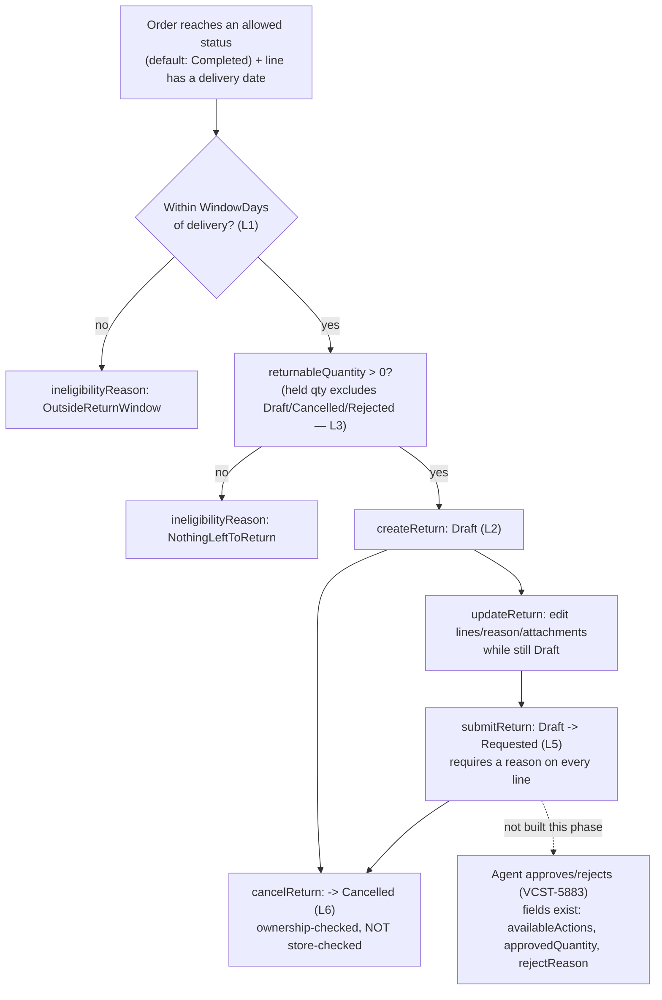

# Returns — domain map

> Refresh with `/qa-domain-map returns`. This file answers **what the feature is and where its surfaces
> are**. It does **not** carry behavioural rules — there is no `BL-RET` domain in
> `oracles/business-logic.md` yet (checked: Domains 1-24, none) — and it can **never ground an assertion
> as `{DOC}`**. Pointer index plus surface inventory: it says *where to look* and *what exists*, never
> *what correct looks like*.

**Every claim carries a verdict.** `CONFIRMED` = observed live or read at source this pass ·
`DRIFT` = prior art/docs say otherwise and are wrong · `MISSING` = documented, does not exist ·
`UNVERIFIED` = not established, and **not** to be treated as true.

**Read-only pass.** No create/update/submit/cancel/delete mutation was executed against either the new
or the legacy Return surface, and no order/store data was touched (a concurrent agent owns order seeding
for this env this pass).

> **MID-CHANGE, and it is the single most important fact in this file.** Both PRs are open and both
> advanced *during this same pass* (both show `updated: 2026-09-22`, today).
> 1. **Backend source drift.** The deployed module is `VirtoCommerce.Return 3.1002.0-pr-26-323d`
>    (confirmed via `GET /api/platform/modules`) — built from an **earlier commit** of PR #26 than the
>    one this map reads source from (`ee6e377b`, the PR's current head, short-sha fragment `323d`
>    vs `ee6e377`). Everything under §2c/§3 that cites source is grounded in the **later** commit; the
>    **live** GraphQL/REST observations are grounded in the **actually deployed** `323d` build. Where the
>    two could plausibly disagree this is called out inline; nothing observed live contradicted the
>    source read this pass.
> 2. **The storefront half is not deployed here at all — confirmed, not assumed.** The brief named
>    vc-frontend PR #2488 (`feat(VCST-5628): returns module — list, create wizard, details, cancel`,
>    head `4c6bb181`) as the deployed theme. The storefront footer on this env reads
>    **`Ver. 2.58.0-pr-2464-595d-595d3244`** — a **different PR number**. Checked PR #2464 directly: it
>    is `feat(VCST-5732): sales rep task management`, entirely unrelated to returns. **`/account/returns`
>    404s outright** (not an empty/gated page — a routing 404, confirmed live), and no order detail page
>    for any of the buyer's 19 orders (`New`/`Processing`/`Cancelled`, zero `Completed`) shows a Return
>    affordance. §2b states this as the reason, in preference to "no eligible order data" — both are true,
>    but the route's absence is the stronger and more precise cause, and it means seeding a `Completed`
>    order on this env **would still not produce a visible buyer flow** until PR #2488 itself deploys.

---

## §1 — Purpose and value chain

**Purpose** (this map's own reconstruction — no purpose statement exists in `PlatformUserGuide`,
`StorefrontUserGuide`, or the PR body for the buyer-facing half; the published guides only describe the
admin-created legacy flow, §3 D7): *An authenticated buyer requests to return specific quantities of
specific lines from their own delivered order, within a configurable window, optionally with a comment
and attachments, and can withdraw the request before an agent acts on it. Agent approval/rejection is a
separate, later phase (VCST-5883) that several fields already exist for but nothing in this build
exercises.* `CONFIRMED` as the mechanism (source + live); the sentence itself is the map's own framing,
not a quote.

The legacy admin Return module's own purpose IS documented (`PlatformUserGuide` §Return module overview,
verbatim): *"The Return module gives you an opportunity to view and manage all return operations. Once a
customer returns an item to your store, this information appears in the list of returns."* — an
**admin-side record of a return that already happened**, not a self-service request flow. The two
purposes coexist on the same entity going forward (§3 D1/D2/D9).

| # | Link, in the buyer's words | Mechanism |
|---|---|---|
| 1 | **My order becomes returnable** | `returnableItems(orderId)` computes per-line eligibility in `ReturnEligibilityService.GetIneligibilityReason`: order status must be in `Return.AllowedOrderStatuses` (default `Completed` — `IsOrderStatusAllowed`); the line's **shipment delivery date** (not order date — "no delivery date means no honest point to count the window from," source comment, `CONFIRMED`) must exist; `ReturnableUntil = deliveryDate + WindowDays` (default 30) must not have passed; remaining returnable quantity must be > 0. Reasons returned: `ReturnsDisabled`, `OrderStatusNotAllowed`, `LineCancelled`, `NotDelivered`, `OutsideReturnWindow`, `NothingLeftToReturn`. `CONFIRMED` source; **not reachable live this pass** — no order on this env is `Completed` (§0) |
| 2 | **I build a draft** | `createReturn(orderId, customerReference?, customerComment?, items[])` — `CreateReturnCommandHandler` is a thin pass-through to `IReturnFlowService.CreateDraft`; each item names `orderLineItemId`, `quantity`, optional `reasonCode`/`reasonComment`/`serialNumber`/`attachmentUrls`. Return starts in status `Draft`. `updateReturn(returnId, items?, customerReference?, customerComment?)` edits it while still `Draft`. `CONFIRMED` live (introspected argument shapes) + source (handler signature) |
| 3 | **Quantity is held, but only by "open" returns** | `ReturnQuantityService.GetHeldQuantity` sums quantity from every OTHER return on the same order **except** those in `NonHoldingStatuses = {Draft, Cancelled, Canceled, Rejected}` — i.e. a return only reserves quantity once it is `Requested`/`Approved`/`PartiallyApproved`/etc. This is a deliberately narrower definition than the legacy admin method (§3 D1). `CONFIRMED` source |
| 4 | **I attach evidence** | `ReturnAttachmentService` registers a file against a `ReturnLineItem` via the platform File Experience API; `Return.AttachmentsRequired` is a store setting, **default `false`** — the PR's own doc explains why: *"turned on before the scope exists, it would refuse every submit for a file the buyer has no way to upload"* (docs/return-module-guide.md, `CONFIRMED` source) |
| 5 | **I submit** | `submitReturn(returnId)` — `Draft -> Requested`. Docs (same file): *"Submit runs the same checks and additionally requires a reason on every line."* `CONFIRMED` source |
| 6 | **I can withdraw, but only before it's acted on** | `cancelReturn(returnId, reason?)` — sets `Status = Cancelled`, `CancelReason`. Authorization is by **ownership only** (`ReturnAuthorizationHandler.IsOwnedBy`, comparing the return's customer id to the caller) — no store-scope check exists in the handler (§3 D6, source-only, not reproduced live) |
| 7 | **Someone else decides what happens next — not built yet** | `ReturnType.availableActions` (`[ReturnActionType!]!`, fields `name`/`isAvailable`/`unavailableReason`) and `ReturnLineItemType.approvedQuantity`/`rejectReason` are **already in the live schema**, but no mutation in this build sets them from an agent's decision — VCST-5883's territory. `CONFIRMED` live (schema) that the fields exist; `UNVERIFIED` what any of them ever return, since no return exists to query |
| 8 | **Reversal is asymmetric, same as the legacy flow** | Cancel (buyer, pre-decision) and the eventual Reject (agent, post-decision — not built) are the only two ways a return's effect is undone. There is no un-cancel. |



### Actors

| Actor | Can do | Verdict |
|---|---|---|
| **Buyer / customer** | Create/edit/submit/cancel **their own** returns only (customer-id ownership check, no store check — D6). Cannot see or act on anyone else's return via `return(id)` if they somehow know its id, unless the id belongs to a different order of the SAME customer id | `CONFIRMED` source (`ReturnAuthorizationHandler`); ownership *enforcement* not reproduced live (would need a second buyer's return to attempt cross-access) |
| **Admin (legacy Return module)** | Search/view/edit status+resolution/delete any return, **across every store**, via the unchanged `api/return` controller. Cannot see the new fields (`customerComment`, `submittedDate`, attachments, `itemState`) in the legacy Admin SPA blade — that blade was not touched by this PR | `CONFIRMED` live (`api/return/search` returned pre-existing legacy rows from an unrelated store) + source (controller untouched) |
| **Returns agent (approve/reject)** | Not implemented in this build. Schema fields exist (`availableActions`, `approvedQuantity`, `rejectReason`) but nothing populates them from a decision | `UNVERIFIED` — deferred to VCST-5883 |
| **Anonymous** | Denied on every new-flow query with a clear `Unauthorized`/"Anonymous access denied" error (not a silent null) | `CONFIRMED` live (`returnReasons` probed unauthenticated) |

---

## §2 — Surface inventory

### 2a. Admin — legacy Return module (UNCHANGED by this PR)

Route: platform main menu **Return** blade (per `PlatformUserGuide` — not re-navigated live this pass;
its REST backing was hit directly and returned real pre-existing data, confirming the surface is live).
REST: `[Route("api/return")]` (**singular** — `config/test-suites.json`'s module-suite-map row for suite
073 states `/api/returns/` (plural), which 404s; the correct route is `api/return`, a small citation
correction worth fixing next time that map is touched):

| Verb | Route | Permission | `CONFIRMED` |
|---|---|---|---|
| POST | `search` | Read | live — returned 2 pre-existing legacy returns, one against store `Electronics` (not this ticket's store) |
| GET | `{id}` | Read | source |
| PUT | *(none — upsert)* | Update | source. **No POST create action exists on this controller** — `PlatformUserGuide` documents creating a return "via the Return module" as a UI action, which most plausibly upserts through this same PUT with no id (VC's common create-via-PUT convention); not confirmed live this pass (would require a mutating call) — recorded as `UNVERIFIED` rather than assumed |
| DELETE | *(none)* | Delete | source |
| GET | `available-quantities/{orderId}` | Read | live — returned a real per-line-item quantity map for a seeded order |

`Return.cs` model (legacy + new fields coexist on one entity): `Number, StoreId, CustomerId,
CustomerName, OrderId, OrderNumber, CustomerReference, Status, Resolution, CustomerComment, Comment,
RejectReason, CancelReason, Order, LineItems[]`. **`Resolution` (free-text, legacy) and `Status`
(dictionary-backed, legacy) sit alongside the new flow's own status machine** — see D9.

### 2b. Storefront — buyer-facing (NOT REACHABLE ON THIS ENVIRONMENT)

**No entry point renders anywhere** — confirmed by direct inspection, not inference:

- Account sidebar (`/account/orders` and every other account page): **Purchasing** section lists
  Dashboard, Orders (+ status counts), Lists, Quote requests, Saved for later, Back-in-stock list.
  **No Returns link.** `CONFIRMED` live, signed in as the buyer persona.
- Order detail page (`/account/orders/{id}`) for a `Processing` order: full line item, totals, addresses,
  shipping/payment method, Print order button. **No Return affordance of any kind.** `CONFIRMED` live.
- Direct navigation to `/account/returns`: **404 — routing failure, not an empty list.** `CONFIRMED` live.

**Root cause, confirmed rather than assumed (§0):** the deployed storefront build's footer identifies
itself as `2.58.0-pr-2464-...`, and PR #2464 is a completely unrelated feature (Sales Rep task
management). vc-frontend PR #2488 — the one that actually adds `/account/returns`, a create wizard, and
a details/cancel view (per its own title) — **is not what's deployed here**. The backend
(`VirtoCommerce.Return 3.1002.0-pr-26-323d`) IS the PR #26 build. **This is a backend-ahead-of-frontend
deployment gap, not a data gap** — seeding a `Completed` order on this env would not by itself produce a
visible flow.

### 2c. API — GraphQL, shared `/graphql` endpoint (not a scoped sub-schema, unlike Sales Rep)

**6 queries / 4 mutations**, live-introspected 2026-09-22 and 1:1 matched to source file names (zero
unmatched, zero extra):

```
returnableItems(orderId: String!): [ReturnableItem!]!
returnPolicy(storeId: String!): ReturnPolicy!
return(id: String!): Return
returnReasons(storeId: String!, cultureName: String): [ReturnReason!]!
returns(after: String, first: Int, keyword: String, sort: String, storeId: String!,
        statuses: [String], startDate: DateTime, endDate: DateTime): ReturnConnection!
returnStatuses(cultureName: String): LocalizedSettingResponseType!   # see D3 — NOT the new-code status set

createReturn(command: CreateReturnCommandType!): ReturnType
updateReturn(command: UpdateReturnCommandType!): ReturnType
submitReturn(command: SubmitReturnCommandType!): ReturnType
cancelReturn(command: CancelReturnCommandType!): ReturnType
```

Input shapes, live-introspected:

```
CreateReturnCommandType { orderId: String!, customerReference: String, customerComment: String, items: [InputReturnItemType!]! }
UpdateReturnCommandType { returnId: String!, customerReference: String, customerComment: String, items: [InputReturnItemType!] }
SubmitReturnCommandType { returnId: String! }
CancelReturnCommandType { returnId: String!, reason: String }
InputReturnItemType     { orderLineItemId: String!, quantity: Int!, reasonCode: String, reasonComment: String, serialNumber: String, attachmentUrls: [String!] }
```

Output shapes, live-introspected — note **no `storeId` argument on `return`/mutations**, only on
`returns`/`returnPolicy`/`returnReasons` (§3 D6):

```
ReturnType         { id, number, status, statusDisplayValue, createdDate, orderId, orderNumber,
                      customerReference, customerComment, rejectReason, cancelReason, itemsQuantity,
                      items: [ReturnLineItemType!]!, availableActions: [ReturnActionType!]! }
ReturnableItemType { orderLineItemId, productId, sku, name, imageUrl, measureUnit, orderedQuantity,
                      deliveredQuantity, returnableQuantity, isReturnable, ineligibilityReason,
                      deliveryDate, returnableUntil }
ReturnReasonType   { code, localizedName, requiresComment }
ReturnPolicy       { isEnabled, windowDays, allowedOrderStatuses }   # exactly 3 fields — see D8
ReturnLineItemType { id, orderLineItemId, productId, sku, name, imageUrl, measureUnit, orderedQuantity,
                      quantity, approvedQuantity, itemState, reasonCode, reasonComment, rejectReason,
                      serialNumber, attachments: [ReturnAttachmentType!]! }
ReturnActionType   { name, isAvailable, unavailableReason }
ReturnAttachmentType { name, url, mimeType, size }
```

**Anonymous access**: introspection was performed with a token this pass (not re-tested anonymously —
gap G6); a real query (`returnReasons`) unauthenticated returns `200` with
`errors[0].extensions.code: "Unauthorized"`, `data: null` — a clear refusal, not a silent empty result.
`CONFIRMED` live.

**Live values on this env**, buyer persona (AcmeCorp, 19 orders, none `Completed`):

| Call | Result | Verdict |
|---|---|---|
| `returnPolicy(storeId:"B2B-store")` | `{isEnabled:true, windowDays:30, allowedOrderStatuses:["Completed"]}` | `CONFIRMED` live — matches `ModuleConstants` defaults exactly |
| `returnReasons(storeId:"B2B-store")` | 5 codes: `DamagedInTransit, FaultyOnArrival, NoLongerNeeded, OrderedByMistake, WrongItemDelivered` | `CONFIRMED` live — matches source's 5-value default |
| `returns(storeId:"B2B-store")` as buyer | `{totalCount:0, items:[]}` | `CONFIRMED` live — no returns exist for this buyer, consistent with §0/§2b |
| `orders(first:20)` as buyer | 19 orders, statuses `{New, Processing, Cancelled}` only — **zero `Completed`** | `CONFIRMED` live — this is *why* link 1 is unreachable, independent of the frontend-deployment gap in §2b |

### 2d. NOT manageable from any layer this pass

- **Approval/rejection of a return** — no mutation exists yet (VCST-5883).
- **A store-scoped read/write of a single return by id** — `return(id)`/mutations take no `storeId`;
  only `returns()`/`returnPolicy()`/`returnReasons()` do (D6).
- **The legacy Admin SPA blade showing any new-flow field** — attachments, `customerComment`,
  `itemState`, `approvedQuantity` are all invisible there; the blade was not touched by this PR.
- **The buyer flow itself, on this environment** — 404 (§2b), independent of data.

---

## §3 — Where the layers DISAGREE

| # | Disagreement | Verdict |
|---|---|---|
| **D1** | **Legacy admin "available quantity" counts ANY return status; the new buyer flow's held-quantity counts only "open" ones.** `ReturnService.GetItemsAvailableQuantities` (legacy, `api/return/available-quantities/{orderId}`) sums `LineItems.Quantity` across **every** return on the order with **no status filter at all** — a `Cancelled` or `Rejected` legacy return still consumes quantity forever (the PR's own doc admits this verbatim: *"counts every return regardless of its status, so a cancelled or rejected one still consumes quantity"*). `ReturnQuantityService.GetHeldQuantity` (new flow) explicitly excludes `{Draft, Cancelled, Canceled, Rejected}` via `NonHoldingStatuses`. An admin checking the legacy endpoint and a buyer checking `returnableItems` for the **same order** can see two different "quantity left to return" numbers whenever a cancelled/rejected return exists on that order. | `CONFIRMED` source (both methods read verbatim); not reproduced live (would need a cancelled return to exist, none do on this env) |
| **D2** | **Settings split**: 8 settings are `StoreLevelSettings`. **Those are the C# field names in `ModuleConstants.cs`, NOT the persisted keys** — the dotted key drops the second `Return`, so the field `ReturnWindowDays` persists as `Return.WindowDays`. Verified live 2026-09-25 against `GET /api/stores/{id}`; a case written against the field name silently targets a setting that does not exist. The eight keys are `Return.ReturnEnabled, Return.ReturnNewNumberTemplate, Return.WindowDays, Return.AllowedOrderStatuses, Return.AllowedShipmentStatuses, Return.Reasons, Return.ReasonsRequiringComment, Return.AttachmentsRequired` — configurable per store, and `returnPolicy(storeId!)`/`returnReasons(storeId!)` read them per-store. `Return.ReturnPassword` (default `"qwerty"`, `SecureString`) and `Return.Status` (the legacy status dictionary) are **module-global only** — not in `StoreLevelSettings` — legacy leftovers with no per-store override. | `CONFIRMED` source (`ModuleConstants.cs`, exact array membership) |
| **D3** | **`returnStatuses` (the storefront-queryable localized dictionary) is a DIFFERENT vocabulary from `ReturnStatus.cs` (the new flow's actual status constants) — not a relabeling of the same set.** Live `returnStatuses`: `Approved, Canceled, Cancelled, Completed, Draft, New, PartiallyApproved, Processing, Rejected, Requested` (10, includes legacy `New` and the **legacy typo spelling `Canceled`**). Source `ReturnStatus.cs` constants: `Draft, Requested, Approved, PartiallyApproved, Rejected, Cancelled, AwaitingDelivery, Received, Processing, Completed` (10, includes `AwaitingDelivery`/`Received`, which the dictionary does **not** have). A return that ever reaches `AwaitingDelivery` or `Received` would have **no matching label** in the vocabulary a status-lookup UI would query via `returnStatuses` — and a return status of `New` (a dictionary value) is not a value the new-flow status machine can ever set. | `CONFIRMED` live (`returnStatuses` query) + source (`ReturnStatus.cs`) — genuine set difference, not overlap-only |
| **D4** | **`ReturnReasonType.localizedName` resolves to the raw code, not a display string.** Live: every reason's `localizedName` is byte-identical to its `code` (`"DamagedInTransit"`, not "Damaged in transit"). A storefront reason dropdown built from this field today would show `PascalCase` codes to a buyer. | `CONFIRMED` live — no localization resource was found to be missing/present this pass (not investigated further; recorded as observed, not diagnosed) |
| **D5** | **`requiresComment` live matches only 1 of the 3 codes the module's own default declares as comment-requiring.** `ModuleConstants` default for `Return.ReasonsRequiringComment` is `"FaultyOnArrival,DamagedInTransit,WrongItemDelivered"` (3 codes); live, only `FaultyOnArrival` returns `requiresComment: true` — `DamagedInTransit` and `WrongItemDelivered` both return `false`. Could be this store's own setting override rather than a bug — **not distinguishable without reading the store's actual persisted setting value**, which was not done this pass. | Source default vs. live value **CONFIRMED** to differ; whether that is an override or a defect is `UNVERIFIED` (gap G3) |
| **D6** | **Authorization is customer-scoped, not store-scoped, on `return(id)`/`updateReturn`/`submitReturn`/`cancelReturn` — while `returns()`/`returnPolicy()`/`returnReasons()` are store-scoped by argument.** `ReturnAuthorizationHandler` checks only `IsOwnedBy(orderReturn, callerId)` and authentication; no `storeId` comparison exists in the handler. A customer id that happens to have returns across more than one store (plausible for a multi-org contact) could plausibly fetch/cancel a return by id without it being scoped to the store context they're currently signed into. | `CONFIRMED` source; **not reproduced live** — would need a real cross-store same-customer return pair, none exist (gap G4) |
| **D7** | **Published docs describe only the admin-created legacy flow; the entire buyer self-service mechanism this map documents does not exist in any published guide.** `PlatformUserGuide` "Manage Returns" covers creating/processing returns via the Return module or the Orders module — both admin actions. `StorefrontUserGuide` was queried directly for a return/RMA page and returned **zero** results (checkout, quote-requests, purchase-requests — nothing named "return"). This is **expected given both PRs are unmerged** (§0), not a defect — but it means once PR #2488 merges, `StorefrontUserGuide` needs a **new** page (there is nothing to amend, unlike a contradiction) and `PlatformUserGuide`'s "Manage Returns" page needs a customer-initiated-vs-admin-initiated distinction added. | `CONFIRMED` (docs queried first-hand, zero hits); flagged as a **future** doc gap, not a current contradiction |
| **D8** | **`ReturnPolicy` carries exactly 3 fields (`isEnabled, windowDays, allowedOrderStatuses`) — the three fields this map's own brief was told to check against a larger hypothesized set (`allowOrderlessReturns, maxOrderlessLineQuantity, policyText`) that DO NOT exist anywhere in source or the live schema.** | `CONFIRMED` on both source (`ReturnPolicy.cs` model, 3 properties) and live introspection (`__type(name:"ReturnPolicyType")`, 3 fields) — the narrower set is correct |
| **D9** | **The `Return` entity still carries the legacy free-text `Resolution` field alongside the new dictionary-backed `Status`, and neither creation nor approval of a return raises any order-side event** (per `config/test-suites.json`'s own retired-case note on suite 073: no payment refund is ever triggered by a return, `resolution` is nullable free text with no enum, and 4 pre-existing legacy returns with `resolution:"refund"` show zero actual order refunds). This PR does not touch that gap — a return reaching any terminal state, old or new, still does not connect to payment/refund automatically. | `CONFIRMED` — carried over from a prior, already-live-verified finding recorded directly in the suite manifest; re-confirmed the `Resolution` field still exists on the current `Return.cs` |

---

## §4 — Coverage shape

| Suite | Content | Feature-relevant to THIS ticket's buyer flow |
|---|---|---|
| `073-returns.csv` (Backend/returns) | 22 rows, **all** `Automation Status: None`. Legacy admin CRUD only: create/view/edit/delete a return via the Admin SPA "Returns workspace," status transitions (`New/Processing/Completed/Rejected`), search/filter/sort/pagination, grid-consistency checks, a refund-amount assertion, an inventory-restore assertion. | **Zero.** Every row targets the unchanged legacy admin blade; none exercises `createReturn`/`submitReturn`/`cancelReturn` or any storefront surface. The module-suite-map's REST citation for this suite (`/api/returns/`) is also off by one letter — the real route is `api/return` singular (§2a) |
| `014b-orders-frontend-returns-filtering.csv` rows `ORD-037..ORD-051` (15 of 47 total rows in that file) | Speculative buyer-return cases (`Return - Reason Selection Required`, `Status Tracking Display`, `Partial Return Quantity Selection`, `Window Expiry Enforcement`, plus invoice/cancellation rows) authored **before this feature existed**, all `Automation_Status: Draft`, all carrying `References: "ENV-BLOCKED: Returns module not installed on vcst-qa (Coverage Gap Analysis)"`, all citing `Business_Rule: PROPOSED-BL-RTN-001` (never adopted — no `BL-RET` domain exists in the oracle) and `Edge_Case_Refs: ECL-7.1` — which is **"Browser & Device Issues,"** not returns at all. A miscitation, not just a placeholder. | **Zero, and actively misleading if reused as-is.** Their guessed mechanics do not match the real schema: e.g. ORD-038 assumes a customer-visible "RMA ID" — the real field is `Return.number`; ORD-040 assumes a visible "Return period has ended" message on the order page — the real mechanism is a per-line `ineligibilityReason: OutsideReturnWindow` returned from `returnableItems`, with no confirmed storefront rendering of it (route doesn't exist, §2b); none references `orderLineItemId`, `quantity` caps via `returnableQuantity`, or the reason-code vocabulary that actually exists. These rows should be treated as **superseded**, not extended, once the storefront half deploys |

**Zero coverage, and it is a hole, not a deliberate exclusion:** the entire new backend surface
(`createReturn`, `updateReturn`, `submitReturn`, `cancelReturn`, `returnableItems`, `returnPolicy`,
`returnReasons`, `returnStatuses`, and the new `returns`/`return` query behavior) has **no test case
anywhere in the corpus** that targets the actual schema. This is expected for an unmerged PR, but it
means the day PR #26 merges, this domain starts at **true zero**, not at "14b's rows just need
unblocking."

**Executability note:** even a freshly authored suite against this schema could exercise the full
backend flow via GraphQL today (schema is live, `323d` build), but could not exercise anything through
the storefront UI until vc-frontend PR #2488 (or its successor) is actually deployed to an environment
(§0/§2b) — a `requiresModules`-style environment gate belongs on any storefront-layer case, distinct
from the backend-layer cases which only need `VirtoCommerce.Return` installed.

---

## §5 — Open gaps

| # | Gap | State |
|---|---|---|
| G1 | Whether `createReturn`/`submitReturn`/`cancelReturn` actually succeed end-to-end (a real `Draft -> Requested -> Cancelled` cycle) | **OPEN** — needs an order that reaches `Completed` status with a delivered line inside the 30-day window, which needs seeding (deliberately not done this pass — reserved for the concurrent seeding agent per the brief) and a mutation, which this read-only pass does not perform |
| G2 | The legacy admin controller's actual **create** path (no POST action exists; hypothesized as an id-less `PUT`) | **OPEN** — needs one non-destructive mutating call against `api/return` with no `id`, or a walk of the Admin SPA's "Add new return" button's network call, neither done this pass |
| G3 | Whether D5 (`requiresComment` mismatch) is a per-store setting override or a genuine defect | **OPEN** — needs `GET /api/settings/Store/B2B-store/values?names=Return.ReasonsRequiringComment` (or the Admin Settings blade) read, not attempted this pass |
| G4 | Whether D6 (no store-scope check on `return`/mutations) is exploitable — i.e. whether a real customer id has returns spanning two stores on any environment, and whether cross-store fetch/cancel actually succeeds | **OPEN** — needs a same-customer, two-store return pair; none exist on this env |
| G5 | The Admin SPA's legacy Returns blade's own screen contents (columns, widgets) were **not re-navigated live this pass** — cited from the 073 suite's own case descriptions and the PlatformUserGuide, not fresh screenshots | **OPEN** — a straightforward re-walk, deprioritized in favor of the backend/schema work given the storefront is unreachable anyway |
| G6 | Anonymous **introspection** (as opposed to anonymous query execution, which was confirmed refused) was not tested against `/graphql` this pass | **OPEN** — low priority; the query-refusal behavior is the security-relevant half and is confirmed |
| G7 | `Return.AllowedShipmentStatuses` (default empty = any status) was read from source only, never exercised against a real shipment-status value | **OPEN** — needs a delivered order whose shipment carries a specific non-default status |
| G8 | vc-frontend PR #2488's own route names, wizard step count, and rendered field set are **entirely unread** (§0 — deliberately not investigated since nothing on this env can reach it) | **OPEN** — re-open this gap and read the PR's diff once it is actually deployed somewhere reachable; do not guess its shape from the backend schema alone, since a storefront rarely renders 1:1 with its GraphQL contract (see D4's raw-code labels as exactly the kind of gap a UI layer usually papers over, or doesn't) |

---

## §6 — Prior-art verdicts

| Claim | Verdict |
|---|---|
| Ticket brief: `ReturnPolicyType` live "has only `isEnabled`, `windowDays`, `allowedOrderStatuses`"; the ticket also names `allowOrderlessReturns`, `maxOrderlessLineQuantity`, `policyText` as **not** existing | **CONFIRMED exactly as briefed** — both source and live agree on the narrower 3-field set (D8) |
| Ticket brief: admin's legacy quantity calc counts every return regardless of status, while the storefront path does not | **CONFIRMED exactly as briefed**, and sourced precisely to `ReturnService.GetItemsAvailableQuantities` vs `ReturnQuantityService.GetHeldQuantity`/`NonHoldingStatuses` (D1) |
| Ticket brief: settings split — 8 store-level, `Return.ReturnPassword` + `Return.Status` module-global | **CONFIRMED exactly as briefed** (D2), with the exact 8-item array named |
| Ticket brief: "the feature is enabled on this stand but no test orders exist yet" | **CONFIRMED, but incomplete as the full explanation.** True that zero orders are `Completed` (§2c). Also true, and not named in the brief, that the storefront route does not exist on this build at all regardless of order data (§0/§2b) — the more precise and more consequential of the two reasons |
| 014b suite's `PROPOSED-BL-RTN-001` and its guessed field/route names (RMA ID, "Return period has ended" copy, a dropdown of "Defective/Wrong Item/Changed Mind") | **DRIFT, now supersedable.** None of the guessed vocabulary matches the real schema (§4) — this map's §2c is the authoritative field/argument list going forward |
| module-suite-map row for suite 073: REST endpoint `/api/returns/` | **DRIFT, minor.** The real route is `api/return` (singular), confirmed live and in source |

Resolves 014b's own open question ("what does this look like once the module is installed?") — it now
is, on the backend, and this map is the answer. Does not resolve G1/G2/G3/G4/G8 above.

---

## §7 — Amendments

*(none yet — this is the initial build, rev 1)*
