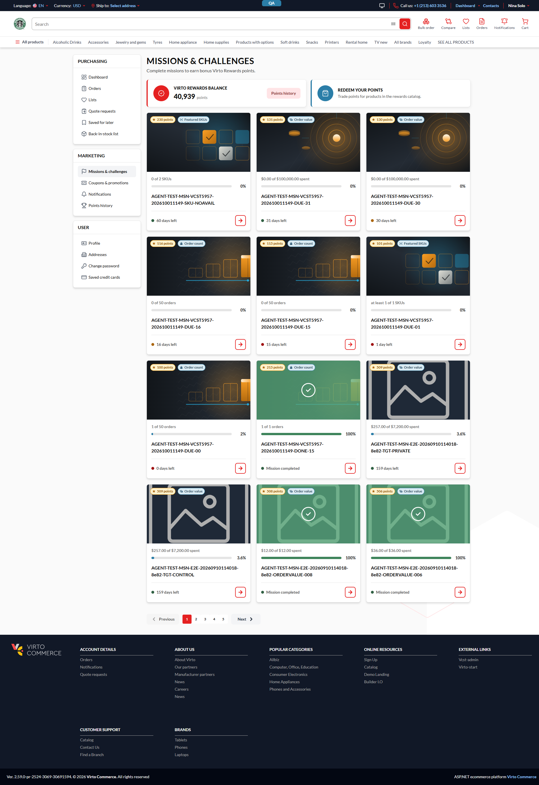
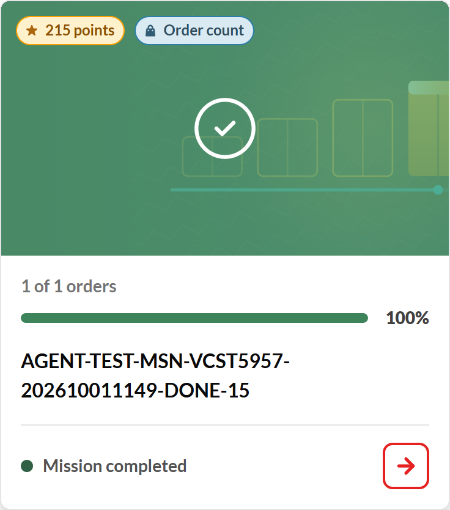
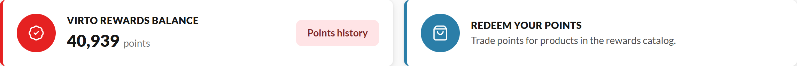
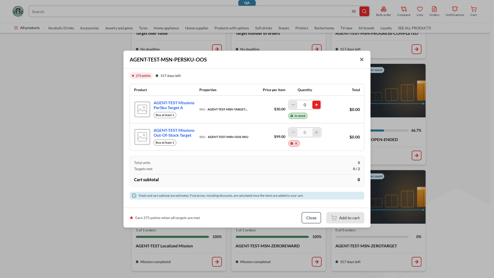

# View and Track Your Loyalty Missions

### Introduction

If your store runs loyalty missions, you can earn extra points by completing goals — spending a set
amount, placing a number of orders, or buying specific products — on top of any points you already earn
from ordinary shopping.

*Each open mission is shown as its own card with its name, description, reward, and how many days are left.*

### Prerequisites

- You are **signed in** to your account.
- Your store offers loyalty missions. If you don't see **Missions & challenges** in your account menu,
  it isn't enabled for your account — contact your store administrator.

### View your missions

1. Sign in to your account. The **Missions & challenges** link appears in your account navigation right
   away — you don't need to reload the page.
2. Click **Missions & challenges**.
3. Each mission card shows its reward, its type, your progress, its name and the time left (see
   [Read a mission card at a glance](#read-a-mission-card-at-a-glance)).
4. Only missions that are currently open to you are listed — a mission that hasn't started yet or has
   already expired won't appear here.

!!! note "I opened a link to Missions & challenges before signing in — what happens?"
    You're taken to sign in first. Once you sign in, you're brought straight back to the mission you
    were trying to open, not just to your account dashboard.

### Check what you need to do to complete a mission

The card shows your progress against the goal (for example, "$0.00 of $100,000.00 spent" or "0 of 50 orders"). Open the mission to see the full details.

1. Click a mission's card to open its details.
2. What you see depends on the mission's goal:
   - **Spend a set amount** — the target amount and the points you'll earn for reaching it.

     
     *Opening the mission shows the spend target — the card itself shows only what you've spent so far.*

   - **Place a number of orders** — the number of separate orders you need to place.
   - **Buy specific products** — every qualifying product is listed, with a counter showing how many
     you've already bought (for example, "2 of 3"). That counter always matches the progress shown on
     the card you opened it from.

     
     *Every qualifying product is listed with its own price, along with how many you still need.*

### Read a mission card at a glance

*The page opens with two banners, then the mission cards - 12 per page, three across on a wide screen, with page numbers below.*

Every card is built the same way, so you can spot what matters without opening it:

- **On the picture** - a yellow chip with the points you earn, and a blue chip with the mission type:
  **Order value**, **Order count** or **Featured SKUs**.
- **Under the picture** - your progress line (for example "0 of 50 orders"), a progress bar with a
  percentage, and the mission name.
- **At the bottom** - the time left, and an arrow button (**Open mission**) that opens the details.

The dot next to the time left tells you how urgent the mission is:

| Dot | Meaning |
|-----|---------|
| Red | 15 days left or fewer |
| Amber | 16 to 30 days left |
| Green | 31 days or more left, or **No deadline** |

*A completed mission turns green with a check mark, a full green progress bar, and the footer "Mission completed".*

!!! note "My mission is completed but still has days left - why does it say 'Mission completed'?"
    Once you finish a mission, the footer shows **Mission completed** with a green dot instead of the
    countdown, even if the mission window is still open.

!!! note "Why is the progress bar a different colour?"
    The bar is blue while a mission is in progress and green once it is completed. The same colours are
    used on the card and inside the mission details.

### Check your balance and open your points history

At the top of the page, the **Virto Rewards balance** banner shows your current points and a
**Points history** button.

*The balance banner (left) and the "Redeem your points" banner (right).*

1. Click **Points history**.
2. You land on your **Points history** page, where the balance is the same number as the banner.

The **Redeem your points** banner tells you that points can be traded for products in the rewards
catalog. To shop with your points, use **Loyalty** in the store's main menu.

### Buy the featured products from a mission

For a **Featured SKUs** mission, the details window lists each qualifying product in a table with the
columns **Product**, **Properties** (the SKU), **Price per item**, **Quantity** and **Total**.

*An out-of-stock product shows a red "0" badge and its quantity control is switched off.*

1. Click the arrow button on a **Featured SKUs** card.
2. Use **+** next to a product to choose how many to buy. The **Total units**, **Targets met** and
   **Cart subtotal** lines update as you go.
3. Click **Add to cart**.
4. The window closes, and when you open the mission again the product shows **in Cart** with the
   quantity you added. A "Buy at least N" label turns green once your quantity reaches the target.

!!! note "Why is Add to cart greyed out?"
    It stays off while the total is 0 units. Products that are out of stock, or whose availability
    cannot be determined, cannot be changed - their quantity control is disabled.

!!! note "Do the totals include discounts?"
    No. The window says the totals and cart subtotal are estimates; final prices, including discounts,
    are calculated once the items are in your cart.

!!! note "Does adding to the cart count towards my mission?"
    No. Putting products in your cart, or taking them out again, does not change your mission progress.

!!! tip
    Press **Esc** to close any mission window. Focus returns to the button you opened it from. On phones
    and tablets the cards and windows fit the screen without sideways scrolling, and the page is
    readable in the dark theme.

### Featured-product prices follow your currency

If your store offers more than one currency, each product's price in the mission detail always matches
that product's own price on its product page, in whichever currency you currently have selected.

### Troubleshooting

- **I don't see "Missions & challenges" in my account menu** — it isn't enabled for your account or your
  store. Contact your store administrator.
- **A mission I saw before is no longer listed** — once a mission's window closes, it stops being listed.
- **A mission that has ended still shows "0 days left"** - it can briefly remain listed after its window
  closes. Contact your store administrator if it stays.

See also: [Manage Loyalty Missions](Loyalty&Mixed%20cart/missions-admin-guide-2026-09-02.md) (admin guide — creating and configuring missions in the back office).

---

*VCST-5346 verdict FAIL; amended for VCST-5957 verdict PASS WITH NOTES - verified on vcst-qa - Audiences derived from layer `storefront` -
Evidence: `reports/tickets/Sprint26-17/VCST-5346/`, `reports/tickets/Sprint26-19/VCST-5957/`*

*Not documented (VCST-5957): sort dropdown - NOT-RUN, not built (declared scope cut) - "Account setup" mission kind - NOT-RUN, not built (no backend type) - "Rewards catalog" button on the Redeem banner - NOT BUILT, accepted scope cut (VCST-5823) - completed-mission contrast and screen-reader names (VCST-6142, VCST-6143, VCST-5826) - localised labels in de/fi/ja - FAIL - unknown mission type fallback and page kept in the address after reload - NOT-RUN.*

*Not documented (VCST-5346, earlier run): non-English mission text - FAIL - mission attribution in points history - FAIL (BL-LOY-015) - new-mission / completion notifications - UNCOVERED - per-SKU required quantity (3.a) and 375 px truncation (G12) - UNCOVERED - single-currency card (2.j), modal currency label (3.e), empty state (G7), partial payload (G5) - BLOCKED.*
