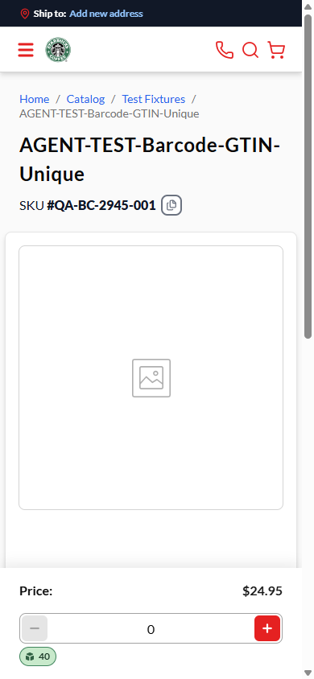
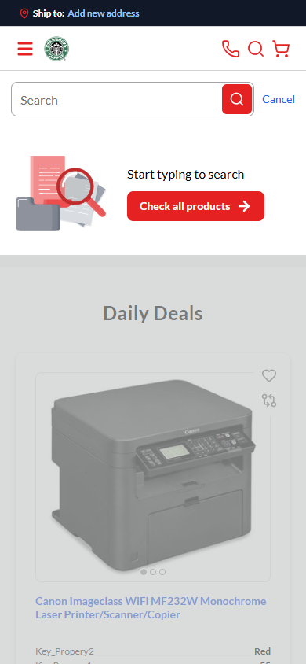

# Finding a Product by Scanning Its Barcode

### Introduction

The search bar's barcode scanner lets you jump straight to a product by scanning its code instead of
typing a search. Your store can now set the scanner up so that a scan looks for an **exact match** on
the codes it chooses (for example the product's GTIN, SKU, or manufacturer part number) — so scanning
the item in your hand takes you straight to its page, instead of running a general keyword search.

*Scanning a code that matches exactly one product opens that product's page — here on a mobile screen.*

### Prerequisites

- No account is required — the scanner works the same way whether you are browsing as a guest or
  signed in.
- The scanner button only appears if your store has left it turned on (see below).

### Scan a product's code

1. Click the **scanner** icon in the search bar.
2. Scan the product's barcode.
3. If the code matches exactly one product, its page opens right away — no results list, no extra
   click.
4. If the same code is shared by more than one product (for example different sizes of the same item),
   you instead see a results list headed by the code you scanned.
5. If the code doesn't match anything, you see a "No products found" message for that code, with a
   **Reset** option that clears the scan and returns you to the full catalog.

!!! note "Why don't I see the usual filters after a scan?"
    A scan looks for one specific item, so the sidebar and browsing options (category, in-stock,
    branch) are hidden while a scan result is showing — they don't apply to a single scanned code.
    Sorting the list still works.

While scan results are showing, the search bar stays empty and the **scanner** icon stays in it, so
you can scan the next item right away. Typing a word and pressing Enter starts a normal keyword search
instead.

### When the scanner isn't available

Some stores turn the scanner off entirely, or keep it on with plain keyword matching. When it's off,
the scanner icon simply doesn't appear in the search bar, on desktop or on mobile.

*With the scanner turned off, no scan icon shows in the mobile search bar either.*

### Troubleshooting

- **A scan opens a list instead of the product I wanted** — the store may not have set up exact
  matching yet, so the scan is being read as a normal keyword search. This is a store setting, not
  something you control from the storefront.
- **The scan doesn't find my product** — the product may not yet carry the code your store matches on
  (for example its GTIN), or the catalog may still be updating after a recent change. Try again in a
  few minutes, or search by name instead.

---
*Source: this run's own evidence (`reports/tickets/Sprint26-19/VCST-2945/`); StorefrontUserGuide
"Barcode scanner" (https://docs.virtocommerce.org/storefront/user-guide/shopping/searching-for-products)
consulted for voice and terminology.*
