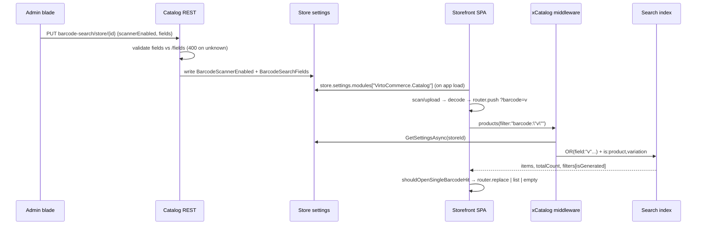
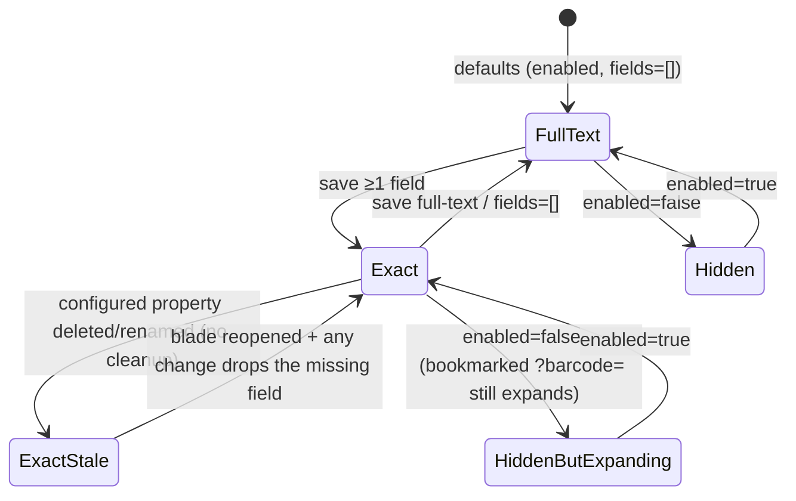

# Test Model — VCST-2945 — Barcode scanner search setup

```
TEST MODEL — VCST-2945
Ticket:      VCST-2945 | Type: Story | Status role: testable | Flow: feature-test | Priority: P2 (Medium) | Path: FULL | Changed: Both (Admin SPA + module REST + xAPI + storefront)
Context:     FULL: ba-system-analyzer (1c) + ba-story-writer Mode B (1d) + 1r reachability (REACHABLE, 3.6 min)
Prior model: none — first model for this surface
Domain map:  .claude/knowledge/domain/search.md @ rev 1 (generated 2026-09-28, built_in_run: true) — see §Chain position
Mind map:    ABSENT
Chain position: see block below Part 0
Affected surface: vc-module-catalog #909 (Admin SPA blade barcode-search.{js,tpl.html}, search-configuration.js tile;
             CatalogModuleBarcodeSearchController; BarcodeSearchConfigurationService; ProductDocumentBuilder schema) ·
             vc-module-x-catalog #113 (EvalBarcodeFilterMiddleware in the IndexSearchRequestBuilder pipeline) ·
             vc-frontend #2501 (useBarcodeSearch.ts, search-bar.vue, mobile-search-bar.vue, barcode-scanner-modal.vue
             [unchanged; Browse = file-upload decode path], category.vue, useProducts.prepareFilters, facets.ts escape,
             filter.graphql isGenerated, 13 locales). All three OPEN, deployed as PR builds on vcst-qa.
Ticket signals: no ACs, no attachments. The spec is the PR #909 body posted as a comment 2026-09-23. 2025-03-31 comment
             proposed UPC/EAN/ISBN/JAN/type/serial/lot fields — NOT delivered; delivered = pick index fields for exact match.
             Linked VCST-2622 (Done): scanner button, full-text scan, "single match opens PDP" in its AC.
Epic context: none (no parent). Integration sibling: VCST-2622 (Done) — the scanner this story re-routes; its full-text
             path must be unchanged when no fields are configured.
Domains:     srch (primary), cat, store
Flows & boundaries: admin search configuration ↔ store settings ↔ storefront module settings · product/variation
             data ↔ search index ↔ xAPI products(filter) · results page ↔ facets/filter chips ↔ PDP · search history · analytics
Risk areas:  shared-store config (B2B-store is every runner's store) · two write paths, one unvalidated · index lag ·
             provider case-folding (vcst-qa: case-INSENSITIVE, observed 1c) · facet aggregation rewrite · redirect race
AC traceability: 16 derived {SPEC} ACs (AC-1..16) + 13 gap-ACs (G1..G13) — 1d, working context
DoD: none declared on the ticket — proposed DoD kept in working context; confirm at 5-verdict
```

## Test object (2-map / 1c)

- **Purpose (UNDECLARED before this model; established here):** let a store find the exact product a shopper is
  holding by scanning its code, by matching the scanned value to the product-identifier fields the store chooses
  (instead of free-text relevance), and let the store turn the scanner off.
- **Operations:** fill code/GTIN/MPN/short-text property on product or variation · GET/PUT
  `api/catalog/barcode-search/store/{id}` (+`/fields`) · blade Save/Reset · generic settings write (`PUT /api/stores/{id}`) ·
  storefront scan (camera or **Browse image upload**) in desktop and mobile bars · direct `/search?barcode=` · xAPI
  `products(filter:"barcode:\"v\"")`.
- **Properties:** `scannerEnabled`, `fields[]` (order, canonical case), `/fields` list (`isCollection`, `isProductField`),
  response `filters[].isGenerated`, `totalCount`, redirect target, heading i18n key, chip set, history entries.
- **Variants:** see matrix rows.
- **Constraints:** BL-SRCH-002 empty state · BL-SRCH-003 / BL-CAT-003 index lag · BL-SRCH-004 store scope ·
  BL-SRCH-005 special chars · BL-STORE-001 per-store config · BL-SRCH-001 facet counts follow the filter.

## Part 0 — VALUE CHAIN

Value chain:
- **L1** Category manager puts the code on the product or variation (code / GTIN / MPN / a short-text property) →
- **L2** the index holds it as a filterable string field (after the reindex window) →
- **L3** store admin opens Store → Search configuration → Barcode scanner, picks exact match + fields, saves (validated) →
- **L4** the store's public settings carry `BarcodeScannerEnabled` / `BarcodeSearchFields` to the storefront →
- **L5** the shopper sees (or not) the scanner in the search bar, scans; exact mode routes `?barcode=v`, full-text `?q=v` →
- **L6** xAPI expands `barcode:"v"` into an OR of the configured fields, widens to variations, patches aggregations,
  reports the expansion `isGenerated` →
- **L7** the results page shows 0 / 1 / N: empty state · opens the product (or variation) · lists with browsing controls hidden →
- **L8** the shopper acts on the found item (PDP → add to cart). **This is what it unlocks.**

```mermaid
flowchart LR
  L1[CM fills code/GTIN/MPN/prop<br/>on product or variation] --> L2[Index: filterable string field]
  L3[Admin: Barcode scanner blade<br/>exact + fields, Save] -->|PUT validated| L4[Store settings public<br/>Catalog.Search.*]
  X[Generic PUT /api/stores/id] -.unvalidated.-> L4
  L4 --> L5{Storefront bar}
  L5 -->|enabled=false| H[no scanner button]
  L5 -->|fields=[]| FT[?q=v full-text — VCST-2622 path]
  L5 -->|fields non-empty| EX[?barcode=v]
  EX --> L6[xAPI expands barcode: → OR fields<br/>is:product,variation · aggs · isGenerated]
  L2 --> L6
  L6 --> R0[0 hits: header_barcode_empty + Reset]
  L6 --> R1[1 hit unnarrowed: router.replace → PDP / variation]
  L6 --> RN[N hits: list, sidebar+prefs hidden]
  R1 --> L8[PDP → add to cart]
  RN --> L8
```





**Variants** (derived from the layer that branches — middleware + composable + blade):
V1 exact · single built-in field (`gtin`) · product-level │ V2 exact · multi-field OR (`gtin`+`code`) │ V3 exact · short-text
property field │ V4 exact · variation-level code │ V5 full-text (fields=[]) — VCST-2622 baseline │ V6 scanner disabled │
V7 mobile bar (≤1023 px DOM swap) │ V8 back-office role: BrowseFilters Update / Read-only / none │ V9 storefront actor:
anonymous / signed-in B2B │ V10 write path: blade vs dedicated PUT vs generic settings PUT.

**Mechanism coverage matrix** (cols = links, rows = variants; cells = scenario # / GAP / WAIVED)

| | L1 fill | L2 index | L3 configure | L4 expose | L5 bar/route | L6 expand | L7 render | L8 act |
|---|---|---|---|---|---|---|---|---|
| V1 gtin | 1 | 1 | 1 | 1 | 1 | 1,4 | 1,9 | 1 |
| V2 OR | 5 | 5 | 5 | 5 | WAIVED — same route as V1 | 5,6 | 5 | WAIVED — same PDP path as #1 |
| V3 property | 7 | 7 | 7 | 7 | 7 | 7,12 | 7 | WAIVED — as V2 |
| V4 variation | 8 | 8 | 8 | 8 | 8 | 8 | 8 | 8 |
| V5 full-text | WAIVED — pre-existing data | WAIVED — VCST-3054 | 2 | 2 | 2,22 | 2 (untouched) | 2,23 | WAIVED — VCST-2622 |
| V6 disabled | n/a (no data dependency) — WAIVED | WAIVED | 3 | 3 | 3 | 3 (still expands) | 3 | WAIVED |
| V7 mobile | WAIVED — data layer identical | WAIVED | WAIVED — config identical | 20 | 20 | WAIVED — same query | 20 | WAIVED |
| V8 roles | WAIVED — product edit perms out of scope | WAIVED | 14,15,16 | WAIVED — public read | WAIVED | WAIVED | WAIVED | WAIVED |
| V9 actor | WAIVED | WAIVED | WAIVED | 21 | 21 | 21 | 21 | WAIVED |
| V10 write path | WAIVED | WAIVED | 13,17,18 | 18 | WAIVED | 18 | WAIVED | WAIVED |

**Reverse edges** (per forward effect that moves entitlement — here "a scan finds this product"):
- Exact → full-text (unconfigure) → #2 covers ("scan reverts to full-text").
- Scanner off → button gone → #3; **but the expansion is NOT revoked** for a hand-built/bookmarked `?barcode=` (pr113
  runtime note, intentional) → #3 asserts it as documented behaviour.
- Configured property deleted/renamed → **no cleanup path: stale name persists, scans silently 0** until blade reopen+change → #19.
- Code removed from the product → index lag → no longer found → #11.
- Store A config does not leak to store B (BL-STORE-001) → #10.

**Fixture lifecycle:** store settings are mutable shared state on B2B-store — every storefront-scan case **sets then
restores** `scannerEnabled=true, fields=[]`, and those cases are serialised (one session at a time). API/xAPI cases use a
**dedicated AGENT-TEST store bound to the B2B-mixed catalog**, so they never touch B2B-store. Seeded product codes are
per-seed; nothing is terminal.

**Chain position (clause 11):** the domain chain (search.md §1) is *enter query/scan → build filter → index search →
facets/sort/page → results → PDP → cart*. This ticket touches **L3–L7 plus the scan entry (L5) and the variation widening**,
and relies on (does not change) indexing (L2), PDP and cart (L8). It does **not** touch: keyword relevance/fuzzy, search
suggestions dropdown, category browsing, facet configuration, sorting configuration, search history storage.

## Part 0r — ROLE SCENARIOS (matrix carries >1 role variant: V8, V9)

Roles in scope: store admin with `catalog:BrowseFilters:Update` → `@td(ADMIN_DEFAULT.email)` · back-office user with
`catalog:BrowseFilters:Read` only → **FIXTURE-GAP** (no role holds Read without Update — to 3a) · back-office user with
neither → **FIXTURE-GAP** (to 3a) · anonymous shopper → no account · signed-in B2B buyer → `@td(ORG_USER.email)` (3a confirms alias).

BSC-1 — Store admin sets up exact barcode matching
  Role: admin (Update) · Situation: the store sells scanned goods and wants scans to open the exact product.
  | # | Action | Sees | Can do | Expected |
  | 1 | open Store → Search configuration | Facets / Sorting / Barcode scanner tiles | open Barcode scanner | blade with switch, match mode, hints |
  | 2 | choose Exact, tick gtin + code, Save | fields checked-first then alphabetical | Save enabled only when dirty+valid | 204; GET returns the fields |
  Outcome: a scan of a configured code resolves to that product.
  Not allowed: saving Exact with zero fields (Save disabled + PUT 400) · saving an unknown field name (400 naming it, nothing persisted).

BSC-2 — Merchandiser reviews the barcode setup without the right to change it
  Role: BrowseFilters Read-only · Situation: a category manager checks which fields scans match.
  | # | Action | Sees | Can do | Expected |
  | 1 | open Barcode scanner blade | current mode + fields | nothing editable | controls read-only, no active Save |
  Outcome: the setup is visible, unchanged.
  Not allowed: `PUT barcode-search/store/{id}` with this role's own token → 403, settings unchanged on re-GET.

BSC-3 — Back-office user without search-configuration access
  Role: neither permission · Not allowed: `GET barcode-search/store/{id}` and `/fields` → 403; `PUT` → 403, nothing persisted.

BSC-4 — Shopper scans a product in hand (anonymous and signed-in B2B)
  Role: anonymous; B2B buyer · Situation: standing at a shelf, scans a product barcode.
  | 1 | tap scanner, upload the code image | results or PDP | open the product | same resolution for both actors |
  Outcome: identical exact-match resolution for both. Not allowed: the scan is not written to search history.

## Parts 1–5 — FAULT MODEL

**Condition space:** match mode {full-text, exact} × field set {gtin, code, mpn, property, gtin+code} × data level
{product, variation} × hits {0, 1, N} × value shape {plain digits, mixed case, quote/colon, whitespace-only, very long} ×
scanner {on, off} × bar {desktop, mobile} × actor {anon, B2B} × write path {blade, dedicated PUT, generic PUT} ×
role {Update, Read, none}. Constraints: full-text × field set = infeasible (fields ignored); scanner off × scan = infeasible
(no button; only direct URL); role applies to L3 only; actor/bar apply to L5–L7 only. Raw N ≈ 2·5·2·3·5·2·2·2·3·3 = 21 600.

**Reduction:** (a) role and write path touch L3 only → factored out of the storefront space into their own DT (#13–18, 9 cells → 6);
(b) actor and bar do not change the query (settings are store-level, the composable is shared) → one pair-wise sweep row each
(#20, #21) instead of multiplying; (c) value shape is a BVA over one field (gtin/property) with exact mode (#4, #12, #24);
(d) hits × data level: {0,1,N} on product (#9, #1, #6) + {1} on variation (#8) — N on variation subsumed by #6's OR; (e) field
set: each field kind once (#1 gtin, #5 gtin+code, #7 property, #8 mpn on variation) — code-only subsumed by #5. **N → M = 24.**
Dropped: provider variation (vcst-qa has one active provider — case-insensitive; Lucene path untestable here, stated);
older-backend compat (AC-14 — no old-backend lane; WAIVED, unit-tested per PR).

| # | Cell | Defect hypothesis | Archetype | Technique | Oracle | P |
|---|---|---|---|---|---|---|
| 1 | [JOURNEY] exact · gtin · product · 1 hit · desktop · anon | the chain breaks at a join: saved setting not read by the SPA, scan still goes to ?q=, or the single hit lists instead of opening the PDP — the shopper cannot reach the item they hold | PARITY | FLOW | {SPEC} pr909/pr2501 single-hit opens product | Critical |
| 2 | full-text (fields=[]) · scan | the new composable breaks the VCST-2622 path: scan no longer fills the phrase/runs search, or routes ?barcode= with no fields ⇒ always 0 hits | FALLBACK | DT | {SPEC} pr2501 "full-text unchanged" | Critical |
| 3 | scanner off | button still rendered in one bar (desktop vs mobile), or a bookmarked ?barcode= stops expanding (contract says it keeps expanding) | CONFIG | DT | {SPEC} pr2501 hide both bars; pr113 runtime note | High |
| 4 | exact · gtin · mixed-case / leading zeros | exact term compare misses a legitimately equal code (case) or matches a prefix (zero-padding) — scan finds the wrong or no product | BOUNDARY | BVA | {SPEC} pr113 "values compared exactly as term filters"; case per provider {OBSERVED 1c: insensitive} | High |
| 5 | exact · gtin+code OR | only the first configured field is applied, or AND instead of OR — a code stored in `code` is not found when gtin is also configured | SILENT | DT | {SPEC} pr113 OrFilter table | High |
| 6 | exact · N hits (shared code) | N-hit result auto-redirects to one of them, or facet counts ignore the barcode filter | BOUNDARY | EP | {SPEC} shouldOpenSingleBarcodeHit totalCount===1; {BL-SRCH-001} | High |
| 7 | exact · short-text property field | property field names are not lowercased/canonical, so a configured property never matches | SILENT | EP | {SPEC} pr909 "lowercased short-text properties" | High |
| 8 | exact · mpn · variation-level · out of stock | variation not searched (is:product not widened) or hidden by the in-stock preference; redirect uses a slug the variation lacks → 404 | SCOPE | DT | {SPEC} pr113 is:product,variation; pr2501 variation /product/<id>, prefs ignored | Critical |
| 9 | exact · 0 hits | blank grid / wrong heading / Reset leaves `barcode` so the shopper is stuck | FALLBACK | EP | {BL-SRCH-002} + {SPEC} header_barcode_empty, Reset clears barcode+q | Medium |
| 10 | store A configured, store B not | settings keyed wrong: the dedicated store's exact config changes B2B-store behaviour or vice versa | SCOPE | DT | {BL-STORE-001} | High |
| 11 | code removed/changed on product | index lag beyond window or stale projection: old code still opens the product | STALE | ST | {BL-SRCH-003} 120 s | Medium |
| 12 | exact · value with quote + colon (QR) · whitespace-only | escaping splits the term → injection/500, or whitespace scan triggers a request | BOUNDARY | BVA | {BL-SRCH-005} + {SPEC} escapeFilterSyntaxValue; empty/whitespace no-op | High |
| 13 | dedicated PUT · unknown field / null / unknown store | validation accepts an unknown field (silently matches nothing) or wrong status | SILENT | DT | {SPEC} pr909 400/400/404/204 | High |
| 14 | role Read-only · blade + PUT | Read-only user can Save; server accepts PUT | SCOPE | DT | {SPEC} pr909 Update gate | High |
| 15 | role none · GET/PUT | endpoints readable/writable without BrowseFilters perms | SCOPE | DT | {SPEC} pr909 permission table | High |
| 16 | admin · blade ordering + dirty-close + Save gating | reordering while toggling, Exact+0 fields savable, unsaved changes lost on close | LIFECYCLE | ST | {SPEC} pr909 blade bullets | Medium |
| 17 | blade · missing-from-index field | saved-but-missing field silently re-saved, or not dropped on mode change | STALE | ST | {SPEC} pr909 missing-from-index badge | Medium |
| 18 | generic settings PUT writes an unknown field | unvalidated path corrupts: blade crashes, or storefront switches to exact with a field that matches nothing (every scan 0) | PARITY | EG | {SPEC} pr909 "stored as-is… blade shows missing"; {HYPOTHESIS} storefront effect — made an oracle by #18 run + PO | Medium |
| 19 | configured property deleted | stale field left in settings, scans 0 with no signal (reverse edge, no cleanup) | STALE | EG | {SPEC} pr909 widget-only validation; {HYPOTHESIS} consequence — needs PO ruling | Medium |
| 20 | mobile bar | mobile overlay not hidden before push, or scanner gating differs from desktop | PARITY | PW | {SPEC} pr2501 both bars one handler | Medium |
| 21 | anon vs B2B buyer | signed-in context (org pricelist/catalog) changes resolution or hides the result | PARITY | PW | {SPEC} settings store-level; {BL-SRCH-004} | Medium |
| 22 | exact · scan while in a category / from history | scan inherits category scope or is written to history | SCOPE | EG | {SPEC} pr2501 global, not in history | Medium |
| 23 | exact · barcode result + facets param / sort / page | ?facets= applied, chips shown for generated filters, or redirect fires after a narrowing | RENDER | DT | {SPEC} pr2501 prefs ignored, isGenerated dropped, no redirect when narrowed | Medium |
| 24 | admin blade + storefront result · a11y | switch/radio/checkbox rows/badge lack names; scanner button/modal not keyboard reachable | RENDER | EG | {BL-A11Y-001..004} | Medium |

Probes carried in: VC-API-004 (products filter needs virtual-catalog subtree) → #1/#5 xAPI cases include the subtree term ·
VC-API-005 (full field selection on happy path) → #1/#5 · VC-CAT-003 (seeded physical products 404 until linked) → 3a fixture
precondition · VC-CAT-001 (virtual catalog root drifts) → resolve by live-discover, never literal · other in-domain VC-* → N/A.
Archetype sweep: SCOPE 8,10,14,15,22 · PARITY 1,18,20,21 · STALE 11,17,19 · RACE — covered in unit tests
(shouldOpenSingleBarcodeHit request-binding), live race **WAIVED: not deterministically drivable through MCP** ·
REPLAY — WAIVED: config PUT is idempotent by design, no effect to double-apply · SILENT 5,7,13 · MONEY — WAIVED: no
price/currency on this chain (PDP price is VCST-2622 territory) · BOUNDARY 4,6,12 · LIFECYCLE 16 · CONFIG 3 · FALLBACK 2,9 · RENDER 23,24.
UIP sweep: UIP-BACK → #1 (router.replace: Back must not loop) · UIP-DEEP → #3 (bookmarked ?barcode=) · UIP-REFRESH → #1
(reload the result page: no second redirect) · UIP-INPUT → #12 · UIP-VIEW → #20 · UIP-DATA → #9 · UIP-TABS / UIP-EXPIRE /
UIP-STORAGE / UIP-NET / UIP-PAGE / UIP-EXTREME → WAIVED: no cross-tab state, session or offline behaviour on this chain;
store settings load once per app start (covered implicitly by #1's reload after save).
Business Rules: BL-SRCH-001, BL-SRCH-002, BL-SRCH-003, BL-SRCH-004, BL-SRCH-005, BL-STORE-001, BL-CAT-003, BL-A11Y-001..004
Edge cases: ECL-3.1 (no results), ECL-3.2 (filter/sort — facet-as-barcode-field suspends multi-select), ECL-8.2 (variant
present but hidden by availability default — the feature defeats it on purpose, #8)
Docs grounding: StorefrontUserGuide "Barcode scanner" (VCST-2622 behaviour only) · PlatformUserGuide "Search configuration"
(Facets/Sorting only) — both pre-date the unmerged PRs; staleness, not contradiction (1c).
Agents to dispatch: qa-backend-expert (Admin blade + REST, edge) · qa-frontend-expert (storefront scan, chrome) ·
ui-ux-expert (visual + a11y, Chrome DevTools) · test-data-engineer (3a) · test-management-specialist (A)

## Amendments — Step 3x (2026-09-28, SBTM-VCST-2945-2026-09-28.md)

- **L5 is not drivable in this env:** camera denied/absent ⇒ modal spins forever, **Browse disabled** (never leaves `loading`), no message (B2). Scan dispatch (camera or upload) needs a fake-media lane (`--use-fake-device-for-media-stream`, MCP config + restart) — **not available this run** ⇒ storefront rows enter at `/search?barcode=<v>` (the exact route the composable pushes) and the scan→route hop is covered by PR unit tests; stated in every such case.
- **Exact-mode storefront (rows 1, 6, 8, 9, 22, 23) needs B2B-store configured** — the storefront serves only B2B-store. Executed in ONE serialised window with a mandatory restore to `{"scannerEnabled":true,"fields":[]}`; the API-level twins run on `BARCODE_STORE`.
- **Row 2 grounded {OBSERVED}:** full-text single hit does NOT open the PDP (list of 1) — VCST-2622's "single match opens product" was never implemented on the `?q=` path. **PO question, not a regression**; row keeps {SPEC} "full-text unchanged".
- **Row 4 grounded:** case-INsensitive (Elastic), whitespace-SENSITIVE, no GTIN-14 normalisation.
- **Row 12 grounded:** whitespace-only `?barcode=` sent untrimmed as `barcode:"  "` → 0 + blank-code heading.
- **Row 18 grounded:** generic `PUT /api/stores` stores an unknown field verbatim (204); dedicated GET returns it; xAPI ORs it without error; blade pins it checked + MISSING FROM INDEX. Malformed JSON ⇒ dedicated GET `fields:[]`, public settings expose the raw string.
- **Row 19 / RE1 grounded:** stale field persists after property deletion; `/fields` drops it at once; re-PUT of the same selection → 400; blade badge is the only signal.
- **RE2 grounded:** `scannerEnabled:false` + fields ⇒ `barcode:` still expands (documented, by design).
- **NEW row 25 (PROMOTE):** exact match treats `*` / `?` as wildcards (`barcode:"*"` → whole catalog; `"<prefix>*"` → 1 ⇒ single-hit redirect opens a product from a partial code). BOUNDARY · EG · {BL-SRCH-005} + {SPEC} pr113 "compared exactly". Bug candidate B1.
- **NEW row 26 (PROMOTE):** no-permission user sees a false "scanner disabled" state in the blade after a 403 (B3). FALLBACK · EG · {SPEC} pr909 permission table.
- **NEW variant V11:** keyboard-wedge / typed code ⇒ always full-text (no exact path) — WAIVED: behaviour of the phrase box, unchanged by this ticket.
- **NEW precondition:** `price.<currency>:(0 TO)` still applies to barcode requests — a product unpriced in the active currency is "not found".
- **Checklist-only conditions** (not cases): scanner button hidden while the box has text; full-text scans go to history; several codes in frame ⇒ `codes[0]`; `/fields` is global; unknown store GET → 200 defaults; picker has no search; Reset on `?barcode=` empty → `/catalog`; HTML in the code is escaped in the heading.
