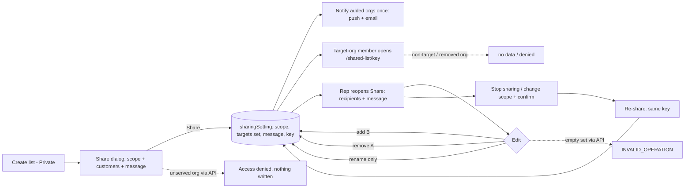
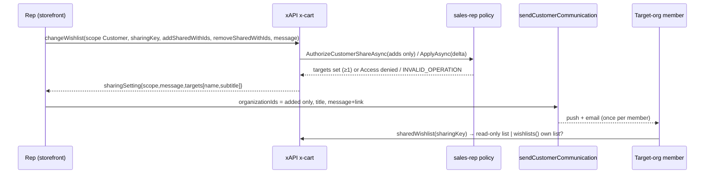

# TEST MODEL — VCST-5707

```
Ticket:      VCST-5707 | Type: Story | Status role: testable (Testing) | Flow: feature-test | Priority: P2 (Medium) — access-control risk | Path: FULL | Changed: Both
Context:     FULL — ba-system-analyzer (1c) + ba-story-writer Mode B (1d) + 1r REACHABLE
Prior model: none — first model for the list-sharing surface
Domain map:  .claude/knowledge/domain/sales-rep.md @ rev3 — PRESENT, but it enumerates NO list-sharing surface (1c §4)
Chain position: L1–L9 below are ONE mechanism the sr map does not carry. Of the sr domain chain (rep creation →
             serve orgs → hub → communication → documents → access removal) this ticket TOUCHES "communication"
             (sendCustomerCommunication) and "serve orgs" (the served-org gate on adds); it does NOT touch rep
             creation, statistics, layout, documents, customer orders, block/lock/delete.
Affected surface: vc-frontend PR #2476 (share-wishlist-modal, stop-sharing-confirmation-modal,
             wishlist-customer-sharing, wishlist-sharing-recipients, add-or-update-wishlist-modal, list-details,
             lists, wishlist-dropdown-menu, wishlist-status) · vc-module-x-cart #141 (CartSharingService,
             CartSharingExtensions, PurchaseSchema, SharingTargetType, InputChangeWishlistType) · vc-module-cart
             #194 (targets table, Message ≤1024, MaxTargets 1000) · vc-module-sales-rep #21
             (SalesRepCustomerCartSharingScopePolicy, SendCustomerCommunicationCommandHandler, email template).
             Map MISSING surfaces (clause 11b): Share/Rename dialogs, 4 scopes, recipients list, confirmation,
             /shared-list/:key recipient page, changeWishlist sharing contract, SalesRepMessageEmailNotification.
Ticket signals: description repro (Watermelon → Purple Pink overwrite → 403) · 7 attachments = design evolution
             (old combined dialog crossed out → Rename/Share/Remove list menu → 4-tab Share dialog, multi-select,
             message 0/250, Notify via) · only comment: "ready for test as soon as backend PR review done" ·
             PR states deliberate deviations: no Notify via, address not email on rows, "list" not "page".
Epic context: VCST-5142 Sales Rep Hub (In progress). Done sibling VCST-5332 (publish list to ONE customer) = the
             baseline this replaces; VCST-5335 (customer side) = the recipient seam; in-progress VCST-5728
             (message on edit), VCST-5850 (multi-org send), VCST-5925 (BE contract), VCST-5923 (Select all — OUT).
Domains:     Sales Rep (BL-SR), Cart/Wishlist (BL-CART), Notifications (BL-NOTIF), Auth (ECL-4), UI (ECL-7)
Flows & boundaries: storefront ↔ xAPI changeWishlist ↔ cart storage ↔ sales-rep scope policy ↔ member/membership
             (active org) ↔ sendCustomerCommunication ↔ push/email
Risk areas:  silent revoke/grant of an org's access (SCOPE/SILENT); revoked link resurrects on re-share (no key
             rotation — by design, KB-7A9D4927); recipient cannot find list outside the link (KB-AA3C8721, open
             BUG-rep-shared-wishlist-grants-customer-no-access); stale 007 cases drive the removed combined dialog.
AC traceability: 4 ACs → 14 atomic conditions + 13 IMPLICIT (1d §5). Impl: AC1 NOT-FOUND (no org-name token in
             any PR; design spec lists it Out of scope) · AC2 DRIFT (sharing moved to an editable Share dialog) ·
             AC3 DRIFT copy ("this list", body rewritten; buttons MATCH) + extra "Change who can access?" dialog ·
             AC4 MATCH-by-source (same key revived, recipients/message not restored).
Oracle gap:  NO BL-* invariant exists for list sharing (BL-SR / BL-CART / BL-NOTIF checked). Oracles below are
             {SPEC} = ticket AC / design attachments / PR contract / VCST-5925; KB entries are {OBSERVED} baselines.
```

## Part 0 — Value chain

| Link | In the user's words |
|---|---|
| L1 | Rep creates a list (Rename dialog: name + description) — it starts **Private** |
| L2 | Rep opens **Share**, picks a scope; on *Specific customers* selects ≥1 served customer and an optional message |
| L3 | Save persists ONE sharing setting per list: scope + target SET (delta adds/removes) + message + a stable key/link |
| L4 | Newly added organizations are notified once (push + email), member-deduplicated, rep excluded — AC1: the org name is in the notification |
| L5 | A member of a targeted org (active in that org) opens `/shared-list/<key>` and reads the list (read-only, "recommended by your rep") |
| L6 | Rep re-opens Share: current scope, recipients (name + city/region) and message are shown; card reads "Shared with N customers" |
| L7 | Rep adds B (**A keeps access** — the ticket's bug), removes A (A loses access, B keeps it), edits message, renames without touching sharing |
| L8 | Rep stops sharing / changes scope → confirmation (AC3) → every previous recipient loses access |
| L9 | Rep shares again (AC4) — same link revived; old recipients not silently restored |

```mermaid
stateDiagram-v2
  [*] --> Private: create
  Private --> Customer: share (≥1 org, no confirm)
  Private --> Organization
  Private --> AnyoneAnonymous
  Customer --> Customer: add/remove targets (no confirm; set never empty)
  Customer --> Private: Stop sharing (confirm) — targets+message wiped, key kept
  Customer --> Organization: Change access (confirm)
  Customer --> AnyoneAnonymous: Change access (confirm)
  AnyoneAnonymous --> Private: Stop sharing (confirm)
  Private --> [*]: Remove list (only true revoke of the key)
```







**Variants** (union of the branching layers — FE scope registry branches on 4 scopes; sales-rep policy branches on
served/unserved/deleted target and on add vs remove; x-cart branches on new delta vs legacy `sharedWithId`; access
check branches on the reader's ACTIVE org):
V1 Specific customers · V2 Anyone with link · V3 My organization · V4 Private · V5 legacy single-`sharedWithId`
client · V6 reader role: R-own (owner rep) / R-tgt (member of 1 target org) / R-multi (member of 2 target orgs) /
R-non (member of a served but non-target org) / R-anon / R-coowner (non-owner Write member) · V7 target org: served /
unserved (never assigned) / no-longer-served / deleted.

**Mechanism coverage matrix** (cells = scenario # · GAP · WAIVED)

| | L1 | L2 | L3 | L4 | L5 | L6 | L7 | L8 | L9 |
|---|---|---|---|---|---|---|---|---|---|
| V1 Specific customers | 1 | 1,5 | 1,6 | 1,9,10 | 1,11 | 1,7 | 2,3,4,8 | 13,14 | 16 |
| V2 Anyone with link | 1 | 17 | 17 | WAIVED no notification for link scope | 17 | 17 | 18 | 15 | 16 |
| V3 My organization | 1 | 19 | 19 | WAIVED no notification | 19 | 19 | WAIVED no targets | 15 | WAIVED = V1/V2 path |
| V4 Private | 1 | 13 | 13 | WAIVED | 13,14 | 13 | WAIVED | 13 | 16 |
| V5 legacy sharedWithId | WAIVED FE-independent | WAIVED API-only | 20 | WAIVED old clients notify themselves | 20 | 20 | 20 | WAIVED | WAIVED |
| V6 R-own | 1 | 1 | 1 | — n/a sender excluded: 10 | 1 | 7 | 2 | 13 | 16 |
| V6 R-tgt | — | — | — | 9 | 11,12 | 12 | 2,3 | 14 | 16 |
| V6 R-multi | — | — | — | 10 | 22 | — n/a | 3 | 14 | GAP (not seeded as recipient of re-share) |
| V6 R-non | — | — | — | 10 | 11 | — | 3 | — | 16 |
| V6 R-anon | — | — | — | — | 17 | — | — | 15 | — |
| V6 R-coowner | 23 | 23 | 23 | — | — | 23 | — | — | — |
| V7 served | 1 | 5 | 6 | 9 | 11 | 7 | 2 | 13 | 16 |
| V7 unserved | — | 21 | 21 | WAIVED nothing written | — | — | 21 | — | — |
| V7 no-longer-served | — | — | GAP FIXTURE-GAP (admin unassign) | — | — | GAP | GAP → source + xUnit | — | — |
| V7 deleted org | — | — | GAP FIXTURE-GAP (destructive) | — | — | GAP | GAP | — | — |

`—` = the link does not exist for that variant (e.g. R-tgt never opens the owner's dialog) — stated, not blank.

**Reverse edges**

| Forward effect | Reverse | Covered by |
|---|---|---|
| add org to targets (grants read) | per-row remove → access lost for that org only | 3 |
| share (any audience) | Stop sharing / scope change → all lose access | 13, 14, 15 |
| key issued | re-share revives the SAME key; only Remove list kills it | 16 (ABSENT IN PRODUCT: no key rotation — finding candidate, KB-7A9D4927) |
| notification delivered | none — cannot be recalled | ABSENT IN PRODUCT (reported) |
| Clear all | Undo (FE buffer, lost on close) | 8 |

**Fixture lifecycle:** every scenario that shares mutates a list → per-run lists `AGENT-TEST-5707-*` (≤25 chars,
1r) owned by the rep, deleted at teardown. Notification inboxes are append-only → assert by run-unique message text.

## Part 0r — Role scenarios

Roles in scope: R-own → @td(SR_REP_PRIMARY) (serves ACME, TechFlow, BuildRight, AcmeWest — 1r live) · R-tgt →
@td(ACME_BUYER) (ORG-001) / @td(TECHFLOW_BUYER) (ORG-002) · R-multi → @td(MULTI_ORG_TF_BR) (TechFlow+BuildRight) ·
R-non → @td(ACMEWEST_ADMIN) (ORG-004, served, left untargeted) · R-anon → no session · R-coowner → FIXTURE-GAP
(no second Write member on a rep-owned Organization-scope list; route to 3a) · unserved target → ORG-005 EU
(not in the rep's picker, 1r). Buyer logins historically store-gated on vcptcore → 3a verifies each with ONE attempt.

BSC-1 — Rep publishes one list to two customers
  Role: R-own · Situation: rep curates a reorder list for AcmeCorp and TechFlow
  | # | Action | Sees | Can do | Expected |
  | 1 | Share → Specific customers → pick ACME + TechFlow + message → Share | 2 recipient rows, toast "shared with 2" | re-open, edit | both persisted in targets, one link |
  Outcome: both orgs hold read access under one link.
  Not allowed: adding an unserved org (ORG-005) via API → "Access denied.", nothing written (21); saving an empty
  Customer set via API → INVALID_OPERATION (8); a non-owner opening Share (23).

BSC-2 — Buyer in a targeted org opens the shared list
  Role: R-tgt · Situation: TechFlow buyer receives the push and follows the link
  | # | Action | Sees | Can do | Expected |
  | 1 | open push/email; open link | list read-only, rep attribution, message | add items to own cart | 200 list; targets [] and sharedWithId null for them |
  Outcome: the buyer reads the curated list.
  Not allowed: editing/removing items (server "Access denied."); seeing the rep's other recipients (targets []);
  reading after their org was removed (3) or sharing stopped (14).

BSC-3 — Buyer in a served but untargeted org
  Role: R-non · Situation: AcmeWest admin obtains the link from a colleague
  | # | Action | Sees | Can do | Expected |
  | 1 | open the link | no list / denied | nothing | no data, no leak of list content or recipients |
  Outcome: nothing. Not allowed: reading the list by link (11) or by list id.

BSC-4 — Member of two targeted orgs
  Role: R-multi · Situation: consultant belongs to TechFlow and BuildRight, both targeted
  | # | Action | Sees | Can do | Expected |
  | 1 | receive notification; open link in each active org | one notification; list | read | exactly one push; access follows active org |
  Outcome: notified once. Not allowed: reading while active in a non-target org (22).

## Parts 1–5 — Fault model

**Condition space:** scope-from (4) × scope-to (4) × recipient-count class {0,1,2,≥4} × delta {add, remove, both,
none} × reader role (6) × message {none, default, 250, 251, whitespace} × target kind (4) × client {new, legacy}
→ N = 4·4·4·4·6·5·4·2 = **61,440**. Constraints: scope-to ≠ Customer ⇒ count/delta/target/message collapse
(infeasible 3/4 of the space); reader role only varies at L4/L5; legacy client only on Customer.
**Reduction:** FLOW journey + ST over the 4-state scope machine (every transition that loses an audience, plus the
two that must NOT confirm) + DT actor × operation for the refusals + BVA on count {0,3,4} and message {250,251} +
EG for delta semantics. Dropped: scope×scope pairs without an audience (subsumed by #13/#15 — the confirm rule is
"audience lost", one predicate); message × reader (message is one persisted string, #6/#9 read it on both sides);
no-longer-served and deleted target (FIXTURE-GAP, covered by source + PR #21 xUnit
`SalesRepCustomerCartSharingScopePolicyTests`); >100 served customers (unseedable; request `first` asserted in #5).
N → **M = 23**.

| # | Cell | Defect hypothesis | Archetype | Technique | Oracle | P |
|---|---|---|---|---|---|---|
| 1 | [JOURNEY] V1 R-own→R-tgt, create→share 2 orgs+msg→notify→open→reopen→Stop→re-share | the end-to-end mechanism breaks at a join (persist ok, link denied; share ok, no notification) | SILENT | FLOW | {SPEC} AC1–4 + description + PR #2476 | Critical |
| 2 | V1 add B to list shared with A | second share replaces the first → A's link 403 (the ticket's bug) | LIFECYCLE | EG | {SPEC} description | Critical |
| 3 | V1 remove A, keep B | per-row remove revokes the wrong org or all; A still reads after removal | SCOPE | ST | {SPEC} PR #2476 Recipients / VCST-5925 2.1 | Critical |
| 4 | V1 rename-only after share | Rename sends scope/sharedWithId and wipes targets/message/key | SILENT | EG | {SPEC} PR "each dialog sends only its fields" | High |
| 5 | V1 picker | picker lists unserved/other-store orgs, or misses served ones; search by name | SCOPE | EP | {SPEC} PR (one page of 100 served) ; BL-SR-002 | High |
| 6 | V1 message 250/251/whitespace, persisted | message lost on save/re-open (VCST-5728), cap not enforced, whitespace saved | BOUNDARY | BVA | {SPEC} 83041 0/250 + PR | Medium |
| 7 | V1 reopen shows recipients (name, city/region), card "Shared with N" | reopen shows stale/empty recipients → rep re-adds, re-notifies | STALE | EP | {SPEC} PR / sales-rep #21 targets | High |
| 8 | V1 empty set: Clear all/Undo, Save disabled; API empty → INVALID_OPERATION | emptying the set silently stops sharing or saves an unreachable Customer list | SILENT | BVA | {SPEC} PR + sales-rep #21 | Medium |
| 9 | L4 R-tgt notification content | push/email lacks the org name (AC1), wrong link, default text when message empty | FALLBACK | EP | {SPEC} AC1 | High |
| 10 | L4 notify-once: re-save same set → 0; add one → only it; R-multi → 1; rep excluded | every save re-notifies all recipients / duplicates for multi-org members | REPLAY | DT | {SPEC} PR "one send per save to newly added" / sales-rep #21 | High |
| 11 | L5 R-tgt reads, R-non denied, by link and by list id | untargeted org reads by link; or target denied on list-id path (open BUG part A) | SCOPE | DT | {SPEC} VCST-5925 3.1 ; {OBSERVED} KB-AA3C8721 | Critical |
| 12 | L5/L6 recipient's own Lists page | shared list absent from recipient's own lists (VCST-5335 / 5925 3.2) | FALLBACK | EP | {SPEC} VCST-5335 AC ; KB says link-only → finding if absent | High |
| 13 | V1→Private: confirm copy + Cancel keeps + Stop wipes | no confirmation, wrong copy vs AC3, Cancel still revokes | LIFECYCLE | ST | {SPEC} AC3 (copy DRIFT noted) | High |
| 14 | after Stop: R-tgt link | revoked org still reads via cached link/own list (resurrection trap 5925 3.2) | STALE | ST | {SPEC} AC3 body "will lose access" | Critical |
| 15 | V1/V2→other scope: "Change who can access?"; first share from Private and in-scope edits do NOT confirm | confirmation missing when an audience is lost, or nags on every save | LIFECYCLE | DT | {SPEC} PR §Stopping a share | Medium |
| 16 | re-share after Stop | new key minted (old links dead) or old recipients silently restored | LIFECYCLE | ST | {SPEC} AC4 + VCST-5925 2.4 | High |
| 17 | V2 Anyone with link: anon reads; copy link | link scope unreadable anonymously, or link changes per save | SCOPE | EP | {SPEC} 83044 + PR | Medium |
| 18 | V1→V2→V1 stray rows | a stray Customer row suppresses the link grant (5925 3.4) | SCOPE | EG | {SPEC} VCST-5925 3.4 | Medium |
| 19 | V3 My organization | org scope shares to wrong org (rep is member of 4 — D9) | SCOPE | EP | {HYPOTHESIS} → {SPEC} once PR states which org | Medium |
| 20 | V5 legacy sharedWithId: 1 target replaces, ≥2 refused, errors[] not 500 | old client silently revokes a whole set | SILENT | DT | {SPEC} sales-rep #21 breaking-runtime notes ; 5925 2.3/3.3 | High |
| 21 | V7 unserved add via API (+ valid id in same write) | partial write; unserved org granted | SCOPE | DT | {SPEC} sales-rep #21 ; BL-SR-002 | Critical |
| 22 | R-multi active in non-target org reads link | access keyed on any membership instead of active org, or denied in target org | SCOPE | DT | {HYPOTHESIS} (source IsAuthorized: active org ∈ targets) → {SPEC} needs PO | Medium |
| 23 | R-coowner / R-tgt see no Share (menu + details button) | non-owner can open Share and change audience | SCOPE | DT | {SPEC} PR "Sharing is offered to the list's owner only" | High |

Probes carried in: VC-LIST-001 (share URL location — DRIFT, now in Share dialog) → #1, #17. Others: filled at Step 2.
Archetype sweep: SCOPE 3,5,11,17–23 · SILENT 1,4,8,20 · LIFECYCLE 2,13,15,16 · STALE 7,14 · REPLAY 10 ·
BOUNDARY 6 · FALLBACK 9,12 · PARITY → #11 (link vs list-id path) · RACE WAIVED (single-author lists; concurrent
deltas merge by design 5925 2.2) · MONEY WAIVED (no money) · CONFIG WAIVED (store email config → B2C-LIST-047/050
existing) · RENDER → visual lane 4v.
UIP sweep: UIP-BACK/REFRESH (#7 reopen after reload) · UIP-TABS (two tabs editing one list — WAIVED, deltas merge)
· UIP-DEEP (#11 deep link) · UIP-EXPIRE/STORAGE (#1 recipient session) · UIP-INPUT (#6) · UIP-VIEW (4v, 375px per
83043/83044) · UIP-NET WAIVED (no offline mode) · UIP-DATA (#7 long org names — 4v).
Business Rules: BL-SR-002, BL-SR-011, BL-NOTIF (failure must not block save) — no list-sharing BL (gap).
Edge cases: ECL-4 (auth/session), ECL-7 (modal/focus), ECL-13 (workflow reversal), ECL-14 (VC patterns).
Docs grounding: StorefrontUserGuide §Lists — "If the list was previously shared with another customer, that
customer will lose access" + "List settings" → both DRIFT vs this build (doc finding, not product bug).
Agents to dispatch: 3x /qa-exploratory (edge) · 3a test-data-engineer · 4a qa-frontend-expert (chrome) +
qa-backend-expert (API/GraphQL, edge) · 4v ui-ux-expert (DevTools) · A test-management-specialist.

## 3x amendments (discovery lane, 2026-09-29 11:12–11:23Z — reports/exploratory/SBTM-VCST-5707-2026-09-29.md)
- Grounded {OBSERVED}: #2 PASS (additive) · #9 no org name in push (AC1) · #11 link path reads, list-id path "Access denied." (VCST-5925 3.1 still open) · #12 recipient own wishlists 0 · #16 same key, recipients/message not restored · #20 legacy replaces · #21 unserved + valid id → "Access denied.", nothing written · #8 INVALID_OPERATION generic "Error trying to resolve field 'changeWishlist'." · #19 Organization scope stores no target; rep's active org (AcmeWest) is the implicit one, UI never names it.
- New rows: #24 Customer→Anyone/Org confirmation copy "will lose access" is false for →Anyone (removed org + anon still read by the same key) — LIFECYCLE/DT/{SPEC} AC3 intent · #25 `addSharedWithIds` without `scope` → 200, nothing written — SILENT/EG · #26 message-only edit saves, notifies nobody — REPLAY/DT/{SPEC} PR "offered whether or not anyone new is added" · #27 notification language = sender's UI culture — FALLBACK/EP/{HYPOTHESIS} (PO) · #28 revoked org → error vs stopped/deleted → `null` (two signals) — PARITY/EP.
- Fixtures (3a): buyer fixtures TECHFLOW_BUYER/ACMEWEST_ADMIN/BUILDRIGHT_ADMIN have NO org membership on vcptcore; MULTI_ORG_TF_BR is in an unserved TechFlow duplicate → R-multi, R-non FIXTURE-GAP (admin seeding BLOCKED). Readers: ACME_BUYER (AcmeCorp, organization_id grant) + second reps as org members (SR_REP_EXCLUSIVE_TECHFLOW → TechFlow, per sr map D9). Unserved target = @td(SR_UNSERVED_ORG).
- Matrix deltas: V6 R-multi L4/L5 → GAP (FIXTURE-GAP) · V6 R-non L5 → covered by a TechFlow-member reader of an AcmeCorp-only list (#11) · #22 NOT REACHED.

## Artifact A phase 2a — dispositions (63 tc:scope hits; 0 unscannable, 0 unmatched)
- 007 CONFIRMED (14): 017, 018, 019, 023, 024, 026, 037 (substring "share", org-scope rows untouched) · 041, 048, 049 (sendCustomerCommunication legacy organizationId still accepted) · 044, 045, 046 (shared-list page / deny) · 051 (fixture-gated, no multi-org member).
- 007 REPAIR (9, mechanics only, re-linted): 025, 047, 050, 054, 055, 057, 059, 060, 061 — 047/050/059/061 still need SR_REP_ONLY_ORG (unprovisioned) and will BLOCK in C1.
- 007 RE-BASE (7, expectation kept, resolved by C1): 004 ("List settings" → Rename+Share), 040 (badge "Shared with customer" + sharedWithId payload), 042 (Message absent on reopen), 052 (own Lists), 053 (push names list+rep), 056 ([MATH] link length vs flat 250), 058 (Message absent on reopen).
- 007 SUPERSEDED — proposals only, rows unchanged (human retirement, TRI-006): 043 (replace+warning = the fixed defect; B2C-LIST-063 asserts additive) · 016 (create-dialog visibility control removed) · 007, 009, 010, 011 (Manual, drive the replaced Edit/Share surface). After merge 016 and 043 (Automated) will fail until retired.
- 050h: CONFIRMED WISH-003, WISH-32, WISH-33, WISH-34, WISH-035 (deprecated `sharedWithId` still resolves) · REPAIR WISH-009 (Manual → NOT executed by C1; its condition is covered by B2C-LIST-076 + checklist D4).
- 059 (8) · 083c (10) · 083e (3): CONFIRMED — substring-only hits ("Edit" CMS, "shared environment", "shared company balance").
- New Draft: 007 B2C-LIST-062..080 (#1–#9, #12–#17, #23, #24, #26, #27) · 050h WISH-036..044 (#2/#3, #21, #8, #11, #10, #20, #18, #25, #28). Not authored: #19 (PO question), #22 (FIXTURE-GAP).
