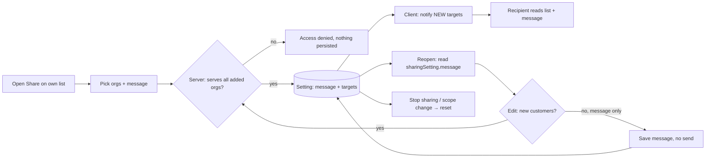
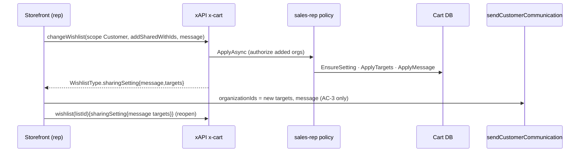
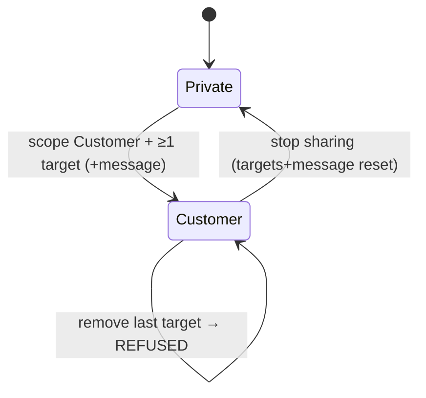

TEST MODEL — VCST-5728 (Sales Rep · Lists · share message persisted and shown on edit)

Ticket:      VCST-5728 | Type: Story | Status role: testable (Ready for test) | Flow: feature-test | Priority: P2 (Medium) | Path: /qa-test-fast | Changed: Both (backend deployed; storefront NOT deployed)
Context:     /qa-test-fast Stage 1 — ba-system-analyzer (A, ticket) + ba-api-specialist (B, 3 PR diffs + vc-frontend#2476) + orchestrator live introspection + deployed-bundle read, 2026-09-29
Prior model: none for this surface (VCST-5733/5735/5346/3912 mention wishlists only incidentally). Part 0 below is the first declaration of the rep list-share mechanism.
Domain map:  .claude/knowledge/domain/sales-rep.md @ rev 3 (generated 2026-09-18) — PRESENT
Mind map:    .claude/knowledge/domain/sales-rep.mind-map.json — nodes added by this run (Wave 2): sr.list-share, .targets-delta, .message-persisted, .message-semantics, .message-needs-scope, .scope-change-resets, .last-target-refused, .customer-access (DRIFT, unfiled), .notify-separate, .edit-prefill
Chain position: L2–L3, L5–L8 of the rep list-share chain L1–L8 at the API layer. L1 and the storefront halves of L6/L7 are
             BLOCKED (vc-frontend#2476 not deployed; user decision 2026-09-29: backend-only run). L4 (notify) is client-driven —
             the server never sends on a share — so it is touched only as a seam (sendCustomerCommunication), not as this ticket's change.
             Does NOT touch: the recipient's shopping flow on the shared list (add to cart / purchase, B2C-LIST-044/045), org switching
             (B2C-LIST-051), dashboard / orders / documents parts of the sales-rep domain.
Affected surface: vc-module-cart#194 (CartSharingSetting.Message + CartSharingSettingTarget, migration) · vc-module-x-cart#141
             (SharingSettingType.message/targets, Input{Create,Change,Clone}WishlistType.message/add/removeSharedWithIds, ApplyMessage,
             scope policies) · vc-module-sales-rep#21 (Customer scope policy, sendCustomerCommunication.organizationIds) ·
             vc-frontend#2476 (share-wishlist-modal / wishlist-customer-sharing — NOT deployed). Domain map §3 enumerates the rep
             Lists/share dialog surface (007 B2C-LIST-040..055); the xAPI `message`/`targets` fields are a surface the map is MISSING.
Ticket signals: split from VCST-5332 point 4 (message hidden on reopen); VCST-5724 removed channel checkboxes (both always);
             comment 2026-09-23 — BE ships in the shared PR with VCST-5850 (multi-share). Rep guide 2026-08-11 documents the OLD behaviour.
Epic context: VCST-5142 Sales Rep Hub. Done: 5332 (publish list), 5724. RFT: 5707 (FE share rework = PR #2476), 5850 (multi-customer
             send). In review: 5925 (BE multi-recipient contract — plural `sharingSettings` NOT shipped; live is singular + targets[]).
Domains:     Lists/wishlists · Sales Rep · Notifications/Push (seam)
Flows & boundaries: rep share write (xAPI) ↔ persistence (Cart) ↔ recipient access (x-cart auth) ↔ notification (sales-rep communication)
Risk areas:  SILENT no-op writes (message without scope), LIFECYCLE reset on scope change, SCOPE leak of message/targets to non-owners,
             BOUNDARY 250/1000/1024 limit mismatch, open defect BUG-rep-shared-wishlist-grants-customer-no-access (x-cart 3.1030).
AC traceability (customfield_10175):
  AC-1 Message field visible when editing an existing share — Impl: FE #2476 only → BLOCKED (not deployed)
  AC-2 Previously sent message populated; latest only, no history — BE half: single `message` per setting (testable) · FE half BLOCKED
  AC-3 Edit message + add new customer(s) → sent + shared with NEW customer(s) only — BE half: add delta keeps old targets · send is client → BLOCKED
  AC-4 Edit message, no new customers → saved, NOT sent — BE half: persisted without a send (testable) · no-send is client → BLOCKED
  AC-D2 (derived) custom message replaces default in push — seam via sendCustomerCommunication (regression guard)
Docs grounding: VirtoOZ StorefrontUserGuide "Lists › Share lists with customers" describes the pre-5850 single-customer flow (message
             optional, default otherwise) and nothing about editing — NEW behaviour ⇒ ground truth = AC {SPEC} + source + live.

--- Part 0 — VALUE CHAIN ---
Value chain:
  L1 Rep opens List settings → Share on an own list (storefront)                                   [FE — BLOCKED]
  L2 Rep picks customer org(s) + types a message → client writes changeWishlist(scope Customer, addSharedWithIds, message)
  L3 Server authorizes (rep serves every ADDED org), applies target delta, applies message (trim / blank→null / ≤1024), persists ONE message per list
  L4 Client notifies the NEW recipients via sendCustomerCommunication(organizationIds, message) → email + push      [client-driven]
  L5 Recipient org member reaches the list (Read) and sees the rep's message
  L6 Rep reopens the dialog → client reads wishlist.sharingSetting{message, targets} → Message field pre-filled   [API testable, FE BLOCKED]
  L7 Rep edits: + new customers ⇒ L3 then L4 for the new ones only (AC-3); no new customers ⇒ L3 only, no L4 (AC-4)
  L8 Stop sharing (scope Private) / scope change → targets + message reset
Chain diagrams:

Variants (union of the layers that branch): x-cart ApplyMessage branches on the message value (null / blank / text / >1024) and on
  scope-present vs absent; the scope policy branches on target delta (add new / none / remove some / remove last) and on scope change;
  x-cart field resolvers branch on reader (owner vs non-owner) and auth on target membership; entry mutation (create / change / clone)
  shares one handler; share age (created before vs after today's migration).
Mechanism coverage matrix (rows = variants, cols = links; cell = scenario # | GAP | WAIVED/BLOCKED + reason):
| Variant \ Link            | L2 write | L3 persist/validate | L4 notify | L5 recipient | L6 read-back | L7 edit branch | L8 reset |
|---|---|---|---|---|---|---|---|
| V1 new share (create)     | 2,12 | 2,12 | 13 | 9 | 2 | WAIVED — no prior share to edit | 7 |
| V2 edit + new targets     | 4 | 4 | BLOCKED (client) | 9 | 4 | 4 | 7 |
| V3 edit, message only     | 3,5 | 3,5 | BLOCKED (client) | 9 | 3,5 | 3,5 | 7 |
| V4 message value class    | 6,11 | 6,11 | 14 | 9 | 6 | 6 | WAIVED — reset is value-independent |
| V5 scope change / stop    | 7 | 7 | WAIVED — no send on stop | 10 | 7 | 7 | 7 |
| V6 remove targets         | 8 | 8 | WAIVED — no send on removal | 10 | 8 | 8 | 8 |
| V7 reader owner rep       | 2 | 2 | WAIVED — owner is the sender, not a recipient | WAIVED — owner is not a recipient | 2 | 2 | 7 |
| V8 reader target member   | WAIVED — Read access, cannot write | WAIVED — reader | 13 | 9 | 9 | WAIVED — reader cannot edit | 10 |
| V9 reader non-target      | WAIVED — no access | WAIVED — no access | WAIVED — not a recipient | 10 | 10 | WAIVED — no access | 10 |
| V10 rep adds unserved org | 12 | 12 | WAIVED — refused before notify | 12 | 12 | 12 | WAIVED — nothing persisted to reset |
| V11 legacy share          | 15 | 15 | WAIVED — migration sends nothing | 15 | 15 | 15 | GAP — reset of a migrated share; charter |
| V12 storefront client     | 1 BLOCKED | 1 BLOCKED | 1 BLOCKED | 1 BLOCKED | 1 BLOCKED | 1 BLOCKED | 1 BLOCKED |
Reverse edges: grant (target added) → removeSharedWithIds / scope Private → covered by 8, 7. Message set → blank write clears → 6;
  scope change clears → 7. Notification sent → ABSENT IN PRODUCT (a sent push/email cannot be recalled) — reported as context, not a defect.
Fixture lifecycle: every scenario uses a per-run AGENT-TEST- list owned by the rep (create-on-fly) — share state is not terminal but is
  mutated by every row, so rows share one list only in the order of scenario 2's journey; boundary rows use their own list.

--- Part 0r — ROLE SCENARIOS (matrix carries 3 reader roles + the rep) ---
Roles in scope: rep (owner) → @td(SALES_REP.*) = SR_REP_PRIMARY · target member → @td(ACME_BUYER.*) PRECONDITION: ORG_ACME is served by
  SR_REP_PRIMARY (verify live via salesRepCustomers; else live-discover a served org + member) · non-target member → live-discover a member
  of a served org NOT targeted (FIXTURE-GAP if none resolves) · unserved org → live-discover an org absent from salesRepCustomers.
BSC-1 — Rep shares a list with a customer and later edits the message
  Role: sales rep · Situation: recommends a list to one served customer, then corrects the note
  | 1 | share with org A + message | own list, sharingSetting | edit message, add/remove targets | message + targets round-trip |
  Outcome: one current message per list, targets as set
  Not allowed: add an org the rep does not serve (12) · remove the last target without stopping sharing (8) · >1024-char message (11)
BSC-2 — Target customer opens the shared list
  Role: member of org A · Situation: received the rep's link
  | 1 | read wishlist(listId) | list, sharingSetting.message | read only | message visible; targets[] empty; sharedWithId null |
  Outcome: sees the list + note, not who else it was shared with
  Not allowed: edit/remove items (Read access) · read other recipients (targets owner-only) — server-asserted in 9
BSC-3 — Member of a non-target organization
  Role: member of served org B (not targeted) · Situation: guesses/obtains the list id
  | 1 | read wishlist(listId) | nothing | nothing | Access denied, no message leaked |
  Not allowed: read the list or its message (10)

--- Parts 1–5 — FAULT MODEL ---
Condition space: write-shape {scope+msg, msg w/o scope, null msg, blank, whitespace, padded, 1024, 1025} · target delta {add new, none,
  remove some, remove last} · scope transition {same, →Private, Private→Customer} · reader {owner, target, non-target, unserved-org add}
  · entry mutation {create, change, clone} · share age {new, legacy}. Constraints: remove-last only with scope Customer; reader rows need
  an existing share. Raw cells N = 8·4·3·4·3·2 = 2304.
Reduction: (a) reader roles are independent of the message value — authorization runs before ApplyMessage — so roles ride one write
  shape (×4 → +3 rows); (b) create/change/clone share ScopedWishlistCommandHandlerBase → change primary, create once (12), clone WAIVED
  (same handler, P4); (c) message value classes interact only with the scope-present path (message-w/o-scope early-returns before
  ApplyMessage) → values tested on scope-present only, plus one scope-absent row (3); (d) share age only matters to read-back → one row (15).
  2304 → 15.
Test scenarios (15 rows):
| # | Cell | Defect hypothesis | Archetype | Technique | Oracle | P |
|---|---|---|---|---|---|---|
| 1 | JOURNEY — storefront: share with message → reopen → edit (+/- new customer) → recipient notified | Deployed dialog still hides Message on reopen / never sends message → AC-1..4 unmet for users | PARITY | FLOW | {SPEC AC-1..4} — BLOCKED: FE #2476 not deployed | P1 |
| 2 | API traversal: create list → share org A + M1 → read M1 → edit M2 (no adds) → read M2, targets [A] → target reads M2 → stop → null | Message not persisted / not returned / history concatenated / targets rewritten on a message-only edit | SILENT | ST | {SPEC AC-2, AC-4} + x-cart#141 field doc "one for all targets" | P1 |
| 3 | edit: message WITHOUT scope in the same write | 200 with message silently dropped (UpdateScopeAsync early-return) → AC-4 "saved" fails for any client that omits scope | SILENT | EG | {SPEC AC-4} "message is saved"; source predicts ignore → finding if so | P2 |
| 4 | edit: add org B + new message | Add replaces instead of delta (A loses access) or message not updated; AC-3 BE half | LIFECYCLE | DT | {SPEC AC-3} "shared with new customer(s)"; delta semantics per 5925 contract {SPEC} | P1 |
| 5 | edit: message null (field omitted) with scope | Null treated as clear → message wiped by an unrelated rename/scope save | SILENT | EP | {SPEC AC-2} previous message kept; source: null = unchanged | P2 |
| 6 | message "" / "   " / "  x  " | Blank stored as "" or whitespace kept / not trimmed → reopen shows junk | BOUNDARY | EP | {HYPOTHESIS} source ApplyMessage — real oracle needs PO confirm of clear semantics | P3 |
| 7 | Customer → Private → Customer | Stale message/targets resurrect after re-share (reset missing) — or message lost though AC wants latest | LIFECYCLE | ST | {HYPOTHESIS} source EnsureSetting reset; PO confirm whether re-share should keep the last message | P2 |
| 8 | remove some / remove last target | Remove-last silently leaves an orphan Customer share with no targets, or remove-some drops all | LIFECYCLE | ST | {SPEC} 5925 delta contract; remove-last refused per source → {HYPOTHESIS} for the error text | P2 |
| 9 | target member reads list | Target gets Access denied (open BUG) or sees targets[]/sharedWithId of other customers | SCOPE | DT | {SPEC} VCST-5332/5335 AC "customer sees list"; targets owner-only per x-cart#141 field doc | P1 |
| 10 | non-target member reads list; target after stop-sharing | Message/list leaks to a non-target org or survives stop-sharing | SCOPE | DT | {SPEC} VCST-5332 "only the chosen customer" | P1 |
| 11 | message 1024 vs 1025 chars (+ multibyte) | Limit off-by-one, silent truncation, or a 1025 write that half-applies targets before failing | BOUNDARY | BVA | {SPEC} cart#194 MessageMaxLength=1024 is the declared limit; atomicity {HYPOTHESIS} | P2 |
| 12 | createWishlist with scope Customer + message; rep adds unserved org | Create path skips ApplyMessage; unserved org accepted | SCOPE | DT | {SPEC} sales-rep#21 authorize-added-orgs; create = same contract | P2 |
| 13 | sendCustomerCommunication(organizationIds=[A], custom message) | Custom message replaced by default / multi-org field ignored (seam, AC-D2) | FALLBACK | EP | {DOC} VirtoOZ "add a message, else default" | P2 |
| 14 | share message 1001–1024 forwarded to sendCustomerCommunication (max 1000); FE max 250 | A valid saved share message cannot be sent — limits disagree across the three layers | PARITY | EG | {HYPOTHESIS} — needs a product decision on one limit | P3 |
| 15 | legacy Customer share created before today's migration | Migrated share loses its target or reads message garbage | STALE | EG | {SPEC} migration Up() copies SharedWithId → target; {HYPOTHESIS} until a pre-migration list is found | P3 |
Probes carried in: filled in Step 2 — FAST flow resolves inline: vc-bug-catalog SCOPE/SILENT probes → 3, 9, 10, 12
Archetype sweep: SCOPE 9,10,12 · SILENT 2,3,5 · LIFECYCLE 4,7,8 · BOUNDARY 6,11 · PARITY 1,14 · FALLBACK 13 · STALE 15 · RACE WAIVED (single-writer
  rep, no concurrent edit surface in scope) · REPLAY WAIVED (server never sends; client-side double-send is FE-only, BLOCKED) · MONEY/CONFIG/RENDER WAIVED (no money, no flag, UI not deployed)
UIP sweep (UI only): WAIVED — storefront surface not deployed (row 1 BLOCKED)
Business Rules: none declared for list sharing (bl:extract: no Lists/Sales-Rep sharing BL domain); BL-SR-011 gates the rep UI — cited only
Edge cases:  ECL-7.2 (form input — message text classes)
Agents to dispatch: qa-backend-expert (playwright-edge, GraphQL lane) · qa-frontend-expert (short storefront confirm of row 1) · qa-testing-expert (exploratory charter)

Unresolved → exploratory charter: V11 GAP (legacy share), rows 6/7/8/11/14/15 {HYPOTHESIS} oracles, AC-3/AC-4 client halves (BLOCKED),
  whether the recipient sees the message anywhere on the deployed storefront (/shared-list/<key>).

## Round 2 — correction (2026-09-29, same diff)
- Row 3 oracle: `{SPEC AC-4}` was the wrong source. VCST-5925's contract and vc-frontend#2476's README both require `scope` in the same write and state that a write omitting `scope` must not touch sharing. Oracle → `{SPEC}` 5925 contract; the observed silent ignore is BY DESIGN, not a defect.
- Affected surface / row 14: the deployed storefront's Message budget is **1000 − link length** (counter `0 / 911`), not 250. The 250 came from a test file in the undeployed #2476. The 1001–1024 gap therefore reaches only API clients.
- Row 9: the recipient reads the list through `sharedWishlist(sharingKey)` (Read + message), while `wishlist(listId)` and the `wishlists` roster deny it. The open defect holds in a narrower shape.

## Round 3 — FE #2476 head deployed (2026-09-29 pm, theme 2.59.0-pr-2476-0604-0604e3f1; backend unchanged)
- Status role now `testable (Testing)`. V12 / row 1 **UNBLOCKED**: the JOURNEY is runnable end to end. The backend rows 2–15 were observed on the same backend build this morning, so they are context here, re-run where a storefront row depends on them.
- New rows for the mechanisms the #2476 head adds (wishlist-customer-sharing.vue, share-wishlist-modal.vue). V12 cells → L1 1 · L2 16,17 · L3 18 · L4 17,23 · L5 23 · L6 1,16 · L7 16,17,20 · L8 19. New variants: V13 client cap (250 vs server 1024) → 18 · V14 legacy `sharedWithId` write reopened in the new dialog → 24. UIP sweep: row 25 (no longer WAIVED).

| # | Cell | Defect hypothesis | Archetype | Technique | Oracle | P |
|---|---|---|---|---|---|---|
| 16 | reopen → edit message only → Save | Message-only save is not persisted, or it re-sends to the existing recipients (`:253-257`) | SILENT/REPLAY | DT | {SPEC AC-2, AC-4} | P1 |
| 17 | reopen → +customer B, message M2 → Save | Send goes to A+B, or B is not shared; one `sendCustomerCommunication` with `organizationIds [B]` expected (`:208-217`) | SCOPE/REPLAY | DT | {SPEC AC-3} | P1 |
| 18 | type/paste 250 / 251 / 1000; reopen a list whose message was written via API with 251–1024 chars | Cap off-by-one; a longer server message is truncated on reopen and silently rewritten on the next save | BOUNDARY/PARITY | BVA | 250 {SPEC #2476 const :87}; >250 reopen {HYPOTHESIS} — needs a PO decision on one limit | P2 |
| 19 | Stop sharing → Cancel / Confirm → reopen → re-share | Cancel still revokes; after Private the old message or recipients reappear; the link is not restored on re-enable | LIFECYCLE | ST | confirm text + Cancel {SPEC 5707}; link restored {SPEC 5925 AC}; message on re-share {HYPOTHESIS} PO | P2 |
| 20 | remove a recipient (basket) · Clear all → Undo · whitespace-only edit | Remove sends a notification; Clear all + Save persists 0 targets; whitespace marks the form dirty (`:104`) | LIFECYCLE | EP | {SPEC 5707 "basket to remove"} · canSave ≥1 {HYPOTHESIS source :101-106} | P2 |
| 21 | blank message on a save that adds a customer | Blank is sent as an empty push instead of the default text | FALLBACK | EP | {DOC} VirtoOZ "optional, default otherwise" | P2 |
| 22 | recipients list render (name/subtitle/logo) + audience-count toast | Wrong org shown; the count toast uses the local selection, not the server targets (`:142-144`) | RENDER | EP | {SPEC 5707 Share popup AC} | P3 |
| 23 | new recipient B opens the push link | The link carries the client-minted UUID, not the persisted key → 404 or empty `/shared-list` | STALE | FLOW | {SPEC AC-3} "shared with new customers"; key replacement per #2476 | P1 |
| 24 | legacy `sharedWithId`-written share → reopen in the new dialog | The recipient is missing from the list, or a message-only save drops the legacy target | STALE | EG | {SPEC 5925} "legacy sharedWithId → one-element set or rejected" | P2 |
| 25 | dialog UIP: textarea label, counter, focus after the confirm modal, keyboard-only save | Unlabelled field (morning B1 finding), focus lost after the modal | RENDER | EG | {BL-UI} WCAG 2.2 AA — advisory, never blocks | P3 |
- Unresolved → charter: 18 (>250 reopen), 19 (message on re-share), 20 (canSave source-only), send-failure warning toast (`:253`, cannot be induced from the checklist), the 5707-vs-5728 conflict ("sharing details read-only" vs an editable Message).
