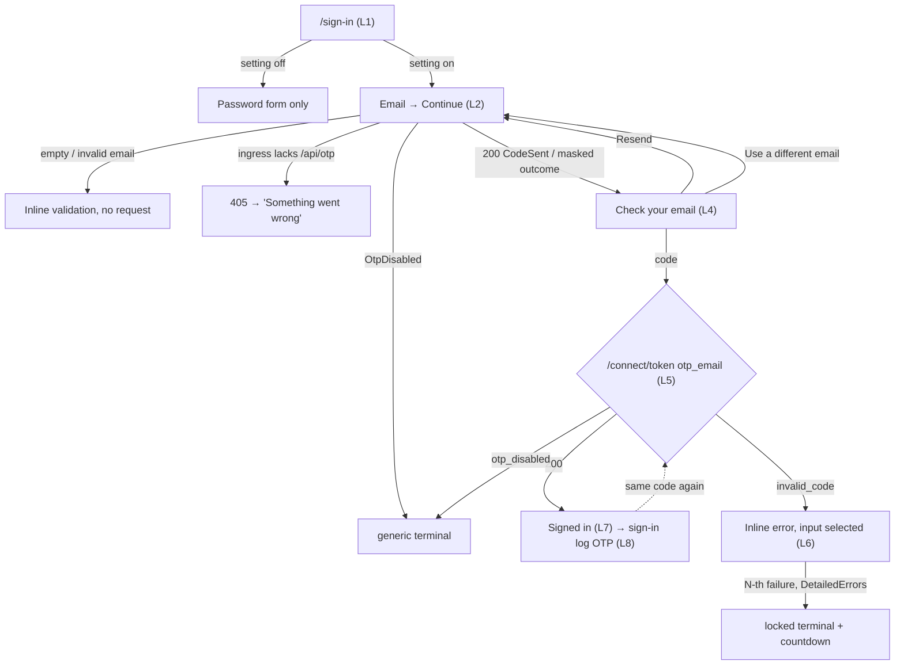
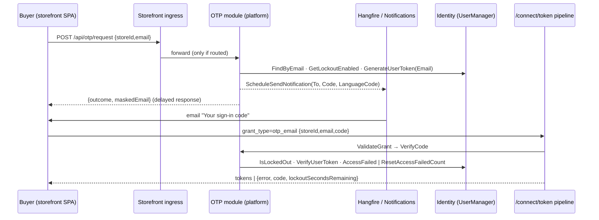
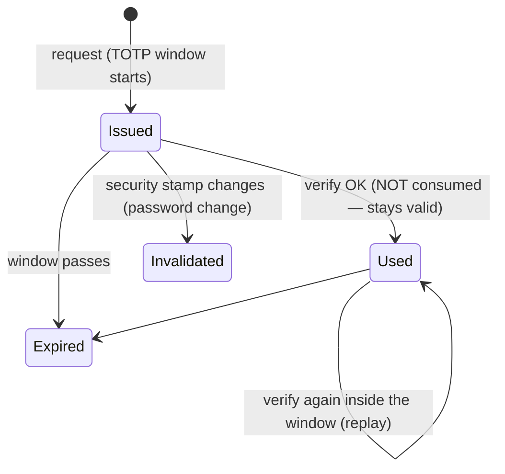

# TEST MODEL — VCST-5748

```
Ticket:      VCST-5748 | Type: Story | Status role: testable | Flow: feature-test | Priority: P2 (Medium) | Path: FULL | Changed: Both
Context:     FULL — ba-system-analyzer (1c) + ba-story-writer Mode B (1d) + 1c-map (auth map built, rev 1) + 1r REACHABLE (API, ~6 min)
Prior model: none — first model for the storefront sign-in surface (reports/ba/test-models/ holds no auth/sign-in model)
Domain map:  .claude/knowledge/domain/auth.md @ rev 1 (generated 2026-09-29, built in this run)
Chain position: L1–L5 and L7 of the domain chain L1–L7 (choose method → challenge → token/org → session → refusal → [impersonation]
             → sign-out). Touches L1 (new default method), L2 (new challenge), L3 (token issued by a new grant), L4 (session), L5
             (shared lockout, store rule). Does NOT touch L6 (Login on behalf — suite 082) nor org resolution inside L3
             (BL-AUTH-015 chain is unchanged; exercised only incidentally by the journey).
Affected surface: vc-platform#3114 — IGrantTypeHandler / GrantTypeHandlerBase / AddGrantTypeHandler, AuthorizationController.Exchange
             dispatch, sign-in log FailureReason. vc-module-otp#1 — POST /api/otp/request, grant otp_email, OtpService,
             OtpSignInEmailNotification, store setting OtpSignIn.Enabled (Settings → OTP Sign-In → General). vc-frontend#2477 —
             /sign-in + homepage login-form-section, OtpEmailSignInForm (request / verify / locked / generic steps), 13 locales.
             Map MISSING before this run: all of it (map built at 1c-map; D5 ingress route is a new row).
Ticket signals: No formal ACs, no DoD. Oleg Zhuk 2026-09-07: ACs "will be adjusted" to .NET 10 capabilities — never done.
             Dmitry Grishin 2026-09-24: 8 manual scenarios (the de-facto ACs, 1d AC-1..8). Two design images — not retrievable (gap).
             Deployed by this run: vc-deploy-dev#6652 (platform + module + theme). SMTP on vcptcore_qa1 broken (Gmail 535) —
             every NotificationMessage is status Error; the code is read from the notification journal.
Epic context: none — no parent Epic.
Domains:     auth (BL-AUTH), store settings, notifications, platform security / token endpoint
Flows & boundaries: storefront form ↔ storefront ingress ↔ OTP module REST ↔ Hangfire notification ↔ /connect/token grant pipeline
             ↔ Identity lockout (shared with password) ↔ sign-in log ↔ xAPI session (me)
Risk areas:  code is a stateless TOTP (Identity "Email" provider) never consumed on success — ECL-4.3; no throttle on
             /api/otp/request; masking depends on PasswordLogin:DetailedErrors (TRUE on vcptcore_qa1); store rule exempts
             administrators + non-Contact accounts (password path refuses admins, kb KB-7A4C260E); storefront ingress routes
             (auth map D5); OTP email carries no From (all other store emails carry the store address).
AC traceability: 8 story scenarios + 6 context bullets + 9 gap-ACs (1d). Impl: AC-1/4/5/8 SATISFIED · AC-2 wording DRIFT +
             "code cleared" CONTRADICTS (input is selected, not cleared) · AC-3 SATISFIED only when DetailedErrors off · AC-6
             CONTRADICTS on a DetailedErrors-on env (a distinct locked screen exists) · AC-7 "sign in unavailable" NOT-FOUND ·
             CTX-5 DRIFT (admin / non-contact exemption unstated) · CTX-6 CONTRADICTS "one-time" (replayable).
DoD:         none declared on the ticket (1d proposed one; confirm at 5-verdict)
```

## Part 0 — Value chain

| # | Link (buyer words) | Mechanism |
|---|---|---|
| L1 | I open Sign in and am offered a code instead of a password | `useOtpEmailAuthentication` reads public store setting `OtpSignIn.Enabled`; OTP view is the default, password one click behind |
| L2 | I type my email and ask for a code | `POST /api/otp/request {storeId,email}` from the storefront origin → ingress route → OtpController → store exists → enabled → user → lockout enabled → store rule → Identity `GenerateUserTokenAsync(Email, "OtpSignIn")` |
| L3 | A code arrives in my mailbox | `OtpSignInEmailNotification` scheduled (Hangfire) with To, Code, LanguageCode (contact → store default); SMTP sender |
| L4 | I see "Check your email" with my masked address and type the code | verify step; masked email from the response; 6-cell input, auto-submit on the 6th digit; Resend / Use a different email |
| L5 | The code signs me in | `POST /connect/token grant_type=otp_email` → OtpGrantTypeHandler → VerifyCodeAsync (store, enabled, user, lockout, token, store rule) → GrantTypeHandlerBase pipeline → tokens |
| L6 | A wrong code tells me so; too many lock me out, the same as passwords | `AccessFailedAsync` on the shared Identity counter; `account_locked` + lockoutSecondsRemaining only when DetailedErrors |
| L7 | I land signed in, in my store, with my organization | `useSignMeIn.signIn()` → `me`; org chain BL-AUTH-015; redirect |
| L8 | The operator can see how I signed in | UserSignInAttemptEvent → Sign-in log, Type = OTP, real FailureReason |







Variants — the layers that branch (union): OtpService branches on **account kind** (own-store contact · trusted-store contact ·
foreign-store contact · no-store contact · non-Contact customer/manager · administrator · lockout-disabled · unknown · duplicate
email); OtpController / grant branch on **DetailedErrors** (on — vcptcore_qa1 · off); the SPA branches on **setting** (on · off ·
flipped mid-flow) and **surface** (/sign-in · homepage section); the verify path branches on **code state** (valid · wrong ·
replayed · expired · superseded by resend · malformed).

Mechanism coverage matrix (rows = variants, cols = links; cell = scenario # | GAP | WAIVED):

| Variant | L1 | L2 | L3 | L4 | L5 | L6 | L7 | L8 |
|---|---|---|---|---|---|---|---|---|
| own-store contact, setting on | 1 | 1 | 1,19 | 1,9,10 | 1 | 5,6 | 1 | 1,20 |
| setting off / flipped mid-flow | 12 | 12 | — n/a | 13 | 13 | — n/a | — n/a | 13 |
| trusted-store contact | 14 | 14 | 14 | 14 | 14 | — covered by own-store | 14 | 14 |
| foreign-store / no-store contact | 15 | 15 | 15 | 15 | 15 | — n/a | 15 | 15 |
| non-Contact customer / manager | 16 | 16 | 16 | 16 | 16 | — n/a | 16 | 16 |
| administrator (lockout on / off) | 17 | 17 | 17 | 17 | 17 | 17 | 17 | 17 |
| unknown / duplicate email | 3 | 3 | 3 | 3 | 3 | — n/a | — n/a | 3 |
| code: wrong / replayed / expired / resend / malformed | — | 7,8 | 8 | 2,11 | 2,4,7,8 | 5 | 4 | 4 |
| DetailedErrors off | WAIVED — platform appsettings, not changeable on the shared stand; covered by 1d gap-AC-8 and unit tests in the PR | | | | | | | |
| homepage login section | 18 | 18 | — | 18 | 18 | — | 18 | — |

Reverse edges: sign-in grants a session → reversed by sign-out (existing suite 032, not re-tested) · a code grants access →
consumption on use is **ABSENT IN PRODUCT** (#4, a finding) · lockout → reversed by expiry (#6) · enabling OTP → disabling it
refuses an outstanding code (#13).
Fixture lifecycle: lockout is terminal for ~15 min per account → #5/#6 need disposable accounts (3a), never a shared persona.

## Part 0r — Role scenarios

Roles in scope: own-store buyer → `{{USER_EMAIL}}` · trusted-store buyer → tester-super@qa.com (FIXTURE-GAP: no alias) ·
foreign-store contact → agent-test-sr-secondstore@example.com (FIXTURE-GAP: no alias) · non-Contact customer / manager →
FIXTURE-GAP (live-discover) · administrator → `@td(ADMIN_DEFAULT.email)` (lockout disabled) + katalonOperator (FIXTURE-GAP).

BSC-1 — Returning buyer signs in to its own store without a password. Role: own-store buyer. Outcome: session in B2B-store.
  Not allowed: a second sign-in with the same code; sign-in after the setting is switched off.
BSC-2 — Buyer of a partner store (trusted group) signs in to B2B-store. Outcome: session. Not allowed: none beyond BSC-1.
BSC-3 — Contact of an unrelated store tries B2B-store. Outcome: refused at the server with its own request.
  Not allowed: a token for B2B-store; a code being sent.
BSC-4 — Back-office administrator uses the storefront OTP form. Outcome: {HYPOTHESIS} — the password path refuses
  (`user_cannot_login_in_store`); the OTP rule exempts admins. Not allowed: whichever the spec settles — a divergence is a finding.

## Parts 1–5 — Fault model

Condition space: setting {on, off, flipped} × DetailedErrors {on} × account kind {9} × code state {6} × surface {page, homepage,
API} × lock {none, locked} → raw N = 3·1·9·6·3·2 = 972.
Reduction: account kind only matters at L2/L5 branches and never interacts with code state except for own-store (the only
kind that reaches VerifyUserToken with a real code) → account kinds collapse to one row each at L2+L5 (9); code states are
exercised on own-store only (6); surface collapses to /sign-in for everything except one homepage journey (the component is
shared, `login-form-section` only mounts it); setting flip is one row; locked is two rows (reach + expiry). Dropped: DetailedErrors
off (WAIVED above); duplicate email (needs two accounts sharing an address — rejected by Identity on create; API-only probe). N → 20.

| # | Cell | Defect hypothesis | Archetype | Technique | Oracle | P |
|---|---|---|---|---|---|---|
| 1 | [JOURNEY] own-store, setting on, /sign-in, valid code | the whole chain fails at a join — ingress, notification, grant, `me` | INTEGRATION | FLOW | {SPEC} dev scenario 1 | Critical |
| 2 | wrong code once | error not shown / wrong copy / code not re-enterable | ERROR-HANDLING | EP | {SPEC} AC-2 (copy DRIFT → confirm) | High |
| 3 | unknown email, UI | UI discloses non-existence (different screen) | ENUMERATION | EP | {SPEC} AC-3 | High |
| 4 | same valid code re-submitted after a successful sign-in | code is not one-time — replay yields a second session | STATE | ST | {ECL-4.3} + ticket title | High |
| 5 | wrong codes to the threshold (disposable acct) | lockout counter not shared / never reached / locked screen wrong | STATE | BVA | {BL-AUTH-003} + CTX-3 | High |
| 6 | lockout interplay: password failures then OTP; OTP failures then password | counters separate → attacker gets 2× attempts | STATE | DT | {BL-AUTH-003} CTX-3 | High |
| 7 | 20 rapid /api/otp/request for one email | no throttle → email bombing, TOTP window abuse | ABUSE | ERROR-GUESS | {ECL-5.x} | Medium |
| 8 | resend: old vs new code | resend issues the same code (TOTP window) / old code still works | STATE | ST | {SPEC} "Check the latest email" | Medium |
| 9 | empty / malformed email | request fired / no validation | VALIDATION | BVA | {SPEC} AC-4 | Medium |
| 10 | paste 6 digits, paste with spaces/letters, 5 digits | auto-submit early / never / garbled | INPUT | BVA | {SPEC} paste hint | Medium |
| 11 | Resend / Use a different email clear previous errors | stale error survives | UI-STATE | ST | {SPEC} AC-5 | Medium |
| 12 | setting off → reload /sign-in | OTP still visible / password form missing | CONFIG | DT | {SPEC} AC-7 | High |
| 13 | code requested, setting switched off, code submitted | outstanding code still accepted | CONFIG | ST | {SPEC} CTX-2 | High |
| 14 | trusted-store contact (New-super → B2B) | trusted rule not applied (refused) | SCOPE | DT | {SPEC} CTX-5 | High |
| 15 | foreign-store / no-store contact | token issued for a store it may not enter | SCOPE | DT | {SPEC} CTX-5 | High |
| 16 | non-Contact customer / manager | exemption lets a back-office account into the storefront | SCOPE | DT | {HYPOTHESIS} → PO | Medium |
| 17 | administrator (lockout on) and admin (lockout off) | admin enters storefront where password path refuses; lockout-disabled silently gets no email | SCOPE | DT | {HYPOTHESIS} vs kb KB-7A4C260E | Medium |
| 18 | homepage login section journey | section mounts form without store context / title wrong | INTEGRATION | FLOW | {SPEC} diff | Low |
| 19 | OTP email content: code, subject, sender, language | no sender (From null); template raw; wrong language | CONTENT | EP | {SPEC} sibling store notifications | Medium |
| 20 | sign-in log entries for success / invalid / locked | Type not OTP, reason lost | AUDIT | EP | {SPEC} CTX-3 | Medium |

Probes carried in: VC-B2B-003 (admin cannot use the storefront by design) → #17 · no other VC-* hits sign-in / OTP.
Archetype sweep: INTEGRATION #1 #18 · STATE #4 #5 #6 #8 · SCOPE #14–#17 · ENUMERATION #3 · ABUSE #7 · CONFIG #12 #13 ·
  INPUT/VALIDATION #9 #10 · AUDIT #20 · CONTENT #19 · A11Y → visual lane (4v) · PERF WAIVED (delayed-response timing is by design).
UIP sweep: BACK (verify → back button) → 3x · REFRESH (reload on verify step loses pending email) → 3x · TABS (code used in
  tab B while tab A waits) → covered by #4 · EXPIRE (TOTP expiry) → #8 3x · INPUT #10 · NET (405 / offline) → #1 · VIEW (mobile
  6-cell input) → 4v · DEEP / STORAGE / DATA → WAIVED (no URL state, no persisted state, no list data).
Business Rules: BL-AUTH-003, BL-AUTH-007 (sign-out unaffected), BL-AUTH-015 (org resolution after an OTP token).
Edge cases: ECL-4.2 (lockout, credential stuffing), ECL-4.3 (OTP reuse), ECL-5.x (bot-like request floods).
Docs grounding: VirtoOZ has no OTP page (new feature — expected); StorefrontUserGuide sign-in documents password only (map D1).
Agents to dispatch: qa-frontend-expert (UI, playwright-chrome) · qa-backend-expert (API + admin + journal, playwright-edge) ·
  ui-ux-expert (a11y + visual, Chrome DevTools) · test-data-engineer (3a disposable accounts) · /qa-exploratory ticket (3x).

## Round 2 — 2026-10-01 (developer updates of 2026-09-30)

Builds: Platform 3.1075.0-pr-3114-8668 · VirtoCommerce.OTP 3.1000.0-pr-1-11d6 · theme 2.59.0-pr-2477-ff59 (vc-deploy-dev#6669).
Diff since round 1: request/verify results moved to `{succeeded, error:{code, description}}` (OtpErrorDescriber); lockout
now reports the platform codes `user_is_locked_out` / `user_is_temporary_locked_out` (no module-own `account_locked`);
the verify form shows one error list (signInErrors) instead of its own message + the synced alert; `GetLockoutSecondsRemainingAsync`
removed from the module. (Correction, live 2026-10-01: Resend still clears the code and announces "New code sent." — an earlier
reading of the diff said otherwise.) The request form now surfaces the server's request error, so with DetailedErrors on an
unknown email shows "User not found" on the email step (round 1 showed the verify step for every outcome but OtpDisabled).
Unchanged in the diff: the store rule (administrator / non-Contact exemption), token consumption on success, the
notification sender, the request endpoint's rate, the relative `/api/otp/request` path (storefront still 405 — map D5).
New rows: none — the changes refine L4–L6 already covered by #2, #5, #8, #11; oracles for #2 and #5 move to the new codes.
Carried from 3x (round 1): variant "own-store contact with an expired password" (→ #1 precondition; personas reset
2026-09-30), identical code on re-request inside the TOTP window (→ #8).
Scope change (operator, 2026-10-01): scenario #7 (request rate) is OUT OF SCOPE for this story — `sendPasswordResetEmail`
on the storefront is equally unthrottled (3 rapid requests → 3 emails, vcptcore_qa1), so it is a platform-wide pattern.
