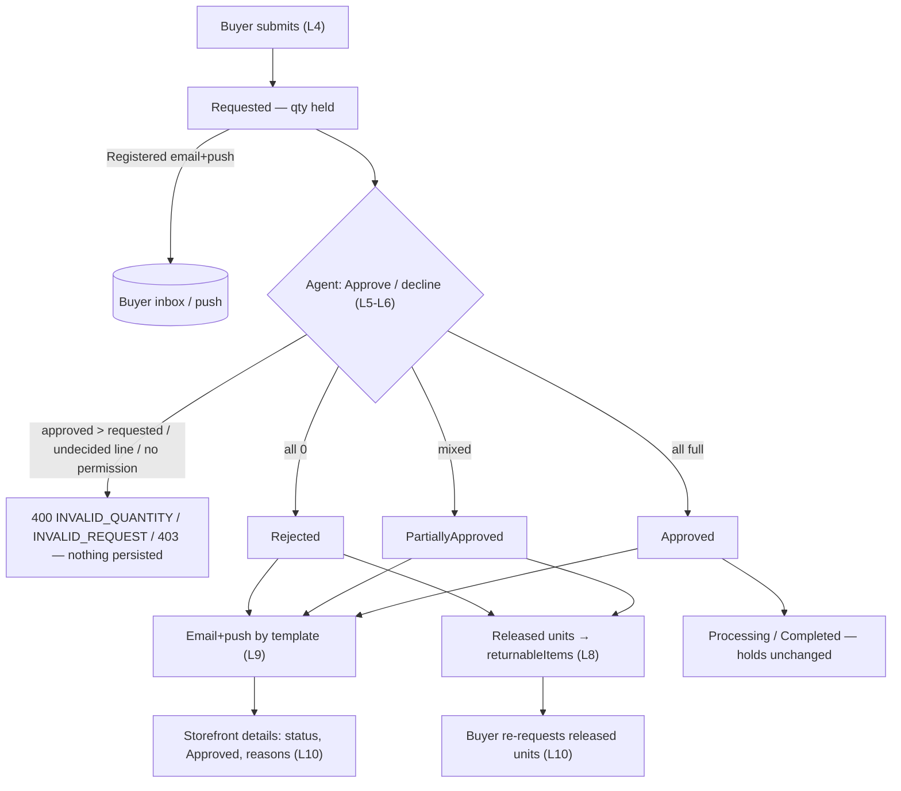
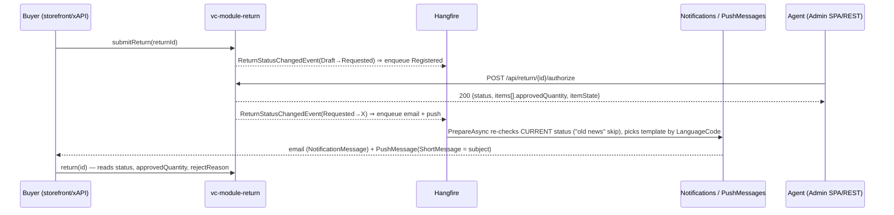
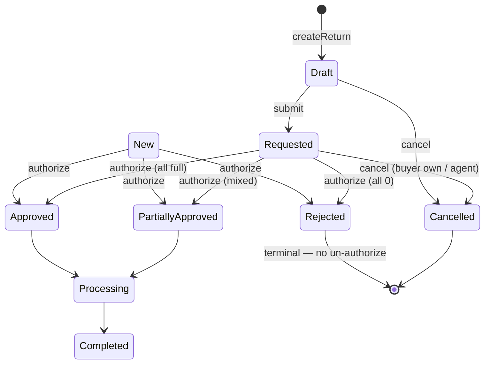

# TEST MODEL — VCST-5883

```
Ticket:      VCST-5883 | Type: Story | Status role: testable | Flow: feature-test | Priority: P2 (Medium) | Path: FULL | Changed: Both
Context:     FULL — ba-system-analyzer (1c) + ba-story-writer Mode B (1d) + 1r REACHABLE (~4 min)
Prior model: none — first model for the Returns surface (VCST-5628 ran without one; reports/ba/test-models/ had no returns file)
Domain map:  .claude/knowledge/domain/returns.md @ rev 1 (generated 2026-09-22) — PRESENT, but written before either PR deployed; its
             "agent approve/reject — UNVERIFIED" actor and §2b "storefront not reachable" are both DRIFT now (1c §4, 1r)
Chain position: L4–L10 of the domain chain L1–L10 (L1 eligible → L2 draft → L3 hold → L4 submit). Touches L4 (submit fires the
             Registered notification), L5–L10 (new). Does NOT touch L1–L3 (eligibility, draft, attachments — VCST-5628, only regressed
             through C1 of 050o/014c) nor orderless returns / NotifyOrganizationEmail (VCST-5884) nor mandatory decline reason (VCST-5885).
Affected surface: vc-module-return PR #27 @51fc4cc — REST POST /api/return/{id}/authorize, GET /api/return/{id}/available-statuses,
             PUT /api/return (edit guards); Admin SPA Returns list (status filter) + Line items blade "Approve / decline"; Data/Handlers/*
             (event publisher, email + push handlers), 5 template pairs; store settings Return.SendNotifications / SendPushNotifications.
             vc-frontend PR #2500 @9d1909f — /account/returns/:id renders rejectReason (return + line) and a Requested/Approved column.
             Map MISSING: authorize + available-statuses endpoints, both settings, the notification wiring (→ 5-docs-map).
Ticket signals: dev E2E comment 2026-09-25 (rounds 1–2, 37/37, local env): fixed #1 #2 #4 #5b #6 #7 #8 #10 #11; moved #3→VCST-5885,
             #5a→VCST-5884; open #12 (lowering qty on a non-holding line refused, Low). SMTP absent ⇒ NotificationMessage status Error
             (still inspectable). PR #27 got 2 commits on 2026-09-28 AFTER that retest ("Refactoring") — the deployed head is untested.
             PR #2500 CI red = unrelated page_builder test (1c §6). Attachments: 5 design screenshots (wizard/statuses) — Step-1 UI, no Step-2 oracle.
Epic context: VCST-5626 Returns (Draft). Done sibling VCST-5628 (buyer own returns) = the seam: submit → Requested, returnableItems,
             storefront returns pages. Dependencies: VCST-5884 (org mailbox), VCST-5885 (decline reason) — out of scope, not blockers.
Domains:     returns (no BL-RET, no ECL returns — FINDING), orders (BL-ORD), notifications (BL-NOTIF), b2b (BL-B2B)
Flows & boundaries: storefront submit ↔ admin decide ↔ quantity engine ↔ Hangfire email/push ↔ storefront read-back
Risk areas:  language fork (1c: LanguageCode = submit-time storefront culture; dev: = order's language — CONTRADICTS);
             English-only templates ⇒ silent skip for non-en (1c) vs "shipped default used" (dev) — CONTRADICTS; no re-validation at
             authorize (1d NOT-FOUND; 1c: structurally cannot oversell); no un-authorize (reverse edge absent); legacy Canceled/Cancelled
             duplicates in available-statuses (1r, live); "Cancel return" offered on a Cancelled return (operator screenshot, live)
AC traceability: 25 story ACs (1d AC-1..25) + 12 gap-ACs; Impl: 17 SATISFIED · AC-5 CONTRADICTS (=VCST-5885) · AC-6/10b NOT-FOUND ·
             AC-17 NOT-FOUND (=VCST-5884) · AC-25 DRIFT (single authorize, no reject endpoint) · 4 untested (AC-4.b, AC-23, gap-8, gap-11)
DoD:         none declared on the ticket
```

## Part 0 — Value chain

| # | Link (buyer / agent words) | Mechanism |
|---|---|---|
| L4 | I submit my return and am told it was received | `submitReturn` → Requested; ReturnChangedEvent → ReturnStatusChangedEvent → Registered email + push (Hangfire) |
| L5 | The agent sees what I asked for and why | Admin Line items blade: quantity, reason code/comment, serial, attachments (fix #4) |
| L6 | The agent decides each line with a quantity | `POST /api/return/{id}/authorize {rejectReason, items[{lineItemId, approvedQuantity, rejectReason}]}`; every line decided; 0 ≤ approved ≤ requested; `return:authorize` |
| L7 | The return gets an outcome | all full → Approved · all 0 → Rejected · mixed → PartiallyApproved; line ItemState Approved/Rejected; only via authorize (CanSetStatus) |
| L8 | Units I was refused become returnable again | `GetHeldQuantity`: decided line holds ApprovedQuantity (by ItemState, not status); Rejected/Cancelled hold 0 |
| L9 | I am told the outcome, in my language, with numbers | one email + one push per status change; recipient order-address → contact → login; culture LanguageCode → store default; requested vs approved + unit + reasons |
| L10 | I see the outcome in my account, and can re-request the refused units | `/account/returns/:id` status, Approved column, rejectReason; new return on the same order line for the released qty |







**Variants** (union of the branching layers — ReturnFlowService.GetAuthorizedStatus, the notification base, the frontend render):
V1 all lines full · V2 mixed lines (one full, one 0) · V3 partial inside one line (240→200) · V4 all 0 · V5 admin-created `New`
(no LanguageCode) · V6 non-English submit culture (fr-FR) · V7 settings: SendNotifications off / SendPushNotifications off ·
roles R1 agent with `return:authorize` · R2 back-office user without it · R3 buyer (owner) · R4 org colleague · R5 anonymous.

**Mechanism coverage matrix** (rows = variants, columns = links; cell = scenario #):

| | L4 | L5 | L6 | L7 | L8 | L9 | L10 |
|---|---|---|---|---|---|---|---|
| V1 full | 1 | 1 | 1 | 1 | WAIVED: full approve releases nothing | 1 | 1 |
| V2 mixed | 2 | 2 | 2 | 2 | 2 | 2,9 | 2 |
| V3 partial-in-line | 3 | 3 | 3,6 | 3 | 3,14 | 3 | 3,14 |
| V4 all 0 | 4 | 4 | 4 | 4,5 | 4 | 4 | 4 |
| V5 admin New | WAIVED: no submit, admin creates | 15 | 15 | 15 | 15 | 15 | 15 (3x: buyer sees New→Rejected on /account/returns/:id) |
| V6 fr-FR | 16 | WAIVED: admin UI language independent | 16 | 16 | WAIVED: same engine as V3 | 16,17 | 16 |
| V7 switches | WAIVED: settings read at send, not submit | WAIVED | 18 | 18 | WAIVED | 18 | WAIVED |
| R1 agent | WAIVED: role not on this link | 1 | 1,6,7,8 | 1 | WAIVED: role not on this link | WAIVED: role not on this link | WAIVED: role not on this link |
| R2 no-perm | WAIVED: role not on this link | 19 | 19 | 19 | WAIVED: role not on this link | WAIVED: role not on this link | WAIVED: role not on this link |
| R3 buyer | 1 | WAIVED: role not on this link | 20 | WAIVED: role not on this link | 14 | 1 | 1 |
| R4 colleague | WAIVED: role not on this link | WAIVED: role not on this link | 21 | WAIVED: role not on this link | WAIVED: role not on this link | 21 | 21 |
| R5 anon | WAIVED: role not on this link | WAIVED: role not on this link | 19 | WAIVED: role not on this link | WAIVED: role not on this link | WAIVED: role not on this link | 21 |

**Reverse edges:** held qty ← released by decline/partial (#2 #3 #4) and by cancel (#22) · decision ← **ABSENT IN PRODUCT** (no
un-authorize; a wrong decline is corrected only by a new return — #14; report as finding, candidate PROPOSED-BL-RET) · notification ←
none (by nature). **Fixture lifecycle:** a decided return is TERMINAL for L6 → every decision row needs its own per-run `Requested`
return (3a seeds them through `submitReturn`, never by DB write — L4 is under test).

## Part 0r — Role scenarios

Roles in scope: R1 agent → `{{ADMIN}}` (config.js env.ADMIN; holds return:authorize — verify at run) · R2 back-office without
`return:authorize` → **FIXTURE-GAP**: role with return:read+update only → 3a · R3 buyer → `{{USER_EMAIL}}` (owner of RETURNS_ORDER_*) ·
R4 colleague → `{{USER2_EMAIL}}` — same-org membership **UNVERIFIED** ⇒ {HYPOTHESIS} until 3a confirms · R5 anonymous.

BSC-1 — The agent authorizes 200 of 240. Role: R1 · Situation: a Requested B2B return with two lines
| # | Action | Sees | Can do | Expected |
|---|---|---|---|---|
| 1 | open return → Line items | requested qty, reason, comment, files | Approve / decline | per-line Approved + decline reason inputs |
| 2 | set 200 / 0 + reasons, confirm | status PartiallyApproved | — | line states Approved / Rejected, 40 + 12 released |
Outcome: buyer notified "partly approved" with requested vs approved per line.
Not allowed: approve > requested (400, nothing saved) · leave a line undecided (400) · authorize a decided/Cancelled/Draft return
(WRONG_STATUS) · set Approved/Rejected via the status dropdown or PUT (refused).

BSC-2 — A back-office user without the grant tries to decide. Role: R2. Not allowed: POST authorize with own token → 403, return unchanged.

BSC-3 — The buyer reads the outcome. Role: R3 · Situation: return decided. Sees status + Approved column + reasons; can re-request
released units. Not allowed: no Authorize in `availableActions`; no mutation decides a return; "Cancel return" not offered once decided/cancelled.

BSC-4 — A colleague in the buyer's organization. Role: R4. Not allowed: `return(id)` of the buyer's return → null; cancel/update → refused;
receives no copy of the buyer's notification (org mailbox is VCST-5884).

## Parts 1–5 — Fault model

**Condition space:** outcome {all-full, mixed-lines, partial-in-line, all-zero} × creation {storefront Requested, admin New} ×
culture {en-US, fr-FR, no LanguageCode} × switches {both on, email off, push off} × decision validity {valid, >requested, <0,
undecided line, empty items} × actor {R1..R5} × follow-up {none, re-request released, move to Processing/Completed}.
Constraints: admin New ⇒ culture = none; invalid decision ⇒ no outcome/notification; R2..R5 ⇒ no outcome. Raw N = 4·2·3·3·5·5·3 = 5 400.

**Reduction:** (a) invalid-decision × everything else collapsed to one-factor BVA/DT rows on R1 (#6–#8) — a refused call persists nothing,
so culture/switch/outcome cannot interact with it; (b) actor collapsed to one refusal row per role (#19–#21) — refusal happens before
the flow service; (c) switches × outcome → t=2 PW on one outcome (#18) — IsEnabled is read per handler, independent of the status branch;
(d) culture × outcome → one partial row + one template-miss row (#16–#17) — template lookup is by LanguageCode only, not by status;
(e) follow-up × outcome → only on partial (#14 #13) where something is released. **5 400 → 24** (#22–#24 are live-observed or 1d-derived hypotheses added after the reduction; #25–#27 were added by the 3x discovery lane).

**3x amendments (2026-09-28, SBTM-VCST-5883-2026-09-28):** V5×L10 GAP closed · #16/#17 grounded {OBSERVED} · #24 re-scoped to the duplicate-line path (reproduced: RET260928-00011, 6 of 5 approved) · #25–#27 added · #22 observed as a DISABLED "Cancel return" (availableActions.cancel=false), not a clickable one · reverse edge confirmed ABSENT for approvals too (wrong decline is recoverable by a new return; a wrong approval has no path at all) · push text always English · AC-19 unit not observable — fixtures had measureUnit=null (data gap).

| # | Cell | Defect hypothesis | Archetype | Technique | Oracle | P |
|---|---|---|---|---|---|---|
| 1 | V1·R1·en — **[JOURNEY]** buyer submits (storefront) → Registered email+push → agent approves all in Admin → Approved → email+push → buyer sees Approved on /account/returns/:id | any link of the chain broken on the deployed head (untested refactor 2026-09-28) | LIFECYCLE | FLOW | {SPEC} ticket status + notifications tables | Critical |
| 2 | V2 mixed (line A full, line B 0 + reason) | status derived from first/last line instead of all → Approved/Rejected instead of PartiallyApproved | LIFECYCLE | DT | {SPEC} status table rows authorize | Critical |
| 3 | V3 500-line req 240 → 200 approved | approved measured vs ordered, not requested; 40 not released; email shows only one quantity | BOUNDARY | FLOW | {SPEC} Quantity model §Returnable quantity (3) | Critical |
| 4 | V4 all 0 + return reason | Rejected releases nothing / Rejected email without reasons | LIFECYCLE | DT | {SPEC} "Rejected and Cancelled release fully" | High |
| 5 | V4 single line qty 1 → 0 | `All(...)` predicate edge → PartiallyApproved | BOUNDARY | BVA | {SPEC} status table | Medium |
| 6 | approved = requested+1 | upper bound off-by-one → over-approval persisted | BOUNDARY | BVA | {SPEC} 0 ≤ Approved ≤ Quantity | High |
| 7 | approved = -1 / items[] empty / one line missing | negative or undecided accepted → 200 with half-decided return | BOUNDARY | BVA | {SPEC} Rules table; 1d AC-4.b, gap-3 | High |
| 8 | authorize twice / on Draft / on Cancelled | second decision overwrites the first (no un-authorize guard) | LIFECYCLE | ST | {SPEC} transitions: only Requested/New | High |
| 9 | V2 email body | requested and approved not side by side, unit missing, line reason missing | RENDER | EP | {SPEC} "Templates must render quantities with MeasureUnit … side by side" | High |
| 10 | push for each outcome | push missing / text ≠ subject / wrong member | PARITY | EP | {SPEC} push table + "text is email subject" | High |
| 11 | exactly one email + one push per change | duplicate send (two handlers, re-save) | REPLAY | EG | {SPEC} "one PushMessage per event"; BL-NOTIF-001 (analogous) | High |
| 12 | a save that keeps status / edit resolution on decided return | silent-case sends an email | SILENT | DT | {SPEC} dev comment "silent cases" → {DOC} none | Medium |
| 13 | decided return → Processing → Completed | moving on re-holds released units (regression of fix #1) | STALE | ST | {SPEC} (3) + dev #1 | High |
| 14 | V3 then buyer re-requests the released 40 on a new return | released qty not returnable / 40 over-limit accepted (41) | BOUNDARY | FLOW | {SPEC} (3) "buyer may re-request them later" | High |
| 15 | V5 admin-created New return decided | New path skips notifications or language → exception | FALLBACK | EP | {SPEC} dev "admin-created returns can be decided" + store default | Medium |
| 16 | V6 buyer creates the draft in fr-FR, agent partial | LanguageCode taken from order instead of the buyer's culture; messages stored under the wrong language | MONEY | EP | {OBSERVED} 3x: LanguageCode = storefront culture at createReturn (not order, not submit); null → store default — baseline; {SPEC} "Culture from Return.LanguageCode" | High |
| 17 | V6 locale with NO template (fr-FR, only default shipped) | notification skipped — buyer gets nothing | FALLBACK | EG | {SPEC} buyer is notified; {OBSERVED} 3x: sent with the default (English) template, stored lang=fr-FR — not skipped | High |
| 18 | V7 email off / push off (PW with outcome=partial) | one switch disables both, or neither | CONFIG | PW | {SPEC} dev switches; ModuleConstants defaults | Medium |
| 19 | R2 + R5 call authorize | missing permission check → decision by any back-office user | SCOPE | DT | {SPEC} permission return:authorize | High |
| 20 | R3 buyer: availableActions / any mutation | buyer can authorize own return | SCOPE | DT | {SPEC} "agent" actor only | High |
| 21 | R4 colleague reads/cancels buyer's decided return; receives no email | colleague sees reasons / gets a copy | SCOPE | DT | {SPEC} Authorization §Mutations; org copy = VCST-5884 | High |
| 22 | storefront details on Cancelled / decided return | "Cancel return" offered though not allowed (live: operator screenshot) | LIFECYCLE | ST | {SPEC} Draft/Requested → Cancelled only | Medium |
| 23 | available-statuses on Cancelled → ["Canceled","Cancelled"]; on Approved | duplicate legacy spelling shown as two options; flow statuses offered | RENDER | EP | {OBSERVED} baseline → {SPEC} dev #7 "only what saving accepts" | Low |
| 24 | admin PUT adds a 2nd line for the SAME order line to a Requested return, then authorize full (3x re-scope; separate returns ARE guarded) | 6 approved of 5 ordered — ValidateReturn checks each line alone, authorize never re-validates | RACE | EG | {SPEC} "1 ≤ Quantity ≤ AvailableQuantity" + "Availability re-validated at Authorize" | High |
| 25 | admin PUT raises a buyer's Requested quantity (2→5) before the decision (3x) | buyer's request silently rewritten; Registered email says 2, storefront shows 5, no re-notification | SILENT | EG | {SPEC} Quantity = "quantity the buyer requested" | Medium |
| 26 | PUT changing approvedQuantity/itemState/quantity on a decided return (3x) | 200 while changes are discarded — caller believes the correction saved | SILENT | ST | {SPEC} decided lines keep their decision (dev comment) + {DOC} none on the error contract | Low |
| 27 | available-statuses for New → [New, Completed, Canceled, Processing, Cancelled] (3x) | a New return can be moved to Completed without any decision; duplicate Canceled/Cancelled | LIFECYCLE | ST | {SPEC} status table: New/Requested → decision via authorize only | Medium |

Probes carried in: VC-* with a returns probe — none exist (catalog has no VC-RET); VC-NOTIF-* template/culture probes → #16 #17 · others N/A (no returns entries).
Archetype sweep: SCOPE 19–21 · PARITY 10 · STALE 13 · RACE 24 · REPLAY 11 · SILENT 12 · MONEY 16 · BOUNDARY 3 5 6 7 14 · LIFECYCLE 1 2 4 8 22 ·
CONFIG 18 · FALLBACK 15 17 · RENDER 9 23.
UIP sweep (UI only): UIP-REFRESH → #1 (details reload after decision) · UIP-BACK/DEEP → #22 (deep link to a decided return) ·
UIP-TABS WAIVED: admin decision is single-actor · UIP-EXPIRE/STORAGE WAIVED: no client state in the decision · UIP-NET WAIVED: async
send is server-side · UIP-INPUT → #6 #7 (blade inputs) · UIP-VIEW → 4v (mobile Approved column, 1d DoD) · UIP-DATA → #3 (large quantities).
Business Rules: BL-NOTIF-001 (analogous exactly-once) · BL-NOTIF-003 (send must not block — #1 on an env with no SMTP) · BL-ORD-004
(refund conditions — no refund coupling, D9: N/A) · BL-B2B scope rules → #21. **No BL-RET domain: 4 PROPOSED-BL-RET from 1d + the
no-un-authorize edge → oracle proposals.**
Edge cases: ECL ch.13 workflow (state machine guards) → #8 · ch.6 data/integration (async jobs) → #11 #17 · ch.2 inventory-hold analogue → #3 #14 #24.
Docs grounding: PlatformUserGuide Return module — legacy status/resolution edit only; per-line authorize, notifications undocumented (MISSING → finding for docs).
Agents to dispatch: 3x /qa-exploratory ticket · 3a test-data-engineer · 4a qa-backend-expert (admin + REST + notifications) ‖ qa-frontend-expert
(storefront journey) · 4v ui-ux-expert (Admin Approve/decline blade + storefront details).
