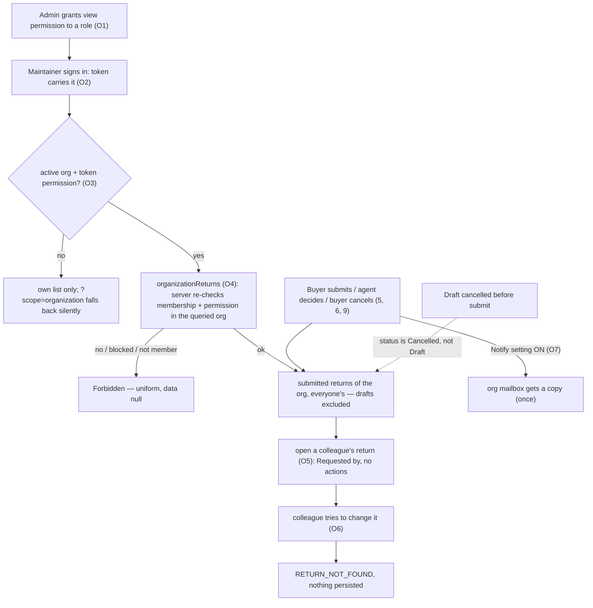
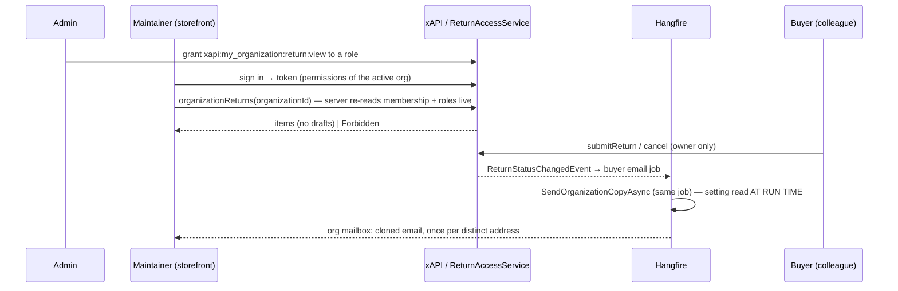
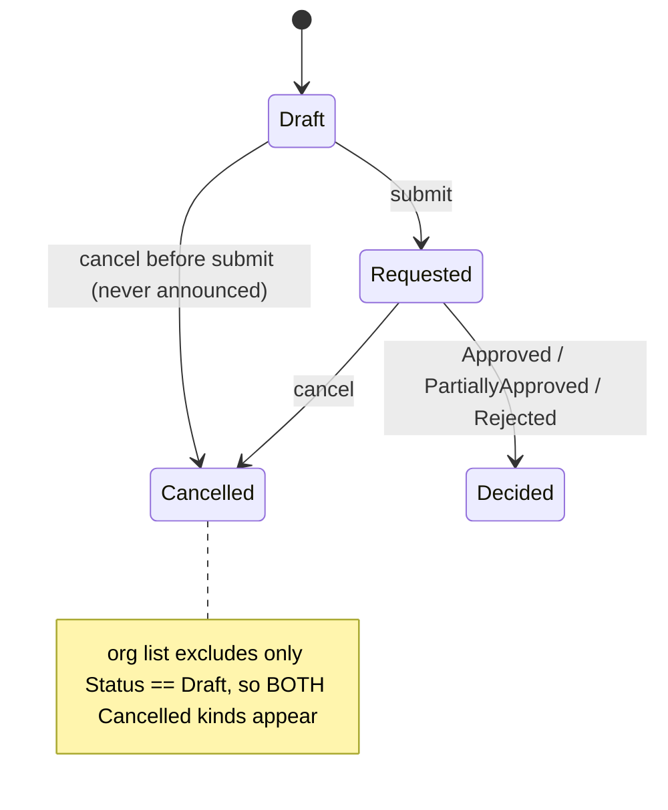

# TEST MODEL — VCST-5884

```
Ticket:      VCST-5884 "[E2E] Returns - Step 3 - My Organization Returns" | Type: Story | Status role: testable (Ready for test → Testing at 1a) | Flow: feature-test | Priority: P2 (Medium) | Path: FULL | Changed: Both
Context:     FULL — ba-system-analyzer (1c, 99 tool calls, live + source) + ba-story-writer Mode B (1d) + 1r REACHABLE (~5 min; setup gaps, §Fixtures).
Prior model: reports/ba/test-models/VCST-5883-2026-09-28.md (same surface, step 2). Its Part 0 (L4–L10: submit → decide → notify → read back) is CARRIED FORWARD, not re-derived; drift against it is
             recorded below (§Drift). A model from an earlier QA round of THIS ticket (2026-10-06) is NOT in this checkout — its claims arrive only as the ticket-comment hypotheses (§Ticket signals).
Domain map:  .claude/knowledge/domain/returns.md @ rev 2 (generated 2026-10-06, stale_after 60d) — PRESENT. It predates PR #28 being live: 13 surfaces are MISSING from it (§Affected surface).
Mind map:    .claude/knowledge/domain/returns.mind-map.json — nodes touched: ret.state.draft · ret.state.cancelled · ret.buyer.cancel · ret.buyer.cancel.not-owner · ret.buyer.read.org-colleague (now DRIFT) ·
             ret.agent.notify · ret.agent.notify.by-outcome · ret.agent.notify.silent · ret.agent.notify.email-off · ret.agent.notify.language. NEW behaviour with no node: see §Drift (mind-map DRIFT rows).
Chain position: touches map links 5 (submit → Requested), 6 (cancel), 9 (notify), 10 (read in my account) and ADDS O1–O7 (below). Does NOT touch 1 (eligibility), 2 (draft building), 3 (quantity holds),
             4 (evidence upload), 7–8 (agent decision, released units) or 11 (reversal) — they are only regressed (S22, S23).
Affected surface: vc-module-return #28 @ 62f9aae (DEPLOYED, 3.1005.0-pr-28-62f9): ExperienceApi/Authorization/ReturnAccessService, Queries/OrganizationReturnsQueryBuilder + ReturnsQueryHandler + ReturnQueryHandler,
             Schemas/ReturnType, Data/Services/ReturnSearchService + ReturnService, Data/Handlers/SendNotificationsReturnStatusChangedEventHandler, 3 migrations, Web/Scripts/blades/return-list.tpl.html.
             vc-frontend #2523 @ 9e4e67e (DEPLOYED, theme 2.60.0-pr-2523-9e4e-9e4e67ef; a `dev` merge — only 6 returns files differ from the earlier 3f1b9c6, all contrast classes): client-app/modules/returns/**.
             Layers: storefront · xAPI · REST · Admin SPA · Hangfire/notifications · DB. MISSING from the domain map (11b): Query.organizationReturns · ReturnType.customerId/customerName/organizationId/
             organizationName · permissions xapi:my_organization:return:view|submit · setting Return.NotifyOrganizationEmail (map says 10 settings, live 11) · REST search criteria organizationId/excludeDrafts ·
             Admin "Organization" column · storefront ?scope=organization tab / Buyer name / Requested by · Return.OrganizationId/Name + index + backfill · account-state guard on every return operation ·
             colleague attachment-read path · the org-copy Hangfire path.
Ticket signals: Acceptance field read in FULL (3 items, nothing more; comment 110487 proposes a 4th = the NotifyOrganizationEmail copy, by the ASSIGNEE — AC-4 is UNRATIFIED). Story says "review and CONTROL";
             AC-3 says read-only. 3 comments: 110487 (the proposal) + 111512/111600 (a PRIOR QA round, PASS WITH NOTES, 13 conditions, 9 candidate defects, tested at 3f1b9c6 on vcptcore_dev — HYPOTHESES here).
             4 attachments are that round's evidence PNGs; NOT downloadable from this session (Jira attachment content needs a credentialed REST call) — stated gap. Design mock lives on VCST-5628 (not opened).
             PR bodies claim "stacked on #27/#2500, not merged" — both merged 2026-09-30; PR #28 states platform 3.1048/Customer 3.1021 floors, manifest says 3.1076/3.1028.
Epic context: VCST-5626 Returns (Draft). Done sibling VCST-5628 (buyer own returns) and VCST-5883 (agent decision + notifications) are the seams: draft/cancel semantics, notification handlers, status vocabulary.
             No in-progress sibling blocks. VCST-5885 (mandatory decline reason) is out of scope.
Domains:     returns (BL-RET declared but EMPTY — a FINDING), b2b (BL-B2B), notifications (BL-NOTIF), graphql (BL-GQL), ui/a11y (BL-UI, BL-A11Y)
Flows & boundaries: Admin role grant ↔ Customer membership/roles ↔ token (organization_id-scoped permission claims) ↔ xAPI gate ↔ storefront tab ↔ list/search ↔ details ↔ Hangfire org copy ↔ NotificationMessage journal
Risk areas:  VC-B2B-005 (blocked member still reads org data) · VC-B2B-002 (role change visible "without re-login" vs docs: next sign-in) · VC-UI-006 (long value overlays next column) · VC-UI-007 (13 locale keys) ·
             scope creep: account-state guard on EVERY return operation · cancelled-never-submitted draft leak · legacy returns vs the StoreId filter (N1) · tab gate ≠ server gate · permission `:submit` checked by nothing
AC traceability: 35 atomic conditions, ids as in the checklist: 1.a–1.h · 2.a–2.c · 3.a–3.h · 4.a–4.i · G.1–G.7 (1d's table had 36 — its 4.e "push stays with the buyer" is merged into 4.b; 28 gap-ACs in 1d). Impl: SATISFIED majority · DRIFT: AC-2 location, "all returns" vs drafts, tab gate,
             CC/BCC overlap · CONTRADICTS (suspicion): cancelled-never-submitted draft · NOT-FOUND: "the Organization maintainer holds it by default" · untested: setting-write honoured (D17a), retry duplicate.
DoD:         none declared on the ticket.
```

## Part 0 — Value chain (carried forward from VCST-5883, extended)

Domain links reused: **5** I submit → Requested · **6** I can withdraw · **9** I am told, once · **10** I see the outcome. New links for this ticket (the *organization visibility chain*):

| # | Link (the maintainer's words) | Mechanism |
|---|---|---|
| O1 | An admin lets a role view the organization's returns | permission `xapi:my_organization:return:view` on a role assigned **globally**, as an **organization-level** role or a **membership** role (BL-B2B-007: union of three sources). No role holds it out of the box |
| O2 | My session knows it | token carries permissions of the **active** org at sign-in (≤30 min); the server re-reads roles, membership, lock and status live on every request |
| O3 | The Returns page shows a tab named after my organization | storefront gate: selected org **and** token permission (`useReturns.ts:38-40`); opens on "My returns"; `?scope=organization` |
| O4 | It lists what my colleagues raised for my organization | `organizationReturns(organizationId!, storeId!, …)`: active membership + permission in the QUERIED org, **StoreId** filter, **drafts excluded by `Status != Draft`**, keyword also matches buyer name, snapshot `OrganizationId` |
| O5 | I open one, read-only | `return(id)`: owner first, else same-org holder, else `null`; "Requested by"; `availableActions` all unavailable (`RETURN_NOT_FOUND`); files open, never delete |
| O6 | A colleague's change is refused | every mutation requires the owner → `RETURN_NOT_FOUND` / `ORDER_NOT_FOUND`; nothing persists |
| O7 | The organization's mailbox is told what the buyer was told | `Return.NotifyOrganizationEmail` (store, default off): cloned buyer email → org's first address, inside the buyer's Hangfire job; none when equal to the buyer's address; push never |







**Variants** (union of the layers that branch): **V1** non-holder · **V2** holder, global role · **V3** holder, org-level / membership role · **V4** holder with a blocking membership (Invited · Rejected · Deleted · locked) ·
**V5** holder only in a non-active org · **V6** administrator who is not a member · **V7** submitted storefront return · **V8** Draft / cancelled-never-submitted · **V9** legacy admin-created (null storeId/customerId,
org backfilled) and other-store returns · **V10** notification setting × address (Notify on/off × SendNotifications on/off; org address absent / equal to buyer / on CC-BCC; buyer address absent) · **V11** Admin list / REST search.

**Mechanism coverage matrix** — columns = O1–O7, rows = V1–V11, derived from the chain and the layers above BEFORE the scenarios were mapped in. WAIVED keys: **w1** the variant takes no code path on this link (the
copy is addressed by organization, not by viewer) · **w2** a mutation is refused by ownership before any organization rule is reached (V2/V3 carry it) · **w3** an administrator holds every permission, the grant is moot ·
**w4** the return's own state does not depend on the grant or the token · **w5** a Draft→Cancelled announces nothing and an admin-created return is silent (`IsAnnounced`; ret.agent.notify.silent) ·
**w6** the setting has no code path on O1–O6 · **w7** the Admin/REST surface has no tab, token or copy.

| | O1 grant | O2 reach | O3 see | O4 list | O5 read | O6 refuse | O7 copy |
|---|---|---|---|---|---|---|---|
| V1 non-holder | S2 | S20 | S2 | S2 | S2 | S11 | w1 |
| V2 holder, global role | S3 | S20 | S1 | S1 | S10 | S11 | w1 |
| V3 holder, org-level/membership | S3 | S20 | S3 | S3 | S10 | S11 | w1 |
| V4 blocking membership | S4 | S4, S22 | S4 | S4, S21 | S4 | S4 | w1 |
| V5 holder in a non-active org | S6 | S6 | S6 | S6 | S6 | w2 | w1 |
| V6 administrator, not a member | w3 | S5 | S5 | S5 | S5 | S11 | w1 |
| V7 submitted storefront return | w4 | w4 | S23, S25 | S9, S25 | S10, S12 | S11 | S15 |
| V8 Draft / cancelled-never-submitted | w4 | w4 | w4 | S7, S8 | S7 | S11 | w5 |
| V9 legacy / other-store | w4 | w4 | w4 | S13 | S13, S14 | w2 | w5 |
| V10 setting × address | w6 | w6 | w6 | w6 | w6 | w6 | S15, S16, S17, S18, S19 |
| V11 Admin list / REST search | w7 | w7 | w7 | S24 | w7 | w7 | w7 |

**Reverse edges** — the grant → *revoked*: server refuses at once, tab survives a reload until the token renews (PR's own known limitation) → S20 · membership blocked / removed / buyer leaves → S4, S21 · setting turned off → S16 ·
organization renamed / buyer leaves: returns keep the **snapshot** organization — no re-snapshot exists → **ABSENT IN PRODUCT** (finding for the PO, observed in S21) · a draft: cancel is the only exit → S7 · there is **no**
un-submit and no un-authorize (map link 11, not touched).
**Fixture lifecycle** — a decided or cancelled return is TERMINAL → one per-run return per assertion; role grants and store-setting writes persist on the shared env → restore in teardown; a blocking membership
status MUTATED mid-run needs its own single-org account (ORG_TF_ONLY_STATUS), never a shared one; org-copy evidence is rows in the NotificationMessage journal (SMTP absent ⇒ status `Error`, still inspectable).

**11b — every variant resolves to an enumerated surface, or is reported MISSING.** V1: returns map §1 Actors "Org colleague" (verdict now DRIFT — true for non-holders only) · V2/V3: the *holder* actor is **MISSING** from
the returns map; membership/role placement is enumerated in `b2b-organizations.md` · V4: `b2b-organizations.md` link 9 (status `Invited`/`Rejected`/`Deleted` block, lock beats status; `Customer.OrganizationMembershipStatuses`) ·
V5: `b2b-organizations.md` org switcher (storefront: present) · V6: returns map Actors "Admin" + b2b "Platform admin" · V7/V8: returns map §1 statuses, §2b list + details · V9: returns map §2a (one store-less legacy row seen) ·
V10: returns map §2a notification setup — the `NotifyOrganizationEmail` setting is **MISSING** · V11: returns map §2a Return list blade — its column list omits **Organization** (MISSING).

## Part 0r — Role scenarios (REQUIRED: the matrix carries 6 ROLE variants)

**Roles in scope** (resolved through `process.env` after `config.js`, never off one layer):
- *viewer, holder* — **FIXTURE-GAP**: no account on vcst holds `xapi:my_organization:return:view` (all 70 roles read live) → 3a: a dedicated `AGENT-TEST-` role + one org-level and one global placement.
- *buyer / colleague in the SAME org as the viewer* — **FIXTURE-GAP**: returns buyer persona is `USER_EMAIL`, `RETURNS_COLLEAGUE` has no vcst write-back; the viewer's and buyer's shared org is not established → 3a.
- *non-holder maintainer* — `ORG_USER` (Emily Johnson, TechFlow; token perms edit / order:view / user:invite; no return perm — observed). *Blocking memberships* — `ORG_TF_MBR_INVITED` / `_REJECTED` / `_DELETED`
  (single-org, registry says seeded 2026-08-03; liveness re-verified by 3a). *Multi-org* — `MULTI_ORG_TF_BR` (+ `_ALT` for the other lane). *Administrator* — the env admin. Org with / without email, and the
  `Return.NotifyOrganizationEmail` state of B2B-store — **FIXTURE-GAP** (3a). The role→permission binding is read from `me.permissions` as a PRECONDITION; only the permission→gate binding is asserted (SECOND RULE).

BSC-1 — A maintainer who may view the organization's returns reads a colleague's return and cannot change it
  Role: org holder · Situation: a purchasing manager reviewing what their buyers raised.
  | # | Action | Sees | Can do | Expected |
  | 1 | open Returns | tab named after the org | switch tabs | own list first; org tab lists submitted returns of everyone |
  | 2 | open a colleague's return | details, "Requested by" | read, open files | no Cancel / Edit; availableActions all unavailable |
  Outcome: the maintainer reviews without being able to control. Not allowed: cancel / update / submit / create on the colleague's order or return; delete a colleague's file; read a colleague's Draft;
  read another organization's returns (each asserted at the SERVER with this role's token; a holder with `:submit` too — it must change nothing).
BSC-2 — A member without the permission asks for the organization's returns
  Role: non-holder · Situation: an employee or a maintainer whose role was never granted it.
  | 1 | open `/account/returns?scope=organization` | own list, no tab | — | own list; no message |
  Outcome: nothing of the organization is revealed. Not allowed: `organizationReturns` for own / empty / unknown org → the SAME Forbidden, `data` null (no enumeration); `return(colleague id)` → `null`.
BSC-3 — A member whose membership is blocked still holds the permission
  Role: Invited / Rejected / Deleted / locked holder · Situation: access withdrawn while the token is still valid.
  | 1 | request the org's returns | stale tab possible | — | refused at once by the server |
  Outcome: the org's returns close. Not allowed: list, open, copy of files; also the account-state guard (UserLocked / PasswordExpired / Unauthorized) on every return operation but `returnStatuses`.
BSC-4 — An administrator who is not a member of the organization
  Role: platform administrator · Situation: support looking at a customer's returns.
  | 1 | request `organizationReturns` | — | — | refused — "no bypass" (PR #28; PO to ratify) |
  Outcome: membership, not privilege, opens an organization. Not allowed: reading an organization the administrator does not belong to.

## Parts 1–5 — Fault model

**Condition space** (raw cells N = 61 440): F1 viewer standing (non-holder · holder-global · holder-org-role · holder-membership-role · 4 blocking memberships · holder-in-other-org-only · admin-non-member = 10) ×
F2 return state (Draft · cancelled-never-submitted · Requested · Approved · PartiallyApproved · Rejected · Cancelled-after-submit · legacy store-less = 8) × F3 owner (viewer / colleague = 2) × F4 surface (storefront /
xAPI / REST+Admin = 3) × F5 setting (Notify × SendNotifications = 4) × F6 org address (absent / distinct / equal-to-buyer / on CC-BCC = 4) × F7 buyer address (present / absent = 2) × F8 org count (1 / 2) ×
F9 locale (en / non-en = 2). Constraints: F5–F7 only act on a status change; a Draft is announced to nobody; a blocking membership excludes holder-in-other-org; only submitted states have a decision.
**Reduction** (EP + DT, t=2, PW only on F1×F8): N → **M = 25**. Three independent sub-models: **access** (F1×F4×F8, one row per class + PW for the multi-org cell, 10 → S2–S6, S20), **content** (F2×F3, ST over the state
diagram, 8 → S7–S14), **notification** (F5×F6×F7, DT, 32 → S15–S19). **Dropped:** F9 locale — the org copy is `CloneTyped()` of the buyer's rendered email, so language is subsumed by `ret.agent.notify.language`;
F4 REST for access — it runs the same `IReturnAccessService` as xAPI, so only the parity row S24 keeps it; F7 × F6 beyond the two boundary cells — the handler branches on address equality, not on their product;
SendNotifications × org setting reduced to the one row (S16) that can disagree.

**Test scenarios (M = 25)** — authored from in Step 3. Oracles: `{SPEC:AC-n}` ticket · `{DOC:…}` PR #28 text / module guide / VirtoOZ · `{BL-…}` · `{HYPOTHESIS}` says what would make it real. A row whose
expectation the build currently breaks keeps the SPEC expectation and is HELD (rule 3).
| # | Cell | Defect hypothesis — what breaks, and why it plausibly would | Archetype | Tech | Oracle | P |
|---|---|---|---|---|---|---|
| S1 | **[JOURNEY]** V2/V3 holder: grant → colleague submits → maintainer signs in → tab → list → open read-only → Notify ON → agent decides → org copy; 2 buyers, org address ≠ buyer's | the chain breaks at a seam no single check crosses: grant absent from the token, list keyed on the wrong org, copy follows the order's org | SCOPE | FLOW | {SPEC:AC-1..3}; copy leg {HYPOTHESIS: AC-4 unratified — real when the PO ratifies it} | Critical |
| S2 | V1: `organizationReturns` for own / empty / unknown org; storefront tab and `?scope=organization` | a missing permission yields an empty list or a distinguishable error (org-id enumeration); the tab leaks | SCOPE | DT | {SPEC:AC-1 "specific permission" — non-holder refusal is 1d's derived AC-1c} + {DOC:PR #28 "an error, not a narrower list"} (kb KB-9E0ED0F4 = baseline only) | Critical |
| S3 | permission via global role · org-level role · membership role, one at a time, isAdministrator=false | the server counts one source, the storefront another; a source is ignored | SCOPE | DT | {BL-B2B-005} (effective permissions = union of global, organization and membership roles, re-evaluated at sign-in) + {BL-B2B-007} (org-scoped JWT) | High |
| S4 | V4: Invited · Rejected · Deleted · locked membership WITH the permission, xAPI + storefront | a blocked member still reads the org's returns (VC-B2B-005 shape); Return's rule diverges from Customer's (`IsMember` before membership) | SCOPE | EP | {BL-B2B-013}, {BL-B2B-012} (BL-B2B-001 SUSPECT — caveat) | Critical |
| S5 | V6 administrator, not a member, requests an org's returns | an admin bypass leaks every org — or support cannot see them; intent unstated | SCOPE | EG | {HYPOTHESIS: PR #28 "no bypass"} — real when the PO ratifies | Medium |
| S6 | V5, 2 orgs: permission in Y only, X active — tab, API for Y, switch org, back; own return raised for Y shows under My returns | tab gate (active-org token) and server gate (queried org / global) decide differently; the contact's own return lands in the wrong list | SCOPE | PW | {BL-B2B-007}, {ECL-14.3} | High |
| S7 | V8: draft → cancel without submit → org tab, `return(id)` as holder, deep link | a Cancelled draft is listed and readable (status-only exclusion): buyer's comment, reasons, files leak | SCOPE | ST | {DOC:PR #28 "drafts are never listed"; guide §abandoned draft} — HELD (PO decides) | High |
| S8 | V8: Draft in the org status filter; `statuses:[Draft]`; the own list's Draft filter | an option that can never match; `[Draft]` returns drafts | BOUNDARY | EP | {DOC:PR #28 "no drafts"} | Medium |
| S9 | V7 list: columns, keyword (RMA / order / buyer name, partial, case), status + date filters, sort incl. buyer, page 10 / 11 / past the end, URL state reload + tab switch | keyword misses the buyer name; sort/paging drops the org filter and shows another org's rows | PARITY | BVA | {SPEC:AC-3 list}, {DOC:PR #28 Behaviour} | High |
| S10 | V7: a colleague's return — Requested by, no Cancel/Edit, row opens details not the editor; the viewer's OWN return in the list stays actionable | read-only view offers an action, or the viewer's own return is wrongly locked | SILENT | EP | {SPEC:AC-3 read-only} | High |
| S11 | O6 as holder (also with `:submit`), non-holder, admin: cancel / update / submit / create-on-colleague's-order / delete a colleague's file; read back as owner | a mutation says OK and no-ops, or truly changes the owner's return | SILENT | DT | {SPEC:AC-3 read-only, derived}; kb KB-657521DF baseline | Critical |
| S12 | V7 attachments: colleague opens, cannot delete; a Draft's files private | the file handler lets a colleague delete or serves a draft's file | SCOPE | EP | {DOC:PR #28 Notes} — needs FileUpload config (FIXTURE-GAP) | Medium |
| S13 | V9 legacy store-less returns (org backfilled): in the org list, details as colleague | never listed (StoreId filter) against the migration note; details show a disabled Cancel / blank buyer | FALLBACK | EP | {DOC:PR #28 Database; guide "filled in"} — HELD | High |
| S14 | V9 return of another store opened by `return(id)` as holder | no store comparison in `CanViewReturnAsync` | SCOPE | EG | {HYPOTHESIS: map D6/G4 unverified} — real when the PO states the store rule | Medium |
| S15 | Notify ON × 5 types (Registered · Approved · PartiallyApproved · Rejected · Cancelled-after-submit) + draft cancel | a type missed or doubled; copy follows the order's org; a draft cancel mails the org | LIFECYCLE | DT | {SPEC:AC-4} unratified → {HYPOTHESIS}; {DOC:guide Notes} | High |
| S16 | Notify OFF (default) · ON with SendNotifications OFF · value changed between two status changes | copy sent with the setting off; stale value used (read when the job RUNS) | CONFIG | DT | {SPEC:AC-4c derived}, {DOC:guide} | High |
| S17 | org address = buyer's (same / different case) · org address also on buyer CC/BCC | the org gets two emails | REPLAY | BVA | {SPEC:AC-4d}; CC/BCC {HYPOTHESIS: code clears only the copy's lists} | High |
| S18 | org without email · buyer without email | an exception blocks the buyer's email; the org gets mail the buyer did not | FALLBACK | EP | {HYPOTHESIS} — "no failure" is BL-NOTIF-003 by analogy; real when the PO states it | Medium |
| S19 | O7: the org copy throws after the buyer's email was scheduled → job retry | the buyer is mailed twice | REPLAY | EG | {HYPOTHESIS} — **WAIVED live**: no fault injection on a shared env; goes to review as a unit-test proposal | Low |
| S20 | reverse O1/O2: revoke mid-session → next call refused at once, tab stays until token; grant mid-session → tab after re-sign-in | stale token keeps data reachable, or the server also lags | STALE | ST | {BL-B2B-005}, {ECL-4.3}, {DOC:VirtoOZ org-scoped roles "applied on the server immediately, only the active session is stale"} | High |
| S21 | reverse O4: member removed / buyer leaves / org renamed → list, name, copies follow the snapshot | an old org still reads (or keeps getting copies of) a departed buyer's returns; stale name | STALE | ST | {HYPOTHESIS: snapshot by design per PR} — real when the PO states it | Medium |
| S22 | scope creep: locked / password-expired / deleted account with a valid token on every return query + mutation except `returnStatuses`; healthy accounts' returnPolicy / returnReasons / own list / wizard unchanged | the guard refuses healthy users or one builder skips it; regression of 5628/5883 flows | PARITY | DT | {HYPOTHESIS: PR #28 "Runtime" — no AC} — real when the PO confirms it belongs here | High |
| S23 | storefront "My returns" after the list refactor: filters, sort, paging, URL state, "Purchase order reference" label | the refactor drops a filter or breaks a deep link | PARITY | EP | {SPEC:existing own-list behaviour, map §2b} | High |
| S24 | V11 Admin Return list + `POST /api/return/search` (`organizationId`, `excludeDrafts`, sort `organizationName`, buyer-name keyword) vs xAPI | the sort arrow / last header is clipped (seen live); REST and xAPI disagree on drafts | PARITY | EP | {DOC:PR #28 REST}; clipping {BL-UI-004} | Low |
| S25 | org tab + table at 375 / 768 / 1920, a 32-char unbroken buyer name, mid-word wrap 768–799, long org name, keyboard, contrast after VCST-6107, 13 locales, raw keys after a language switch | an unbroken value is painted over the next column (VC-UI-006); words break mid-word at 768; a locale key is missing (VC-UI-007) | RENDER | EP | {BL-UI-004}; {BL-A11Y-003} binds the accessibility-gated themes only (VC-UI-001) — the case records which theme vcst serves | Medium |

**Probes carried in** (resolved at Step 2; the catalog has NO VC-RET, VC-NOTIF, VC-GQL or VC-ORD entry — a gap): VC-B2B-005 ("locked-out member still reads org data", "org switch leaves a stale organization", "ignores storeId")
→ S4, S6, S14 · VC-UI-006 (unbroken value overlays the next column) → S25 · VC-UI-007 (raw keys / English in non-en) → S25 · VC-UI-005 (BL-UI-001..006 layout stability) → S25 via the visual lane. N/A, false-positive guards:
VC-B2B-001 / -003 / -004 (BY-DESIGN, CONVENTION: no address link, admin is back-office-only, dual permission name) · **VC-B2B-002** is a CONVENTION whose probe ("without a re-login") CONTRADICTS BL-B2B-005 and the docs (next sign-in) —
S20 asserts the server and the token separately and does not cite it as a defect shape · VC-UI-003 (row click opens a new tab BY DESIGN — not a bug) · VC-UI-001 (only Coffee and Red are WCAG-gated) · VC-UI-002 (mobile header re-mount: no header change in this diff).
**Archetype sweep** (resolved at Step 2): SCOPE → S1–S7, S12, S14 · PARITY → S9, S22, S23, S24 · STALE → S20, S21 · REPLAY → S17, S19 · SILENT → S10, S11 · BOUNDARY → S8 · LIFECYCLE → S15 · CONFIG → S3, S16 ·
FALLBACK → S13, S18 · RENDER → S25 · MONEY → covered by S25 (13 locales); the org copy is a clone of the buyer's rendered email, so its culture is subsumed by `ret.agent.notify.language`; no amount is shown on the list ·
**RACE → WAIVED: the feature adds only reads and one append-only side effect; the one read-then-write invariant (ownership) is a single-row check unchanged by this diff.** Revisit if a defect shows two simultaneous status changes double-mailing the org.
**UIP sweep (UI only)** (resolved at Step 2; swept mechanically in the storefront plan): TABS, NET, VIEW, DATA, PAGE, EXTREME → six swept rows (EXTREME also S25) · BACK → WAIVED, covered by S9 (back after a tab switch; no submit on this page) ·
DEEP → S2, S9 · REFRESH → S9, S20 · EXPIRE → S20 (the 401 handling is the platform's shared error handling, outside this diff) · STORAGE → WAIVED: nothing is persisted client-side by this diff · INPUT → WAIVED: one keyword box, covered by S9.
**Business Rules** (text loaded at Step 2, scope orders · b2b · notifications · ret): BL-B2B-001 (SUSPECT), BL-B2B-005 (SUSPECT, docs conflict), BL-B2B-007, BL-B2B-012, BL-B2B-013, BL-NOTIF-001/003 (by analogy — they govern ORDER
placement), BL-GQL-001, BL-UI-004, BL-A11Y-003. **BL-RET: declared, EMPTY — nothing return-specific can be cited as an invariant**; three candidates are proposed by 1d, none minted (each needs a human source).
**Edge cases:** ECL-14.3, ECL-4.3, ECL-4.2 (no notification chapter exists). **E2E catalog:** E2E-ORD-005 is the only returns journey (buyer request → admin processing); there is no organization-visibility journey — S1 is it.
**Docs grounding:** VirtoOZ PlatformUserGuide (org-scoped roles; return overview — silent on organization returns), module guide `docs/return-module-guide.md` @ 62f9aae; kb KB-9E0ED0F4, KB-5B2E99AB, KB-40BBC91A, KB-657521DF, KB-4E9C8D27.
**Contract:** REFRESHED 2026-10-08 from vcst (`organizationReturns` present); 86/86 fixtures pass — no drift on any operation this diff touches.
**Agents to dispatch:** qa-frontend-expert (storefront, playwright-chrome) · qa-backend-expert (xAPI / REST / Admin, playwright-edge) · ui-ux-expert (visual lane, Chrome DevTools) · test-data-engineer (3a) · test-management-specialist (Artifact A).

## Drift and open items

- **Against VCST-5883's Part 0:** its chain ends at the buyer; there is no organization-visibility link. O1–O7 are the extension; links 5, 6, 9, 10 are unchanged. Mind-map DRIFT: `ret.buyer.read.org-colleague`
  ("a colleague cannot read a buyer's return") is true for non-holders only; nodes for `organizationReturns`, the permission, the org copy and the account-state guard do not exist. The domain map's `excludes:` mis-attributes
  VCST-5884 as "orderless returns" and its §2d / G17 say organization visibility is "not built".
- **Questions only the PO / author can answer** (cannot be settled by testing): tab vs section (AC-2) · is a cancelled-never-submitted draft visible · who holds the permission by default · is the account-state guard in this
  story · the dead `:submit` permission · is AC-4 ratified · sub-organizations (no scenario until stated) · `Return.ReturnEnabled` off still answers the API (pre-existing gate, not in this diff — WAIVED).
- **Candidate defects carried from 1c, none yet observed live:** S7 (Medium) · N1 / S13 (Medium) · S8, S17 (CC/BCC), S19 · compile-time break of the `SendNotificationsReturnStatusChangedEventHandler` constructor against RELEASED 3.1003/3.1004 (PR calls it "not a break") ·
  stale PR-body floors. **Confirmed live by 1c:** the Admin Organization sort arrow / last header clipping (S24).

## 3x amendments — discovery session (21 of 60 min; report `reports/exploratory/SBTM-VCST-5884-2026-10-08.md`)

Observed values are BASELINES, not oracles (rule 5): each expectation above stays `{SPEC}` / `{DOC}` / `{HYPOTHESIS}`; the line says what the build does today. No Critical finding; nothing filed by the lane.
- **Hypotheses grounded:** S5 refused — uniform Forbidden; the administrator's token has role `__administrator`, no `organization_id`, no `xapi:*` claim (stays {HYPOTHESIS} on INTENT until the PO ratifies) ·
  S14 store NOT compared — `return(id)` of an Electronics-store return opens on B2B-store, `organizationReturns(storeId:"Electronics")` with a B2B-store token lists it, storeId matches case-insensitively ·
  S15 Notify ON: Registered, Approved, Cancelled-after-submit → one buyer + one organization copy each (cc/bcc null, Sent); Rejected with an org without email → buyer only; a draft cancelled before submit → nothing ·
  S16 OFF → one email to the buyer; a change between two status changes applies on the NEXT one · S17 org address = buyer's in another letter case → one email · S18 org without email → buyer only, no error ·
  S21 the old org still lists a departed buyer's returns and still receives copies · S22 locked account + valid token → `UserLocked` on returns, return, returnPolicy, returnReasons, createReturn, cancelReturn.
- **S7 CONFIRMED live** (a draft cancelled before submit is listed as Cancelled, opens read-only, deep link works; a live Draft is hidden). AC-2 observed: no Corporate-area entry for a holder or a non-holder (tab only).
  "The Organization maintainer holds it by default": a fresh maintainer's token lacks it (NOT-FOUND confirmed). Admin grid has **9** columns (RET-021 RE-BASE), Organization sortable, empties first (RET-019 RE-BASE),
  "Item count" header clipped by the column-menu icon (S24 confirmed).
- **Reverse edge extended:** "no re-snapshot" covers NEW returns too — a return copies its ORDER's `organizationName`, so a rename never reaches later returns. **O7:** the copy is keyed on the return's organization
  snapshot (follows a departed buyer) and the buyer's To is the ORDER's address email, not the account's — V10 "buyer address" means the order address. **O3:** `?scope=organization` opens the tab directly for a holder;
  the breadcrumb from a colleague's return drops back to My returns.
- **V9 CORRECTED (my error, from 1c):** of the 11 store-less returns on vcst only **3** have an organization (8 have none, nor do their orders) — not "11 of 12". N1 / S13 is narrower than stated and its evidence is REST-only
  (`organizationId` + `excludeDrafts` → 1 row each for 3 orgs, 0 with `storeId=B2B-store`); the HOLDER's view of those rows was NOT reached. An admin `PUT /api/return` now copies store, customer and organization from the
  order, so this affects historical rows only.
- **New condition, env-specific, UNVERIFIED as a defect:** the status filter on vcst offers Approved, Cancelled, Completed, New, Processing — no Requested, Rejected, PartiallyApproved — in My returns and the org tab; the
  domain map saw 9 statuses elsewhere, so this is probably the environment's status dictionary. Re-check on a second env before it is anyone's bug.
- **NOT reached → carried to Step 4:** S15 PartiallyApproved · S16 SendNotifications-OFF combination · S17 CC/BCC overlap (needs a shared notification-template edit) · S18 buyer without email · S22 expired / deleted accounts and
  `returnStatuses` · S12 attachments (no FileUpload config on vcst) · S13 the holder-side view · S3 the other two role placements, S4 blocking memberships and S6 multi-org (3a fixtures).
- **Shared-state record:** `Return.NotifyOrganizationEmail` original `null` (default false) → now stored `false`; it was `true` for two 1–2 min windows plus ~1 min after a failed restore (the store PUT ignores `null`).
  One real Registered email (RET261008-00010) reached `USER_EMAIL` because the cloned order carried that buyer's address.

## 4a amendments (lane B) — corrections to this model's own text
- **S20 corrected:** the server gate re-reads roles on every call and ignores the token claim — revocation AND a new grant apply on the NEXT call (observed); only the token claim, hence the storefront TAB, lags until sign-in. "New grant ignored until re-sign-in" was my misreading of {BL-B2B-005}/{ECL-4.3} (token content) applied to the API.
- **S14 premise corrected:** `createReturn` has no storeId; the store comes from the order, so an other-store return exists only via admin `PUT /api/return`. Store NOT compared on `return(id)` (observed twice); list `storeId` is case-insensitive. Value for real buyers: low.
- **S7 confirmed at API level:** a cancelled-never-submitted draft is listed and `return(id)` returns the buyer's `customerComment`, line `reasonCode` and `reasonComment` (RET261008-00026 / -00028 kept as evidence). **S21 confirmed:** rename → rows and later returns keep the old name, `me.contact.organizations` shows the new one; a departed buyer's return stays listed.
- **S22:** locked → UserLocked on 10 operations incl. returnableItems, `returnStatuses` still answers; password-expired leg inconclusive (flag set via API did not trip the guard — mechanism unverified); deleted NOT reached.
