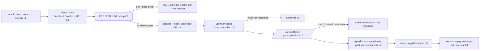
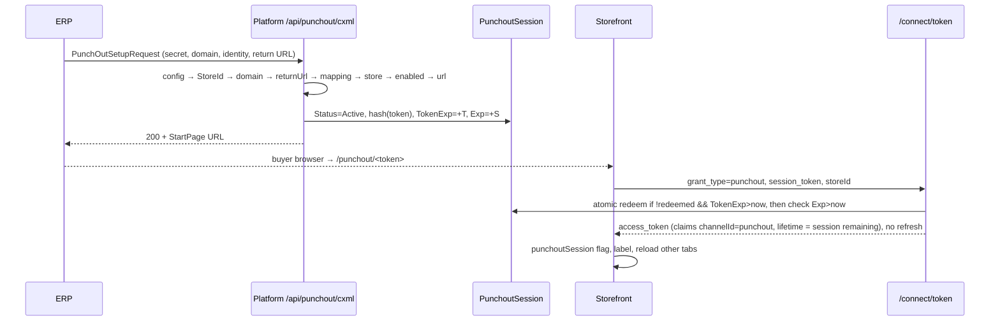
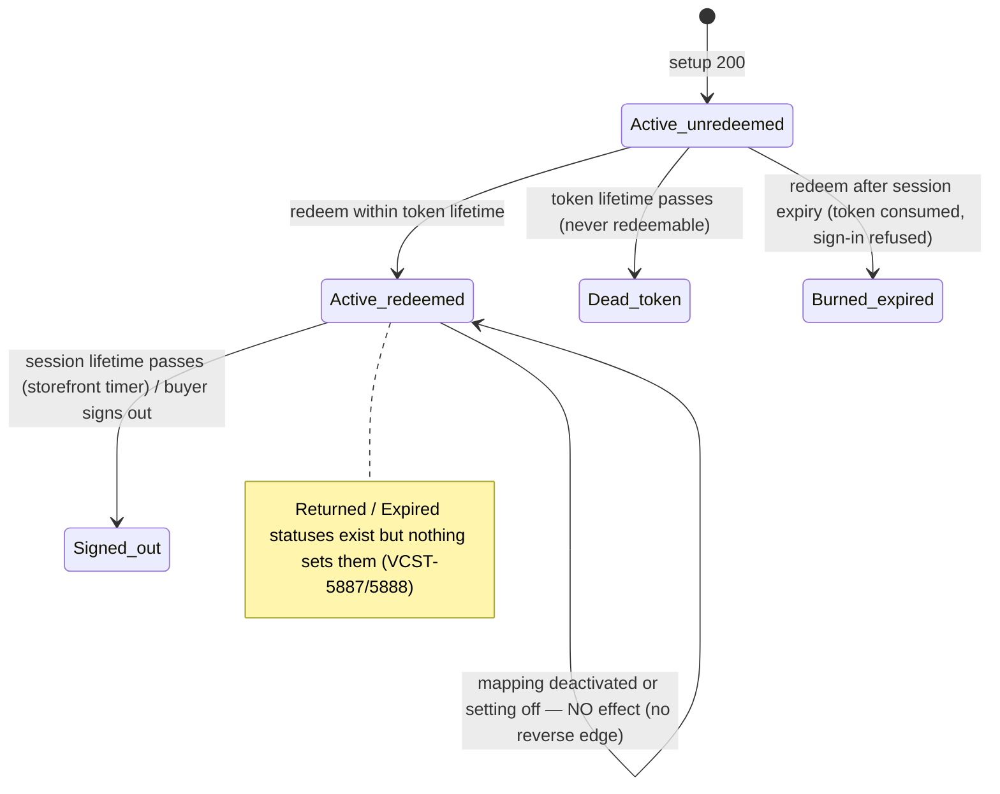

# TEST MODEL — VCST-5886

```
Ticket:      VCST-5886 | Type: Story | Status role: testable | Flow: feature-test | Priority: P1 (High) | Path: FULL | Changed: Both
Context:     FULL: ba-system-analyzer (1c) + ba-story-writer Mode B (1d) + qa-backend-expert 1r (REACHABLE, 6 min)
Prior model: none — first model for this surface
Domain map:  ABSENT — 1c-map built rev 1 (scratchpad punchout-domain-map.md) but build_outcome FAILED: slug `punchout`
             is not a declared bl:extract domain (DOMAIN-005), so it was not written. Its D1–D13 / G1–G14 rows are used
             below as defect hypotheses only, never as an inventory.
Mind map:    ABSENT
Chain position: unverified — no domain map. Slice stated against the Epic instead: touches setup → session → sign-in →
             shop (L1–L9); does NOT touch PunchOutOrderMessage / cart return (VCST-5887), OrderRequest (VCST-5888),
             Returned/Expired session transitions, ERP-side UI.
Env / build: vcptcore-qa1, Platform 3.1076.0; Punchout 3.1000.0-pr-1-fbb9 · PXA 3.1020.0-alpha.383-vcst-5886 · Cart 3.1010.0-pr-195-1b82 ·
             XCart 3.1038.0-pr-145-9124 · theme 2.59.0-pr-2506-f23c — deployed via vc-deploy-dev#6693, verified in /api/platform/modules
Contract:    REFRESHED — live introspection of qa1 equals .claude/knowledge/api/graphql-schema.md; Punchout adds no GraphQL types
```

**Affected surface.** `vc-module-punchout`: `POST /api/punchout/cxml` (anonymous, always HTTP 200, outcome in cXML `Status`),
`PunchoutSetupService.ValidateAsync`, `PunchoutGrantTypeHandler` (`grant_type=punchout` on `/connect/token`), session store
(hash only), `/api/punchout-user-mappings` REST (`punchout:read/create/update/delete`), Admin widget + `user-mapping-detail`
blade, store setting `Punchout.Enabled` (public, default false), xAPI `PunchoutContactOrganizationsMiddleware`.
PXA #147: `ContactOrganizationsContext` pipeline behind `Contact.organizationsIds`/`organizations`. Cart #195: `ChannelId`
persisted. XCart #145: `GetCartQuery` with null name ⇒ `"default"`; `CreateCartCommand.ChannelId`. vc-frontend #2506:
`modules/punchout` — route `/punchout/:sessionToken` registered at boot iff `Punchout.Enabled`, `useAuth.authorizeWithGrant`,
`punchout-mode-label` (top header only), auto sign-out at session expiry.

**Ticket signals.** No formal ACs: the developer's Jira comment (2026-10-01) is the de-facto spec — E1–E6, N1–N17, B1–B10.
cart#195 and x-cart#145 are NOT in that comment's PR list (found by org search). Attachments opened: the process-flow diagram
(setup → validate → logged in → browse; order return below the line = later stories), the widget screenshot (Active +
External identity `Test100`), the header screenshot ("Punchout mode" label).
**Epic context.** VCST-5154 (In progress). Siblings: VCST-5887 PunchOutOrderMessage (In progress), VCST-5888 OrderRequest
(To do) — the cart RETURN and the `Returned`/`Expired` session statuses belong to them; this story ends at "buyer shops".
**Domains:** punchout (new) · auth · b2b-organizations · cart · store-settings.
**Flows & boundaries:** ERP ↔ cXML endpoint · cXML ↔ session store · start page ↔ `/connect/token` · token ↔ org resolution
(BL-AUTH-015) · org ↔ cart isolation (BL-B2B-001) · Admin mapping ↔ setup validation.
**Risk areas:** VC-B2B-003 (admin account on storefront), VC-CART-001 (Apollo cache after auth replace), ECL-14.3 (org context
missing after login — the middleware empties the org list when `CurrentOrganizationId` is null); x-cart default name on every
cart lookup (125 cases at risk); PXA pipeline on every org switcher (6 cases).
**AC traceability:** 1d seeded 61 atomic conditions — E1.a–E6.b, N1–N17, S.a (sample), B1–B10, gap-ACs G1–G29. Impl verdicts
carried: Story 1 **DRIFT** (no per-organisation switch; enablement = store setting + appsettings + per-contact mapping) ·
E4 "while session valid" **DRIFT** (status never checked; expiry checked after the burn) · B6/B10 DRIFT · sample request
**CONTRADICTS** its own allow-list · G5/G13/G16/G17/G19 NOT-FOUND.
**DoD:** none declared on the ticket (1d proposed one; every item confirm-at-5-verdict).

## Part 0 — VALUE CHAIN

| Link | In the user's words |
|---|---|
| **L1** | Admin links a contact's security account to an external identity and marks it Active (widget / REST) |
| **L2** | Admin turns on Punchout for the store (`Punchout.Enabled`), the store has a URL; the platform carries a `Punchout:Configurations` entry whose SharedSecret selects the store |
| **L3** | The ERP posts a PunchOutSetupRequest; the platform validates it in a fixed order and answers with a cXML Status |
| **L4** | On success a session and a one-time token exist; the response carries `StartPage = <store url>/punchout/<token>` |
| **L5** | The buyer's browser opens the start page; the storefront route exists only where the setting is on |
| **L6** | The storefront exchanges the token (`grant_type=punchout`) for an access token: once, within the token lifetime, while the session lives; no refresh token |
| **L7** | The buyer lands signed in as the mapped user, sees "Punchout mode", sees only the current organization |
| **L8** | The buyer shops: the cart is the org's `default` cart; nothing from another org or another user is visible |
| **L9** | The session ends — automatic sign-out at session expiry or the buyer signs out (cart return = VCST-5887, out of slice) |







**Variants** (union of the layers that branch): V1 config 0 (B2B-store, domain + return-URL checks, 15 min / 4 h) · V2 config 1
(New-super, no checks, 2 min / 10 min) · V3 config 2 (store missing) · V4 config 3 (no StoreId) · V5 contact with one org ·
V6 multi-org contact (`MULTI_ORG_USER`) · V7 browser already signed in as another user · V8 Admin role full / read-only / none.

**Mechanism coverage matrix** (axes from Part 0; scenario # mapped in afterwards)

| Variant \ Link | L1 | L2 | L3 | L4 | L5 | L6 | L7 | L8 | L9 |
|---|---|---|---|---|---|---|---|---|---|
| V1 config 0 | 1 | 1 | 1, 4–11 | 1, 2 | 1 | 1, 17, 18 | 1 | 1, 23 | 21 |
| V2 config 1 | 12 | 12 | 12, 13 | 12 | 12 | 19 | 12 | WAIVED — same host as B2B-store on qa1, cart identical to V1 | 20 |
| V3 config 2 | WAIVED — mapping shared with V1 | 14 | 14 | WAIVED — no session | WAIVED — no session reaches this link | WAIVED — no session reaches this link | WAIVED — no session reaches this link | WAIVED — no session reaches this link | WAIVED — no session reaches this link |
| V4 config 3 | WAIVED — check fires before mapping | WAIVED — no session reaches this link | 15 | WAIVED — no session reaches this link | WAIVED — no session reaches this link | WAIVED — no session reaches this link | WAIVED — no session reaches this link | WAIVED — no session reaches this link | WAIVED — no session reaches this link |
| V5 one org | 1 | 1 | 1 | 1 | 1 | 1 | 1 | 23 | 21 |
| V6 multi-org | 24 | 24 | 24 | 24 | 24 | 24 | 24, 25 | 25 | GAP — expiry on multi-org not separately exercised (subsumed by 20) |
| V7 other user signed in | 22 | 22 | 22 | 22 | 22 | 22 | 22 | 22 | 22 |
| V8 admin roles | 26–29 | WAIVED — store-settings RBAC is not in this change | WAIVED — a back-office role does not act on this link | WAIVED — a back-office role does not act on this link | WAIVED — a back-office role does not act on this link | WAIVED — a back-office role does not act on this link | WAIVED — a back-office role does not act on this link | WAIVED — a back-office role does not act on this link | WAIVED — a back-office role does not act on this link |

**Reverse edges**

| Forward effect | What moves it back | Covered by |
|---|---|---|
| Mapping active (L1) | deactivate / delete / re-key → new setup refused | 9, 27, 28 |
| Mapping active (L1) | …→ an ALREADY ISSUED token or live session | **ABSENT IN PRODUCT** — grant re-checks only user/lockout (16) |
| Setting on (L2) | setting off → new setup refused (cXML 500), route gone on a fresh context | 10, 31 |
| Setting on (L2) | …→ live sessions / cached manifests | **ABSENT IN PRODUCT** — no revocation (16) |
| Token issued (L4) | redeem burns it; token lifetime kills it | 17, 19 |
| Signed in (L7) | session expiry auto sign-out; manual sign-out | 20, 21 |
| Session row Active | Returned / Expired | **ABSENT IN PRODUCT** in this story — owned by VCST-5887/5888 |

**Fixture lifecycle.** A start-page token is TERMINAL once redeemed and a session is terminal once expired, so every L4–L7 case
mints its own setup request in the case (FIFTH RULE). The mapping `AGENT-TEST-PO-100` (1r, id `435e16ea…`) is stable state;
cases that deactivate / delete / re-key a mapping create their OWN mapping in the case and delete it in Cleanup.

## Part 0r — ROLE SCENARIOS

**Roles in scope:** Back-office admin → `{{ADMIN}}` · Back-office viewer with `punchout:read` only → **FIXTURE-GAP** (role + user,
routed to 3a) · Back-office user with no `punchout:*` → **FIXTURE-GAP** (3a) · Punchout buyer → mapped `{{USER_EMAIL}}` contact
(1r) · Multi-org buyer → `{{MULTI_ORG_USER_EMAIL}}` (needs its own mapping, 3a).

**BSC-1 — An admin links a buyer to their procurement identity.** Role: admin. Situation: a customer onboards Coupa.
| # | Action | Sees | Can do | Expected |
|---|---|---|---|---|
| 1 | Opens a saved org contact with an account | widget "Not linked" | open widget | blade with Active + External identity |
| 2 | Enters identity, ticks Active, saves | widget shows the identity | edit, delete | setup with that identity → 200 |
Outcome: the contact can be punched into. Not allowed: an empty identity (Save disabled), an identity already used by another contact (save refused).

**BSC-2 — A support viewer checks a mapping.** Role: `punchout:read` only.
Outcome: sees the mapping. Not allowed: changing or deleting it — Save/Delete disabled in the blade AND `PUT`/`POST`/`DELETE /api/punchout-user-mappings` → 403 with this role's token.

**BSC-3 — A back-office user without punchout rights opens a contact.** Role: no `punchout:*`.
Outcome: the contact blade works as before. Not allowed: seeing the widget; `POST /api/punchout-user-mappings/search` → 403.

**BSC-4 — A Coupa buyer punches in.** Role: punchout buyer.
Outcome: signed in, shops in the current org. Not allowed: re-using the start link; getting a refresh token; seeing or switching to another organization (UI and `me.contact.organizations` / refresh-token org switch at the server).

## Parts 1–5 — FAULT MODEL

**Condition space.** cXML shape {valid, not-XML, no Request, other request type, hostile DTD} · config {0,1,2,3} · secret {match,
wrong, absent} · sender domain {match, other, absent} · return URL {allowed, foreign, absent, prefix look-alike} · mapping {active,
inactive, none} · store {enabled+url, disabled, no url, missing} · token timing {fresh, reused, token-expired, session-expired,
concurrent} · browser {fresh, other user signed in} · contact orgs {one, many, none} · admin role {full, read, none} · storefront
setting cache {fresh, cached} · viewport {desktop, 375 px} · locale {en, non-en}.
Constraints: config 3 never reaches domain/URL/mapping; config 2 never reaches a session; secret≠match ends at check 2.
Raw N = 5·4·3·3·4·3·4·5·2·3·3·2·2·2 = **9 331 200**.

**Reduction.** The setup validation is a short-circuit sequence, so its seven factors collapse to a **decision table of one row
per first-failing check** (DT; N1–N17 minus the unreachable N17) + the happy path: 4 320 cells → 15 rows. Token timing × config
→ ST over the state diagram (5 transitions, rows 17–20). Contact orgs × browser → PW, t=2 (rows 22, 24, 25; "no org" kept as
`{HYPOTHESIS}` row 25 because the expected outcome is unspecified). Admin role × widget op → Part 0r (rows 26–29). Viewport,
locale, setting cache → one row each (30–32); two map-derived EG rows (34, 35). Dropped: return-URL × domain interaction
(independent checks, both covered on config 0 and both skipped on config 1); config 1 × multi-org (cart/org mechanism is
config-independent). **9 331 200 → 35.**

| # | Cell | Defect hypothesis | Archetype | Technique | Oracle | P |
|---|---|---|---|---|---|---|
| 1 | [JOURNEY] config 0 · active mapping · one-org contact · fresh browser | Any link breaks: setup 200 but token not redeemable, or sign-in lands as the wrong user / without org / without the label, or the cart is not the org default | SILENT | FLOW | {SPEC} E1+E3 | Critical |
| 2 | config 0 success · inspect StartPage | URL host is not the store's SecureUrl-else-Url, token not 43-char base64url, two setups share a token | BOUNDARY | EP | {SPEC} E1 | High |
| 3 | developer's sample (return host `punchoutcommerce123.com`) on config 0 | the prefix match accepts a different host → returns to an attacker's page; or the documented sample fails for a real customer | CONFIG | EG | {SPEC} AllowedReturnUrls rule ⇒ 400; sample contradicts it — author to confirm | High |
| 4 | not-XML / truncated / empty body (N1) | parser exception escapes as HTTP 500 / stack trace | SILENT | EP | {SPEC} N1 + {BL-AUTH-017} | High |
| 5 | no `<Request>` (N2); `<ProfileRequest/>` (N3) | unsupported request accepted as setup, or crashes | LIFECYCLE | DT | {SPEC} N2, N3 | Medium |
| 6 | wrong secret (N4) / no secret (N5) | a request without a secret selects some configuration | SCOPE | DT | {SPEC} N4, N5 | Critical |
| 7 | config 0 · domain DUNS (N6) · domain attribute absent | domain check skipped or case-sensitive | CONFIG | DT | {SPEC} N6 | High |
| 8 | config 0 · return URL foreign (N8) · absent (N9) · `https://punchoutcommerce.com.evil.net/` | the buyer is posted back to a non-allowed host | SCOPE | BVA | {SPEC} N8, N9; look-alike {HYPOTHESIS} — needs author rule (PROPOSED-BL-PUNCHOUT-004) | Critical |
| 9 | identity unmapped (N11) · mapping inactive (N12) | inactive mapping still signs in | LIFECYCLE | DT | {SPEC} N11, N12 | Critical |
| 10 | config 0 · active mapping · store setting off (N13) | setup issues a session for a store that disabled punchout | CONFIG | DT | {SPEC} N13 (precondition: mapped identity) | High |
| 11 | store with neither Url nor SecureUrl (N14) | StartPage built as `/punchout/<t>` with no host | BOUNDARY | DT | {SPEC} N14 | Medium |
| 12 | config 1 secret · active mapping · domain DUNS · foreign return URL (N7, N10, E5) | skipped checks still enforced, or config 1 resolves to B2B-store | CONFIG | DT | {SPEC} N7, N10, E5 | High |
| 13 | config 0 and config 1 secrets in turn | the secret does not select its own configuration (first-match / wrong store) | PARITY | EP | {SPEC} E5 | High |
| 14 | config 2 secret · active mapping (N15) | missing store → session created / unhandled error | SILENT | DT | {SPEC} N15 | Medium |
| 15 | config 3 secret · any identity (N16) | missing StoreId reaches later checks or creates a session | CONFIG | DT | {SPEC} N16 | Medium |
| 16 | token issued, then mapping deactivated / setting off, then redeem | a revoked buyer still signs in | LIFECYCLE | ST | {HYPOTHESIS} — no rule stated; PROPOSED-BL-PUNCHOUT-001 needs author decision | High |
| 17 | redeem the same start link twice; two tabs at once | the token signs in twice (replay / race) | REPLAY | ST | {SPEC} E4 "works once" | Critical |
| 18 | access-token response after redeem | a refresh token is issued, or lifetime ≠ remaining session | BOUNDARY | EP | {SPEC} E4 + {HYPOTHESIS} lifetime = session (code) | High |
| 19 | config 1 · redeem after 2 min token lifetime | an expired token still redeems | BOUNDARY | BVA | {SPEC} E4 | High |
| 20 | config 1 · signed in · wait past 10 min session | the buyer stays signed in after the session ends | LIFECYCLE | ST | {SPEC} E4 "only while the session is valid" | High |
| 21 | signed in in punchout mode · sign out · sign in with password | punchout flag/label survive sign-out; the cart is lost | STALE | ST | {BL-CART-008} | Medium |
| 22 | browser signed in as user A · open B's start link; then an invalid link | A's cart/org leaks into B's session, or an invalid link signs A out | SCOPE | PW | {BL-B2B-001} + {HYPOTHESIS} invalid link keeps A | High |
| 23 | punchout buyer with an existing org cart · plus a named non-default cart | the punchout session opens a new or wrong cart; named carts become unreachable | STALE | EP | {BL-CART-005} {BL-CART-007} | High |
| 24 | multi-org contact punches in | the buyer lands in an org other than the BL-AUTH-015 chain picks, or the org list is empty | SCOPE | PW | {BL-AUTH-015} | High |
| 25 | multi-org buyer opens the org menu; tries an org switch at the API; contact with no current org | another org is reachable; the no-org case breaks the storefront | SCOPE | EG | {BL-B2B-001}; no-org {HYPOTHESIS} (ECL-14.3) | High |
| 26 | admin: new contact (B1) · saved contact (B2) · no account (B3) · empty identity (B4) · reopen (B5) | the widget shows on unsaved contacts / saves without an account / loses the mapping | LIFECYCLE | DT | {SPEC} B1–B5 | High |
| 27 | admin: duplicate identity on a second contact (B6); re-key to a new identity (B7) | duplicate identities accepted (two buyers, one identity); old identity still works | SCOPE | DT | {SPEC} B6, B7 | High |
| 28 | admin: delete a mapping (B8) | confirmation does not name the identity; setup still 200 | LIFECYCLE | ST | {SPEC} B8 | Medium |
| 29 | read-only (B10) and no-permission (B9) users · UI and REST | the read-only user can save through the blade or REST; widget visible without permission | SCOPE | DT | {SPEC} B9, B10 + {BL-AUTH-005} | Critical |
| 30 | REST create a mapping whose userId is another contact's / an admin's account | anyone with punchout:create can map an identity onto any account | SCOPE | EG | {HYPOTHESIS} — PROPOSED-BL-PUNCHOUT-002, author decision | Critical |
| 31 | fresh context with Punchout.Enabled off (E6) | `/punchout/` still registered; setting not public | CONFIG | EP | {SPEC} E6 | High |
| 32 | punchout label at 375 px and in a non-en locale | the label disappears on mobile / shows a raw i18n key | PARITY | EP | {HYPOTHESIS} — mobile scope unstated; locale {SPEC}: 13 locale files shipped | Medium |
| 33 | failed / reused / garbage start link — what the buyer sees | silent redirect to home with no message | SILENT | EG | {HYPOTHESIS} — no spec; diagram says "Error message" (attachment 83053) | Medium |
| 34 | `Punchout.Enabled` set at MODULE level vs STORE level (map D12) | storefront and setup read different levels — one says on, the other off | PARITY | DT | {SPEC} "Settings → Punchout → Punchout Enabled" on the store; module-level reader {HYPOTHESIS} | Medium |
| 35 | role with `punchout:read` but without `punchout:access` · contact with two security accounts (map D5, D6) | `punchout:access` gates nothing; the mapping silently binds the first account | SCOPE | EG | {HYPOTHESIS} — permission purpose unstated; author decision | Medium |

**Probes carried in:** VC-CART-001 (Apollo cache after the auth replace) → 22, 23 · VC-B2B-002 (permissions on roles) → 29 ·
VC-B2B-003 (admin account cannot use the storefront) → 30 (map onto an admin account) · VC-AUTH-001 (sign-out is an action)
→ 21 · VC-B2B-001 (Addresses link) → N/A, false-positive guard only · VC-CART-002/003/004/005/006 → N/A, line-item / shipment
/ inventory / stepper mechanics this change does not touch · VC-B2B-004 (impersonation naming) → N/A, impersonation untouched
· VC-AUTH-002/003 → N/A, password sign-in untouched.
**Archetype sweep:** SCOPE → 6, 8, 22, 24, 25, 27, 29, 30, 35 · PARITY → 13, 32, 34 · STALE → 21, 23 · RACE → 17 · REPLAY → 17 ·
SILENT → 1, 4, 14, 33 · MONEY → WAIVED, no price/currency path in this change · BOUNDARY → 2, 11, 18, 19 · LIFECYCLE → 5, 9,
16, 20, 26, 28 · CONFIG → 3, 7, 10, 12, 15, 31 · FALLBACK → 25 (no current org) · RENDER → 32 (+ 4v visual lane).
**UIP sweep:** UIP-DEEP → 1 (start page is a deep link) · UIP-REFRESH → WAIVED, refresh after redeem = replay, covered by 17 ·
UIP-TABS → 17, 22 (cross-tab reload broadcast) · UIP-EXPIRE → 19, 20 · UIP-STORAGE → 21, 31 (punchoutSession flag, cached store
manifest) · UIP-BACK → 33 (back to the used start link) · UIP-NET → WAIVED, no new network-retry path · UIP-INPUT → 26 (identity
field) · UIP-DATA → 8 (look-alike URL), 30 · UIP-PAGE → WAIVED, no pagination · UIP-EXTREME → 4 (hostile / oversize cXML) ·
UIP-VIEW → 32.
**Business Rules:** BL-AUTH-005, BL-AUTH-014, BL-AUTH-015, BL-AUTH-016, BL-AUTH-017, BL-B2B-001, BL-B2B-007, BL-B2B-013,
BL-CART-005, BL-CART-007, BL-CART-008, BL-STORE-001. Proposed: PROPOSED-BL-PUNCHOUT-001..004 (1d §5).
**Edge cases:** ECL-14.3, ECL-5.3.
**Docs grounding:** VirtoOZ has no punchout / cXML / Coupa page (1c) — NEW feature: oracles are `{SPEC}` (the Jira comment)
and `{BL}`; the module README (PR #1) agrees with the code except it omits the `Punchout.Enabled` check.
**Observed grounding (kb):** none for punchout; 1r queued capture KB-C239652A.
**Agents to dispatch:** 3x discovery (`/qa-exploratory ticket`), 3a `test-data-engineer` (FIXTURE-GAPs), 4a `qa-backend-expert`
(cXML / REST / Admin) ‖ `qa-frontend-expert` (storefront), 4v `ui-ux-expert` (widget + label).
