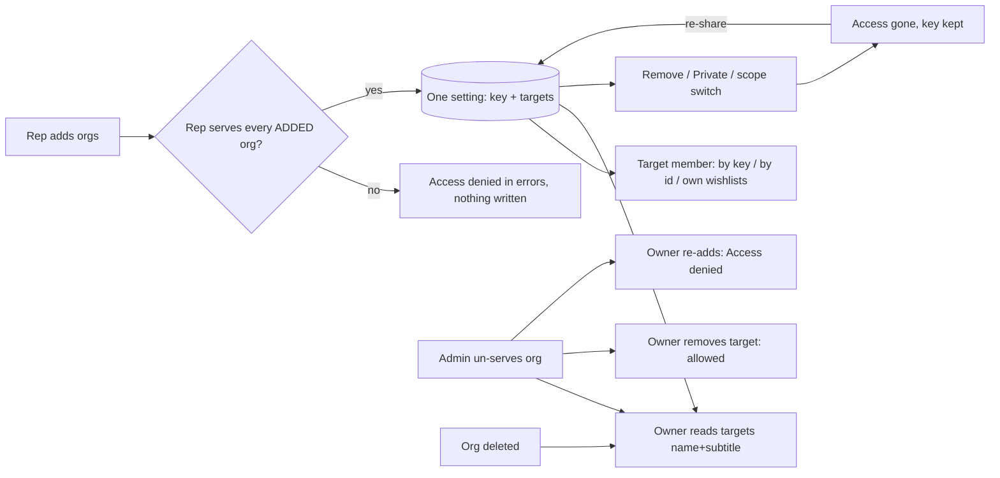
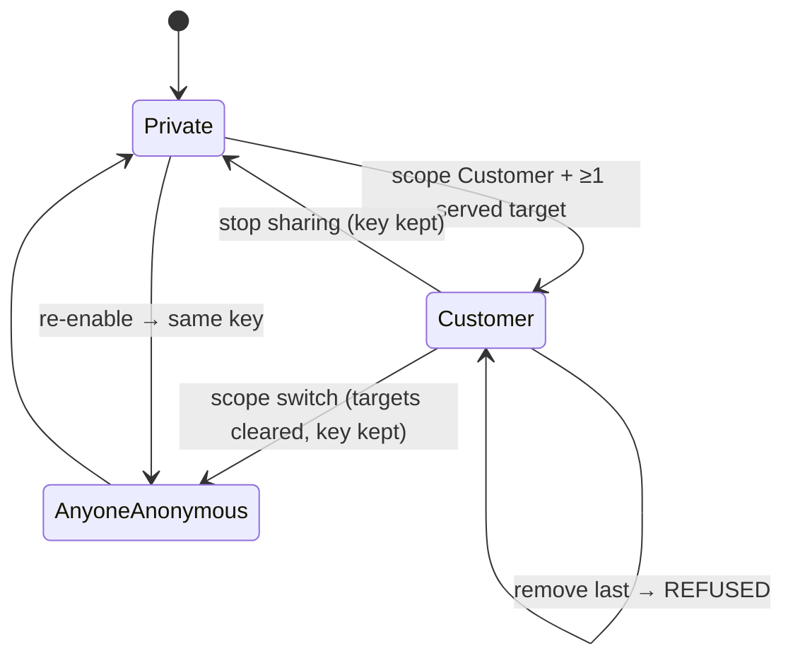

TEST MODEL — VCST-5925 (Sales Rep · Lists · multi-recipient sharing contract + targeted-customer access, backend)

Ticket:      VCST-5925 | Type: Story | Status role: testable (Ready for test → Testing 2026-10-01T12:52Z) | Flow: feature-test | Priority: P2 (Medium) | Path: FULL | Changed: Backend
Context:     /qa-test FULL, orchestrator inline (ticket + contract comment + 12 AC in customfield_10175 + PR bodies x-cart#141, cart#194, sales-rep#21) + kb + prior model; 1c/1d not dispatched (prior model VCST-5728 is the same backend build — see Ticket signals)
Prior model: reports/ba/test-models/VCST-5728-2026-09-29.md — Part 0 (chain L1–L8, diagrams, variants V1–V14, reverse edges) carried forward below; corrections recorded as drift
Domain map:  .claude/knowledge/domain/sales-rep.md — PRESENT (working-tree amendments from VCST-5707, 2026-09-29/30)
Mind map:    .claude/knowledge/domain/sales-rep.mind-map.json — nodes sr.list-share, .targets-delta, .scope-change-resets, .last-target-refused, .customer-access (DRIFT)
Chain position: L2, L3, L5, L6, L8 of the rep list-share chain L1–L8 (API layer) PLUS the assignment axis of the sales-rep domain chain (link 2 "rep is linked to customers", link 8 "access is taken away").
             Does NOT touch: L1 (storefront dialog — VCST-5707), L4 notify (sendCustomerCommunication — VCST-5850), L7 client branch logic, the recipient's shopping on the list.
Affected surface: vc-module-x-cart#141 (SharingSettingType.targets/message, Input*WishlistType add/remove/message, CartSharingService, scope policy registry #140) · vc-module-cart#194 (CartSharingSettingTarget table + migration) · vc-module-sales-rep#21 (Customer scope policy: authorize adds, ResolveTargetsAsync, empty-set refusal). All map to domain-map §3 Lists/share; the xAPI targets/message fields are a surface the map was MISSING (recorded by VCST-5728).
Ticket signals: contract comment (Ivan Kalachikov, 2026-09-09) proposes 1.1 plural `sharingSettings` + 1.2 `sharedWith`; PRs ship the singular `sharingSetting.targets[]` (the comment's own "Alternative shape" is closer) → AC3 is a contract DRIFT to be stated, not silently mapped.
             Part A (3.1/3.2) is a standing defect folded in with no Jira bug of its own — reproduction `reports/bugs/open/critical-high/BUG-rep-shared-wishlist-grants-customer-no-access.md`. None of the three PR bodies claim to fix 3.1/3.2.
             kb: KB-2F64A447 (well attested, 5 sessions incl. vcptcore 2026-09-30): target reads only via sharedWishlist(key); wishlist(listId) Forbidden; absent from own wishlists().
Epic context: VCST-5142 Sales Rep Hub. Related: VCST-5707 (FE, Reopen — 050h WISH-036..044 Draft, uncommitted), VCST-5728 (Tested), VCST-5850 (multi-org send, RFT), VCST-6105 (message limits, Draft).
Domains:     Lists/wishlists · Sales Rep (assignment) · xAPI contract
Risk areas:  SCOPE (grant leaks / grant not usable), LIFECYCLE (revoke after unassign, scope switch residue), STALE (key rotation), SILENT (partial write side effects, legacy write dropping grants), contract DRIFT vs the agreed comment.
AC traceability (customfield_10175, 12 atomic):
  AC1 adding does not revoke — Impl: delta ApplyTargets (x-cart#141) ✓
  AC2 link stable; re-enable restores previous link — Impl: key = sharingSetting.id, kept on scope change (x-cart#141) ✓; "where FE reads the key" = sharingSetting.id (PR text)
  AC3 sharingSettings one entry per grant with sharedWith{name subtitle} — Impl: DRIFT — singular sharingSetting.targets[]{id name subtitle imageUrl}
  AC4 targets resolve regardless of assignment; null only when org gone — Impl: sales-rep#21 ResolveTargetsAsync (owner only) ✓ claimed
  AC5 target sees list in wishlists() isOwner:false; wishlist(listId) works — Impl: NOT in any PR ✗ (kb says still failing)
  AC6 revoke survives losing assignment — Impl: sales-rep#21 authorize adds only ✓ claimed
  AC7 revoking immediate — Impl: delta remove ✓
  AC8 one scope at a time — Impl: EnsureSetting drops extra rows (x-cart#141) ✓ claimed
  AC9 partial write leaves the rest alone — Impl: omit scope = untouched ✓
  AC10 legacy sharedWithId explicit — Impl: replace single / refuse multi ✓ claimed
  AC11 access = viewer's own — Impl: unchanged field ✓
  AC12 failures are GraphQL errors — Impl: INVALID_OPERATION / Forbidden in errors[] ✓ claimed
Docs grounding: NEW behaviour (unreleased PRs) ⇒ ground truth = AC {SPEC} + PR source + live build. VirtoOZ StorefrontUserGuide documents the old one-recipient rule (per VCST-5728 model) — not an oracle here.

--- Part 0 — VALUE CHAIN (carried from VCST-5728, + assignment axis A1–A2) ---
Value chain:
  L2 Rep picks org(s) → changeWishlist(scope Customer, addSharedWithIds[, message])
  L3 Server authorizes ADDED orgs only, applies delta, keeps ONE setting/key per list, persists targets
  L5 Recipient org member reaches the list: by key (sharedWishlist) AND by id (wishlist(listId)) AND in own wishlists() (AC5)
  L6 Owner reads sharingSetting{id, targets{name subtitle}, message} — targets owner-only
  L8 Remove target / stop sharing (Private) / scope switch → access gone immediately, key kept
  A1 Admin un-serves an org (rep loses assignment) → owner still sees the target resolved, can remove it, cannot re-add
  A2 Org deleted → target keeps id, name null, still revocable

Variants: write shape {add, remove, both-overlap, dup-add, absent-remove, case-variant id, legacy single/first/second/new, no-scope, rename-only} · reader {owner, target member, removed-target member, non-target, anonymous} · assignment {served, un-served, org deleted} · scope transition {Customer↔Private, Customer→AnyoneAnonymous, AnyoneAnonymous↔Private} · read path {sharedWishlist(key), wishlist(listId), wishlists()}.
Mechanism coverage matrix:
| Variant \ Link | L2 write | L3 authorize/persist | L5 recipient | L6 owner read | L8 revoke/switch | A1 unassign | A2 deleted |
|---|---|---|---|---|---|---|---|
| add second org | 1 | 1 | 1 | 1,4 | 7 | WAIVED — covered by 5 | WAIVED — covered by 6 |
| target read paths | WAIVED — reader cannot write | WAIVED — reader | 2,3 | 9 | 7 | WAIVED — reader-side unaffected | WAIVED |
| rename / message-only | 10 | 10 | 10 | 8,10 | WAIVED — no revoke | WAIVED | WAIVED |
| deltas edge (dup/absent/overlap/case) | 11 | 11 | WAIVED — no reader change | 11 | WAIVED | WAIVED | WAIVED |
| legacy sharedWithId | 12 | 12 | WAIVED — covered by 1 | 12 | 12 | WAIVED | WAIVED |
| un-served org | 5 | 5 | WAIVED — FIXTURE: no member of a created org | 5 | 5 | 5 | 6 |
| scope switch | 13 | 13 | 13 | 8,13 | 13 | WAIVED | WAIVED |
| refusals | 14 | 14 | 14 | WAIVED | 14 | 5 | WAIVED |
Reverse edges: grant → remove / Private / scope switch (7, 13); assignment → un-assign (5); org → delete (6); key → rotate? must NOT (8). Re-grant after un-assign → refused (5).

--- Part 0r — ROLE SCENARIOS (rep owner, target member, removed-target member, non-target member, anonymous) ---
Roles: rep → @td(SR_REP_PRIMARY) · target member → @td(ACME_BUYER) in @td(ORG_ACME) · org-B member → FIXTURE-GAP (SR_REP_EXCLUSIVE_TECHFLOW has no password) → create-in-case or GAP · non-target → same gap · anonymous → no auth.
BSC-1 Rep shares a list with two customers, later loses one customer: Not allowed — re-adding the lost customer (5); revoking must stay possible (5).
BSC-2 Target member uses the list: sees it among own lists and by id (3), Read only; Not allowed — seeing other recipients (2).
BSC-3 Removed / non-target member: Not allowed — any read path (7).

--- Parts 1–5 — FAULT MODEL ---
Condition space: write 11 × reader 5 × assignment 3 × transition 4 × path 3 → raw N = 1980.
Reduction: readers ride one write shape (auth runs before ApplyTargets) · assignment only matters to owner read + add/remove · transitions are independent of write shape beyond scope present/absent · already-observed rows from VCST-5728 (message normalisation, 1024/1025, unserved add, empty set) carried as existing cases, not re-modelled. 1980 → 14 (dropped: message value classes, notify, clone path — same handler as change, P4).
| # | Cell | Defect hypothesis | Archetype | Technique | Oracle | P | Covered by |
|---|---|---|---|---|---|---|---|
| 1 | add org B to [A] | add replaces → A loses access | LIFECYCLE | ST | {SPEC AC1} | P1 | WISH-036, P-1 |
| 2 | target reader projection | targets/sharedWithId of other customers leak to a reader | SCOPE | DT | {SPEC} x-cart#141 owner-only | P1 | P-1 |
| 3 | target wishlist(listId) + wishlists() | grant persisted but unusable: Forbidden by id, absent from own roster | SCOPE | DT | {SPEC AC5} | P1 | WISH-33, WISH-039, P-1 |
| 4 | owner target resolution | name/subtitle wrong or null for a live org | RENDER | EP | {SPEC AC3} | P2 | P-3 |
| 5 | rep un-served from org X | owner cannot remove X (locked out) / can re-add X / X name null | LIFECYCLE | ST | {SPEC AC4, AC6} | P1 | P-4 |
| 6 | org X deleted | target vanishes (unrevocable ghost grant) or resolver throws | STALE | EG | {SPEC AC4} | P2 | P-4 |
| 7 | remove org A | removed member keeps reading (cache) | SCOPE | ST | {SPEC AC7} | P1 | WISH-044, P-1 |
| 8 | key across saves/switches | key rotates on save or on re-enable | STALE | ST | {SPEC AC2} | P1 | P-2 |
| 9 | owner access field | owner loses Write/isOwner after sharing (menu gone) | SILENT | EP | {SPEC AC11} | P2 | P-1 |
| 10 | rename-only on multi-target list | rename drops targets/scope/key/message | SILENT | DT | {SPEC AC9} | P1 | P-6, WISH-043 |
| 11 | dup add / absent remove / overlap / case | retry not idempotent; overlap half-applies; case dup target | BOUNDARY | EP | {SPEC 2.1} | P2 | P-7 |
| 12 | legacy sharedWithId on 1 / 2 targets | legacy write silently drops the other grant | SILENT | DT | {SPEC AC10} | P1 | WISH-041, P-8 |
| 13 | Customer → AnyoneAnonymous | stray Customer row suppresses the link grant | LIFECYCLE | ST | {SPEC AC8} | P2 | WISH-042, P-5 |
| 14 | refusal transport | a refusal surfaces as HTTP 500 | FALLBACK | EG | {SPEC AC12} | P2 | WISH-037/038, P-9 |
Contract DRIFT (not a scenario, a finding for the PO): AC3 names `sharingSettings[]` + `sharedWith`; shipped = `sharingSetting.targets[]` (checked by P-3 introspection).
Probes carried in: vc-bug-catalog SCOPE/SILENT probes → 2, 3, 10, 12. Archetype sweep: SCOPE 2,3,7 · LIFECYCLE 1,5,13 · STALE 6,8 · SILENT 9,10,12 · BOUNDARY 11 · RENDER 4 · FALLBACK 14 · RACE WAIVED (2.2 revision is optional and not implemented; single-writer rep) · REPLAY WAIVED (server sends nothing) · MONEY/CONFIG WAIVED (none).
UIP sweep: WAIVED — backend-only ticket, no UI surface (visual_surface false).
Business Rules: BL-SR-002 (scoped access to served orgs) — no Lists-sharing BL domain exists. Edge cases: ECL-7.2 (message text) — carried from VCST-5728.
Unresolved → charter: 3x discovery lane NOT run as a separate session (see summary.discovery) — its sources (rows 5, 6 FIXTURE/HYPOTHESIS, AC3 DRIFT) were folded into the 4a probes P-3/P-4.
