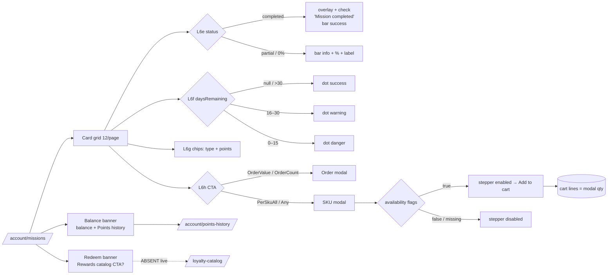
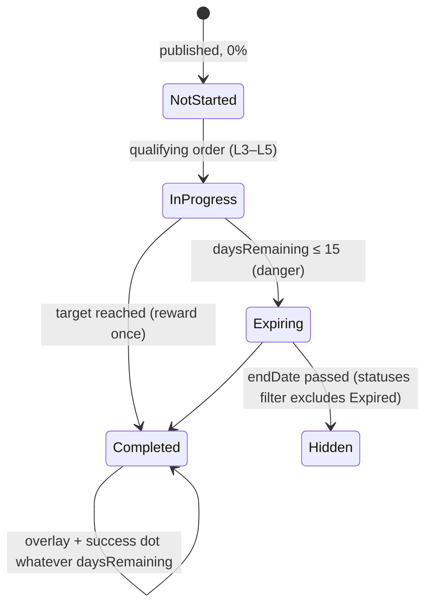

TEST MODEL — VCST-5957 (Loyalty Missions — "Missions & challenges" redesign, L6 display)
Ticket: VCST-5957 | Type: Story | Status role: testable | Flow: feature-test | Priority: P2 (Medium) | Path: FULL (Story default; §5b refusal — Missions purpose UNDECLARED in the domain map) | Changed: Frontend
Context: FULL — `ba-system-analyzer` (1c, live firefox as `@td(LOY_PERSONAL_NOORG)`) + `ba-story-writer` Mode B (1d) + `1r` REACHABLE. Code read at vc-frontend PR #2524 head `30691594`; backend at Loyalty tag `3.1009.0`.
Prior model: `reports/ba/test-models/VCST-5346-2026-09-02.md` (L6 display, scenarios #15–#23) over `VCST-5346-2026-08-28.md` (Part 0 L1–L5, #1–#14). **Part 0 is carried forward**: chain L1–L7 and L6a–L6d are unchanged, and their scenarios stay authoritative for routing, payload, currency and points-history. This model adds the sub-links this PR moves (L6e–L6i) and numbers from #24. Corrections are drift against the predecessor, listed at the end.
Domain map: `.claude/knowledge/domain/loyalty-missions.md` @ rev 4 (generated 2026-10-01) — PRESENT.
Mind map: `.claude/knowledge/domain/loyalty-missions.mind-map.json` (domain_map_rev 3). Nodes touched only indirectly: `loy.missions.gate.on` and `loy.mission.progress.accrue.cart-add-no-accrual`. **Mind-map DRIFT:** no node covers the storefront display slice (card / modal / banner / date badge). Route it to `/qa-test-mind-map update`; this model does not draw one.
Chain position: touches **L6 only** (the display link): L6e–L6i new, plus re-reads of L6c. The L6h add-to-cart edge reaches the cart, but no order is placed. **Does NOT touch L1–L5** (accrual, jobs, progress write, reward grant), **L7** (spend), L8–L11 (expiry sweep, reversal, org mode). Backend `daysRemaining` is consumed as given.
Affected surface: vc-frontend `client-app/modules/loyalty/` — `composables/useMissionCard.ts` (ladder `DATE_DANGER_DAYS=15`, `DATE_WARNING_DAYS=30`; type label and icon map with silent fallback), `components/mission-card.vue` (h-52 banner, `__done` overlay `success-400/0.75` + `circle-check` 56, `__badges` chips, body order note→bar→title→footer), `mission-date-badge.vue`, `missions-banner.vue` (`color: primary|info`, start-edge accent, solid icon, `VcButton soft sm`), `points-balance.vue` (label removed), `order-mission-modal.vue` (bar info/success), `sku-mission-modal.vue` (60rem, `VcLineItems`, availability `?? false`, `extendedPrice = amount×qty`, `subtotal_hint` `VcAlert`), `pages/missions.vue` (`gap-5`, redeem banner **without** `linkTo`), 14 locales. Map §2b enumerates the page, cards, "Open mission" and both banners. **MISSING from the map:** the completed overlay, the chip and icon map, the `VcLineItems` SKU modal, the subtotal hint, and the availability-default rule (1c `unmapped_surfaces[]`).
Ticket signals: no comments. Attachment 83896 (annotated cards): (1) type ("driver") on top in a chip; (2) chips restyled; (3) buttons per UI Kit; (4) completed = check on green. It shows an "Account setup" card with "0 of 1 steps" and subtitles "$0.00 spent" / "$3,240.00 spent". Attachment 83929 (top banners): white banners, accent edge, "VIRTO REWARDS BALANCE", **soft "Rewards catalog" button on the redeem banner**. The Changes artifact (`ef9240f0`, third-party) lists 26 items, incl. a sort dropdown, the "account" kind, overlay `success-600 @55%`, ladder ≤15 red / ≤30 orange / else green, subtitle "$0.00 of $7,200.00 spent". **Blocked-by VCDZ-897 "Design edits for Missions & challenges", IN PROGRESS:** the visual oracle is still moving.
Epic context: VCST-5099 "Loyalty - Mixed Cart" (Draft); the 8 sibling stories are Done (5365, 5104, 5024, 5103, 5135, 5101, 5100, 5023). Integration seams: the mixed cart (the SKU modal adds to the cart), the loyalty catalog (redeem banner), points-history (balance banner). Predecessor storefront story: VCST-5346 under VCST-5320.
Domains: Loyalty (missions display), Cart (add from modal), Catalog/Inventory (availability flags), i18n, a11y, UI layout.
Flows & boundaries: missions ↔ points-history (balance + nav) · missions ↔ loyalty-catalog (redeem CTA) · SKU modal ↔ cart (`addToCart`, estimate vs real totals) · SKU modal ↔ catalog `availabilityData` · card ↔ xAPI `daysRemaining` (server UTC ceil, floor 0).
Risk areas: VCST-5910 (date ladder; code now 15/30, live bands unverified), VCST-5833 (order-modal banner missing, mobile carousel; still present), VCST-5834 (Points-history hit area; fixed at 1920, 375 unmeasured), VC-UI-001/005/006/007, VC-CART-006, VC-PLATFORM-005 (UTC day shift).
AC traceability: 25 atomic conditions (1d T01–T25): 16 story-derived (4 annotations + 12 artifact groups) + 9 gap groups (gap-AC-1..17). Impl verdicts: SATISFIED 14 · DRIFT 6 (T03 208 vs 210 px, T05 overlay spec, T08 no Rewards-catalog CTA, T09 tracking/line-height, T16 body order, T22 icon-only completion) · NOT-FOUND 3 (T10/T11 sorting, T13 "account" kind — **declared PR scope cut / no backend type: ABSENT, re-scope trigger, no case**) · CONTRADICTS 1 (T24: the artifact says the SKU modal is out of scope; the PR rebuilds it and changes availability semantics).
DoD: none declared on the ticket. 1d proposal carried as advisory only.

--- Part 0 — VALUE CHAIN (carried; L6 extended) ---

Value chain (L1–L5, L7 carried verbatim from VCST-5346-2026-08-28; L6a–L6d from 2026-09-02):
  L1–L5. order → `OrderChangedEvent` → eligibility job → progress write → reward granted once  *(not touched)*
  L6a route reached · L6b payload survives · L6c money reads true · L6d meaning reads true  *(carried; #15–#23)*
  **L6e. Status reads true** — at a glance the customer tells completed from in-progress from not-started: overlay + check, "Mission completed", bar colour, %, progress label. *(the story's own purpose)*
  **L6f. Urgency reads true** — the date badge label and dot match `daysRemaining` on the 15/30 ladder; completed and no-deadline read safe.
  **L6g. Identity reads true** — type chip (label + glyph per goal type) and points chip (reward) say what the mission is and pays.
  **L6h. Act** — the CTA opens the right modal; in the SKU modal only purchasable rows can be added, totals are honest estimates, and Add-to-cart puts exactly those quantities in the cart.
  **L6i. Navigate** — the balance banner shows the same balance as points-history and links to it; the redeem banner leads to where points are spent (L7).
  L7. points spendable  *(not touched)*

Variants (rows), the union of the branching layers:
- **goal type** (`useMissionCard` + `TYPE_ICONS`): OrderValue · OrderCount · PerSkuAll · PerSkuAny · *unknown / raw `PerSku`* (silent fallback to "Featured SKUs" + barcode).
- **status** (`mission-card` / `order-mission-modal`): 0% · partial · completed.
- **deadline band** (`resolveDateSeverity` over server `daysRemaining`): null · 0 (expired-not-swept) · 1–15 · 16–30 · ≥31; boundaries 15/16, 30/31.
- **availability** (`sku-mission-modal` → `QuantityControl`): flags true · flags false (OOS) · `availabilityData` missing.
- **presentation** (layout / theme / i18n): 1920 · 375 · dark theme · long-form locale (de/fi) · CJK (ja).

Mechanism coverage matrix (variant × link; # = scenario; W = WAIVED with the reason in the key):

| Variant \ Link | L6e status | L6f urgency | L6g identity | L6h act | L6i navigate |
|---|---|---|---|---|---|
| OrderValue | #24, #36 | #25 | #33 | #24 (order modal) | W1 |
| OrderCount | #36 | #25 | #33 | #36 | W1 |
| PerSkuAll | #24, #36 | #25 | #33 | #24, #29, #30 | W1 |
| PerSkuAny | #36 | #25 | #33 | #29 | W1 |
| unknown / raw PerSku type | W2 | W2 | #34 | GAP — no fixture can publish an unknown type from Admin (5 constants, 3 goal classes, D5) | W1 |
| 0% | #36 | #25 | W3 | #30 | W1 |
| partial | #24, #36 | #25 | W3 | #31 | W1 |
| completed | #24, #26, #27, #28 | #26 | W3 | #36 (modal shows completed, no stepper titles) | W1 |
| deadline null / 0 / ≤15 / 16–30 / ≥31 | W4 | #25 (BVA set) | W3 | W4 | W1 |
| availability true / false / missing | W5 | W5 | W5 | #24 (true), #29 (false), #30 (missing) | W5 |
| 1920 | #24 | #25 | #33 | #24 | #32, #35 |
| 375 | #37 | #37 | #37 | #37 | #32, #37 |
| dark theme | #38 | #38 | #38 | GAP — dark theme × modal not authored; covered only by the 4v visual lane | #38 |
| de / fi long-form, ja | #39 | #39 (plurals) | #39 | #39 (`subtotal_hint`) | #39 |

Key: W1 the banners do not branch on any mission attribute (source `missions.vue`) · W2 the status and urgency paths are type-independent (`resolveDateSeverity` reads only status and days) · W3 chips do not branch on status or deadline · W4 the CTA and status are deadline-independent · W5 availability exists only inside the SKU modal.

Reverse edges:
- L6h add-to-cart → removing the line in the cart. **WAIVED:** owned by the cart domain (`083b`, `010`); this ticket only changes what gets added.
- Points and money: this ticket moves none.
- L5 reversal: **ABSENT IN PRODUCT** (BL-LOY-019, carried; not re-tested).
- L6e Completed → never reverts on the card even if a later order is cancelled: same BL-LOY-019 absence, display side. Recorded, not a scenario.

Fixture lifecycle:
- **Deadline bands are TIME-TERMINAL.** A mission seeded at "15 days left" reads 14 tomorrow.
  - FIFTH RULE: the durable case creates its mission with `endDate = now + N days` right before reading it, and deletes it in cleanup.
  - This run's 3a seeds one boundary set and reads it the same day.
  - Server ceil: `Math.Ceiling((EndDate − UtcNow).TotalDays)`, so to pin a boundary set `endDate` mid-day (e.g. N days − 12 h). Never use exactly N×24 h.
- **Completed** is terminal-once-reached. Use the already-completed `MSN_E2E_*` / `@td(MSN_PROGRESS_COMPLETED)` read-only; never re-drive it.
- `@td(MSN_PERSKU_OOS)` + `@td(MSN_ZEROSTOCK_PRODUCT)` cover flags-false.
- **Flags missing has no fixture: FIXTURE-GAP**, routed to 3a.

--- Parts 1–5 — FAULT MODEL (L6e–L6i) ---

Condition space: surface (4: card / order modal / SKU modal / banners) × goal type (5) × status (3) × deadline class (5 + 4 boundaries = 9) × availability (3) × viewport (2) × theme (2) × locale (3: en / de / ja). Constraints: availability only × SKU modal; deadline × completed collapses to success (`resolveDateSeverity` checks completed first). Raw N = 4×5×3×9×3×2×2×3 = **19,440**.
Reduction: 19,440 → **16 scenarios (#24–#39)**.
- (a) Goal type collapses to one card render path except where the label/icon map branches (#33/#34) and the SKU modal exists (#29–#31).
- (b) Deadline is a pure function of `daysRemaining` × completed, so it collapses to one BVA set (#25) + the completed override (#26). It is not crossed with type or surface (W2/W4).
- (c) Availability exists only in the SKU modal: 3 cells, not ×4 surfaces.
- (d) Viewport × theme × locale: t=2 pairwise is subsumed by three presentation sweeps (#37/#38/#39) over one fixed card set, because none of them branches the logic.
- (e) Currency and payload health are dropped here. They are subsumed by #16–#18 and #17 of the predecessor, unchanged by this diff (the modal still reads `price.actual.currency.code`).

Test scenarios:

| # | Cell | Defect hypothesis — what breaks, and why it plausibly would | Archetype | Technique | Oracle | P |
|---|---|---|---|---|---|---|
| 24 | signed-in customer, 1920; one completed, one partial, one ≤15 d mission; PerSkuAll with one in-stock + one OOS target | **[JOURNEY]** The customer opens Missions & challenges and must tell at a glance which mission is done, which is in progress and which is urgent, then act on one. They open a PerSku mission, add the in-stock target and find exactly that quantity in the cart, and the balance banner agrees with points-history. A restyle that swaps a state cue, mis-colours the dot, or breaks the modal→cart hand-off passes every per-element check while the page no longer answers its one question. Crosses L6e→L6f→L6g→L6h→cart→L6i | SILENT | FLOW | {SPEC} ticket user story + annotations A1–A4 + PR #2524 description; {SPEC} mind-map node `cart-add-no-accrual` (cart-add moves no progress — no BL invariant states it) | Critical |
| 25 | card, `daysRemaining` ∈ {null, 0, 1, 15, 16, 30, 31}, not completed | The dot uses the wrong band at an edge: an off-by-one (`<` vs `≤`), or a client recomputation drifting from the server's UTC ceil (VC-PLATFORM-005). Then 15 reads warning or 31 reads warning. The unit test pins the composable but not the rendered dot from real xAPI data | BOUNDARY | BVA | {SPEC} Changes artifact item 24 (≤15 red, ≤30 orange, else green) + PR text; {OBSERVED} needed for 0 (artifact silent → `{HYPOTHESIS}`: danger + "0 days left") | High |
| 26 | completed × `daysRemaining` ≤15 | A completed mission still shows a red dot or "N days left" because the completed check is skipped on one surface. The customer is told to hurry on something already won | PARITY | DT | {SPEC} PR text "Completed missions stay success" | Medium |
| 27 | completed card, screen reader / a11y tree | The "Completed" chip text and its locale key were removed, so completion is now carried by a colour overlay + icon. If the circle-check has no accessible name and "Mission completed" is not exposed, a non-sighted customer cannot tell completed from in-progress: the story's own question, unanswerable | RENDER | EG | {BL} BL-A11Y-002/003 (non-colour cue) + ECL-15.1 | High |
| 28 | completed card, light theme, varied banner photo | White 56 px check on `success-400 @75%` over a photo falls below 3:1 (non-text contrast), and the chips' tonal text over the overlay is below 4.5:1. The artifact specifies a darker `success-600 @55%`, so the PR's lighter scrim is a plausible contrast regression | RENDER | EP | {BL} BL-A11Y-003 (1.4.11 / 1.4.3) | High |
| 29 | SKU modal, target with flags present and false (OOS) next to an in-stock target | The OOS row's stepper is enabled, or its stock badge disagrees with the stepper (the pre-PR mismatch), so the customer adds an unbuyable product toward a mission they then cannot complete | SILENT | DT | {SPEC} PR text (availability) + ECL-2.x | High |
| 30 | SKU modal, target whose `availabilityData` is missing | **The PR's own fix:** `?? false` must disable the stepper. If any of the four flags still reaches `QuantityControl` as `undefined` (its default is `true`), the product is addable again. This is the exact regression the change targets | FALLBACK | EG | {SPEC} PR text "Missing availability flags now default to false"; source `quantity-control.vue:97-100` | High |
| 31 | SKU modal, in-stock target, qty changed 0→1→2 (and above stock) | Line Total ≠ unit × qty, or Cart subtotal formats as bare "0" instead of currency at 0 units (1c observed). The estimate hint is the only thing standing between a client-side sum that ignores promotions/tiers and a customer who reads it as the price | MONEY | BVA | {SPEC} PR text (`subtotal_hint`) + {BL} BL-PRICE-005 formatting; "0" vs "$0.00" `{HYPOTHESIS}` until compared with the pre-PR build | Medium |
| 32 | balance banner, 1920 + 375 | The balance moved from `PointsBalance`'s own label into the banner title. If another consumer lost its label, or the banner value ≠ the points-history Balance, or the "Points history" control is < 24×24 at 375 (VCST-5834), the customer either sees two balances or cannot reach the history | PARITY | EP | {BL} BL-UI-006 (target size) + VCST-5834; parity {SPEC} map §2b "same balance as points-history" | Medium |
| 33 | card, each goal type | A goal type shows another type's label or glyph (OrderValue→cash, OrderCount→shopping-bag, PerSku*→barcode "Featured SKUs"), or the points chip shows a value other than the mission reward. Two chips side by side invite a copy-paste swap | RENDER | EP | {SPEC} annotation A1/A2 + PR text | Medium |
| 34 | card, mission type outside the map (raw `PerSku`) | An unknown type silently renders as "Featured SKUs" with a barcode. It is acceptable as a fallback only if it neither crashes nor mislabels a real type. Kept because D5 proves the backend declares a constant the UI does not map | FALLBACK | EG | {SPEC} 1d gap-AC-17 → `{HYPOTHESIS}`, grounded only if a fixture can publish the type (GAP, see matrix) | Low |
| 35 | redeem banner | The design (screenshot 83929 + artifact) shows a soft "Rewards catalog" button. The PR passes no `linkTo`, so the banner tells the customer to "trade points" with no way to the catalog. **Kept at the SPEC expectation (rule 3)**, 1c observed it ABSENT live, and existing MSNF-010/044 assert it | RENDER | EP | {SPEC} attachment 83929 + Changes artifact; finding pending a PO decision | Medium |
| 36 | card vs order modal vs SKU modal, 0% / partial / completed | Bar colour, % and label disagree between the card and its modal: card info-500 but modal warning, or a completed modal bar not success. A completed SKU modal must not offer a stepper/Add. Sibling surfaces were restyled in different files | PARITY | ST | {SPEC} PR text (bar info-500 / success-500, card + order modal) | Medium |
| 37 | 375 / 768, long title (80 ch), 9-digit reward, long type label | Chips overflow the 208 px banner or wrap under the overlay; the new 60rem modal and `VcLineItems` table scroll horizontally on mobile; banners do not stack | RENDER | EP | {BL} BL-UI-004 + VC-UI-006 | Medium |
| 38 | dark theme | The banners are now hard-coded white surfaces, so in a dark preset they glare or render white text on white; tonal chips lose contrast | RENDER | EP | {BL} BL-A11Y-003 + VC-UI-001 (only Coffee and Red are WCAG-gated: grade others advisory) | Low |
| 39 | de / fi / ja | Chip labels, "N days left" plurals and the new `subtotal_hint` show raw keys, English, or clip. 14 locale files were edited by hand and `no.json` changed an unrelated key | RENDER | EP | {BL} VC-UI-007 → ECL-7.2 | Medium |

Probes carried in: VC-PLATFORM-005 → #25 · VC-UI-007 → #39 · VC-UI-006 → #37 · VC-UI-001 → #38 · VC-UI-005 → #37 (layout stability) · VC-CART-006 → #29/#30 (stepper as add control) · VC-UI-004 → #36 (state-dependent layout) · VC-CART-007 → N/A, the modal adds through the standard cart mutation and the cart page re-fetches (#24 reads the cart page itself) · VC-LOY-001 → N/A, no PTS-priced row in this surface's fixtures (it is carried by the predecessor #16).
Archetype sweep: SILENT #24, #29 · BOUNDARY #25 · PARITY #26, #32, #36 · RENDER #27, #28, #33, #35, #37–#39 · FALLBACK #30, #34 · MONEY #31 · SCOPE WAIVED (single customer role, no org/permission branch in the diff) · RACE WAIVED (no new async read; the first-paint currency race is the predecessor #16) · STALE WAIVED (no bootstrap-time read added) · REPLAY / LIFECYCLE WAIVED (display only; the mission lifecycle is L3–L5) · CONFIG WAIVED (no setting gates the redesign) · BY-DESIGN → sort dropdown + "account" kind recorded ABSENT (re-scope trigger), not scenarios · CONVENTION → the #35 PO question.
UIP sweep: UIP-VIEW #37 · UIP-DATA #31 (qty input) · UIP-INPUT #31 · UIP-DEEP / NET / REFRESH carried (predecessor #15, #17, #19) · UIP-BACK, UIP-TABS, UIP-EXPIRE, UIP-STORAGE WAIVED (the diff adds no navigation, session or storage behaviour; 083c already holds `MSNF-UIP-EXPIRE-001` / `-STORAGE-001`).
Business Rules: (cart-add no accrual, #24, is `{SPEC}` — mind-map `cart-add-no-accrual`; no BL-LOY states it — corrected 2026-10-01 at Artifact A), BL-LOY-015 (VIOLATED, carried), BL-PRICE-005 (#31), BL-UI-004/006 (#32, #37), BL-A11Y-002/003 (#27, #28, #38). Still no display-layer `BL-LOY` invariant exists, so the design questions (#35, body order, overlay colour) escalate to the PO rather than resolve.
Edge cases: ECL-2.x (stock, #29/#30) · ECL-7.x (UI, #37/#39) · ECL-15.1 (#27).
Docs grounding: VirtoOZ StorefrontUserGuide re-queried 1c, nothing mission-shaped (D4). `{DOC}` here means source, never product docs. kb: 2 queries, `none` (capture candidates: `daysRemaining` UTC ceil; 208 px banner; redeem banner without CTA).
Agents to dispatch: 3x `/qa-exploratory ticket VCST-5957` (playwright-chrome) ‖ 3a `test-data-engineer` (deadline boundary set + missing-availability target) → B → 4a `qa-frontend-expert` (chrome) ‖ 4v `ui-ux-expert` (Chrome DevTools, `vs. DESIGN` against project `518d0b90-…`) → A `test-management-specialist` (2a over the 82 tc:scope hits + author #24–#39) → 4c C1.

Drift against the predecessor (VCST-5346-2026-09-02): its date-severity reasoning (`DATE_DANGER_DAYS = 10`, VCST-5910) is superseded by 15/30; its "zero DISPLAY-layer invariants" note still holds; its UIP-VIEW waiver (open VCST-5831) is replaced by #37, because this PR rebuilt the grid and modal it waived.

## 3x amendments (2026-10-01, discovery lane, `reports/exploratory/SBTM-VCST-5957-2026-10-01.md`)
- **Variant added — deadline 0 is reachable:** expired-not-swept (InProgress, `daysRemaining` 0) renders "0 days left", danger dot, live CTA. #25's day-0 oracle grounded `{OBSERVED}`; the ladder 31 success · 30/16 warning · 15/1 danger · null "No deadline" success · completed+15 "Mission completed" success observed live (#26 holds). Server ceil rounds at the endDate's time-of-day.
- **Variant added — orphaned target (product null)** and **flags disagree (isBuyable=false, isInStock=true)**: neither is the "availabilityData missing" cell (schema makes `availabilityData` non-null, so null product is the only missing-flags path — 3a `MSN_DL_SKU_NOAVAIL`). New rows **#40** (null product renders raw GUID title + 404 link — RENDER/EG, oracle NONE→`{HYPOTHESIS}`) and **#41** (unbuyable row shows "In stock N" next to a disabled stepper — PARITY/DT, ECL-2.x).
- **L6h extended:** the modal summary (units / targets met / subtotal) is computed from the stepper **including invalid values** → **#42** (over-stock qty counted in summary while Add is disabled — MONEY/BVA, BL-PRICE-005). #31 grounded: subtotal bare "0" at 0 units, "$60.00" at qty 2, line Total = unit × qty holds.
- **#38 premise corrected:** banners follow the theme in dark (not hard-coded white); dark completed check turns near-black. Re-scoped to the dark completed overlay contrast (4v).
- **#43 (4v):** 208 px banner crops 2048×768 artwork to ~66% width, cutting baked-in text (RENDER, design advisory).
- **#25 extension → #44:** "1 day left" in the last hour then "0 days left" with a live CTA after end (BOUNDARY/ST); the durable case creates its mission in-case (FIFTH RULE).
- **L6i:** balances agree (banner 40,939 = points-history "Balance: 40939", no thousands separator). **UIP-BACK waiver withdrawn:** pager does not update the URL, page lost on reload/back — GAP, named not authored.
- **#34** stays unreachable (Admin offers exactly 3 goals; all visible missions map). **Fixture note:** `MSN_PROGRESS_COMPLETED/PARTIAL`, `MSN_PERSKU_ALL/ANY` read 0% for `LOY_PERSONAL_NOORG`; plans re-pointed to `MSN_DL_DONE_SOON` / `MSN_ORDERVALUE_POINTS`.

## Artifact A — scenario → case ids (2026-10-01)
#24 MSN-E2E-009 · #25 MSNF-088 · #26 MSNF-089 · #27 MSNF-090 · #28 MSNF-091 · #29 → existing MSNF-035 (REPAIR) + MSNF-092 · #30 MSNF-092 · #31 MSNF-093 · #32 MSNF-094 · #33 MSNF-095 · #34 not authored (unreachable) · #35 → existing MSNF-010 (duplicate, not re-authored) · #36 MSNF-096 · #37 MSNF-097 · #38 visual lane only · #39 MSNF-098 · #40 MSNF-099 · #41 MSNF-100 · #42 MSNF-101 · #43 visual lane only · #44 MSNF-102 (after-end window; "1 day left" half = MSNF-088 L01). All Draft.
