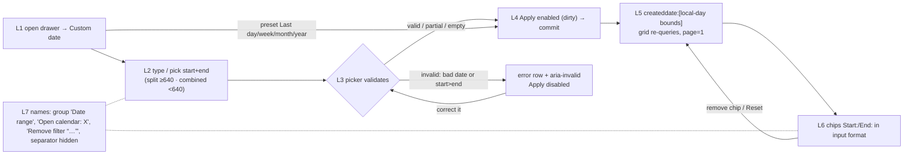
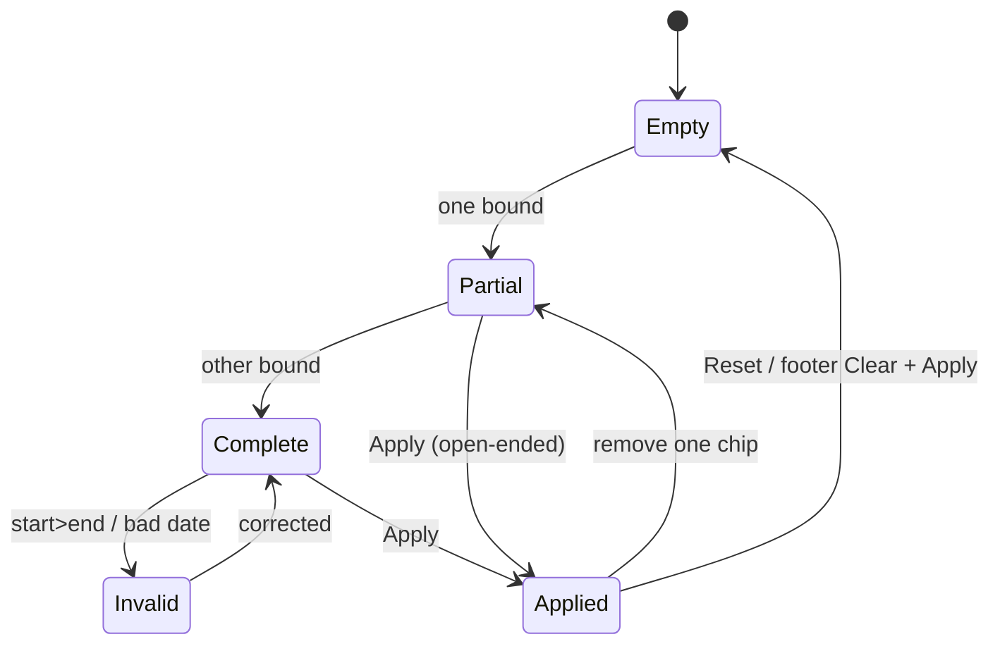

# TEST MODEL — VCST-6001 `[Sales Rep] Adopt VcDateRangePicker in the customer-orders filter`

- **Ticket:** VCST-6001 | Type: Story | Status role: testable | Flow: `feature-test` | Priority: P2 (Medium) | Path: **FULL** (§5b: reach unestablished at 1a, then exceeded the diff — ui-kit primitives `VcInput`/`VcDatePicker`/`VcDateRangePicker` are shared) | Changed: Frontend | Shape class: not `ui-kit` (fails closed; the subject is a sales-rep surface, kit change is additive)
- **Change surface:** VirtoCommerce/vc-frontend#2519 head `1d9bc6dc` (open). **Deployed:** vcptcore-qa theme `2.59.0-pr-2519-1d9b-1d9bc6dc` (live bundle + footer, 2026-10-06). Storybook `vcptcore-qa-storybook` built from the same PR (`vcinput--clear-button-aria-label` present). Contract: **n/a** (no GraphQL surface in the diff).
- **Context:** FULL — 1c `ba-system-analyzer` (source + live 1920/375) · 1d `ba-story-writer` Mode B · 1r REACHABLE.
- **Prior model:** `reports/ba/test-models/VCST-5097-2026-09-17.md` — its Part 0 (L1–L6 of the range component) is carried forward below; this ticket is its sales-rep column (#12–#17, #27–#29) made real.
- **Domain map:** `.claude/knowledge/domain/sales-rep.md` @ rev 3 (generated 2026-09-18, amended 2026-09-29) — PRESENT.
- **Mind map:** `.claude/knowledge/domain/sales-rep.mind-map.json` — nodes `sr.customer-orders.date-range`, `.filter-chips`, `.zero-match`, `.url-restore`, `.paging`. **Mind-map DRIFT:** no node carries the drawer's *validity → Apply gating* or the chip *accessible name*; proposed `sr.customer-orders.range-validity`, `sr.customer-orders.chip-a11y-name`.
- **Ticket signals:** no comments, no attachments, no parent Epic. Description measured on vcptcore-qa1 `2.58.0-pr-2402`. Links: VCST-5097 (picker, Done), VCST-6002 (clipping, Done, out of scope), VCST-5718 (name shape), VCST-5869 (dialog semantics, out of scope).
- **Domains:** Sales Rep (storefront customer orders) · UI kit (date pickers) · Accessibility. **Flows & boundaries:** filter drawer ↔ page `applyFilters` ↔ `salesRepCustomerOrders` · ui-kit ↔ storefront `/account/orders` (`date-filter-select.vue`).
- **Risk areas:** `VC-PLATFORM-005` (dates in UTC shift a day) · KB-17E74050 (`/account/orders` presets shift a day east of UTC) · VCST-5717 (popover retains unapplied values) · VCST-5213 (back-nav restore ABSENT) · suites 014/014b select `aria-label='Open calendar'` exactly.

## AC traceability (from 1d; impl verdicts are static until 5-verdict)

| # | Atomic condition | Origin | Impl verdict |
|---|---|---|---|
| C1 | Filter renders ONE VcDateRangePicker (no two VcDatePicker) | AC1 | SATISFIED (1r/1c live) |
| C2 | Exposed as `group "Date range"` in split AND combined | AC1 | SATISFIED live both |
| C3 | Inputs carry `aria-haspopup="dialog"` | AC1 | SATISFIED source; confirm live |
| C4 | `aria-invalid` flips true on an invalid range and back to false | AC1 | UNVERIFIED |
| C5 | <640 px combined single field labelled "Date range"; ≥640 split | AC2 | SATISFIED live 375/1920; 639/640 untested |
| C6 | Clearable: "preserved" — dev never had in-field clear; clearing = calendar footer. Decision recorded in the TICKET | AC3 | **DRIFT** — ticket premise wrong; decision lives only in the PR body |
| C7 | Separator not in the accessibility tree | AC4 | source `aria-hidden="true"`; snapshot ambiguous → DOM probe |
| C8 | Chip date text == input text (format + padding), every locale | AC5 | SATISFIED source |
| C9 | Chip calendar day == picked day in a UTC− and a UTC+ browser | gap | source-safe; verify |
| C10 | Calendar buttons named "Open calendar: Start date/End date" (split) | AC6 | SATISFIED live |
| C11 | Chip close named "Remove filter “Start: …”", distinct per chip | AC6 | SATISFIED source |
| C12 | No "Clear" duplicates (no in-field clear on this surface) | AC6 | N/A by construction — stated |
| G1 | start > end: error shown, `aria-invalid`, Apply disabled, no request | gap | picker-owned now; verify |
| G2 | One-sided range (start only / end only) applies as open-ended | gap | `rangeValid` treats partial as valid; verify wire |
| G3 | Typed impossible date (02/31) → invalid, Apply disabled, applied filter unchanged | gap | verify |
| G4 | Custom(invalid) → preset → Custom: Apply state correct | gap (1c seam) | verify |
| G5 | Reset / chip-remove / preset interplay keeps picker, chips, grid consistent | gap | verify |
| G6 | Keyboard: Tab/Enter/arrows/Esc, focus returns, teleport keeps order | gap | verify |
| G7 | Storefront `/account/orders` range filter still works; split names contextual | reverse edge | verify |
| G8 | New locale keys render (no raw key) — `date_range`, `remove_filter`, `open_calendar_for`, `clear_field` | gap | verify en + one non-en |
| G9 | No layout shift when the error row appears (`show-empty-details`) | gap | verify (BL-UI-003) |

## Part 0 — VALUE CHAIN

Value chain (rep's words): **L1** open Filters and choose *Custom date* → **L2** type or pick a start and an end → **L3** the picker validates (format, order) and reports validity → **L4** Apply becomes available and commits the draft → **L5** the page sends `createddate:[local-day bounds]` and the grid re-queries → **L6** the active range is disclosed as two chips that read like the inputs and can each be removed → **L7** the rep (incl. keyboard/screen-reader users) can tell every control apart. Unlocks: trusted per-period review of served customers' orders.

**Chain position:** domain chain links 1–8 (`sales-rep.md` §2). This ticket touches **L5b only** (the membership-scoped customer-orders family — its filter UI). Within it, it owns **L1–L4, L6, L7**; **L5 (server range arithmetic, boundary days) is NOT changed** — BL-SR-001-style boundary inclusion stays SR-CO-008's, re-run only as the FLOW row. Does **not** touch provisioning (1–3), statistics/rankings (5a), documents (7), access removal (8), backend sorting/paging.

**Variants (union of branching layers):** layout `split`/`combined` (JS breakpoint `sm`=640) · route cross-customer `/company/customer-orders` vs customer-scoped `/company/my-customers/:org/orders` · input mode typed vs calendar · preset Custom vs Last-* (picker unmounted) · browser TZ UTC−/UTC+ · locale en vs non-en · theme light/dark · consumer sales-rep vs storefront `/account/orders` vs Storybook.

## Mechanism coverage matrix (axes from Part 0; scenarios mapped after)

| Variant ↓ / Link → | L1 open/preset | L2 enter | L3 validate | L4 Apply gate | L5 query | L6 chips | L7 names |
|---|---|---|---|---|---|---|---|
| split, cross-customer, en | #1 | #1 #4 | #5 #6 | #5 #7 | #1 | #1 #9 | #2 #3 |
| combined (<640) | #11 | #11 | #11 | #11 | WAIVED — same `applyFilters` | #11 | #11 #12 |
| customer-scoped route | #13 | #13 | WAIVED — same component instance | WAIVED — same | #13 | #13 | WAIVED — same |
| typed vs calendar | — | #4 (typed) #1 (calendar) | #6 | #6 | — | #4 | — |
| preset Last-* | #8 | WAIVED — no input | #8 (latch reset) | #8 | #8 | #8 | — |
| browser TZ UTC− / UTC+ | — | — | — | — | #10 | #10 | — |
| non-en locale | — | — | #14 | — | — | #14 | #14 |
| dark theme | — | — | #16 | — | — | — | #16 |
| keyboard only | #15 | #15 | #15 | #15 | — | #15 | #15 |
| storefront `/account/orders` | #17 | #17 | — | #17 | #17 | GAP — chips still `d()` (follow-up, PR body) | #17 |
| Storybook | — | — | — | — | — | — | #18 |

(`—` = the variant does not branch at that link; stated rather than blank.)

**Reverse edges:** remove a chip → that bound clears, grid re-queries once (#9, SR-CO-035) · Reset → picker emptied, chips gone, unfiltered grid (#9) · footer Clear → draft cleared, applied filter unchanged until Apply (#7) · Apply → browser Back restores range: **ABSENT IN PRODUCT**, VCST-5213 (not re-filed).
**Fixture lifecycle:** nothing terminal — read-only filtering on seeded orders (`AGENT-TEST-SRO-TZ-VCPTCORE-*`, ≥3 creation days). `data_surface: false`.

## Condition space & reduction

Factors: layout (2) × route (2) × input mode (2) × range shape {empty, start-only, end-only, valid, single-day, start>end, impossible date} (7) × preset {custom, last-*} (2) × TZ (3: UTC, UTC−, UTC+) × locale (2) × theme (2) × consumer (3) = **N ≈ 4,032**. Constraints: preset ⇒ no range shape/input mode; Storybook ⇒ no route/TZ/query.
**Reduction 4,032 → 18:** range-shape × layout collapsed (validation is the picker's, layout-independent) — split carries all shapes, combined one valid + one invalid; route collapsed to one FLOW pass (same component, same `applyFilters`); theme only on the error/focus colour rows (#16); TZ only on L5/L6 (#10); locale only on text-bearing rows (#14); consumer reduced to one storefront smoke + Storybook names (#17/#18).

## Test scenarios

| # | Cell | Defect hypothesis | Archetype | Technique | Oracle | P |
|---|---|---|---|---|---|---|
| 1 | L1→L7 split, cross-customer, calendar pick 3-day window spanning seeded days | the adopted picker commits the wrong bounds / grid unchanged / chips wrong | SILENT | FLOW | `{SPEC}` AC1+AC5 + `{OBSERVED}` count vs live-discovered orders in window | High |
| 2 | L7 split | group/`aria-haspopup`/`aria-invalid` missing in split (label undefined there) | RENDER | EP | `{SPEC}` AC1 · BL-A11Y-002 | High |
| 3 | L7 separator | `–` still exposed to AT | RENDER | EG | `{SPEC}` AC4 | Medium |
| 4 | L2 typed both bounds | typed value not mirrored into chip format (padding) | PARITY | EP | `{SPEC}` AC5 | High |
| 5 | L3/L4 start>end | old `invalid_range` removed but picker error not shown; Apply enabled → request with inverted bounds | BOUNDARY | DT | `{SPEC}` PR "range validity is the picker's own" · BL-A11Y-001 | High |
| 6 | L3 impossible date 02/31 / partial segments | mask accepts it; Apply enabled | BOUNDARY | BVA | `{SPEC}` picker validity | Medium |
| 7 | L4 one-sided + footer Clear | partial range blocked or sends `[X TO ]` wrongly; footer Clear applies immediately | LIFECYCLE | ST | `{OBSERVED}` → `{SPEC}` once PO confirms open-ended | Medium |
| 8 | L3/L4 Custom(invalid)→preset→Custom | stale `rangeValid` leaves Apply wrong | STALE | ST | `{SPEC}` PR comment on latch | Medium |
| 9 | L6 reverse edges | chip remove/Reset leaves picker and chips out of sync, or fires >1 request | PARITY | ST | `{BL}` BL-SR-012 + SR-CO-035 | Medium |
| 10 | L5/L6 TZ UTC−8 and UTC+3 | chip shows previous/next day vs picked; preset bounds shifted | BOUNDARY | EG | `{SPEC}` AC5 + `VC-PLATFORM-005` | High |
| 11 | combined @375 / 639 / 640 | combined label missing, two fields still stacked, draft lost on resize | RENDER | BVA | `{SPEC}` AC2 | High |
| 12 | L7 combined | the single "Open calendar" lacks the field context or chip names duplicate | RENDER | EP | BL-A11Y-002 | Low |
| 13 | customer-scoped route FLOW | route-specific wrapper still renders old pickers | PARITY | EP | `{SPEC}` AC1 | Medium |
| 14 | non-en locale (de/fi on vcptcore) | raw key `date_range`/`remove_filter`; chip ≠ input format | FALLBACK | EP | `{BL}` BL-SR-013 | Medium |
| 15 | keyboard walk | teleported calendar breaks tab order / focus not returned | RENDER | EG | `{BL}` BL-A11Y-001 | Medium |
| 16 | dark theme error/focus | error text / focus ring contrast <4.5/3:1; error row shifts layout | RENDER | EG | `{BL}` BL-A11Y-003 · BL-UI-003 | Low |
| 17 | storefront `/account/orders` | kit props regress the shipped range filter; names now contextual (014/014b selectors stale) | PARITY | CT | `{SPEC}` PR "visible to storefront users" | High |
| 18 | Storybook VcInput/VcDatePicker/VcDateRangePicker stories | new props absent / fallback names wrong | CONFIG | EP | `{SPEC}` PR ui-kit section | Low |

`{OBSERVED}` rows become oracles once the PO records the decision (#7 open-ended partial range; AC3 in the ticket).

## Sweeps (Step 2)

- **Probes carried in:** `VC-PLATFORM-005` → #10 · KB-17E74050 (preset day-shift east of UTC) → #10 · VCST-5717 (popover retains unapplied) → #7 · VCST-5718 (identical names) → #2/#17 · VCST-6002 (clip) → #16 visual check at 1024–1280 (regression only, not re-filed) · other in-domain `VC-*` defect shapes: N/A — none on date filters (VC-SEARCH-003 is provider-level, out of surface).
- **Archetype sweep** (vc-bug-catalog vocabulary): SILENT #1 · RENDER #2/#3/#11/#12/#15/#16 · PARITY #4/#9/#13/#17 · BOUNDARY #5/#6/#10 · LIFECYCLE #7 · STALE #8 · FALLBACK #14 · CONFIG #18 · SCOPE: WAIVED — no permission/scope change (membership scope untouched, L5 not in the diff) · RACE: WAIVED — single request per Apply, SR-CO-035 covers chip-remove request count · REPLAY/MONEY: WAIVED — read-only filter, no money path.
- **UIP sweep:** UIP-INPUT #4/#6 · UIP-VIEW #11 · UIP-REFRESH/DEEP → SR-CO-014 (url-restore, re-run in C1 only if touched); malformed URL date → #10 note · UIP-BACK: ABSENT (VCST-5213) · UIP-TABS/EXPIRE/STORAGE/NET/DATA: WAIVED — filter is client state, no new storage/network path.
- **Part 0r:** omitted — one role variant (rep).
- **Business Rules:** BL-SR-012, BL-SR-013, BL-A11Y-001/002/003, BL-UI-003/004/006. **Edge cases:** none date-specific in the ECL (stated).
- **Docs grounding:** NEW behaviour (kit props, sales-rep surface) — ticket + PR + live are ground truth `{SPEC}`/`{OBSERVED}`; kb: KB-09CEE315, KB-F9D75EA0 (DISPUTED; split-names clause holds on this build), KB-17E74050.
- **Agents:** 4a `qa-frontend-expert` (playwright-chrome) · 4v `ui-ux-expert` (Chrome DevTools, sales-rep page + Storybook) · 3x `/qa-exploratory ticket` (playwright-firefox).

## Amendment — 3x discovery (2026-10-06, `reports/exploratory/SBTM-VCST-6001-2026-10-06.md`)

- **C3 split per layout:** split → `aria-haspopup="dialog"` on both inputs; combined → on the single "Open calendar" button, not the inputs. `{OBSERVED}`.
- **C4 grounded:** `aria-invalid` false/false at rest, true/true on any invalid range (both inputs, even an empty sibling); shared `aria-describedby` details row. Start>end text "End date must be on or after start date"; 02/31 → "Invalid date format". `{OBSERVED}`.
- **C6/AC3 grounded:** no in-field clear in either layout; footer Clear empties ONLY the field whose calendar is open, sends nothing until Apply. `{OBSERVED}`.
- **C7 grounded:** separator `aria-hidden="true"` (DOM) in both layouts — an a11y snapshot printing "–" is NOT evidence either way.
- **#7 grounded:** partial ranges apply open-ended — `createddate:["<start>T21:00Z" TO]` / `[TO "<end>T20:59:59.999Z"]` (UTC+3); Apply enables on blur, not per keystroke. Oracle stays `{OBSERVED}` until the PO records open-ended as intended.
- **#8 grounded:** no stale latch; Custom→preset→Custom yields an empty picker (previous applied bound dropped from the draft).
- **#10:** UTC+3 correct for custom and sales-rep presets (rolling window). UTC− NOT REACHED. `/account/orders` Last week window differs (KB-17E74050, pre-existing, other code path).
- **#11 grounded:** 639 combined / 640 split; committed draft survives the switch, half-typed text does not (Low, DECLINE).
- **Matrix cell added — L6 reverse edge × preset:** removing one chip of an APPLIED PRESET leaves the drawer claiming the preset while the grid is open-ended → scenario **#19** (`STALE`, oracle `{HYPOTHESIS}` drawer/grid agreement — no BL covers it; PROPOSED invariant for `/qa-review-oracles`). Already asserted by existing **SR-CO-034** (EXPECTED-RED, predates PR #2519) ⇒ provenance PRE-EXISTING; no new row authored (2a).
- **#17 GAP confirmed live:** `/account/orders` chips `Start: 1/5/2026` vs input `01/05/2026`, close buttons both "Close chip" — PR follow-up, out of scope.
