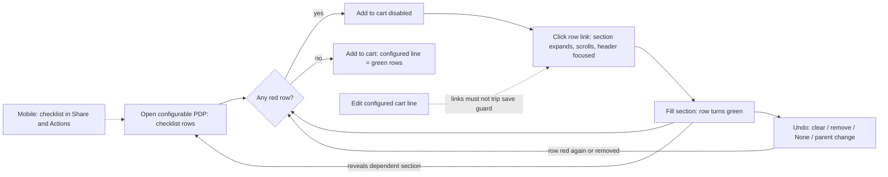
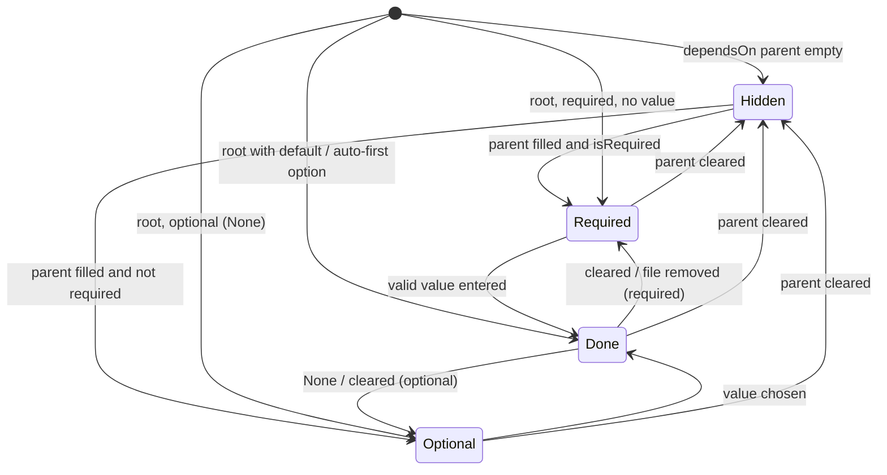

# TEST MODEL — VCST-6027

```
Ticket:      VCST-6027 | Type: Story | Status role: testable (Ready for test → Testing at 1a) | Flow: feature-test | Priority: P2 (Medium) | Path: FULL | Changed: Frontend
Context:     FULL — ba-system-analyzer (1c) + ba-story-writer Mode B (1d) + 1r REACHABLE (4 min) + VirtoOZ top-up (2-topup)
Prior model: none — first model for the configurable-product PDP surface (VCST-5735 touches identity/pricing at its fringe only)
Domain map:  .claude/knowledge/domain/configurable-products.md @ rev 1 (generated 2026-09-16) — PRESENT; §1 Purpose UNDECLARED (declared below)
Mind map:    .claude/knowledge/domain/configurable-products.mind-map.json — touches cat.cfg.pdp, cat.cfg.pdp.none-option,
             cat.cfg.pdp.default-preselected, cat.cfg.pdp.conditional-reveal, cat.cfg.required-gate(.all-filled/.one-missing/
             .optional-empty), cat.cfg.file.accepted, cat.cfg.file.rejected-type, cat.cfg.cart-line (journey far side only).
             Mind-map DRIFT: no node carries the checklist / section-navigation mechanism (new behaviour, see unmapped surfaces).
Chain position: Domain chain L1–L8. This ticket TOUCHES L2 (buyer sees sections), L3 (fills; dependent sections), L4 (required
             sections gate purchase) — and crosses into L5 only as the journey's far-side observation (configured cart line).
             It does NOT touch L1 (Admin authoring), L6 (line identity strips files), L7 (order/quote carry), L8 (file access scope).
Affected surface: vc-frontend PR #2527 @ d08928e7 (storefront only, no backend/xAPI change) — NEW product-configuration-checklist.vue,
             NEW composables/useConfigurationSectionNavigation.ts, product-configuration.vue (section ids, collapsedSections,
             nav listener → expand + scrollIntoView + focus header), product-price-block.vue (mounts checklist; mobile → "Share &
             Actions"), 13 locales. Map §3 enumerates the PDP section accordion + Add to cart; it is MISSING the checklist, the
             section-navigation bus, per-section collapse state and the mobile host (→ domain_map.unmapped_surfaces[]).
Ticket signals: no comments. Attachment (opened) = mockup: checklist BELOW Add to cart; ✓ "Layers — Top: Chocolate / Bottom:
             Chocolate" (value wraps); red Text/"Fill it in", Photo/"Upload a file", Filling/"Check it out"; ONE GROUPED yellow row
             "3 optional options not set — Icing, Decoration, Message." + one Review → contradicts description "NOT grouped". Live
             (1c, 1r): one row per optional section ⇒ mockup stale on grouping (description is the oracle). Figma 828-2971 not opened.
Epic context: none (no parent Epic).
Domains:     Catalog / configurable products (BL-CAT), UI (BL-UI), Accessibility (BL-A11Y — loaded at Step 2, visual_surface)
Flows & boundaries: PDP configuration accordion ↔ checklist (shared composable state) ↔ Add to cart gate ↔ cart line (addItem
             configurationSections) ↔ edit-configured-cart-line route guard (SaveChangesModal) ↔ mobile Share & Actions widget
Risk areas:  checklist and button read DIFFERENT predicates (selectedOptionTextValue vs isRequiredConfigurationComplete — 1c H2);
             first-paint window: all rows green while button disabled (1c, seen once); required Product auto-first-option ⇒
             "Check it out" may be unreachable (H5); optional Text of whitespace shows green (H1); checklist bound to a non-reactive
             productId (H4); collapse state never reset; stale fixture CFG_WEDDING_CAKE_CONDITIONS slug 404 (VC-CFG-003 shape).
AC traceability: 6 story ACs (AC-1, 1.1, 2.1, 2.2, 2.3, 3, 3.1) → 12 conditions + 15 gap-ACs = 27 (1d C-01..C-27). Impl: AC-1 DRIFT
             (Text/File done = name only) · AC-2.1/2.2 DRIFT on link target (header focused, not the control) · AC-3 SATISFIED vs
             text / CONTRADICTS mockup · AC-3.1 DRIFT (optional Text/File done = name only) · statement "why Add to cart is disabled"
             NOT-FOUND as wiring (existing gate, unchanged).
DoD:         none declared (1d proposed one; items confirmed at 5-verdict).
```

## Part 0 — Value chain

**Purpose (declared here — map §1 was UNDECLARED):** a configurable product can only be bought once every *required* section
has a value; the checklist exists so the buyer can **see, at the purchase control, what still blocks purchase and get to it in
one click**, and so that optional choices are visible but never read as blockers. Source: {SPEC} VCST-6027 statement + {DOC}
platform user guide "Manage Product Configurations" (required ⇒ must select; non-required ⇒ None; default preselected).

| Link | In the buyer's words | Mechanism |
|---|---|---|
| C1 | I open a configurable product and the Price-and-delivery box lists every part I can configure, each marked done / required / optional | checklist rows = visible sections in config order; status = done (has value) · required · optional |
| C2 | A red row tells me why "Add to cart" is disabled; when none is red the button works | `BL-CAT-006` gate (existing) vs the row status (new) — two predicates over one state |
| C3 | I click "Fill it in" / "Upload a file" / "Check it out" / "Review" and land on that part, opened | event bus → expand + scroll + focus section header; URL unchanged (edit-line guard not fired) |
| C4 | I fill it and the row turns green, showing what I chose | Product: `{name} — {value}`; Text/File: name only (PR) vs `{name} - {value}` (AC-1/3.1); clamp 2 lines |
| C5 | If I undo a choice (clear text, remove file, pick None, change a parent) the row goes back — or disappears — and the button follows | reverse transitions; `dependsOnSectionId` hides child rows |
| C6 | With no red rows I add to cart and the line carries exactly what the green rows said | addItem `configurationSections` → configured cart line (domain L5) |




No `sequenceDiagram`: the chain is single-layer and synchronous on the client (no backend change, no async job).

**Variants** (union of the layers that branch: the checklist branches on status × type; `useConfigurableProduct` on
default / auto-first / whitespace / None; `product-configuration` on visibility and edit-line mode; the price block on
viewport and `isConfigurable`):
R1 Product·required (default or auto-first preselected) · R2 Product·required·dependent (revealed later) · R3 Product·optional
(None) · R4 Text·required · R5 Text·optional · R6 File·required · R7 File·optional · R8 dependent visibility (any type) ·
R9 edit-configured-cart-line mode · R10 mobile viewport · R11 locale / long label · R12 OFF — non-configurable PDP ·
R13 duplicate section names. Single actor (Buyer); anonymous vs signed-in is a session variant with no branch in the diff
(1r: identical) ⇒ **Part 0r not required** (clause 12 passes silently).

**Mechanism coverage matrix** (axes from Part 0; scenarios mapped in afterwards)

| Variant \ Link | C1 render/status | C2 row⇔button | C3 link nav | C4 done label | C5 reverse | C6 add to cart |
|---|---|---|---|---|---|---|
| R1 Product req preselected | #6 | #7, #8 | WAIVED — a done row carries no link {SPEC} | #6 | WAIVED — required has no None {DOC} | #1 |
| R2 Product req dependent | #5 | #7 | #5 | #5 | #17 | #7 |
| R3 Product optional | #12 | #7 | #9 | #12 | #12 | #7 |
| R4 Text req | #3 | #13 | #9 | #11 | #13, #14, #15 | #1 |
| R5 Text optional | #18 | WAIVED — optional never gates (#7 asserts it) | #18 | #11 | #14 | WAIVED — never gates |
| R6 File req | #4 | #16 | #9 | #11 | #16 | #1 |
| R7 File optional | #18 | WAIVED — never gates | #18 | #11 | GAP — remove optional file → back to optional (3x charter) | WAIVED — never gates |
| R8 dependent visibility | #2, #17 | #17 | GAP — link to a just-revealed row (3x charter) | #17 | #17 | #17 |
| R9 edit cart line | #10 | GAP — button is "Update" in edit mode? (3x charter) | #10 | #10 | GAP — clear in edit mode (3x) | #10 |
| R10 mobile | #21 | #21 | #21 | WAIVED — label derivation viewport-independent | WAIVED — same component | #21 |
| R11 locale / long label | #24 | WAIVED — no locale branch in gate | WAIVED — no locale branch | #20 | WAIVED | WAIVED |
| R12 OFF non-configurable | #23 | WAIVED — no checklist | WAIVED | WAIVED | WAIVED | WAIVED — unchanged path |
| R13 duplicate names | #19 | WAIVED — gate keyed by section id | #19 | #19 | #19 | WAIVED |
Cross-cutting rows mapped onto every C1/C3 cell they stress: #22 (a11y of status + links), #25 (stale state after SPA nav),
#26 ("or any other btn").

**Reverse edges** (forward effect = entitlement to purchase / a row marked done):
fill required Text → clear → red + button disabled: #13 · upload required File → remove → red + disabled: #16 (1c observed
baseline) · choose optional parent → required child appears → parent None → child row gone + button re-enabled: #17 · optional
Product → None → back to optional: #12 · optional Text cleared / whitespace: #14 · optional File removed: **GAP → 3x** ·
required Product cleared: **N/A by design** ({DOC}: required sections offer no None) · collapse a section the link opened →
link re-opens it: #9.
**Fixture lifecycle:** no terminal state. #10 needs a configured cart line — created in the case, deleted in Cleanup (FIFTH
RULE: a user cart is mutable by the environment). Uploaded files are orphaned (no detach path, map L8) — accepted.

## Parts 1–5 — Fault model

**Condition space:** F1 section type {Product, Text, File} · F2 {required, optional} · F3 fill {empty/None, valid, invalid
(whitespace, > maxLength, rejected file type)} · F4 visibility {root, dependent-revealed, dependent-hidden} · F5 preselection
{none, default, auto-first} · F6 mode {new, edit cart line} · F7 viewport {desktop, mobile} · F8 locale {en, de} · F9 label
length {≤2 lines, >2 lines} · F10 session {anonymous, signed-in}. Constraints: F5≠none only for Product; F3=whitespace/
over-max only for Text, rejected-type only for File; required Product has no None (F3=empty unreachable unless F4=dependent);
F4 hidden ⇒ no row. **Raw N = 3·2·3·3·3·2·2·2·2·2 = 5,184.**

**Reduction (5,184 → 26):** the status/label derivation is a decision table over F1×F2×F3 (18 cells, 4 infeasible ⇒ 14,
#3–#7, #11–#16). F4 collapses into three state-transition rows (#2, #5, #17) because visibility only gates whether a row
exists. F5 collapses to #6 (default/auto-first ⇒ green on load) and #5 (dependent required Product — the only way to see
"Check it out"). F6 interacts only with C3's route guard ⇒ one row (#10). F7 interacts only with placement and target size
⇒ #21 + the visual lane. F8 and F9 interact only with label text ⇒ #20, #24. **F10 dropped**: the diff has no session
branch and 1r observed identical rendering; the journey runs signed-in and the anonymous baseline is recorded. t=2 default;
t=3 only on F1×F2×F3 (revenue gate).

| # | Cell (factor values) | Defect hypothesis | Archetype | Technique | Oracle | P |
|---|---|---|---|---|---|---|
| 1 | JOURNEY — @td(CFG_CHECKLIST_ALLTYPES) (3a; fallback CFG-023 chain): open PDP → read every row → button disabled → each link → fill each required → dependent rows appear → all green → Add to cart → cart line shows the green-row values | a link of the chain is broken so the buyer cannot tell what blocks purchase, or the line differs from what the rows claimed | PARITY | FLOW | {SPEC} AC-1..3 + {BL-CAT-006} | Critical |
| 2 | F4 root+hidden, CFG-028 deep chain, on load | hidden dependent sections leak as rows, or rows ignore Admin order | FALLBACK | ST | {DOC} order = Admin drag order; visibility {HYPOTHESIS} → ground at 3x / PO | High |
| 3 | Text·req·empty, CFG-024 | wrong action ("Check it out") or missing "— required" for Text | PARITY | EP | {SPEC} AC-2.1 | High |
| 4 | File·req·empty, CFG-026 / CFG-025 | File treated as "other" → wrong link text | PARITY | EP | {SPEC} AC-2.2 | High |
| 5 | Product·req·dependent, CFG-029 (Add Extras → Extra Type) and CFG-027 | auto-first-option fires on reveal ⇒ "Check it out" never shown (AC-2.3 unreachable), or row green while nothing is selected | FALLBACK | ST | {SPEC} AC-2.3 + {DOC} required ⇒ must select | High |
| 6 | Product·req·default/auto-first, CFG-030 (Carbon default), CFG-026 | preselected option rendered as required, or green without the value text | FALLBACK | EP | {DOC} default preselected + {SPEC} AC-1 | Medium |
| 7 | DT {no req / some req red / all req done} × {optional empty / set}, CFG-027 A=None/Bundle, B, C | button enabled while a red row exists, or disabled with no red row — the two predicates diverge | PARITY | DT | {BL-CAT-006} | Critical |
| 8 | first paint + throttled network reload, CFG-023 / CFG-026 | during hydration rows show all-green/optional while button is disabled (seen once by 1c) — the exact complaint the story fixes | RACE | EG | {SPEC} statement + {BL-CAT-006} | High |
| 9 | each link type; section first collapsed manually | collapsed section not expanded, wrong section scrolled, focus lost; URL hash changes | RENDER | ST | {SPEC} "anchor to the option"; focus target {HYPOTHESIS} (AC says option, PR focuses header) → PO decision | High |
| 10 | R9 edit configured cart line (line created in case) | link click fires SaveChangesModal / changes URL; checklist not prefilled from the line | LIFECYCLE | EG | {HYPOTHESIS} (ticket silent) → existing save-guard behaviour as baseline; PO confirms | High |
| 11 | done label DT type × required: Product, Text req, File req, Text opt (CFG-025 Notes), File opt (CFG-023 Image) | label rule inconsistent with ACs; optional Text/File show name only although AC-3.1 says `{name} - {value}` | PARITY | DT | {SPEC} AC-1, AC-2.1/2.2, AC-3.1 (kept SPEC — rule 3) | Medium |
| 12 | Product·opt, CFG-024 Style Pack: choose → None | row stays green after None, or shows stale value | LIFECYCLE | ST | {SPEC} AC-3/3.1 | Medium |
| 13 | Text·req type → clear, CFG-024 | row stays green / button stays enabled after clearing | LIFECYCLE | ST | {BL-CAT-006} + {SPEC} AC-2.1 | High |
| 14 | Text whitespace: req (CFG-024) and opt (CFG-025 Notes) | whitespace counts as done → green + enabled (req), or green "done" for an empty optional (1c H1) | BOUNDARY | BVA | {BL-CAT-006} (blank is not a selection); opt {HYPOTHESIS} → PO | Medium |
| 15 | Text over maxLength (CFG-024 max 60 → 61 chars custom) | invalid text marks row green while the add is rejected | BOUNDARY | BVA | {BL-CAT-006} + VC-CFG-001 | Medium |
| 16 | File req: upload → remove; rejected type (.exe) | row green after remove or after a rejected upload | LIFECYCLE | ST | {BL-CAT-006}; rejected-type {DOC} map cat.cfg.file.rejected-type | High |
| 17 | dependent chain CFG-023: Creme → Message → required Text appears → Creme None | new required row not added / button not re-disabled; hidden child rows linger; stale hidden value counted | PARITY | ST | {BL-CAT-006} + {SPEC} AC-2 | Critical |
| 18 | ≥2 optional sections unset, CFG-023 with Message chosen (Image + others) | optional rows grouped (mockup) or one Review link for all | PARITY | EP | {SPEC} AC-3 "NOT grouped" | Medium |
| 19 | R13 CFG-033 two sections named "Finish" | rows keyed by label collapse; link opens the wrong "Finish"; filling one flips both | PARITY | EG | {SPEC} AC-1 (one row per option) | Medium |
| 20 | long label > 2 lines (FIXTURE-GAP → 3a) + de locale | label overflows the widget / not clamped / full text unreachable | BOUNDARY | BVA | {SPEC} AC-1.1 + {BL-UI-004} | Medium |
| 21 | 375 px, CFG-024 | checklist missing on mobile, links don't scroll, sticky Add to cart disagrees with rows, targets too small | RENDER | EP | {BL-UI-006}; placement {HYPOTHESIS} (PR claim) → PO | Medium |
| 22 | screen reader + keyboard on rows/links | status conveyed by colour only; link names lack the section; focus invisible after nav | RENDER | EG | {BL-A11Y} (Step 2) | Medium |
| 23 | R12 simple product + variations product PDP | checklist rendered (empty box) or price block shifted for non-configurable products | CONFIG | EP | {SPEC} scope "when customizing" + {BL-UI-003} | Medium |
| 24 | de / ja locale | raw i18n keys or untranslated strings in rows/links | MONEY | EP | {HYPOTHESIS} (ticket silent) → locale files are the spec | Low |
| 25 | SPA nav CFG-024 → CFG-025 (search / back-forward) | checklist reads the previous product's state (non-reactive productId, H4); collapse state carried over | STALE | EG | {SPEC} AC-1 (rows = this product's options) | High |
| 26 | other PDP actions (Add to list / compare / quote) while a row is red | "or any other btn" inconsistent with the checklist explanation | PARITY | EG | {HYPOTHESIS} — ticket names it, never defines it → PO | Low |

**Probes carried in:** VC-CFG-001 → #15 · VC-CFG-002 (null maxLength) → #15 precondition: read live maxLength first ·
VC-CFG-003 (alias slug 404) → **live: CFG_WEDDING_CAKE_CONDITIONS slug 404 (1r)** → test-data defect for Artifact A `2a` ·
VC-CFG-004 → N/A (REST authoring, not touched) · flex/overflow long-token probe → #20.
**Archetype sweep:** PARITY #1 #3 #4 #7 #11 #17 #18 #19 #26 · FALLBACK #2 #5 #6 · LIFECYCLE #10 #12 #13 #16 · BOUNDARY #14
#15 #20 · RENDER #9 #21 #22 · RACE #8 · STALE #25 · CONFIG #23 · MONEY (i18n) #24 · SILENT — covered by #1's far-side
cart-line read · SCOPE WAIVED (single actor, no permission gate in the diff) · REPLAY WAIVED (no write path changed).
**UIP sweep:** BACK #25 · REFRESH #8 · NET #8 · INPUT #14 #15 · VIEW #21 · DATA #19 #20 · DEEP **GAP → 3x** (open a PDP with
`#product-configuration-section-<id>` in the URL) · TABS WAIVED (no cross-tab state) · EXPIRE WAIVED (no session-bound
state) · STORAGE WAIVED (configuration state not persisted).
**Business Rules:** BL-CAT-006 (SUSPECT — this ticket is a human source for its disabled-button clause; live 1c CONFIRMED
button disabled on PDP; "Customize" is the listing-card control) · BL-UI-001/003/004/006 · BL-A11Y-001..004 (Step 2).
**Edge cases:** ECL 7.2 · 7.3 · 7.4 · 8.1 · 15.1.
**Docs grounding:** platform/user-guide/catalog/managing-product-configurations (required ⇒ must select; None for
non-required; default; drag order = frontend order) · storefront/user-guide/shopping/products-purchase-options (Customize,
required, None, default, editable after add). No doc covers the checklist — NEW feature ⇒ {SPEC}/{OBSERVED}.
**kb:** KB-F78ED1CC (PDP has a real Add to cart — agrees), KB-0C163966 (no button, 1 MB — disagrees on this stand),
KB-057A596A (file allowlist 9.5 MB / 5 files); checklist: none (1r recorded kb_none).
**FIXTURE-GAP (→ 3a):** CFG_CHECKLIST_ALLTYPES — one configurable product modelled on the mockup: Layers (Product, req, no
default, one option name ≥ 90 chars) · Text (Text, req) · Photo (File, req) · Filling (Product, req, dependsOn Layers) ·
Icing / Decoration (Product, opt) · Message (Text, opt) · a ≥ 70-char section name (File, opt). Needed by #1 and #20.
**Agents to dispatch:** 3x `/qa-exploratory ticket VCST-6027` · 3a test-data-engineer · 4a qa-frontend-expert ·
4v ui-ux-expert · A test-management-specialist.

## 3x discovery amendments (2026-10-06, `reports/exploratory/SBTM-VCST-6027-2026-10-06.md`)
- **#8 → {OBSERVED} defect shape, widened:** the rows-green / button-disabled window is not only first paint — it reopens
  after EVERY forward edit (~~5–16 s~~ **REFUTED 5-triage: in-page timer ~0.5 s after the last keystroke, 1920/375, un-throttled, single-session — the 5–16 s was snapshot-polling latency**; edit mode "Update cart" too). Oracle stays {SPEC} statement + BL-CAT-006 converse. New
  row **#27** (P1): all rows green ⇒ button enabled within a bounded time, in new and edit mode.
- **#5 → {OBSERVED}:** "Check it out" IS reachable — dependent required Product sections reveal red, no auto-preselect
  (CFG-029, CFG-027); root required Product sections arrive preselected (green on load).
- **#9 → {OBSERVED}:** header focused, section expanded, URL unchanged; header-vs-control stays a PO decision.
- **#10, R9 GAPs closed:** edit mode button = "Update cart", gates like Add to cart; links never fire SaveChangesModal (the
  guard exists — "Create new configuration" fires it); clear ⇒ red + disabled. R9×C2 → #10, R9×C5 → #10.
- **R7×C5 closed → #16** (optional file removed ⇒ "— optional" + Review) · **R8×C3 closed → #17** (just-revealed row's link works).
- **#14 + new row #28:** whitespace in a required PARENT Text keeps the row red but REVEALS the dependent child section/row
  (visibility predicate ≠ gate predicate). Optional whitespace Notes — not reached, stays {HYPOTHESIS}.
- **#15 downgraded:** input truncates at maxLength (60/60) — over-max not reachable via UI; keep only as a paste check, Low.
- **#21 → {OBSERVED}:** mobile host "Share & Actions", sticky bottom Add to cart elsewhere; link hit box 40×14 px (BL-UI-006 suspect).
- **#24 → {OBSERVED} clean (de).** **#26 → {OBSERVED}:** Add to list / Compare / Share / Print stay enabled with a red row.
- **UIP-DEEP → {OBSERVED}:** hash scrolls + focuses but does not expand — PO question, no row. **#25:** back-nav resets
  correctly; SPA hop to another configurable PDP NOT REACHED (lane stall). **#19 → {OBSERVED}:** duplicate "Finish" rows separate.
- **AC-1/3.1 DRIFT confirmed live:** Text/File done rows (required AND optional) show the name only; Product rows `name — value` (em dash).
- **New condition:** legacy per-section prompt "Complete all required options to finalize your selection" still renders
  beside the checklist (duplicate messaging — PO ruling).
- **Fixture:** CSV notes carry stale section ids (CFG-024 A, CFG-026 B differ live) — ids must be live-discovered.
