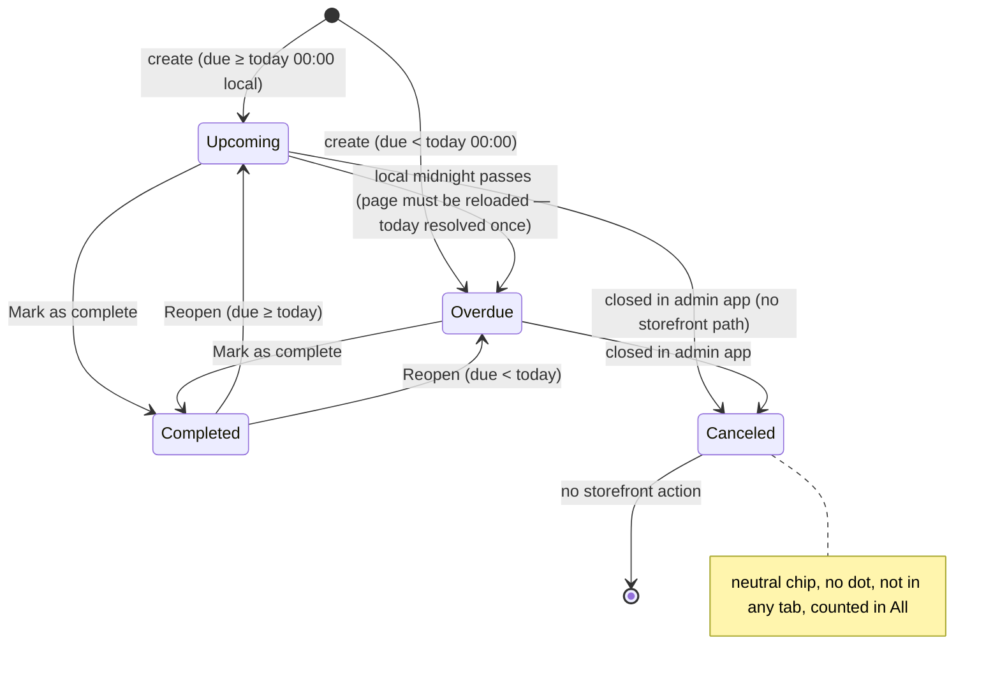

# TEST MODEL — VCST-6077

Ticket:      VCST-6077 | Type: Story | Status role: testable | Flow: feature-test | Priority: P2 (Medium) | Path: **FULL** (1a: reach > diff — `layout-surface`, `SalesRepRuleChips`, `VcCalendar` are shared; 1b confirmed) | Changed: Frontend only (`vc-frontend` PR #2536, 46 files; backend untouched)
Context:     FULL — `ba-system-analyzer` (1c, live, `playwright-firefox`) · `ba-story-writer` Mode B (1d) · `1r` REACHABLE (1.5 min)
Env:         `http://localhost` = theme **2.59.0-pr-2536-c2de-c2de2cd2** (footer read live) reverse-proxied to the **vcst-qa** backend (SalesRep 3.1012.0 · TaskManagement 3.1005.0 · Customer 3.1029.0 · Xapi 3.1026.0). vcst-qa's own storefront still serves alpha.2548 (old Calendar) — PR #2536 is deployed nowhere shared. Data + seeding run under `TEST_ENV=vcst`.
Prior model: `reports/ba/test-models/VCST-5732-2026-09-17.md` (rev 1 + rev 2) — **Part 0 carried forward** (L-T1…L-T6, V1–V6, reverse edges, fixture lifecycle). Corrections below are DRIFT against it, not a re-derivation.
Domain map:  `.claude/knowledge/domain/sales-rep.md` @ rev 3 (generated 2026-09-18, amended 2026-09-29) — PRESENT. §3i (Calendar) is now DRIFT: route/H1/header/chip row all changed.
Mind map:    `.claude/knowledge/domain/sales-rep.mind-map.json` — nodes `sr.tasks`, `sr.tasks.calendar-tabs`, `sr.tasks.past-due-accepted`, `sr.tasks.nav-visibility` (UNVERIFIED → refuted for 0 tasks), `sr.tasks.api-version` (UNVERIFIED). **Mind-map DRIFT:** no node for scope chips / date-chip close rule / All arithmetic / canceled-no-action; `sr.tasks` still names `/company/calendar`.
Chain position: Sales Rep domain chain L1 (user becomes rep) → L2 (rep↔org) → L3 (store enables hub) → L4 (served-org scoping) → L5 (rep-facing hub surfaces) → Tasks branch L-T1…L-T6. **Touches** L5's Tasks page + dashboard Tasks widget + the shared hub chrome (rule chips, rail), and L-T1, L-T3, L-T3s (new), L-T4, L-T5, L-T6. **Does not touch** L1–L4, L-T2's server contract (create unchanged), the Documents library content, buyer-facing `/company/sales-reps`, the Admin embedded app.
Affected surface: `/company/tasks` (was `/company/calendar`, §3i) · `/company/dashboard` Tasks widget + "My recent orders"/Top sellers rule chips (§3b) · customer-profile rail (§3c) · `/company/documents`, `/company/my-customers` rule chips · customer-orders date-range picker (`VcCalendar`, VCST-6001). **Map MISSING:** scope chips + date chip, row-action column, Edit-task-via-title, `?filter=` deep link, empty-state pair, mobile card layout (→ 5-docs-map).
Ticket signals: no comments. Attachment `Tasks · Desktop 1440.jpg` (opened): chips `Today 8 · All 29 · Upcoming 15 · Overdue 5 · Completed 9` (15+5+9=29), dated list header "May 28, 2026 / 12 of 12 tasks", Task·Status·Notes·Actions, completed titles **struck + greyed**, "DUE DATES" rail. PR #2536 delivers more than the ticket: route rename w/o redirect, header Today removed, scope chips + date chip, canceled = no action, counts aliases `currentDay`/`all`, rail 24→22rem, `VcCalendar` tokens, 13 locales. Known issues declared: VCST-6133 (action margin), VCST-6134 (link titles <4.5:1 on hovered row, red/coffee dark), month ellipsis es/pt/ru.
Epic context: VCST-5142 "Sales Rep Hub" (In progress). Done siblings = dashboard layout (VCST-5317), customer orders date range (VCST-6001), Tasks feature (VCST-5732) — their seams are the reach rows #24–#26.
Domains:     Sales Rep (`sr`), UI kit (`VcCalendar`), Task Management (backend, unchanged)
Flows & boundaries: rep auth ↔ `/graphql` task ops (storefront issues them on `/graphql`, not `/graphql/sales-rep` — 1c live) · scope selection ↔ counts query · task status (server filter rules ↔ client `taskStatus`) · calendar markers ↔ list
Risk areas:  client/server classification disagreement (canceled, dateless) · counts staleness (resolved once per page, refetch only after a write) · date-chip state machine · timezone day window · shared-component reach · `{SPEC}` vs build drift (rail width, completed colour, chip variant)
AC traceability: 1d — **35 atomic conditions** A1–A35 (16 ticket/mockup + 19 gap-ACs). DRIFT: A3 chip variant, A5 alignment (ticket stale; build = mockup), A11 rail 272 vs 280 px, A14 completed colour. NOT-FOUND: M4 dated header. No CONTRADICTS.
DoD: none declared — 1d's proposed minimal DoD confirmed at 5-verdict.

---

## Part 0 — VALUE CHAIN (carried from VCST-5732; this ticket's slice marked ▲)

**In the rep's words:** *"I open Tasks, see what is due today and what has slipped, switch between today / a day / everything / a status, tick a task off or reopen it from its row, and the calendar shows which days are heavy."*

| # | Link | Mechanism | ▲ |
|---|---|---|---|
| L-T1 | **The Tasks surface is there** | nav item `sales-rep-tasks` → `/company/tasks`; gated on sales-rep permission + SalesRep.Enabled (`BL-SR-011`) + TaskManagement installed. Dashboard widget link "All tasks". Old route → 404 | ▲ renamed |
| L-T2 | **Rep creates a task** | New task modal → `createSalesRepTask`; `defaultDay` = selected day | unchanged (default day now follows the date chip) |
| L-T3 | **Task is classified** | server filter rules `upcoming`/`overdue`/`completed`; client `taskStatus()` adds `canceled` (`!isActive ∧ completed≠true`); dateless ⇒ client "upcoming" but in **no** dated tab | ▲ chip recipe; canceled rendering |
| **L-T3s** | **Rep chooses which slice they see** (new link) | Today = `period` (local day window, completed included) · picked day = `period` + date chip · All = no filter, no period · tab = `filter` + `today`. Counts: one `SalesRepTaskCounts` request (`currentDay`, `all`, `upcoming`, `overdue`, `completed`), `today` resolved once per page, refetched only after a write | ▲ **new** |
| L-T4 | **Rep reads / edits a task** | title `<button>` → Edit task modal → `updateSalesRepTask`; in day view a re-dated task makes the page follow it | ▲ restyled |
| L-T5 | **Rep completes / reopens** | row action (was checkbox) → `changeSalesRepTaskStatus(id, completed)` → `refreshAll()` (list, counts, markers) | ▲ new control |
| L-T6 | **Calendar shows heavy days** | markers query (`first:200`, ~7-week grid window) → one dot per kind; canceled has no dot; picking a non-today day opens the date chip; no selection in All view | ▲ `sm` + tokens |
| R | **Shared chrome still works elsewhere** (reach) | `SalesRepRuleChips`/`sales-rep-rule-chip` (dashboard orders + top sellers, documents, my-customers) · `layout-surface` rail 22rem (dashboard, customer profile) · `VcCalendar` (customer-orders date-range picker) | ▲ reach |

```mermaid
flowchart TD
  A[Rep signs in] --> B{sales-rep perm + hub enabled + TaskManagement?}
  B -- no --> B1[No Tasks nav; /company/tasks blocked]
  B -- yes --> C[/company/tasks — Today scope]
  A2[old bookmark /company/calendar] --> X[404]
  C --> S{scope}
  S -->|Today| T1[period = local day; tab cleared; month = today]
  S -->|pick non-today day| T2[period = that day; date chip opens; ?filter cleared]
  S -->|All| T3[no filter, no period; no day selected]
  S -->|status tab| T4[filter + today; ?filter=…]
  T2 --> Z{× on chip}
  Z -->|its day on screen| T1
  Z -->|All / tab on screen| Z2[chip closes, view + month unchanged]
  T1 & T2 & T3 & T4 --> L[list rows: status chip + action]
  L -->|Mark as complete / Reopen| M[changeSalesRepTaskStatus]
  L -->|title| E[Edit task modal → updateSalesRepTask]
  L -->|New task| N[createSalesRepTask]
  M & E & N --> R[refreshAll: list + counts + markers]
  R --> S
```



**Variants** (rows — the union of the server filter rules and the client `taskStatus()`, which branch differently):

| Variant | Server tab | Client chip / action | Why a row |
|---|---|---|---|
| V1 Overdue (open, due < today 00:00) | overdue | Overdue · Mark as complete | own predicate |
| V2 Due today, open | upcoming (+Today scope) | Upcoming · Mark as complete | Today ⊂ Upcoming — must not leak into Overdue; 00:00 boundary |
| V3 Future, open | upcoming | Upcoming · Mark as complete | the only open variant outside Today — proves Today ⊂ Upcoming, not = |
| V4 Completed (past due) | completed | Completed · Reopen | reopen must land in Overdue |
| V5 Completed ∧ due today/future | completed (+Today if today) | Completed · Reopen | completion outranks date; Today includes completed |
| **V6 Canceled** (new) | **none** | Canceled (neutral) · **no action** | client-only status; in All **and Today/day view** (3x: `currentDay` has no status filter), never in a tab |
| **V7 Dateless** (new) | **none** | **"Upcoming"** chip **+ Mark as complete** | layers DISAGREE: chip + action say Upcoming, Upcoming tab omits it; sorts first in All |

### Mechanism coverage matrix — variants × links (axes derived from Part 0 above; scenarios mapped after)

| | L-T1 entry | L-T2 create | L-T3 classify | L-T3s scope/counts | L-T4 edit | L-T5 action | L-T6 calendar |
|---|---|---|---|---|---|---|---|
| V1 Overdue | 2 | 1 | 3 | 8 | 15 | 12 | 17 |
| V2 Today | 2 | 1 | 4 | 9, 10 | 15 | 1 | 17 |
| V3 Future | 2 | 1 | 4 | 8, 11 | 15 | 12 | 17, 18 |
| V4 Completed | 2 | WAIVED — no `completed` on create input | 5 | 8 | 15 | 13 | 17 |
| V5 Completed∧today | 2 | WAIVED — same | 5 | 9 | 15 | 13 | 17 |
| V6 Canceled | 2 | WAIVED — no storefront cancel; seeded via admin (3a) | 6 | 7, 31 | 28 (was GAP — resolved by 3x) | 6 | 6, 30 |
| V7 Dateless | 2 | WAIVED — create input makes `dueDate` non-null; admin-seeded (3a) | 7 | 7 | 16 | 12 | 7 (no dot) |

**Reverse edges**

| Forward effect | Reversed by | Covered |
|---|---|---|
| open → completed | Reopen (row action) | 13 |
| date chip opened | × (only close) | 11 |
| scope switch / tab | any other chip; Today also resets month | 10 |
| task re-dated | edit again | 15 |
| canceled | **ABSENT IN PRODUCT on the storefront** — no reopen; Edit keeps it canceled (3x confirmed). Finding-shaped absence, by PR design | 6, 28 |
| create → undo | **Delete in the Edit task modal** — CORRECTED by 3x (VCST-5732 said ABSENT) | 32 |

**Fixture lifecycle:** completion is reversible ⇒ no terminal state. Due dates are **wall-clock relative** (seeder `seed-sales-rep-tasks.mjs`, 14 tasks, groups 2/3/5/4) ⇒ **re-seed the same day as execution**; fixture is isolated **per rep account** (`SR_REP_PRIMARY`), not per suite. vcst has **0 tasks today** (1r/1c) — never seeded on vcst. **FIXTURE-GAP → 3a:** one **canceled** task + one **dateless** task (admin/TaskManagement path), a task due at exactly local 00:00 today, a task due 23:30 local today, and a task in a **non-visible month** (date-chip off-screen fallback).

---

## Parts 1–5 — FAULT MODEL

**Condition space**
- task variant → {V1…V7} (7)
- scope → {Today, picked day (today / non-today / off-screen month), All, tab ×3} (8)
- transition → {chip open, chip move, chip click-back, × on-screen, × off-screen, Today reset} (6)
- action → {complete, reopen, none} (3)
- viewport → {1440 desktop, lg card ≤1023, 375} (3)
- theme → {coffee light, coffee dark, red dark, others} (4)
- locale → {en, es/pt/ru (long), other} (3)
- browser TZ → {UTC+2 (lane default), UTC−5} (2)
- surface → {Tasks page, dashboard widget, reach R1/R2/R3} (5)
- Constraints: V4/V5/V6/V7 not creatable from the storefront; action=none ⇔ V6; × only exists after a non-today pick; Today scope ⊂ day-window.
- Raw cells **N = 7·8·6·3·3·4·3·2·5 = 362 880**

**Reduction** — DT on `variant × scope` (the only pair the classification predicate reads — 7×8 → 14 decisive cells: each variant in its own tab, in Today, and in All); ST on the date-chip/scope machine (6 transitions → 4 rows, covering every edge incl. both × fallbacks); BVA held at full resolution on `dueDate` vs local 00:00 and on browser TZ (the only factors the day-window reads). **Dropped:** `theme × locale × viewport` cross-product → collapsed to the visual lane's matrix (#19–#21; contrast is theme-bound, ellipsis is locale-bound, layout is viewport-bound — no interaction between them on this surface); `action × scope` → one action row per variant (the action component is scope-independent — same `refreshAll()` from every view); surfaces R1–R3 → one guard row each, executed as C1 over the existing cases `tc:scope` named. **N 362 880 → M 26.**

### Test scenarios

| # | Cell | Defect hypothesis | Archetype | Technique | Oracle | P |
|---|---|---|---|---|---|---|
| **1** | rep, seeded set, Today → New task for a non-today day → date chip → Mark as complete → Reopen → back to Today | **[JOURNEY]** The redesigned page loses a link of the loop: the new task does not appear under its day, the row action does not move it between groups, or counts/markers do not follow without a reload | LIFECYCLE | FLOW | `{SPEC}` ticket + PR #2536 description | Critical |
| 2 | entry: nav, dashboard "All tasks", direct `/company/tasks`, old `/company/calendar` | Rename half-done — a nav id, breadcrumb or dashboard link still points at `/company/calendar` (404) or reads "Calendar"/"Full calendar" | FALLBACK | EP | `{SPEC}` PR (rename, no redirect) | High |
| 3 | V1 in Overdue tab, All, Today | Overdue shows a completed-past or canceled task, or omits an open past-due one; chip not danger+glyph | PARITY | EP | `{SPEC}` ticket "Orders recipe" + `@td(SR_TASK_GROUPS.overdue)` | High |
| 4 | V2/V3; due **exactly 00:00 local today** and **23:30 local today** | Day boundary off by one: 00:00-today task lands in Overdue, or 23:30 task falls out of Today (UTC vs local window) | BOUNDARY | BVA | `{SPEC}` PR "a task due at exactly 00:00 today is upcoming" — confirm with PO → `{HYPOTHESIS}` until then | High |
| 5 | V4/V5 in Completed, Today, Upcoming | Completion does not outrank date — Tango (done, due today) missing from Today or leaking into Upcoming; title not struck | PARITY | DT | `{SPEC}` PR "Today = today's tasks (completed included)"; carried VCST-5732 #7 | High |
| 6 | V6 canceled in every scope + calendar | Canceled gets an action, a dot, or a tab; or its row collapses because the Actions cell is empty | FALLBACK | EP | `{SPEC}` PR "Canceled tasks get no action" + mockup legend (3 kinds) | Medium |
| 7 | V7 dateless + V6 present; read counts | **All ≠ Upcoming+Overdue+Completed and nobody can tell why** — a dateless task is chipped "Upcoming" yet absent from the Upcoming tab; the rep sees a count mismatch with no explanation | PARITY | DT | `{HYPOTHESIS}` — mockup implies All = U+O+C; PR code says dateless is All-only. **PO decision needed** before this is an oracle | Medium |
| 8 | All vs each tab, counts vs list lengths | A badge disagrees with the list it opens (`currentDay`/`all` hand-written aliases in `types.ts` mis-wired) | SILENT | EP | `{SPEC}` ticket chips + `@td(SR_TASK_GROUPS.*)` | High |
| 9 | complete a task from All view; observe Upcoming/Completed badges | Counts not refetched — they refresh only after a write, so a write from a non-tab view must still update every badge | STALE | ST | `{SPEC}` PR "refreshAll" + VCST-5732 #11 | High |
| 10 | on a tab + another month → click Today | Today does not clear the tab, does not return the grid to the current month, or keeps the old `?filter` | LIFECYCLE | ST | `{SPEC}` PR "Today … clears the status tab and moves the grid back" | Medium |
| 11 | pick non-today day → pick another → navigate month → click chip → × (on-screen) / × (All on screen) / × (off-screen month) | Date-chip state machine wrong: chip opens on today, does not move, click does not restore day+month, × falls back to the wrong view, focus lost | LIFECYCLE | ST | `{SPEC}` PR scope-chips spec (verbatim fallback rules) | High |
| 12 | V1/V3/V7 → Mark as complete | Action targets the wrong row, double-click sends two mutations, failure leaves row in a false state | RACE | EG | `{SPEC}` ticket "Actions" + `{BL-SR-030}` analogue (in-flight guard) | High |
| 13 | V4 (past due) → Reopen; V5 (future) → Reopen | Reopen lands a past-due task in Upcoming (status computed from stale `today`) or keeps the strike-through | LIFECYCLE | DT | `{SPEC}` state diagram above; carried VCST-5732 #12 | High |
| 14 | `?filter=overdue` deep link; `?filter=zzz`; pick a day while on a tab | Deep link does not select the tab; unknown token shows an empty list instead of the baseline; picking a day keeps a stale `?filter` | FALLBACK | EP | `{BL-SR-009}` (unknown fails closed) vs 1c live (client normalises to Today) — PARITY with BL to be decided | Medium |
| 15 | title button → Edit task; change due date in day view vs All view | Title not keyboard-operable; editing silently wipes description/type/priority (VCST-5732 #10 full-replace); page does not follow a re-dated task in day view | SILENT | DT | `{SPEC}` ticket "title is a link that opens Edit task" + VCST-5732 #10 | High |
| 16 | V7 dateless → Edit task | Edit form forces a date on save, or saves and the task vanishes from All | FALLBACK | EG | `{HYPOTHESIS}` — resolve live (3x) | Low |
| 17 | calendar month with V1/V2/V4 dots, two tasks one day, empty days | Dot kinds wrong after redesign, multi-task day indistinguishable, today ring missing, selection shown in All view | RENDER | BVA | `{SPEC}` mockup legend + PR "the calendar shows no selection" | Medium |
| 18 | browser TZ UTC−5 vs UTC+2, task due 23:30 local | Day window built in UTC — task shows on the wrong calendar day / wrong Today | BOUNDARY | BVA | `{SPEC}` PR `startOfLocalDay` intent; `ECL-12.1` | Medium |
| 19 | 1440 desktop: zebra, chip recipe, single "Due dates", rail width, completed colour, action glyph colours | Visual drift vs `{SPEC}`: rail 280 vs 272 px, completed title link-coloured vs grey, tonal vs outline chips | RENDER | EP | `{SPEC}` mockup + ticket px values (4v) | Medium |
| 20 | 375 + lg card layout | Action missing from the mobile card, date chip overflows, horizontal scroll | RENDER | EP | `{BL-UI-004}` + `ECL-7.4` | Medium |
| 21 | dark presets (coffee, red) + keyboard: × target, row action name | Contrast < 4.5:1 beyond the declared VCST-6134 hover case; × < 24 px or not focusable; action name not label-first | RENDER | EG | `{BL-A11Y-001..004}` (WCAG 2.5.3, 2.5.8, 1.4.3) | Medium |
| 22 | es / pt / ru | Raw keys (removed `tasks.add_task`/`full_calendar` still referenced) or untranslated new keys; month heading clipped | FALLBACK | EP | `{BL-SR-013}` | Low |
| 23 | 0 tasks: Today, a day, All | Empty state generic / wrong per scope; chips disabled | FALLBACK | EP | `{SPEC}` 1c live copy pair; `BL-SR-012` | Low |
| 24 | **reach R1** dashboard "My recent orders" + Top sellers, documents, my-customers rule chips | `allLabel` now optional → "All" label disappears; selected-count accent regression; renamed selectors break existing cases | PARITY | EP | `{SPEC}` pre-change baseline; existing SR-FE-045…047, SR-HD-* | High |
| 25 | **reach R2** customer profile + dashboard rail at 22rem | Rail widgets clipped / overflow; skeleton width ≠ surface (layout shift) | RENDER | EP | `{BL-UI-001}`, `{BL-SR-032}`; existing SR-CP-* | Medium |
| 26 | **reach R3** customer-orders date-range picker (`VcCalendar`) | Kit token split (`border` → `border-width`/`border-color`) or weekrow centering shifts the grid / drops the border | RENDER | EP | `{SPEC}` VCST-6001 model; existing SR-CO-038…051 (C1) | Medium |

### 3x amendments — 2026-10-07 (`reports/exploratory/SBTM-VCST-6077-2026-10-07.md`; amends this model in place)

**`{HYPOTHESIS}` → `{OBSERVED}`** (baseline, not oracle — rule 5): **#4** 00:00-local task → Upcoming chip, in Today, counted in Upcoming, not Overdue; 23:30-local in Today; window `[22:00Z, 21:59:59.999Z]`. **#7** All **22** ≠ U12+O2+C4 = **18**; the 4 = 1 dateless + 3 canceled; **Today 7 includes canceled Lima**. Oracle still **PO decision** (Q1/Q3 below). **#16** Edit forces a due date (required, Save disabled); saved at local 00:00; task joins Today + Upcoming; a re-date of a dated task keeps its time of day.
**1d DRIFT measured:** A11 rail `<aside>` **280px** (ticket 272) · A14 completed title **link colour** `rgb(21,95,122)` + line-through (mockup grey) · A3 chip **tonal** (mockup outlined+dot) · M4 header reads "N tasks", never "N of M" (paginated 15/page).
**Open questions (to PO, never filed):** Q1 should a canceled-only day announce/mark its tasks (today: no dot, no "N tasks") · Q2 on mobile should picking a rail day scroll to the list · Q3 is it intended that canceled-due-today tasks count in Today.

| # | Cell | Defect hypothesis | Archetype | Technique | Oracle | P |
|---|---|---|---|---|---|---|
| 27 | keyboard: Tab to the row action, Enter | Focus drops to the document root after Mark as complete / Reopen — a keyboard user loses their place (**3x observed**) | RENDER | EG | `{BL-A11Y-001}` WCAG 2.4.3 | Medium |
| 28 | V6 canceled → Edit task → save unchanged, then re-date | Saving a canceled task silently reopens it or adds an action | LIFECYCLE | ST | `{SPEC}` PR "Canceled tasks get no action" | Medium |
| 29 | V7 dateless → Edit → date required → save | Dateless task becomes un-editable or vanishes; saved date not local midnight | FALLBACK | EG | `{OBSERVED}` baseline — needs PO confirmation of intent | Low |
| 30 | calendar: canceled-only day vs mixed day | A canceled-only day shows a dot / "N tasks", or a mixed day's count omits the canceled one | RENDER | DT | `{OBSERVED}` + Q1 → `{HYPOTHESIS}` until PO answers | Low |
| 31 | Today scope + day list with a canceled task due today | Today badge and list disagree about canceled tasks | PARITY | EP | `{OBSERVED}` + Q3 → `{HYPOTHESIS}` until PO answers | Medium |
| 32 | create own task → Delete from Edit task | Delete leaves a ghost row, stale counts or a stale dot | STALE | ST | `{SPEC}` reverse edge (create → Delete) | Medium |

**DECLINED:** page-2 row action (covered by #9/#12) · 375px rail pick changes off-screen content (UX question Q2, not a defect). **Not reached:** #18 (UTC−5) — lane fixed at CEST; carried to Artifact A as a case that sets `timezoneId`.

**Probes carried in:** no `VC-*` entry for Sales Rep / tasks / calendar — N/A, recorded. `VC-UI-003` (VcTable row-click new tab) — **N/A**: the title is a `<button>`, not a row click.

**Archetype sweep** (Step 2): LIFECYCLE ✓1,10,11,13 · FALLBACK ✓2,6,14,16,22,23 · PARITY ✓3,5,7,24 · BOUNDARY ✓4,18 · SILENT ✓8,15 · STALE ✓9 · RACE ✓12 · RENDER ✓17,19,20,21,25,26 · **SCOPE — WAIVED**: tasks are private per rep (VCST-5732 #9 IDOR guard, server unchanged by a frontend-only PR) · **MONEY — WAIVED**: no money; locale formatting covered by #22 · **REPLAY — WAIVED**: status call is idempotent by value (`completed:true` twice = same state); double-submit is #12 · **CONFIG — WAIVED**: TaskManagement-absent gating unchanged by this PR; carried by VCST-5732 L-T1.

**UIP sweep:** BACK ✓14 (tab → back) · DEEP ✓14 · REFRESH ✓11 (All / picked day reopen on Today after refresh) · TABS — WAIVED, no cross-tab state beyond server data · EXPIRE — WAIVED, auth unchanged · STORAGE — WAIVED, scope lives in URL/memory only · NET ✓12 (failed status write) · INPUT ✓15 · VIEW ✓20 · DATA ✓3–8.

**Business Rules:** `BL-SR-009` · `BL-SR-011` · `BL-SR-012` · `BL-SR-013` · `BL-SR-025`/`026`/`032` (rail, block) · `BL-SR-030` (in-flight guard, analogue) · `BL-UI-001`/`004`/`005` · `BL-A11Y-001..004`. **Oracle gap (carried from VCST-5732, still open):** no `BL-*` for task classification — 1d proposes two (overdue-today counted once; canceled = no action). Proposals only.
**Edge cases:** `ECL-7.3` (loading/race) · `ECL-7.4` (responsive) · `ECL-12.1` (locale/TZ) · `ECL-15.1` (screen reader).
**Docs grounding:** VirtoOZ `StorefrontUserGuide` §Sales Rep Hub has **no Tasks/Calendar page** (1c, quoted) — no `{DOC}` oracle exists; this is NEW behaviour ⇒ ticket + mockup `{SPEC}`, PR, live `{OBSERVED}`. Existing guide `reports/ba/vcst-5732-sales-rep-tasks-customer-guide.md` names "Calendar" — amend at 5-docs.
**Agents to dispatch:** `qa-exploratory ticket` (3x) · `test-data-engineer` (3a) · `qa-frontend-expert` (4a, `playwright-chrome`) · `ui-ux-expert` (4v, Chrome DevTools MCP) · `test-management-specialist` (A).
