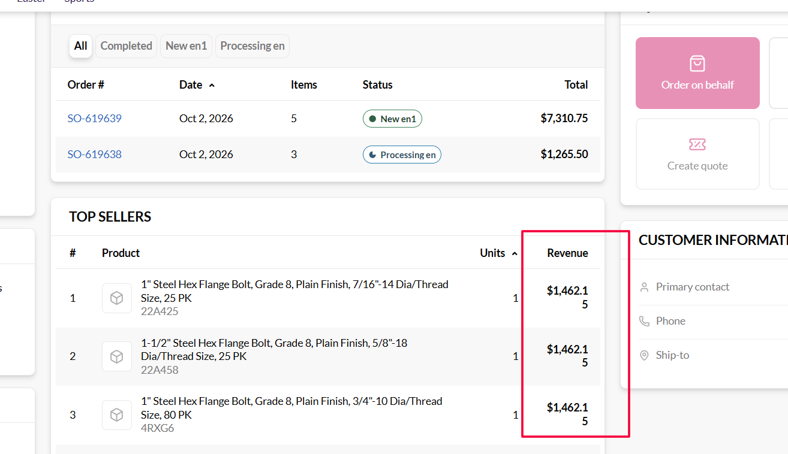
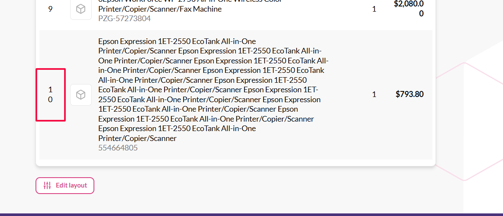

# BUG: Top sellers — numeric cells wrap mid-number (Revenue "$1,462.1" / "5", rank "1" / "0")

## Status: FIXED · Jira: VCST-6153
**Severity: Low** (P3) · cosmetic, but it splits a monetary value and the rank, so a quick read gives `$1,462.1` or rank `1`.
No data is lost. **Found by:** manual check (QA), 2026-10-02 · **Archetype:** `RENDER`

**Env:** vcptcore-qa · theme `2.59.0-pr-2476-fcf0-fcf00751` · Platform `3.1076.0` · SalesRep `3.1012.0-pr-21-ff6d` ·
store `B2B-store` · desktop, about 1300 px viewport (the `lg`+ desktop table layout).

## Steps to Reproduce
1. Sign in to the storefront as a sales rep → **My customers** → open a customer whose top sellers have long
   product names (e.g. `/company/my-customers/3af19e5f-03ed-4d47-9fae-7e6a23dacd8c`).
2. Look at the **Top sellers** widget, especially the **#** and **Revenue** columns, down to rank 10.

## Expected vs Actual
- **Expected:** each number stays on one line (`$1,462.15`, `10`), like **Total** in the *Recent orders* widget next to it.
- **Actual:** numbers break **inside the digits** in every row with a long product name:
  - **Revenue:** `$1,462.1` / `5` (ranks 1–3), and `$2,080.0` / `0` (rank 9).
  - **#** (rank): `1` / `0` for rank 10. Single-digit ranks are not affected.

## Layer Validation

| Layer | Result | Evidence |
|-------|--------|----------|
| 1. Storefront Frontend | FAIL | screenshots above; the values are correct, only their rendering is wrong |
| 2. Backend Admin | N/A | the widget exists only in the storefront |
| 3. GraphQL xAPI | PASS | `salesRepTopSellers` returns `rank` and a pre-formatted `revenue`; both show in full, just wrapped |
| 4. Platform REST API | N/A | not involved in a CSS wrap |

**Owning layer:** Layer 1 — Storefront.

## Root Cause Analysis
Two things combine:
1. **`VcTable` lets body text break anywhere:** `client-app/ui-kit/components/organisms/table/vc-table.vue`,
   `.vc-table__body { word-break: break-word; }` (≈L1227). This rule is meant for long product names, but
   every cell inherits it, so `$1,462.15` or `10` can also break at any character.
2. **The numeric columns cannot defend themselves:** `client-app/modules/sales-rep/components/top-sellers.vue`.
   `rank` (≈L61, `align="center"`), `units` (≈L88) and `revenue` (≈L98, `class="font-bold"`) have no
   `whitespace-nowrap` and no `width`. The table uses auto layout, so a long product name gets most of the
   width, and the narrow columns break inside the number. A very long name (rank 10 in screenshot 2) squeezes
   even the `#` column below two digits.

*Recent orders* shows the same kind of value without the defect only because its columns are short.

**Suggested fix (single file):** add `whitespace-nowrap` to the `rank`, `units` and `revenue` columns, e.g.
`class="whitespace-nowrap"` / `class="font-bold whitespace-nowrap"`. The Product column is already `min-w-0` +
`break-word`, so it will absorb the squeeze. Do not change the shared `VcTable` rule, because that would affect
every table.

## Fix Routing (→ /qa-fix)

- **Owning layer:** Layer 1 — Storefront
- **Suggested repo:** VirtoCommerce/vc-frontend
- **repoKind:** frontend
- **Ownership hint:** platform
- **Component / module:** vc-frontend `modules/sales-rep` — Top sellers widget
- **RCA anchor:** `client-app/modules/sales-rep/components/top-sellers.vue` `VcTableColumn id="rank"|"units"|"revenue"`
  (no nowrap) + `client-app/ui-kit/components/organisms/table/vc-table.vue` `.vc-table__body { word-break: break-word }`
- **Routing confidence:** HIGH

## Resolution
- **Fixed in:** vc-frontend PR #2537 @ `faa8dd9e` (theme `2.59.0-pr-2537-faa8-faa8dd9e`) — `top-sellers.vue` adds `top-sellers__number` (`white-space: nowrap`) to rank/units/revenue.
- **Verified:** 2026-10-06 on vcptcore-qa via `/qa-verify-fix` — STR 3/3 at 1300/1280/1024 px, computed-style + line-count proof; VCST-6153 → Tested.
- **Not observed:** rank 10 (widget requests `take: 5`). Same cause in *My recent orders* filed as VCST-6180.
- **Evidence:** `reports/tickets/Sprint26-19/VCST-6153/` (`verification-report.md`, `evidence.html`).
