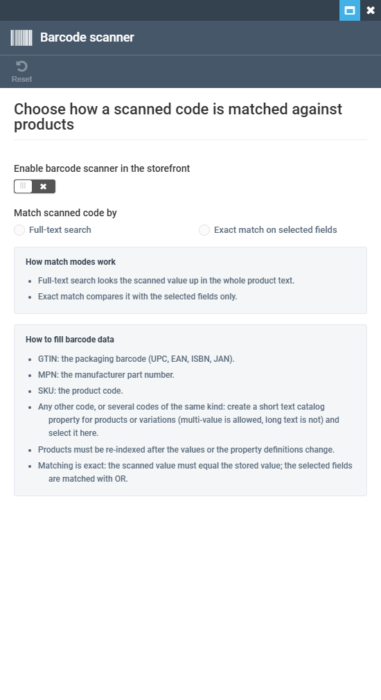

# Barcode scanner blade shows the scanner as OFF to a user without `catalog:BrowseFilters:Read` `[Low]`

## Status: READY_TO_SUBMIT

**Severity:** Low (P3) · **Related:** VCST-2945 (in scope — new blade)
**Env:** vcst-qa · Catalog 3.1046.0-pr-909-2839 · Platform 3.1073.0-pr-3121-9965

## Summary

A back-office user who can open the store but lacks `catalog:BrowseFilters:Read` can still open **Search configuration → Barcode scanner**. The blade shows an "Error 403" banner, but behind it (and after Dismiss) it renders a complete form: switch **OFF**, no match mode selected. The stored value is `scannerEnabled: true`. Once the banner is dismissed, nothing on screen says the values were not loaded, so the user reads a false "scanner disabled".

## Steps to Reproduce

Preconditions: `@td(BARCODE_STORE.id)` stored as `{"scannerEnabled":true,"fields":["gtin"]}` (verify with admin `GET {{BACK_URL}}/api/catalog/barcode-search/store/@td(BARCODE_STORE.id)`).

1. Sign in to `{{BACK_URL}}` as `@td(BROWSEFILTERS_NONE.email)` (password `{{BROWSEFILTERS_NONE_PASSWORD}}`).
2. Stores → `@td(BARCODE_STORE.name)` → Search configuration → **Barcode scanner**.
3. Look at the blade, then click **Dismiss** on the error banner.

## Expected vs Actual

| | Expected | Actual |
|---|---|---|
| Network | settings not readable → no form rendered | only `GET …/store/{id}/fields` sent → **403**; the settings `GET …/store/{id}` is **never sent** |
| Blade body | an access-denied state, or no form (no default values shown as if they were real) | switch **OFF**, neither "Full-text search" nor "Exact match on selected fields" selected, both hint panels shown |
| After Dismiss | the blade still shows that the data is unavailable | a clean "scanner OFF" form with no error indication |
| Tile | not offered to a user who cannot read it | "Barcode scanner" tile shown and opens |

Evidence: `reports/bugs/screenshots/barcode-blade-scanner-off-without-browsefilters-read/` (`SRCHA-056-FAIL-false-disabled-blade.png` shows the banner state, `…-false-off-after-dismiss.png` shows the state after Dismiss). Trace: `reports/regression/REG-2026-09-28-1518/traces/SRCHA-056-FAIL-trace.json`. Console: `Failed to load resource: 403 … /api/catalog/barcode-search/store/AGENT-TEST-BARCODE/fields`.

## Layer Validation

| Layer | Result | Evidence |
|---|---|---|
| 1. Storefront | N/A | admin-only |
| 2. Admin | **FAIL** | screenshots and trace above |
| 3. xAPI | N/A | |
| 4. REST | PASS | 403 on GET settings, GET fields and PUT is the correct RBAC answer (`@td(BROWSEFILTERS_NONE)` contract) |

**Owning layer:** Layer 2 — Admin SPA (module Web).

## Root Cause Analysis

`barcode-search.js` `initializeBlade()` calls `loadSettings()` only in the `getFields` success callback, so when `getFields` fails (403) the settings are never requested and `blade.currentEntity` / `blade.matchMode` stay undefined. `barcode-search.tpl.html` renders the form unconditionally, so an undefined `scannerEnabled` is shown as an unchecked switch. `search-configuration.js` adds the `barcode-scanner` menu item with no `permission`, so the tile is offered to users who cannot read it. The existing facets and sorting items have no `permission` either, so gating the tile may be a separate consistency decision.

Suggested fix: render the form only after a successful load (e.g. an `isLoaded` flag set in `loadSettings` success), and gate the menu item on `catalog:BrowseFilters:Read`.

## Fix Routing (→ /qa-fix)

- **Owning layer:** Layer 2 — Admin
- **Suggested repo:** VirtoCommerce/vc-module-catalog (PR #909, branch `feat/VCST-2945-barcode-search-setup`)
- **repoKind:** module
- **Ownership hint:** platform
- **Component / module:** Catalog Admin SPA — Barcode scanner blade
- **RCA anchor:** `src/VirtoCommerce.CatalogModule.Web/Scripts/blades/barcode-search.js` `initializeBlade` → `loadSettings` chain; `barcode-search.tpl.html` `<form class="form" name="formScope">`; `Scripts/blades/search-configuration.js` `blade.menuItems` (`barcode-scanner`)
- **Routing confidence:** HIGH

Found by: /qa-test VCST-2945 (2026-09-28)
