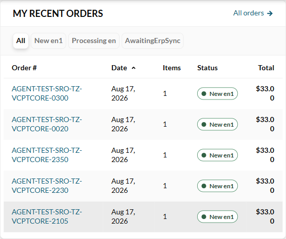

# BUG: Sales Rep — My recent orders wraps Total and Date mid-value ("$33.0" / "0", "Aug 17," / "2026")

## Status: OPEN · Jira: VCST-6180
**Severity: Low** (P3) · cosmetic, but it splits a money value: a quick read gives `$33.0`. No data is lost.
**Found by:** agent (`qa-frontend-expert`) during `/qa-verify-fix VCST-6153`, 2026-10-06 · **Archetype:** `RENDER`
**Related:** VCST-6153 (same cause in the sibling *Top sellers* widget, fixed by vc-frontend PR #2537 for that widget only)

**Env:** vcptcore-qa · theme `2.59.0-pr-2537-faa8-faa8dd9e` · Platform `3.1076.0` · SalesRep `3.1012.0-pr-21-8964` ·
store `B2B-store` · desktop 1300 px (two-column customer-profile layout, ≥1280 px).

## Steps to Reproduce
1. Sign in to the storefront as a sales rep (`@td(SR_REP_PRIMARY.email)`) → **My customers**.
2. Open a customer whose orders have long order numbers, e.g. `AGENT-TEST-Org-TechFlow-20260310`
   (`/company/my-customers/96f109a7-9010-4691-b6a1-bef25cca3d04`).
3. Viewport 1300 px wide. Look at the **Total** and **Date** columns of **My recent orders**.

## Expected vs Actual
- **Expected:** money and date stay on one line (`$33.00`, `Aug 17, 2026`); only the Order # column wraps.
- **Actual:** in every row Total renders `$33.0` / `0` (cell 71 px, `white-space: normal`) and Date renders
  `Aug 17,` / `2026`. At 1024 px (one-column layout, widget ~725 px wide) the values fit and it looks fine.

## Layer Validation

| Layer | Result | Evidence |
|-------|--------|----------|
| 1. Storefront Frontend | FAIL | screenshot above; values are correct, only their rendering wraps |
| 2. Backend Admin | N/A | widget exists only in the storefront |
| 3. GraphQL xAPI | PASS | order total arrives pre-formatted and is shown in full, just wrapped |
| 4. Platform REST API | N/A | not involved in a CSS wrap |

## Root Cause Analysis
Same mechanism as VCST-6153:
1. `client-app/ui-kit/components/organisms/table/vc-table.vue` — `.vc-table__body { word-break: break-word }` lets any
   cell break at any character.
2. The Recent orders widget in `client-app/modules/sales-rep/` (`sales-rep-orders` component) gives its Total and Date
   columns no `whitespace-nowrap`. With long order numbers (`AGENT-TEST-SRO-TZ-VCPTCORE-0300`) the auto-layout table
   squeezes them below the value width in the ~557 px two-column widget.

PR #2537 added `top-sellers__number` (`white-space: nowrap`) only in `top-sellers.vue`. The VCST-6153 bug report
assumed Recent orders was safe "because its columns are short"; that holds only for short order numbers.

**Suggested fix (single file):** add `whitespace-nowrap` to the Total and Date columns of the Recent orders widget,
mirroring PR #2537. Do not change the shared VcTable rule.

## Fix Routing (→ /qa-fix)
- **Owning layer:** Layer 1 — Storefront · **Repo:** VirtoCommerce/vc-frontend · **repoKind:** frontend · **Ownership:** platform
- **RCA anchor:** `client-app/modules/sales-rep/` Recent orders widget, Total/Date `VcTableColumn` (no nowrap)
- **Routing confidence:** HIGH
