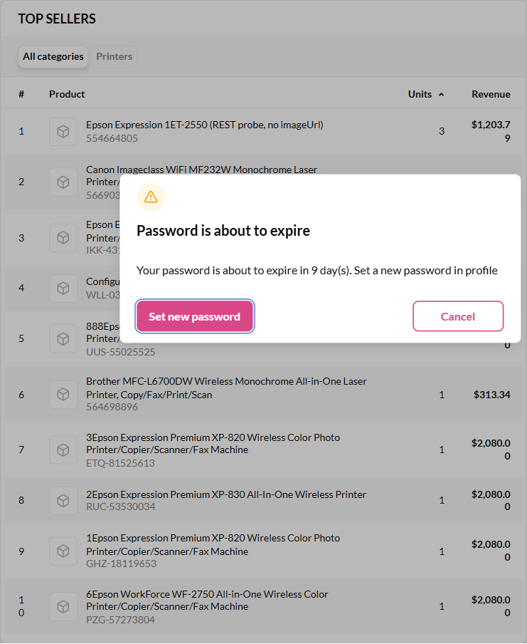
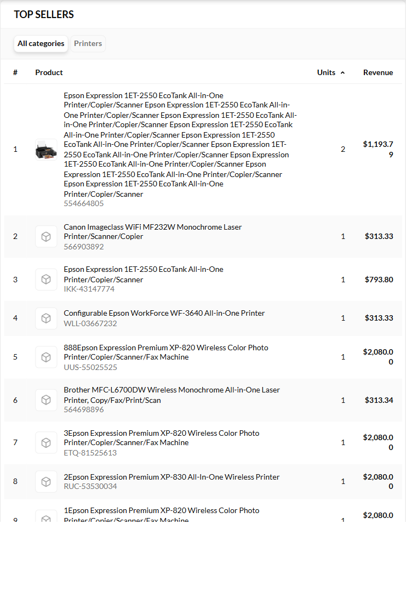

# BUG: Top sellers shows a placeholder for a product that has an image — the newest order line wins even when it has no image

## Status: READY_TO_SUBMIT · Jira: VCST-6154
**Severity: Low** (P3) · cosmetic, but the rep's ranking loses its visual cue, and the product name can also be replaced
by an order-line name. **Found by:** manual check (QA), 2026-10-02, then reproduced via API and UI · **Archetype:** `DATA-SNAPSHOT`

**Env:** vcptcore-qa · theme `2.59.0-pr-2476-fcf0-fcf00751` · Platform `3.1076.0` · SalesRep `3.1012.0-pr-21-ff6d` ·
store `B2B-store` · customer Contoso Manufacturing (`3af19e5f-…`), rep `agent-test-vcst5293-182326@example.com`.

## Steps to Reproduce
1. Product SKU `554664805` has 4 catalog images (`imgSrc` set).
2. The rep places an order for it **through the cart** (`addItem` → `createOrderFromCart`). The order line gets
   `imageUrl` = the catalog image. Top sellers shows the image.
3. Then an order for the same product arrives **without** `lineItem.imageUrl` (REST `POST /api/order/customerOrders`;
   any ERP/integration import that does not send it).
4. Open the customer profile → **Top sellers**.

## Expected vs Actual
- **Expected:** the product keeps its image, because the system has one (catalog, and an earlier order line).
- **Actual:** the image is replaced by the placeholder cube. The **name** is also taken from the newest line
  (here it showed `Epson Expression 1ET-2550 (REST probe, no imageUrl)`).

| Step | Newest order line for SKU 554664805 | Top sellers row |
|---|---|---|
| Seeded orders only (REST, no image) | `imageUrl: null` | cube — all 10 rows, 0 of 18 lines have an image |
| + cart order `CO261002-00020` | image | **image** |
| + REST order without image | `null` | **cube**, name from the REST line |
| REST order deleted | image (`CO261002-00020`) | **image** again |

## Layer Validation

| Layer | Result | Evidence |
|-------|--------|----------|
| 1. Storefront Frontend | PASS (renders what it gets) | `top-sellers.vue` shows `VcImage` when `imageUrl` is set, otherwise the cube |
| 2. Backend Admin | N/A | the widget is not in Admin |
| 3. GraphQL xAPI | **FAIL** | `/graphql/sales-rep` `salesRepTopSellers` → `imageUrl: null` for a product with catalog images |
| 4. Platform REST API | PASS | order lines store what they were given; the catalog product has `imgSrc` |

**Owning layer:** Layer 3 — `vc-module-sales-rep` (xAPI service).

## Root Cause Analysis
`vc-module-sales-rep` `src/VirtoCommerce.SalesRep.Data/Services/SalesRepTopSellerService.cs` `BuildTopSeller()`:
display fields come from the line-item snapshot of the **most recent** row
(`OrderByDescending(x => x.LastOrderedDate)…First()`, then `result.ImageUrl = sample.ImageUrl`,
`result.Name = sample.Name`). This has two gaps:
1. An empty `ImageUrl` in the newest row overrides a non-empty one from older rows.
2. There is no fallback to the catalog product image (`imgSrc`).

**Suggested fix:** pick the latest **non-empty** `ImageUrl` (and name) across the rows, and if all are empty, fall
back to the catalog product image.

Not a fix, but related: our `scripts/seed-data/sales-rep/*` order seeders never set `imageUrl`, so seeded envs always
show cubes (logged in `docs/repo-findings-backlog.md`).

## Fix Routing (→ /qa-fix)

- **Owning layer:** Layer 3 — xAPI
- **Suggested repo:** VirtoCommerce/vc-module-sales-rep
- **repoKind:** module
- **Ownership hint:** platform
- **Component / module:** SalesRep — `SalesRepTopSellerService.BuildTopSeller`
- **RCA anchor:** `SalesRepTopSellerService.cs` `result.ImageUrl = sample.ImageUrl;` (sample = newest row)
- **Routing confidence:** HIGH
