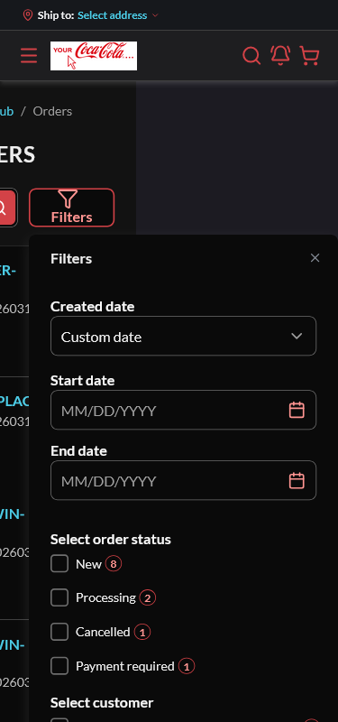

# BUG: [Sales Rep] At 375px, re-opening the customer-orders Filters drawer makes the page scroll horizontally — Medium

**Env:** vcptcore-qa, theme `2.59.0-pr-2519-1d9b-1d9bc6dc` (also reproduced on control vcptcore-qa1 `2.59.0-pr-2540-710a-710ab0fa`, a build without vc-frontend#2519 ⇒ PRE-EXISTING). Found by agent during /qa-test VCST-6001 (2026-10-06); NOT filed — operator chose drafts only.
**Relates:** VCST-6001 · BL-UI-004 (no document horizontal scroll at 375)

## Summary
At a 375px viewport the first open of the Filters drawer is fine, but closing and reopening it makes the document wider than the viewport (`scrollWidth` ≈ 582–599 vs 375, `scrollX` 224): the drawer is placed at x 256–599 and the page content is pushed off-screen to the left. Closing the drawer restores `scrollWidth` 375.

## STR
1. Sign in as a sales rep, open `/company/customer-orders` at 1920, resize to 375×800.
2. Open Filters → close → open again.
3. Read `document.documentElement.scrollWidth`; try swiping horizontally.

## Expected vs Actual
- **Expected:** `scrollWidth` = 375; drawer within the viewport on every open.
- **Actual:** horizontal scroll from the second open onward (every reopen).

