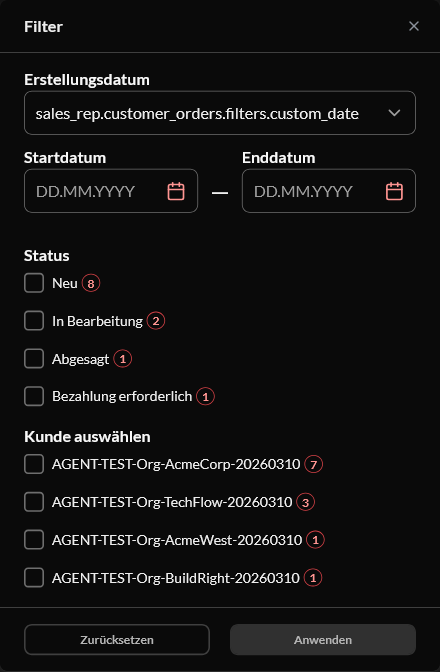

# BUG: [Sales Rep][i18n] Created-date combobox shows the raw key `sales_rep.customer_orders.filters.custom_date` after an in-session language switch — Medium

**Env:** vcptcore-qa, theme `2.59.0-pr-2519-1d9b-1d9bc6dc` (also reproduced on control vcptcore-qa1 `2.59.0-pr-2540-710a-710ab0fa`, a build without vc-frontend#2519 ⇒ PRE-EXISTING). Found by agent during /qa-test VCST-6001 (2026-10-06); NOT filed — operator chose drafts only.
**Relates:** VCST-6001 · BL-SR-013 (raw i18n key never surfaces)

## Summary
After switching the storefront language in-session (header language selector, en → de, then de → fr/es), the closed "Created date" combobox in the customer-orders Filters drawer shows the raw i18n key instead of the translated "Custom date"; its option list is translated. A cold load of `/de/company/customer-orders` is fine. The document title briefly showed `sales_rep.customer_orders.page.all_title` during the switch.

## STR
1. Sign in as a sales rep, open `/company/customer-orders` in English.
2. Switch language to Deutsch via the header selector (then to another language).
3. Open Filters.

## Expected vs Actual
- **Expected:** "Benutzerdefiniertes Datum" (the translated selected value).
- **Actual:** `sales_rep.customer_orders.filters.custom_date`; options are translated. Reproduced 2/2 on the PR build and on the control.

**Likely root cause:** the initial `selectedRange` label is captured before the new locale's messages load (not reactive to the locale).
