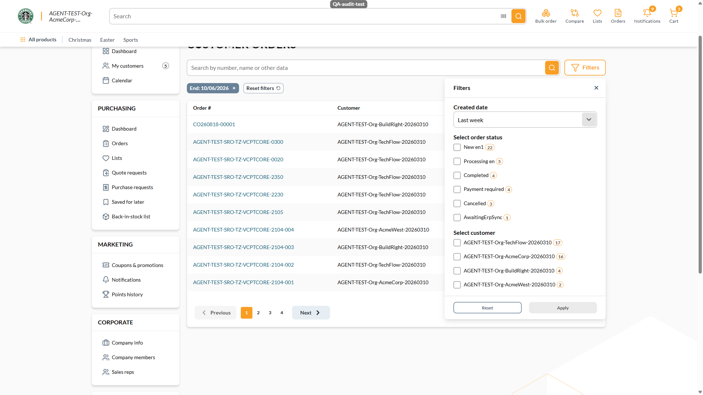

# BUG: [Sales Rep] Removing the Start chip of an applied preset leaves the drawer claiming the preset while the grid is open-ended — Medium

**Env:** vcptcore-qa, theme `2.59.0-pr-2519-1d9b-1d9bc6dc` (also reproduced on control vcptcore-qa1 `2.59.0-pr-2540-710a-710ab0fa`, a build without vc-frontend#2519 ⇒ PRE-EXISTING). Found by agent during /qa-test VCST-6001 (2026-10-06); NOT filed — operator chose drafts only.
**Relates:** VCST-6001 · regression case SR-CO-034 (EXPECTED-RED since 2026-09-04, no ticket until now)

## Summary
After applying a Created-date preset (e.g. "Last week") and removing only its Start chip, the list re-queries with an open lower bound, but the Filters drawer still shows "Last week" with Apply disabled. The rep believes the list is last week's orders while it shows everything up to today; the applied bound cannot be seen or edited without switching away from the preset and back.

## STR
1. Sign in as a sales rep (`@td(SR_REP_PRIMARY.email)`), open `/company/customer-orders` → Filters.
2. Created date → **Last week** → Apply. Chips: `Start: 09/29/2026`, `End: 10/06/2026`; request `createddate:["2026-09-28T21:00:00.000Z" TO "2026-10-06T20:59:59.999Z"]`.
3. Remove the **Start** chip. Request becomes `createddate:[TO "2026-10-06T20:59:59.999Z"]` (grid 0 → 39 orders).
4. Reopen Filters.

## Expected vs Actual
- **Expected:** the drawer describes the filter actually applied (e.g. Custom date with only End = 10/06/2026), or removing a preset chip removes the whole preset.
- **Actual:** the combobox still reads **"Last week"**, no date fields shown, Apply disabled.

Control (no PR 2519): `reports/tickets/Sprint26-20/VCST-6001/screenshots/ab-2-b7-lastweek-after-start-chip-removed.png`

**Likely root cause:** `customer-orders.vue` `removeFilterChip` clears `startDate` but `selectedRange` in `sales-rep-orders-filters.vue` keeps the preset id (neither touched by PR #2519).
