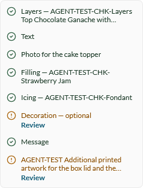

# Configuration checklist: done Text and File rows show only the section name, not `{name} - {value}` (AC-1 / AC-3.1) — **P2**

## Status: CONFIRMED — filed VCST-6188 (Sub-task of VCST-6027)
**Found by:** agent — testing VCST-6027
**Tracker:** Sub-task of VCST-6027 (IN-SCOPE) · labels `found-by-agent`, `found-in-testing`
**Oracle:** `{SPEC}` VCST-6027 AC-1 ("Green (done option): {Option name} - {Option value}") and AC-3.1 ("If the optional
field is filled in then it shall be marked as green {Option name} - {Option value}").
**Nature:** AC/implementation mismatch. PR #2527 omits the value deliberately — the PO may amend the AC, or the value is added.

## Environment
- Storefront: vc-frontend PR #2527 build `2.59.0-pr-2527-d089-d08928e7` (local container at http://localhost, API proxied
  to vcst-qa — the PR is not deployed to vcst-qa yet, vc-deploy-dev#6829 open)
- Backend vcst-qa: Catalog 3.1046.0 · XCatalog 3.1022.0 · XCart 3.1038.0-pr-141-3d86 (unchanged by this ticket)
- Browsers: Chrome (4a), Firefox, Edge (C1 `REG-2026-10-06-1857` CFG-CHK-011) — same result on all three

## Steps to reproduce
1. Open the configurable product `@td(CFG_CHECKLIST_ALLTYPES.url)` (`/products-with-options/cfg-parents/agent-test-cfg-checklist-all-types`).
2. In the "Price and delivery" widget, use **Fill it in** on the Text row and type `Hi Anna`.
3. Use **Upload a file** on "Photo for the cake topper" and upload any `.txt`/`.png`.
4. Use **Review** on the optional "Message" row and pick the preset "Congratulations!".

## Expected
Each filled row turns green and reads `{name} - {value}`: "Text — Hi Anna", "Photo for the cake topper — <file name>",
"Message — Congratulations!" (AC-1, AC-3.1; value clamped to 2 lines per AC-1.1).

## Actual
The rows turn green with the **name only**: "Text", "Photo for the cake topper", "Message" (screen-reader suffix
"(completed)"). Product rows do show the value ("Layers — …", "Icing — AGENT-TEST-CHK-Fondant"). The values are known to
the page — the cart's Components list shows "Hi Anna", the file name and "Congratulations!".

Supporting: `VCST-6027-4a-alltypes-load-1920.png`, `VCST-6027-4a-c1-cart-line-components.png` (same folder).

## Layer Validation

| Layer | Result | Evidence |
|-------|--------|----------|
| 1. Storefront Frontend | FAIL | screenshots above; label built client-side from `selectedOptionTextValue` |
| 2. Backend Admin | N/A | checklist is storefront-only |
| 3. GraphQL xAPI | PASS | `CreateConfiguredLineItem` / cart carry `customText` and the file name (cart Components list shows them) |
| 4. Platform REST API | N/A | not exercised by the label |

**Owning layer:** Layer 1 — Storefront.

## Root Cause Analysis
`client-app/shared/catalog/components/configuration/product-configuration-checklist.vue` @ `d08928e7`, lines ~79–90: the
done label uses `{name} — {value}` only for Product sections; the code comment at line 85 reads *"Text and file values
are not repeated in the checklist, only the selected product is"*. The unit test (`__tests__/product-configuration-checklist.test.ts`)
encodes the same choice (`"Text (completed)"`, `"Photo (completed)"`). Intentional — hence an AC decision, not a regression.

## Fix Routing (→ /qa-fix)

- **Owning layer:** Layer 1 — Storefront
- **Suggested repo:** VirtoCommerce/vc-frontend (PR #2527 branch `feat/VCST-6027-configuration-checklist`)
- **repoKind:** frontend
- **Ownership hint:** platform
- **Component / module:** `product-configuration-checklist.vue` (done-label builder) + its unit test
- **RCA anchor:** `product-configuration-checklist.vue:85` — "Text and file values are not repeated in the checklist"
- **Routing confidence:** MEDIUM — the code site is certain; whether to change it depends on the PO's ruling on AC-1/AC-3.1
